[TOC]

## 1. 理解对象

### 1.1 属性的类型

​		ESMA-262 使用一些内部特性来描述属性的特征。 这些特性是由为JavaScript实现引擎的规范定义的， 因此， **开发者不能再JavaScript 中直接访问这些特性**。

​		为了将某个特性标识为内部特性，规范会用两个中括号把特性的名称括起来， 比如 `[[Enumerable]]` 。

ECMAScript 中将属性分为了两种：

1. **数据属性**
2. **访问器属性**

#### 1.1.1 数据属性 `CEWV`

数据属性包含了一个保存数据值的位置。 值会从这个位置读取，也会写入到这个位置。 数据属性有四个特性描述它们的行为。

1. `[[Configurable]]` : 
   1. 属性是否可以通过 `delete` 删除并重新定义；
   2. 是否可以修改它的特性；
   3. 是否可以把它改为 访问器属性 
   4. 默认值为 `true`
2. `[[Enumerable]]` :
   1. 属性是否可以通过`for-in` 循环返回。
   2. 默认值为 `true`
3. `[[Writable]]` :
   1. 属性的值是否可以被修改；
   2. 默认值为 `true`
4. `[[Value]]` :
   1. 属性实际的值
   2. 默认值为 `undefined`

当我们创建一个对象时，如：

```javascript
let person = {
    name: "Nicholas"
};
```

属性`name` 的数据属性 `[[Configurable]]`、`[[Enumerable]]`、`[[Writable]]` 都会被设置为 `true`， 而` [[Value]]` 特性会被设置为指定的值，即 `"Nicholas"`。 

##### 1.1.1.2 修改与访问 数据属性

###### 1.1.1.2.1 修改属性的默认特性

`Object` 有两个静态方法用于修改 数据属性：

1. `Object.defineProperty()`
2. `Object.defineProperties()` 

**`Object.defineProperty()`**

该方法用于修改对象单个值的数据属性，其语法格式如下：

```javascript
Object.defineProperty(属性的对象，属性的名称，描述符对象（{CEWV}）)
```

示例：

```javascript
let person = {};
Object.defineProperty(person, "name", {
    Writable: false,
    value: "Nicholas"
});

console.log(person.name);	//	"Nicholas"
person.name = "Greg";
console.log(person.name); //	"Nicholas"
```

> :warning: 严格模式下，尝试修改只读属性的值会抛出错误。

```javascript
let person = {};
Object.defineProperty(person, "name", {
    configurable: false,
    value: "Nicholas"
});
console.log(person.name); // "Nicholas"
delete person.name;
console.log(person.name); // "Nicholas"
```

> :warning: 尝试删除`[[Configurable]]` 为`false` 的值在严格模式下会抛出错误

<span style="color:red">一旦某个属性被设定了 `[[Configurable]]` 值为`false` 以后， 该值将会被定义为不可配置， 也不能在变回可配置了。 也就是说，此时，如果再次调用`Object.defineProperty()` 并修改任何非 writable 属性还会导致错误。也无法被改变了。 </span>


**:warning:此外，在调用`Object.defineProperty()` 时， 如果不指定`configurable`, `enumerable` 和 `writable` 值，则全部默认为 `false` 。**

```javascript
let obj = {  };
Object.defineProperty(obj, "name",{value:'jayce'});
let a = Object.getOwnPropertyDescriptors(obj)

console.log(a);//{ name: { value: 'jayce',writable: false,enumerable: false,configurable: false } }
```

<span style="color:red">**注意： 如果已经有初始化值，则初始化时，数据属性已经被设定了默认值，都为true**</span>

```javascript
// 注意： 如果已经有初始化值，则初始化时，数据属性已经被设定了默认值，都为true
let obj = { name:'frank' };
Object.defineProperty(obj, "name",{value:'jayce'});
let a = Object.getOwnPropertyDescriptors(obj)

console.log(a);// { name: { value: 'jayce',writable: true,enumerable: true,configurable: true } }
```


**`Object.defineProperties()`**

`Object.defineProperties()` 用于批量修改默认数据属性，其语法格式如下：

```javascript
Object.defineProperties(obj,props)
```

示例：

```javascript
var obj = {};
Object.defineProperties(obj, {
  'property1': {
    value: true,
    writable: true
  },
  'property2': {
    value: 'Hello',
    writable: false
  }
  // etc. etc.
});
```


###### 1.1.1.2.2 访问数据属性

`Object` 提供了两个数据属性的访问方法，分别是：

1. `Object.getOwnPropertyDescriptor()`
2. `Object.getOwnPropertyDescriptors()`

`Object.getOwnPropertyDescriptor()` 用于获取单个对象值数据属性, 而`Object.getOwnPropertyDescriptors()` 则用于获取对象中所有值的数据属性。 

示例：

```javascript
let obj = { name:'frank',age:18,height:'175cm' };
Object.defineProperty(obj, "name",{value:'jayce'});
let res1 = Object.getOwnPropertyDescriptor(obj,'name')
let res2 = Object.getOwnPropertyDescriptors(obj)

console.log(res1);
/* 
{ value: 'jayce',
  writable: true,
  enumerable: true,
  configurable: true }
*/
console.log(res2);

/* { name: 
   { value: 'jayce',
     writable: true,
     enumerable: true,
     configurable: true },
  age: 
   { value: 18,
     writable: true,
     enumerable: true,
     configurable: true },
  height: 
   { value: '175cm',
     writable: true,
     enumerable: true,
     configurable: true } }
 */
```


#### 1.1.2 访问器属性

**访问器属性不包含数据值。**

访问器属性有4个特性描述它们的行为：

- `[[Configurable]]` : 表示属性是否可以通过 `delete` 删除并重新定义， 是否可以修改它的特性， 以及是否可以把它改为数据属性。 默认值为`true`
- `[[Enumerable]]` : 表示属性是否可以通过 `fot-in` 循环返回。 默认值为` true`
- `[[Get]]` ：获取函数， 在读取属性时调用。 默认值为 `undefined`
- `[[Set]]` : 设置函数， 在写入属性时调用。默认值为 `undefined`

访问器属性是不能直接定义的， 必须使用`Object.defineProperty()`。 

```javascript
// 定义一个对象， 包含伪私有成员 year_ 和公共成员 edition

let book = {
    year_: 2017,
    edition: 1
};

Object.defineProperty(book,"year",{
    get(){
        return this.year_;
    },
    set(newValue){
        if(newValue > 2017) {
            this.year_ = newValue;
            this.edition += newValue - 2017;
        }
    }
});

book.year = 2018;
console.log(book.edition); // 2
```

​		这个例子中 对象 book 有两个默认属性 : `year_` 和 `edition` 。 `year_` 中的下划线常用来表示该属性并不希望在对象方法的外部被访问。 另一个属性 `year` 被定义为一个访问器属性， 其中获取函数简单地返回`year_` 的值， 而设置函数会做一些计算以决定正确的版本（edition)。 因此，把`year` 属性修改为 2018 会导致 `year_` 变成 2018， edition 变成2。 **这是访问器属性的典型使用场景， 即设置一个属性值会导致一些其他变化发生**。

​		获取函数 和 设置函数 不一定都要定义。只定义获取函数 —— 属性只读。只定义设置函数——不可读取


#### 1.1.3 合并对象 —— `Object.assign()`

ES6 提供了` Object.assign()` 方法用于对象合并， 这个方法接收一个目标对象，和一个或者多个源对象作为参数， 然后对每个源对象执行**浅复制**， 如果多个源对象有相同的属性， 则使用最后一个复制的值。用例：

```javascript
let dest = { id: 'dest' };
let result = Object.assign(dest,{ id: 'src1', a:'foo'}, { id :'src2',b:'bar'});
console.log(result);//{id: 'src2', a: 'foo', b: 'bar'}
```

> 注意：实际的逻辑实现是，将每个源对象中可枚举（`Object.propertyIsEnumerable()` 返回 `true`） 和 自有(`Object.hasOwnProperty()` 返回 `true` ) 的属性复制到目标对象。 以字符串和符号为键的属性会被复制。 对每个符合条件的属性，这个方法会使用源对象上的 [[Get]] 取得属性的值，然后使用目标对象上的 [[Set]] 设置属性的值。 


#### 1.1.4 对象标识与相等判定 —— `Object.is()`

ES6 之前，`===` 对有一些结果的判定在不同的js引擎中表现不一样， ES6 中， 规范新增了一个统一方法， 考虑了一些边界情形，输出正常判定：

如:

```javascript
console.log(+0 === -0);// true
console.log(+0 === 0);// true
console.log(-0 === 0);// true
```

```javascript
console.log(Object.is(+0,-0));// false
console.log(Object.is(+0,0));// true
console.log(Object.is(0,0));// false
```

#### 1.1.5 增强的对象语法

 1. **属性值简写**

    给对象添加变量是，属性名和以变量作为属性值的变量名如果是一样的，可以直接简写：

    ```javascript
    let name = 'Matt';
    let person = {
        name: name
    }
    // 可以简写为：
    let name = 'Matt';
    let person = {
        name
    };
    ```

    

 2. **可计算属性**

    ES6 之前，对象的key 只能是字符串形式，现在可以使用变量，动态的访问和设定

    ```javascript
    const nameKey = 'name';
    const ageKey = 'age';
    const jobKey = 'job';
    let person = {
        [nameKey]:'Matt';
        [ageKey]:27;
    	[jobKey]:'Software Engineer'
    }
    ```

    > :notebook: 该特性很强大， 对象中，中括号所包围的对象属性键告诉运行时将其作为JavaScript 表达式而不是字符串来求值， 而因为被当作JavaScript 表达式求值，所以可计算属性本身可以是复杂的表达式，在实例化的时候再进行求值：
    >
    > *<span style="color:red">应用场景如给key拼接token:</span>*
    >
    > ```javascript
    > const nameKey = 'name';
    > const ageKey = 'age';
    > const jobKey = 'job';
    > let uniqueToken = 0;
    > 
    > function getUniqueKey(key){
    >     return `${key}_${uniqueToken++}`;
    > }
    > let person = {
    >     [getUniqueKey(nameKey)]: 'Matt',
    >     [getUniqueKey(ageKey)]:27,
    >     [getUniqueKey(jobKey)]: 'Software Engineer'
    > }
    > console.log(person);//{name_0: 'Matt', age_1: 27, job_2: 'Software Engineer'}
    > ```

 3. **简写方法名**

    ```javascript
    let person =  {
        sayName: function(name){
            console.log(`My name is ${name}`)
        }
    }
    person.sayName('Matt');// My name is Matt
    ```

    简写为：

    ```javascript
    let person = {
        sayName(name){
            console.log(`My name is ${name}`);
        }
    };
    person.sayName('Matt');// My name is Matt
    ```

    > <span style="background-color:#ff000055"> :question: 简写方法名同样使用获取函数和设置函数</span>
    >
    > ```javascript
    > let person = {
    >     name_: '',
    >     get name(){
    >         return this.name_;
    >     },
    >     set name(name){
    >         this.name_ = name;
    >     },
    >     sayName() {
    >         console.log(`My name is ${this.name_}`);
    >     }
    > }
    > person.name = 'Matt';
    > person.sayName(); //My name is Matt
    > ```
    >
    > <span style="background-color:#ff000055">简写方法名可以与计算属性键相互兼容：</span>
    >
    > ```javascript
    > const methodKey = 'sayName';
    > let person = {
    >     [methodKey](name){
    >         console.log(`My name is ${name}`);
    >     }
    > }
    > person.sayName('Matt'); // My name is Matt
    > ```

#### 1.1.6 对象解构

##### 1. 解构基本认识

```javascript
// 不使用解构
let person = {
    name: 'Matt',
    age: 27
};

let personName = person.name;
let personAge = person.age;
console.log(personName);//Matt
console.log(personAge);//27

// 使用对象解构
let person = {
    name: 'Matt',
    age: 27
};

let { name: personName, age: personAge } = person;
console.log(personName);//Matt
console.log(personAge);//27
```


> 解构可以使得在一个类似对象字面量的结构中，声明多个变量，同事执行多个赋值操作。 如果想让变量直接使用属性的名称， 那么可以使用简写语法，如：
>
> ```javascript
> let person = {
>     name: 'Matt',
>     age: 27
> };
> 
> let { name, job } = person;
> console.log(personName);//Matt
> console.log(personAge);//27
> ```

**在解构的同时定义默认值**

> 适用于引用的属性不存在于源对象中的情况

```javascript
let person = {
    name: 'Matt',
    age: 27
}
let { name, job='Software engineer' } = person;
console.log(personName);//Matt
console.log(personAge);//27
```

**注意要点**

> 1. <u>`null` 和 `undefind`为什么不能被解构 ？</u>
>
>    解构在内部使用 函数 `ToObject()` （不能在运行时环境中直接访问） 把源数据解构<u>转换为对象</u> 。这也就意味着，在对象解构的上下文中， <u>原始值会被当成对象</u>， `null` 和 `undefined` 无法被转换为对象。
>
>    ```javascript
>    let { _ } = null // _只是一个合法的变量名，这里可是是任意的，下同
>    let { _ } = undefined
>    // VM1010:1 Uncaught TypeError: Cannot destructure property '_' of 'undefined' as it is undefined.
>    ```
>
>    此外一些基本类型在被解构时也会发生一些意料之外的结果
>
>    ```javascript
>    let { length } = 'hello';
>    console.log(length);// 5
>    
>    let { constructor:c } = 4;
>    console.log(c === Number); // true
>    ```
>
> 2. 解构并不要求必须在解构表达式中声明。 不过，如果是给实现声明的变量赋值，则赋值表达式必须包含在一对括号中：
>
>    ```javascript
>    let personName, personAge;
>    let person = {
>        name: 'Matt';
>        age: 27
>    };
>    ({name: personName, age: personAge} = person);
>    console.log(personName.personAge);// Matt, 27
>    ```


##### 2. 嵌套解构

解构对于引用嵌套的属性或赋值目标没有限制。为此，可以通过解构来复制对象属性:

```javascript
let person = {
    name:'Matt',
    age:27,
    job: {
        title: 'software engineer'
    }
};
let personCopy = {};
({
    name: personCopy.name,
    age:personCopy.age,
    job:personCopy.job
} = person);

// 注意:
// 因为一个对象的引用被赋值给personCopy, 所以修改 person.job 对象的属性也会影响personCopy

person.job.title = 'Hacker'

console.log(person);//{"name": "Matt","age": 27,"job": {"title": "Hacker"}}
console.log(personCopy);//{"name": "Matt","age": 27,"job": {"title": "Hacker"}}
```

解构赋值可以使用嵌套解构，以匹配嵌套的属性：

```javascript
let person = {
    name: 'Matt',
    age:27,
    job: {
        title: 'Software engineer'
    }
};

let { job: {title } } = person;
console.log(title); // Software engineer
```

##### 3. 部分解构

需要注意， 涉及多个属性的解构赋值是一个输出无关的顺序话操作。 如果一个解构表达式涉及多个赋值，开始的赋值成功而后面的赋值出错，则整个解构赋值只会完成一部分（错误会被捕获的情况下，否则会错误中断）。

```javascript
let person = {  
  name: 'Matt', 
  age: 27 
}; 
 
let personName, personBar, personAge; 
 
try { 
  // person.foo 是 undefined，因此会抛出错误 
  ({name: personName, foo: { bar: personBar }, age: personAge} = person); 
} catch(e) {} 
 
console.log(personName, personBar, personAge); 
// Matt, undefined, undefined 
```

##### 4. 参数上下文匹配（对函数参数进行解构）

```javascript
let person = {
    name: 'Matt',
    age: 27
};
function printPerson(foo,{name,age},bar){
    console.log(arguments);
    console.log(name,age);
}
function printPerson2(foo,{name:personName,age:personAge},bar){
    console.log(arguments);
    console.log(personName,personAge);
}
printPerson('1st',person,'2nd');
printPerson2('1st',person,'2nd')
//{
    "0": "1st",
    "1": {
        "name": "Matt",
        "age": 27
    },
    "2": "2nd"
}
```


## 2. 创建对象

### 1. 什么情况下需要面向对象的概念，传统的对象存在什么问题 ？

在提及面向对象的概念之前，JavaScript 中创建一个对象通常有两种方式去创建一个对象，分别是通过字面量和通过`new Object()` 的方式去创建。 

这样有一个很大的问题 —— <span style="color:#00ff0088">**创建具有同样接口的多个对象需要重复编写很多代码**</span>

传统模式也有办法解决这类问题， 那就是利用工厂模式

> 工厂模式即： 用于抽象创建特定对象的过程，也就是通过函数调用，去创建对象。

```javascript
// 示例
function createPerson(name,age,job){
    let o = new Object();
    o.name = name;
    o.age = age;
    o.job = job;
    o.sayName = function(){
        console.log(this.name);
    }
    return o;
}
let person1 = createPerson("Nicholas",29."Software Engineer");
let person2 = createPerson("Grep",27,"Doctor");
```

> 函数 createPerson()接收三个参数， 根据这几个参数构建了一个包含Person 信息的对象。 可以根据不同的参数多次调用这个函数， 这种工厂模式虽然可以解决创建类似对象的问题，但是**没有解决对象标识问题** （**即新创建的对象是什么类型**）。他们都只是Object的实例。

### 2. 构造函数模式

#### 2.1 定义构造函数

ES5.1 引入了构造函数和原型继承的特性， 使得我们可以利用构造函数解决上述 **对象标识的问题**。

```javascript
function Person(name,age,job){
    this.name = name;
    this.age = age;
    this.job = job;
    this.sayName = function(){
        console.log(this.name);
    }
}
let person1 = new Person("Nicholas",29."Software Engineer");
let person2 = new Person("Greg",27."Doctor");
person1.sayName(); //  Nicholas
person2.sayName(); //  Greg
person1 instanceof Person;// true
person1 instanceof Object;// true
```

> 这个例子中 `Person()` 构造函数代替了 `createPerson()` 工厂函数， 实际上，`Person()` 内部的代码跟 `createPerson()` 基本是一样的， 只是有如下区别：
>
> 1. 没有显示地创建对象
> 2. 属性和方法直接赋值给了`this`
> 3. 没有`return`

> 且注意，为了区分普通函数，构造函数`Person` 的首字母大写了， 但是*小写在语法层面是合法的*。

#### 2.2 实例化对象

上例中，通过`new` 操作符去 调用 构造函数，以创建一个`Person` 实例， 实际上会执行以下操作:

1. 在内存中创建一个新对象
2. 这个新对象内部的 `[[Prototype]]` 特性被赋值为 构造函数的 `prototype` 属性 （`prototype` 也叫做<span style="color:red">原型对象</span>）
3. 构造函数内部的`this` 被赋值为这个新对象(即`this` 指向新对象)
4. 执行构造函数内部的代码（给新对象添加属性）
5. 如果构造函数返回 非空对象，则返回该对象；否则， 返回刚创建的新对象。 

> <span style="color:red">关于对象的实例化，有一点特别要注意:  各个实例化对象上的属性和方法完全独立， 并不共享。 </span>
>
> ```javascript
> function SuperType() {
>   this.colors = ["red", "blue", "green"];
> }
> let ins1 = new SuperType();
> let ins2 = new SuperType();
> console.log(ins1, ins2, "--line8"); //['red', 'blue', 'green'],['red', 'blue', 'green']
> ins1.colors.push("yellow");
> console.log(ins1, ins2, "--line10");//['red', 'blue', 'green', 'yellow'], ['red', 'blue', 'green']
> ```
> 
> <span style="color:red">通过`new` 关键字实例化后，每个实例化对象的内存空都是独一无二的， 实例对象的属性和方法都是在自己的空间中存在的。</span>

#### 2.3 构造函数模式的一些深入

通过构造函数所实例化的对象中，都有一个 `constructor` 属性指向 Person, 如下所示：

```javascript
function Person(name, age) {
  this.name = name;
  this.age = age;
}
let person1 = new Person("jay", 28);
console.dir(Person);
console.dir(person1);
```


> 此时，如果验证：
>
> ```javascript
> console.log(Person === person1.constructor);
> ```
>
> 将会输出`true` 。
>
> > 可能你看到了 实例化的对象中, `constructor` 属性在`[[Prototype]]` 下，这是因为它是内部特性。注意： 前面说过，规范会用两个中括号把内部特性的名称括起来，且**开发者不能在JavaScript 中直接访问这些特性**
>
> 实际上`__proto__` 也是指向构造函数的，如果这样验证：
>
> ```javascript
> console.log(Person === person1.__proto__.constructor);
> ```
>
> 也将输出`true` ， `__proto__` 被称之为 <span style="color:red">对象原型</span>,
>
> > **即， 实例对象的`__proto__` 对象原型，指向了构造函数的 `prototype` 原型对象 。**

`constructor` 本来是用于**标识对象类型**的。 不过，一般认为`instanceof` 操作符是确定对象类型更可靠的方式。  上例中的实例化对象`person1` 即是 `Person` 的实例，也是 `Object` 的实例：

```javascript
console.log(person1 instanceof Person);// true
console.log(person1 instanceof Object);// true
```

> 这里不需要太纠结， 尽管`person1 instanceof Person` 返回 `true` ==>  实例化对象是一个构造函数的实例 ？  这就是Js 的特点，只是语法糖而已，万物皆对象。

这样，通过定义自定义构造函数，就可以确保实例被标识为特定类型。 这是相比于工厂模式的一个很大的好处。 

#### 2.4 构造函数也是函数

构造函数与普通函数的唯一区别就是调用方式不同。 除此之外， 构造函数也是函数。 并没有把某个函数定义为构造函数的特殊语法。 任何函数只要使用 `new` 操作符调用就是构造函数， 而不是用`new` 操作符调用的函数就是普通函数。 比如: 

```javascript
function Person(name,age){
    this.name = name;
    this.age = age;
    this.sayName = function(){
        console.log(this.name);
    }
}
// 作为构造函数
let person = new Person('jay',26);
person.sayName(); // jay

// 作为函数调用
Person('jay',26);
window.sayName();// jay
```

> 函数中的this 指向其调用者， 因此，作为函数调用时， 默认是指向global 的 ，在浏览器中，就是window.
>
> 利用这个特点，实际上可以实现:
>
> ```javascript
> // 在另一个对象的作用域中调用
> let o = new Object();
> Person.call(o,'tom',24)
> o.sayName();//tom 
> ```
>
> 变种问题：
> 


#### 2.5 构造函数的问题

```javascript
function Person(name, age, job){
    this.name = name;
    this.age = age;
    this.job = job;
    this.sayNmae = new Function(
    	console.log(this.name)
    )
}
let person1 = new Person('jay','man','software engineer');
ler person2 = new Person('tom','women','lawyer')
```

上面这样的代码中， <span style="color:red">**由于 ECMAScript 中的函数是对象， 因此每次定义函数的时，都会初始化一个对象。** </span>

这样，不同实例对象尽管是都一个构造函数， 但是每次实例化，其中的函数都不是同一个。因为都是做一样的事， 所以没有必要定义两个不同的Function实例。  **况且， this对象可以把函数与对象的绑定推迟到运行时**。


也有办法解决这个问题，容易想到的是，就是把这个函数定义放在外面，然后每次实例化对象的时候，就指向这个同一个函数。 

```javascript
function Person(name, age, job){
    this.name = name;
    this.age = age;
    this.job = job;
    this.sayName = sayName
}
function sayName(){
    console.log(this.name);
}
let person1 = new Person('jay','man','software engineer');
ler person2 = new Person('tom','women','lawyer')
```

> 构造函数内部， sayName 属性中包含的只是一个指向外部函数的指针。 

但是这样虽然解决了相同逻辑的函数重复定义的问题， 但是全局作用域也因此被搞乱了。 

所以为了解决这个问题的副作用， 我们需要通过原型模式来解决。 

### 3. 原型模式

**每个函数都会创建一个 `prototype` 属性，这个属性是一个对象， 实际上，它就是通过调用构造函数创建的对象的原型。** 

使用原型对象的函数时，在它上面定义的属性和方法可以被对象实例共享。  

这样一来，就能够解决相同逻辑函数重复定义问题的同时，也能将代码都维护在构造函数内部。 

以下是用例：

```javascript
function Person(name, age) {
  this.name = name;
  this.age = age;
}
Person.prototype.sayName = function () {
  console.log(this.name);
};
let person1 = new Person("jay", 27);
let person2 = new Person("tom", 25);
person1.sayName(); //jay
person2.sayName(); //tom
```

#### 3.1 理解原型

无论何时， 只要创建一个函数，就会按照特定的规则为这个函数创建一个 `prototype` 属性（指向原型对象）。 默认情况下， 所有原型对象自动获得一个名为`constructor` 的属性，指回与之关联的构造函数。 对前面的例子而言。 `Person.prototype.constructor` 指向 `Person` 。 

<span style="color:red">在自定义构造函数的时候，原型对象默认只会获得`constructor` 属性， 其他所有方法都继承自`Object`。 每次调用构造函数创建一个新实例， 这个实例的内部`[[Prototype]]` 指针就会被赋值为构造函数的原型对象。 </span>

> 脚本中没有访问这个`[[Prototype]]`特性的标准方式， 但是在流行的现代浏览器中，一般会在每个对象上暴露`__proto__` 属性， 通过这个属性可以访问对象的原型。 


以上实例中，各个对象之间的关系如下图所示：


> - 注意：`Person.prototype` 指向原型对象，而`Person.prototype.constructor` 指回`Person` 构造函数。 
>
> - `Person` 的两个实例`person1`, `person2` 都只有一个内部属性 指回 `Person.prototype`, 而且两者都与构造函数没有直接关系。另外，虽然者两个实例都没有属性和方法，但是`person1.sayName()` 可以正常调用。 这是由于对象属性查找机制的原因。
>
> - **<span style="color:red">`isPrototypeOf()`</span> 方法：**虽然不是所有实现都对外暴露了`[[Prototype]]`， 但是可以使用 <span style="color:red">`isProtutypeOf()`</span>方法确定两个对象的这种关系
>
>   ```javascript
>   console.log(Person.prototype.isPrototypeOf(person1));//true
>   console.log(Person.prototype.isPrototypeOf(person2));//true
>   ```
>
>   本质上， `isPrototypeOf()` 会在传入参数的`[[Prototype]]` 指向调用它的对象时，返回 `true`
>
> - **<span style="color:red">`getPrototypeOf() `</span>方法：**<span style="color:red">ECMAScript 的 Object 类型有一个方法叫 `Object.getPrototypeOf()`，返回参数的内部特性 `[[Prototype]]` 的值，这是取得一个对象的原型的合法手段。 </span>
>
>   ```javascript
>   console.log(Object.getPrototypeOf(person1)) == Person.prototype);// true
>   console.log(Object.getPrototypeOf(person1).name);//'jay'
>   ```
>
> - **<span style="color:red">`setPrototypeOf() `</span>方法：** 可以向实例的私有特性 `[[Prototype]]` 写入一个新的值。 这样就可以重写一个对象的原型继承关系。
>
>   ```javascript
>   // 示例
>   let biped = {
>       numLegs: 2
>   };
>   let person = {
>       name: 'Matt'
>   }
>   Object.setPrototypeOf(person,biped);
>   console.log(person.name);// Matt
>   console.log(person.numLegs); //2
>   console.log(Object.getPrototype(person) === biped);// true
>   ```
>
>   > （MDN：修改继承关系影响微妙深远, 且可能造成性能下降）
>   >
>   > 为了避免使用 `Object.setPrototypeOf()` 可能造成的性能下降，可以通过`Object.create()` 来创建一个新的对象，同时为其指定原型：
>   >
>   > ```javascript
>   > let biped = {
>   >     numLegs: 2
>   > };
>   > let person = Object.create(biped);
>   > person.name = 'Matt';
>   > console.log(person.name) ;//Matt
>   > console.log(person.numLegs);// 2
>   > console.log(Object.getPrototypeOf(person) === biped);// true
>   > ```

> **<u>关于 原型对象和实例对象以及Object 的关系更通俗的阐述，这部分内容请查看末尾的 [章节拓展](#章节拓展)</u>**

#### 3.2 原型层级

**原型在用于在多个对象实例之间共享属性和方法的原理：** 逐级查找， 实例对象上有没有目标属性或者方法？  =>  原型对象上有没有 ？ => Object 原型对象上有没有 ？

> **<span style="color:red">:warning: 注意： 前面提到的 `constructor` 属性只存在于原型对象，因此通过实例对象也是可以访问到的。</span>**

- **<span style="color:red">`hasOwnProperty() `</span>方法：** 用于确定某个属性实在实例上还是在原型对象上。<span style="color:red">仅指定属性存在于目标对象上时才会返回`true`  </sapn>

  ```javascript
  function Person(name, age) {
    this.name = name;
  }
  Person.prototype.sayName = function () {
    console.log(this.name);
  };
  let person1 = new Person("jay", 26);
  console.log(Person.hasOwnProperty("name"), "--line8"); //true
  console.log(Person.hasOwnProperty("sayName"), "--line9"); //false
  
  console.log(person1.hasOwnProperty("name"), "--line11"); //true
  console.log(person1.hasOwnProperty("sayName"), "--line12"); //false
  ```


#### 3.3 对象枚举方法

- **`in` 操作符：**

有两种方式去使用`in` 操作符：

1. 单独使用 ： 当可以通过对象访问指定属性时 返回 `true`, **无论该属性是在实例上，还是在原型上。**

   ```javascript
   function Person(name, age) {
     this.name = name;
   }
   Person.prototype.sayName = function () {
     console.log(this.name);
   };
   let person1 = new Person("jay", 26);
   
   console.log("sayName" in person1, "--line9");//true
   console.log("name" in person1, "--line10");//true
   ```

2. 在`for-in` 循环中使用 `in` 操作符时， 可以通过对象且可被枚举的属性都会返回，**包括实例属性和原型属性。**

   ```javascript
   function Person(name, age) {
     this.name = name;
   }
   Person.prototype.sayName = function () {
     console.log(this.name);
   };
   let person1 = new Person("jay", 26);
   
   for (let i in person1) {
     console.log(i, "--line10");
   }
   //name
   //sayName
   ```


> - **自定义函数 `hasPrototypeProperty()`：** 
>
> 怎么判断一个属性是一个原型对象的属性？
>
> 对实例对象判断`hasOwnProperty()`  返回 `false` , 且 `in` 操作符 返回 `true` 就可以确定这个属性是一个原型对象上的属性。
>
> ```javascript
> function Person(name, age) {
>   this.name = name;
> }
> Person.prototype.sayName = function () {
>   console.log(this.name);
> };
> 
> function hasPrototypeProperty(object, name) {
>   return !object.hasOwnProperty(name) && name in object;
> }
> 
> let person1 = new Person("jay", 26);
> 
> console.log(hasPrototypeProperty(person1, "name"), "--line9");//false
> console.log(hasPrototypeProperty(person1, "sayName"), "--line10");//true
> ```


- **`Object.keys()` 方法：**  用于获取对象上所有<span style="color:red">可枚举</span>的**实例属性**。 

  ```javascript
  function Person(name, age) {
    this.name = name;
  }
  Person.prototype.sayName = function () {
    console.log(this.name);
  };
  let person1 = new Person("jay", 26);
  
  console.log(Object.keys(person1), "--line9"); //["name"]
  console.log(Object.keys(Person.prototype), "--line10"); //["sayName"]
  ```

  > <span style="color:red">当单独对实例对象上用`Object.keys()` 获取属性时，其原型对象上的属性不可被。</span>

- **`Object.getOwnPropertyNames()` 方法：** 用于列出所有的**实例属性**，无论是否可以枚举。

  ```javascript
  function Person(name, age) {
    this.name = name;
  }
  Person.prototype.sayName = function () {
    console.log(this.name);
  };
  let person1 = new Person("jay", 26);
  
  console.log(Object.getOwnPropertyNames(person1), "--line9"); //["name"]
  console.log(Object.getOwnPropertyNames(Person.prototype), "--line10"); //["constructor","sayName"]
  ```

  > constructor 也被列出

- **`Object.getOwnPropertySymbols()` 方法：** 和 `Object.getOwnPropertyNames()` 方法类似，不过是针对符号而已。

  ```javascript
  let k1 = Symbol("k1"),
    k2 = Symbol("k2");
  let o = {
    [k1]: "k1",
    [k2]: "k2",
  };
  console.log(Object.getOwnPropertySymbols(o), "--line6");// [Symbol(k1),Symbol(k2)]
  ```

#### 3.4 属性枚举顺序

1. `for-in` 循环
2. `Object.keys()`
3. `Object.getOwnPropertyNames()`
4. ``Object.getOwnPropertySymbols()`
5. 及 `Object.assign()` 

这几种对象属性枚举方法在属性枚举顺序方面有很大的区别。

其中 1,2 枚举顺序不确定， 3,4,5 枚举顺序是确定的。

注意，这里所说的顺序并不是指对象的属性排列顺序， 对象本身不像数组，是无序的。这里所说的顺序是指 输出是按照字典序升序去输出的。 以`Symbol` 为例：

```javascript
let k1 = Symbol("k1"),
  k2 = Symbol("k2");
let o = {
  1: 1,
  first: "first",
  [k1]: "sym2",
  second: "second",
  0: 0,
};

o[k2] = "sym2";
o[3] = 3;
o.third = "third";
o[2] = 2;
console.log(Object.getOwnPropertyNames(o));//['0', '1', '2', '3', 'first', 'second', 'third']
console.log(Object.getOwnPropertySymbols(o));//[Symbol(k1), Symbol(k2)]
```


### 4. 对象迭代

ECMAScript7 新增了两个静态方法 ：

1. `Object.values()`  :  返回对象值的数组；
2. `Object.entries()` ： 返回键/值对的数组。

> 前面说的 `Object.keys()` 用于返回对象键的数组。

以下是其使用使用示例：

```javascript
const o = {
  foo: "bar",
  bar: 1,
  qux: {},
};
console.log(Object.keys(o));//["foo","bar","qux"]
console.log(Object.values(o));//["bar",1,{}]
console.log(Object.entries(o));//[["foo","bar"],["bar",1],["qux",{}]]
```


#### 4.1 其他原型语法

在前面的例子中，我们都通过 `Person.prototype.propertyX` 的方式以字面量的形式其创建新对象。 这样代码冗余且代码不好看。 为了解决这个问题，我们可以通过重写原型的方式去创建一个原型对象带有自定义属性或者方法的构造函数。 如下：

```javascript
function Person(){}

Person.prototype = {
  name:'Nicholas',
  age:28,
  job:'Software Enginner',
  sayName(){
    console.log(this.name);
  }
}
```

在这个例子用， `Person.prototype` 被设置为一个等于一个通过对象字面量创建的新对象。 

**但是这样会有一个衍生问题出现。 这样重写之后，`Person.prototype` 的 `constructor` 属性就不指向 `Person`了。 这是因为在创建函数的时候，也会创建其 `prototype` 对象，同时会自动给这个原型`constructor` 属性赋值（指向构造函数本身）。 而上面的写法完全重写了默认的`prototype` 对象，因此其`constructor` 属性也指向了完全不同的新对象 ，不再指向原来的构造函数。** 

```javascript
function Person() {}

Person.prototype = {
  name: "Nicholas",
  age: 28,
  job: "Software Enginner",
  sayName() {
    console.log(this.name);
  },
};
let person1 = new Person();
console.log(Person.prototype.constructor); //ƒ Object() { [native code] }
console.log(person1 instanceof Person); //true
console.log(person1 instanceof Object); //true
console.log(person1.constructor == Person); //false
console.log(person1.constructor == Object); //true
```

虽然`instanceof` 操作符还能可靠地返回值，但是我们不能再依赖 `constructor` 属性来识别类型了。如输出 2，3

对于输出1，5； 由于在`Person.prototype`原型对象上已经找不到 `constructor` 属性了， 所以按照对象属性的查找规则， 所以会向上层查找，即Object, 因为自定义构造函数的原型对象就指向`Object`构造函数的原型对象， 关系在[下图](#P30 08- 原型链)中有很直观的描述。

为了解决这个衍生问题，需要手动定义其`constructor` 属性，并指回其构造函数。 如下：

```javascript
function Person() {}

Person.prototype = {
  constructor: Person,
  name: "Nicholas",
  age: 28,
  job: "Software Enginner",
  sayName() {
    console.log(this.name);
  },
};
let person1 = new Person();
console.log(person1.constructor === Person.prototype.constructor, "--line13");//true '--line13'
console.log(Person.prototype.constructor, "--line14");//ƒ Person() {} '--line14'
```

> :warning: 以这种方式恢复`constructor` 属性，会创建一个`[[Enumerable]]` 为`true` 的属性。 （通过字面量并初始化值的方式创建对象属性， 默认其属性值属性Descriptors均默认为`true`）, 而原生`constructor` 属性默认是不可枚举的。
>
> ```javascript
> let z = new Object();
> console.log(Object.getOwnPropertyDescriptor(z.__proto__,'constructor'), "--line2");
> //{"writable": true,"enumerable": false,"configurable": true}
> ```
>
> > 意味着，不可用过 for-in， 等方式去遍历。 Object.keys() 也不会返回。但是，`Object.getOwnPropertyNames()` 可以返回。
>
> 所以你需要手动的去恢复其`constructor`属性。
>
> ```javascript
> function Person() {}
> 
> Person.prototype = {
> constructor: Person,
> name: "Nicholas",
> age: 28,
> job: "Software Enginner",
> sayName() {
>  console.log(this.name);
> },
> };
> Object.defineProperty(Person.prototype,'constructor',{
> enumerable: false,
> value: Person
> })
> ```
>
> 

#### 4.2 原型的动态性

因为从原型上搜索值的过程是动态的， 所以即使实例在修改原型之前已经存在，任何时候对原型对象所做的修改也会在实例上反映出来。 示例：

```javascript
let firend = new Person();
Person.prototype.sayHi = function(){
    console.log('hi');
}
firend.sayHi();//hi
```

以上代码先创建了一个`Person` 实例并保存在 firend中。 然后后面一条语句在 `Person.prototype` 上添加了一个名为 `sayHi()` 的方法。 虽然 friend 实例是在添加方法之前创建的，但是它仍然可以访问这个方法。 

:star: 之所以会这样， 主要原因是实例与原型之间松散的联系。 在调用 `friend.sayHi()` 时， 首先会从这个实例中搜索名为sayHi的属性。 在没有找到的情况下，运行时会继续搜索原型对象。因为实例和原型之间的链接就是简单的指针，而不是保存的副本，所以会在原型上找到`sayHi` 属性并返回这个属性保存的函数。 

**但是注意，这不同于重写原型。** 

<u>实例的`[[Prototype]]` 指针是在调用构造函数的时候自动赋值的，这个指针即使把原型修改为不同的对象也不会变。 重写整个原型会切断最初原型与构造函数的联系，但是实例引用的仍然时最初的原型。</u> <span style="color:red">**记住， 实例只有指向原型的指针，没有指向构造函数的指针**</span>， 示例：

```javascript
function Person(){}

let friend = new Person();
Person.prototype = {
    constructor: Person,
    name: 'Nicholas',
    age: 28,
    job: 'Software Engineer',
    sayName(){
        console.log(this.name);
    }
}
friend.sayName(); // 错误
```

下图展示了这里面的原因：


> ```javascript
> //代码说明
> function Person(){}
> 
> let friend = new Person();// 此时，friend的对象原型，所指向的原型对象， 是{constructor:Person}
> 
> //#tag:1
> Person.prototype = {
>     constructor: Person,
>     name: 'Nicholas',
>     age: 28,
>     job: 'Software Engineer',
>     sayName(){
>         console.log(this.name);
>     }
> }
> let friend2 = new Person();// 此时，friend2的对象原型，所指向的原型对象，是 #tag:1 处定义的对象 {#tag:1}。 (只是随便表示而已，为了方便文字说明，无规范)
> 
> friend.sayName(); // 错误
> friend2.sayName();
> 
> // 由于sayName方法，定义在 {#tag:1} 对象。
> // 所以friend2可以访问，但是 friend 不可访问
> ```

## 3. 继承

继承是面向对象编程中讨论最多的话题。 很多面向对象语言都支持两种继承： **接口继承和实现继承**。 前者只继承方法签名， 后者继承实际的方法。 接口继承在ECMAScript 中是不可能的， 因为函数没有签名。  **实现继承 是ECMAScript 唯一支持的继承方式**，而这主要是通过原型链实现的。 

### 3.1 原型链继承模式

ECMA-262 把原型链定义为ECMAScript 的主要继承方式。 其基本思想就是通过原型继承多个引用类型的属性和方法。 

重温以下 构造函数、原型、和实例的关系： 每个构造函数都有一个原型对象，原型有一个属性指回构造函数，而实例有一个内部指针指向原型。 如果原型是另一个类型的实例呢 ？ 那就意味着这个原型本身有一个内部指针指向另一个原型， 相应地另一个原型也有一个指针指向另一个构造函数。  这样就在实例和原型之间构造了一条原型链。这就是原型链的基本构想。

实现原型链涉及如下代码模式：

```javascript
function SuperType(){
    this.property = true;
}
SuperType.prototype.getSuperValue = function(){
    return this.property;
}
function SubType(){
    this.subproperty = false;
}
//继承SuperType
SubType.prototype = new SuperType();
SubType.prototype.getSubValue = function(){
    return this.subproperty;
}
let instance = new SubType();
console.log(instance.getSuperValue());// true
```

> @jayce: 
>
> 首先说说这里想要干什么 ？  简单的来说， 这里想让SubType 的实例能够访问SuperType中的方法， 也称之为 继承。
>
> 逐行解读：
>
> ```javascript
> function SuperType(){
>     this.property = true;
> }
> // 定义了一个构造函数 `SuperType()` ,当其被实例化时，将会在实例化对象上添加一个 `property`属性，（this指向实例化的对象）
> 
> SuperType.prototype.getSuperValue = function(){
>     return this.property;
> }
> // 在 SuperType 这个构造函数的原型对象上定义了一个方法， 这个方法将会返回`property` 属性值， 如果不做修改， 即期望返回 true
> 
> function SubType(){
>     this.subproperty = false;
> }
> // 定义了一个名为SubType 的构造函数， 并且如果当其被实例化时， 将会在实例化对象上定义一个 `subproperty` 属性，其值为 false
> 
> 
> SubType.prototype = new SuperType();// 将 SubType 的原型指向了 SuperType 的实例化对象（注意prototype本身也是一个对象）
> 
> SubType.prototype.getSubValue = function()
>     return this.subproperty;
> }
> // 在SubType的 原型上定义了一个 `getSubValue`属性，它是一个函数， 将会返回 subproperty。 而由于上一步骤中，将 SubType 原型对象指向SuperType 的实例化对象， 因此，这里实际上，是在 SuperType的实例化对象上添加了一个 getSubValue 方法。
> 
> let instance = new SubType();
> //实例化SubType ，返回实例对象，赋值给 instance 变量
> 
> console.log(instance.getSuperValue());// true
> // 输出值解析：
> 1. 首先，在instance 上查找有没有 `getSuperValue()` 方法， 没有
> 2. 然后在instance 的原型上查找，（原型被指向了 SuperType 的实例化对象）， 由于SuperType 的实例化对象上也没有 `getSuperValue` 方法，
> 3.进一步向上查找，在 SuperType 构造函数的 原型对象上查找， 找到了， 执行方法。
> ```
>
> 下图是其过程描述：
>
> 

> 图中有一例错误， subType实例化对象上的值不是`property` 而是 `subProperty：true`。

这是书中给到的图

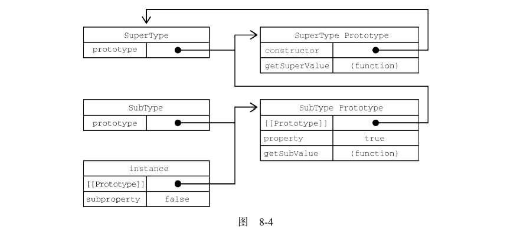

为了更好的理解这段内容所表达的含义， 下面写了一个更便于理解的示例：

```javascript
function Person() {
  this.drink = function () {
    console.log("drink water", "--line3");
  };
}
function Teacher(name) {
  this.name = name;
  this.teach = function () {
    console.log("teacher always teaching", "--line8");
  };
}
Teacher.prototype = new Person();

let teacher = new Teacher("lily");
teacher.drink();//drink water
```

在这个实例中， 为了实现 Teacher 继承 Person, 为了使得 teacher 这个实例化对象能够使用构造函数Person 中的 drink 方法。 我们通过将Teacher的原型对象 指向 Person 的实例化对象，从而使得，自teacher 对象的属性/方法查找，能够延升到 Teacher 的原型对象。


#### 3.1.1 默认原型

实际上， 原型链中还有一环。 默认情况下，所有引用类型都继承自 Object， 这也是通过原型链实现的。  **任何函数的默认原型都是一个 Object 的实例，** 这就意味着这个实例有一个内部指针指向了 Object.prototype。 这也是为什么自定义类型能够继承包括 `toString()` ， `valueOf()` 在内的所有默认方法的原因。 因此前面的例子还有额外一层继承关系。 下图展示了完整的原型链。

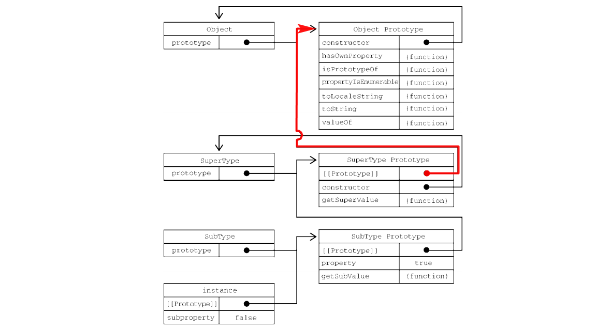

SubType 继承 SuperType, 而 SuperType 继承 Object。 在调用 `instance.toString()` 时， 实际上时调用的是保存在 `Object.prototype` 上的方法。

#### 3.1.2 原型与继承关系

原型与实例的关系可以通过两种方式来确定：

1. 使用`instanceof` 操作符
2. 使用` “”()` 方法

第一种方式，如果一个实例中的原型链中出现过相应的构造函数，则`instanceof` 返回 `true`

```javascript
console.log(instance instanceof Object);//true
console.log(instance instanceof SuperType);//true
console.log(instance instanceof SubType);//true
```

第二种方式，其调用者是原型链中的每个原型， 只要原型链中包含这个原型， 这个方法就会返回 `true`

```javascript
console.log(Object.prototype.isPrototypeOf(instance));//true
console.log(SuperType.prototype.isPrototypeOf(instance));//true
console.log(SubType.prototype.isPrototypeOf(instance));//true
```

#### 3.1.3 关于方法

子类有时候需要覆盖父类的方法，或者增加父类没有的方法。为此，这些方法必须在原型赋值之后再添加到原型上。

```javascript
function SuperType(){
    this.property = true;
}
SuperType.prototype.getSuperValue = function(){
    return this.property;
}
function SubType(){
    this.subproperty = false;
}
// 继承 SuperType
subType.prototype = new SuperType();
// 新方法
SubType.prototype.getSubValue = function(){
    return this.subproperty;
};
// 覆盖已有的方法
SubType.prototype.getSuperValue = function(){
    return false;
}

let instance = new SubType();
console.log(instance.getSuperValue());//2
```

#### 3.1.4 原型链的问题

> @jayce问题1 ：  为什么对象原型属性，如果是一个引用类型会被多实例共享状态， 但是基本类型不会 ？
>
> ```javascript
> //如：
> function Person() {}
> Person.prototype.numb = 111;
> Person.prototype.arr = [0];
> let a = new Person();
> let b = new Person();
> a.numb = 123;
> a.arr.push(1);
> 
> console.log(b.numb, "--line19");//111;
> console.log(b.arr, "--line20");// [0,1];
> ```
>
> 答：因为这里`a.arr.push()` 不是赋值操作， 是对即存的属性值进行值操作。 
>
> 问题的进一步抽象，下面这个是知乎的提问：
>
> 
>
> > 对其解释是：
> > 具体来说这就是 ES 的约定
> >
> > 1. 原型仅用于属性的读取
> > 2. 不应用于属性的修改和删除
> >
> > 如果从道理上来解释合理性的话
> > 1. 读取的话，如果孩子身上没有的特性，希望从祖先身上继承
> > 2. 赋值，这个操作，应该应该只响应自己，一个孩子突变了，不应该应该祖先，影响了祖先，祖先的其他孩子也一起被影响了
>
> ```javascript
> function Person() {}
> Person.prototype.numb = 111;
> Person.prototype.arr = [0];
> let a = new Person();
> let b = new Person();
> a.numb = 123;
> a.arr = [1, 2, 3];
> 
> console.log(b.numb, "--line19"); //111;
> console.log(b.arr, "--line20"); // [0];
> ```
>
> @jayce问题2： 为什么构造函数内属性，则不会被多实例共享状态？
>
> ```javascript
> function SuperType() {
> this.colors = ["red", "blue", "green"];
> }
> let ins1 = new SuperType();
> let ins2 = new SuperType();
> console.log(ins1, ins2, "--line8"); //['red', 'blue', 'green'],['red', 'blue', 'green']
> ins1.colors.push("yellow");
> console.log(ins1, ins2, "--line10");//['red', 'blue', 'green', 'yellow'], ['red', 'blue', 'green']
> ```
>
> 这是因为，`ins1.colors === ins2.colors` 返回 `false` , 即两个实例中的同名属性，并不是同一个引用地址。
>
> 而为什么不同？见上文 [2.2 实例化对象](#2.2 实例化对象)

原型链在实现继承的时候，有两个问题值得注意：

**第一个问题：** 当原型中包含有引用值的时候， 该引用值会在所有实例间共享。

```javascript
function SuperType() {
  this.colors = ["red", "blue", "green"];
}
function SubType() {}
// 继承 SuperType
SubType.prototype = new SuperType();

let instance1 = new SubType();
instance1.colors.push("black");
let instance2 = new SubType();
console.log(instance2.colors);// ['red', 'blue', 'green', 'black']
```

这个问题，实际上，易于解释为什么。 为了利用原型链实现继承，所以将 `SubType` 的 原型对象指向了 `SuperType` 的实例， 在实例化对象 `instance1` 之后， 向`instance1.colors` 执行`push` 操作， 而实际上， `instance1` 本身并不具有`colors` 属性，因此，沿着原型链，向上查找，而其`__proto__` 指针又指向了`SuperType` 的实例化对象， 所以就操作了该实例化对对象上的`colors` 属性。 同样的， `instance2` 也没有`colors` 属性， 沿着原型链，于是也访问到了同样的`colors` 属性。  所以，这个`colors` 被两个实例化对象访问到了， 也就是这里说的引用值共享。 

下图简单的说明了这个问题中的关系：


**第二个问题：**子类型在实例化的时候，不能给父类型的构造函数传参。 

这两个问题，导致原型链基本不会被单独使用。 

### 3.2 盗用构造函数

为了解决原型包含引用值导致的继承问题， ”盗用构造函数“（constructor stealing） 的基础被提出，也称作”对象伪装“， ”经典继承“。

基本思路很简单：**在子类构造函数中调用父类构造函数**

因为函数就是在特定上下文中执行代码的简单对象，所以可以使用`apply()` 和 `call()` 方法以新创建的对象为上下文执行构造函数。 

```javascript
function SuperType() {
  this.colors = ["red", "blue", "green"];
}
function SubType() {
  // 继承 SuperType
  SuperType.call(this);
}

let instance1 = new SubType();
instance1.colors.push("black");
let instance2 = new SubType();
console.log(instance1.colors); // ['red', 'blue', 'green', 'black']
console.log(instance2.colors); // ['red', 'blue', 'green']
```

> 关于`call()` 方法
>
> ```javascript
> const person = {
>   fullName: function() {
>     return this.firstName + " " + this.lastName;
>   }
> }
> const person1 = {
>   firstName:"John",
>   lastName: "Doe"
> }
> const person2 = {
>   firstName:"Mary",
>   lastName: "Doe"
> }
> 
> // This will return "John Doe":
> person.fullName.call(person1);
> 
> // This will return "Mary Doe"
> person.fullName.call(person2);
> ```
>
> call 本身，就是调用的意思， 正常调用，`person.fullName()` 默认的this, 就是`person` 对象。 而如果需要在执行该方法的同时指定一个其他的对象为其`this`， 就需要使用`call()` 或者 `apply()` 方法。 

以上代码执行过程描述：

1. `SuperType()` 构造函数，函数体中通过`this` ，定义了`colors` 属性， 我们已经知道， `SuperType()` 构造函数，本身也是函数， 其中的`this` 指向了调用它的对象， 如果在全局作用域直接执行该方法：

   ```javascript
   function SuperType() {
     this.colors = ["red", "blue", "green"];
   }
   SuperType();
   console.log(window.colors);//["red", "blue", "green"]
   ```

   可以看到 `this` 指向 `window`

2. `SubType()`  构造函数中， 当`SubType`被执行时，将会通过`call(this)` 去执行`SuperType()` 。 

3. `SubType()` 通过`new` 关键字实例化对象，会将`SubType()` 函数体中的`this` 指向这个实例化的空对象， 即，`SuperType.call(this)` ，中的`this` 实际上会指向这个实例化的空对象， 且每当实例化一次，这个`this` 指向的都是一个新的空对象。 

这就是为什么能继承自`SuperType()` 的属性， 且不共享状态的原因。


#### 3.2.1 传递参数

相比于使用原型链，盗用构造函数的一个优点就是可以在子类构造函数中向父类构造函数传参。

```javascript
function SuperType(str) {
  this.colors = ["red", "blue", "green"];
  this.colors.push(str);
}
function SubType(str) {
  // 继承 SuperType
  SuperType.call(this, str);
}

let instance1 = new SubType("hello");
console.log(instance1, "--line10");//['red', 'blue', 'green', 'hello']
```

#### 3.2.2 盗用构造函数的问题

盗用构造函数的 主要缺点， 也是使用构造函数模式自定义类型的问题：必须在构造函数中定义方法，因此函数不能重用。 此外子类也不能访问父类原型上定义的方法， 因此所有类型只能使用构造函数模式。 由于存在这些问题， 盗用构造函数基本上也不能单独使用。 

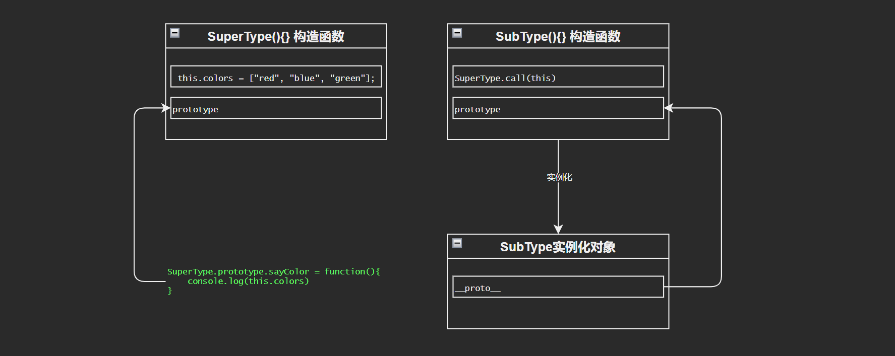

在这张图中，我们可以看出来为什么子类不能访问父类原型上定义的方法。

按照原型链的规则， 当SubType的实例对象试图执行`sayColors()` 方法时， 由于对象本身没有定义该方法， 所以会视图去对象原型`__proto__`（`[[prototype]]`） 上查找， 也就是SubType构造函数中的`prototype` 原型对象，但是发现也没有。 

我们可以看到，该原型对象和`SuperType` 的原型对象之间并无关联， 因此，无法访问到在`SuperType`的原型对象上定义的`sayColor` 方法。 

`SubType` 的构造函数上的`SuperType.call(this)` 仅仅是调用了`SuperType` 这个函数。


### 3.3 组合继承 （伪经典继承）

组合继承，综合了原型链和盗用构造函数， 基本思路是：

1. 使用原型链继承原型上的属性和方法
2. 通过盗用构造函数继承实例属性

优点是： 可以把方法定义在原型上以实现重用、又可以让每个实例 都有自己的属性。 

```javascript
function SuperType(name) {
  this.name = name;
  this.colors = ["red", "blue", "green"];
}

SuperType.prototype.sayName = function () {
  console.log(this.name);
};

function SubType(name, age) {
  // 继承属性
  SuperType.call(this, name);

  this.age = age;
}

// 继承方法
SubType.prototype = new SuperType();

SubType.prototype.sayAge = function () {
  console.log(this.age);
};

let instance1 = new SubType("Nicholas", 29);
instance1.colors.push("black");
console.log(instance1.colors); // "red,blue,green,black"
instance1.sayName(); // "Nicholas";
instance1.sayAge(); // 29

let instance2 = new SubType("Greg", 27);
console.log(instance2.colors); // "red,blue,green"
instance2.sayName(); // "Greg";
instance2.sayAge(); // 27
```

在这个例子中，`SuperType` 构造函数定义了两个属性， `name` 和`colors`。 而它的原型上也定义了一个方法叫`sayName()`。 `SubType` 构造函数调用了 `SubperType` 构造函数，传入了 `name` 参数，然后又定义了自己的属性 `age`。 此外， `SubType.prototype` 也被赋值为`SuperType` 的实例。原型赋值之后，又在这个原型上添加了新方法`sayAge()`。  这样， 就可以创建两个`SubType` 实例， 让这两个实例都有自己的属性， 包括`colors` ， 同时还共享相同的方法。

**组合继承弥补了原型链和盗用构造函数的不足， 是`JavaScript` 中使用最多的继承模式**。 而且组合继承也保留了`instanceof` 操作符 和 `isPrototypeOf()` 方法识别合成对象的能力。

### 3.4 原型式继承

现任PayPal高级JavaScript架构师，也是《JavaScript 语言精粹》的作者 —— Douglas Crockford 06年的时候，写了一篇文章 《JavaScript 中的原型式继承》 ，文中给出了一个函数 ：

```javascript
function object(o){
    function F(){}
    F.prototype = o;
    return new F();
}
```

这个 `object()` 函数会创建一个临时构造函数， 将传入的对象赋值给这个构造函数的原型，然后返回这个临时类型的一个实例。 本质上， `object()` 是对传入的对象执行了一次浅复制。示例：

```javascript
function object(o) {
  function F() {}
  F.prototype = o;
  return new F();
}
let person = {
  name: "Nicholas",
  friends: ["Shelby", "Court", "Van"],
};
let anotherPerson = object(person);
let yetAnotherPerson = object(person);
console.log(anotherPerson.prototype === yetAnotherPerson.prototype); //两个实例化对象的指向的原型对象是同一个
anotherPerson.name = "Greg";
anotherPerson.friends.push("Rob");
yetAnotherPerson.name = "Linda";
yetAnotherPerson.friends.push("Barbie");
console.log(anotherPerson,yetAnotherPerson);//{name: 'Greg'},{name: 'Linda'} // name 是赋值操作，赋值操作不同于对象属性或者方法的访问，因此不遵循原型链查找规则 ，会直接对实例对象本身添加或者覆盖属性

console.log(person.friends);//{"name": "Nicholas","friends": ["Shelby","Court","Van","Rob","Barbie"]} // 因为实例化对象指向的是同一个原型对象，而name 是赋值操作，不会影响到原型对象上的name属性，而
//对这里的引用值类型是访问操作（修改），所以遵循原型链的查找规则， 所以原型对象上的引用值被修改了。 这也是前面说的原型对象上的引用值类型会被实例对象状态共享。
```


### 3.5 寄生式继承

与原型式继承比较接近的一种继承方式是**寄生式继承（parasitic inheritance）**, 也是Crockford 首倡的一种模式。 寄生式继承背后的思路类似于寄生构造函数和工厂模式：创建一个实现继承的函数， 以某种方式增强对象，然后返回这个对象。 基本的寄生继承模式如下：

```javascript
function object(o) { 
  function F() {}  
  F.prototype = o; 
  return new F(); 
} 
function createAnother(original){
  let clone = ojbect(original);//通过调用函数创建一个新会县
  clone.sayHi = function(){//以某种当时增强这个对象
    console.log("hi");
  };
  return clone;// 返回这个对象
}
```

这段代码中，`createAnother()` 函数接收一个参数，就是新对象的基准对象。 这个对象 original 会被传给 `object()` 函数，然后将返回的新对象赋值给clone。 接着给clone 对象添加一个新方法 `sayHi()`。 最后返回这个对象。 可以像下面这样使用 `createAnother()` 函数：

```javascript
let person = {  
  name: "Nicholas", 
  friends: ["Shelby", "Court", "Van"] 
}; 
 
let anotherPerson = createAnother(person); 
anotherPerson.sayHi();  // "hi" 
```

这个例子基于 person 对象返回了一个新对象。新返回的 anotherPerson 对象具有 person 的所
有属性和方法，还有一个新方法叫 sayHi() 。 
寄生式继承同样适合主要关注对象，而不在乎类型和构造函数的场景。 object() 函数不是寄生式
继承所必需的，任何返回新对象的函数都可以在这里使用。 

> :warning: 注意  通过寄生式继承给对象添加函数会导致函数难以重用，与构造函数模式类似。

> @jayce:  其实就是名字吓唬人， 所谓寄生式继承，不过式在原型继承的基础上，加了个工厂模式的处理函数，在每个最终返回的对象上添加了一个方法而已。没什么高明之处。

### 3.6 寄生式组合继承

先回顾一下上面提到的组合继承：

```javascript
function SuperType(name) {  
  this.name = name; 
  this.colors = ["red", "blue", "green"]; 
} 
 
SuperType.prototype.sayName = function() { 
  console.log(this.name); 
}; 
 
function SubType(name, age){ 
  SuperType.call(this, name);   // 第二次调用 SuperType() 
 
  this.age = age; 
} 
 
SubType.prototype = new SuperType();   // 第一次调用 SuperType() 
SubType.prototype.constructor = SubType; 
SubType.prototype.sayAge = function() { 
  console.log(this.age); 
}; 
```

组合式继承存在效率问题。最主要的效率问题就是父类构造函数始终会被调用两次：一次实在创建子类原型的时候调用， 另一次是在子类构造函数中调用。这样会导致一个延升问题，上例中有两组`name` 和 `colors` 属性： 一组在实例上，另一组在`SubType` 原型上。 这是调用两次`SuperType` 构造函数的结果。好在有办法解决这个问题。

寄生式组合继承，通过盗用构造函数继承属性，但使用原型链继承模式继承方法。 基本思路是bu通过调用父类构造构造函数给子类原型赋值，而是取得父类原型的一个副本。说到底就是使用寄生式继承来继承父类原型，然后将返回的新对象赋值给子类原型。 寄生式组合继承的基本模式如下：

```javascript
function inheritPrototype(subType,superType){
    let prototype = object(superType.prototype);// 创建对象
    prototype.constructor = subType;// 增强对象
    subType.prototypr = prototype;//赋值对象
}
```


### 关于以上几种继承方式的总结


## 4. 类


## 附件1：章节拓展

> https://www.bilibili.com/video/BV1Kt411w7MP?p=23
> 2019全新javaScript进阶面向对象ES6 (P23 - P38)
> 讲师：黑马程序员 - pink

##### P23 01- 构造函数和原型导读

目标：

	1. 能使用构造函数创建对象
	1. 能够说出原型的作用
	1. 能够说出访问对象成员的规则
	1. 能够使用ES5 新增的一些方法

目录：

- 构造函数和原型
- 继承
- ES5新增的方法

##### P24 02- 利用构造函数创建对象

**1.1 概述**

- ”类就是对象的模板，对象就是类的实例“

> 类的概念在ES6才被引入

- 在ES6 之前，对象不是基于类创建的，二十用一种成为<span style="color:red">构建函数</span>的特殊函数来定义对象和它们的特征。

- 创建对象可以通过以下三种方式创建

  1. 对象字面量

  2. `new Object()`

  3. 自定义构造函数

     > ```javascript
     > function Star(uname,age){
     >     this.uname = uname;
     >     this.age = age;
     >     this.sing = function(){
     >         console.log("我会唱歌")
     >     }
     > }
     > let ldh = new Star('刘德华',18)
     > let zxy = new Star('张学友',19)
     > ldh.sing()
     > ```
     >
     > 通过构造函数创建对象的过程：
     >
     > 1. 通过`new` 关键字创建一个空对象
     > 2. 将`this` 指向这个空对象
     > 3. 执行构造函数里面的代码，给这个新对象添加属性和方法
     > 4. 返回实例化的对象。

##### P25 03- 实例成员和静态成员

1. 静态成员： 在构造函数上添加的成员成为 <span style="color:red">静态成员，只能由构造函数本身来访问</span>

   > 直接在构造函数上添加的成员，即静态成员，如：
   >
   > ```javascript
   > function Star(){}
   > Star.sex = '男'
   > ```
   >
   > 静态成员只能通过构造函数来访问：
   >
   > ```javascript
   > console.log(Star.sex);//男
   > ```

2. 实例成员： 在构造函数内部创建的对象成员称为 <span style="color:red">实例成员，只能由实例化的对象来访问</span>

   > 通过构造函数内部的`this`添加的成员， 如上例的`uname`， `age`， `sing`。不可以通过构造函数访问。

##### P26 04- 构造函数原型对象 `prototype`

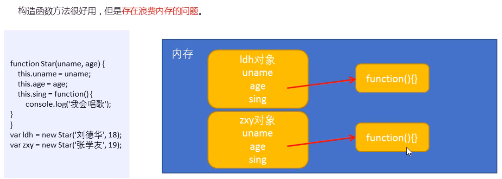

>  实例成员如果是一个复杂数据类型，那么每次实例化对象，这个成员都会重新在内存中去开辟空间。 这样，如果这是一个逻辑相同的函数， 那么每次创建就会造成内存浪费。

**构造函数通过原型分配的函数是所有对象所<span style="color:red">共享的</span>**

> 什么是`prototype` ?
>
> JavaScript 规定， <span style="color:red">每一个构造函数都有一个`prototype` 属性</span>, 指向另一个对象。 这一这个`prototype` 就是一个对象， <u>这个对象的所有属性和方法，都会被构造函数所拥有。</u> 
>
> ```javascript
> function Star(uname,age){
>     this.uname = uname;
>     this.age = age;
>     this.sing = function(){
>         console.log("我会唱歌")
>     }
> }
> console.dir(Star)
> ```
>
> 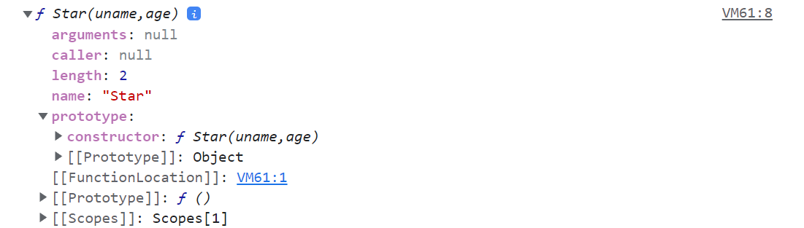

<span style="color:red">我们可以把哪些不变的方法，直接定义在`prototype` 对象上， 这样所有对象的实例就可以共享这些方法。</span>

如：

```javascript
function Star(uname,age){
    this.uname = uname;
    this.age = age;
}
Star.prototype.sing = function(){ console.log("我会唱歌")}
let ldh = new Star('刘德华',18)
let zxy = new Star('张学友',19)
ldh.sing()
zxy.sing()
```


**小结：** 一般情况下，我们的公共属性定义到构造函数里面，公共的方法我们放到原型对象身上。

原型对象(`prototype`) 的主要作用是什么 ？实现了实例对象方法的共享，节省了内存空间。 


##### P27 05- 对象原型 `__ptoto__`

先决问题 ： 我们在构造函数的原型对象（`prototype`）上定义的方法，为什么实例化对象能够直接访问？

<span style="color:red"> 每个对象都会有一个属性——`__proto__`</span> 指向构造函数的 `prototype` 对象，之所以我们对象啊可以使用构造函数`prototype`原型对象的属性和方法，就是因为对象有`__proto__`原型的存在。

```javascript
function Star(uname,age){
    this.uname = uname;
    this.age = age;
}
Star.prototype.sing = function(){ console.log("我会唱歌")}
let ldh = new Star('刘德华',18)
console.log(ldh.__proto__ === Star.prototype);// true
```

> 注意： 实际上指向的是一个内部不可直接访问的属性 —— `[[prototype]]` , firefox 中标记为`<prototype>` 当你直接打印实例对象的时候，不同的浏览器输出结果也是不一样的。老师演示的浏览器版本打印实例化对象上面就直接会有一个`__proto__`属性。
>
> ```javascript
> function Star(uname,age){
>     this.uname = uname;
>     this.age = age;
> }
> Star.prototype.sing = function(){ console.log("我会唱歌")}
> let ldh = new Star('刘德华',18)
> console.log(ldh)
> ```
>
> 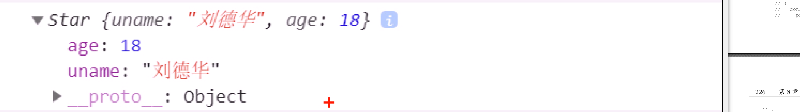
>
> 然而这是历史包袱， 最新的浏览器中，都没有，如chrome中是这样的：
>
> 
>
> firefox 中是这样：
>
> 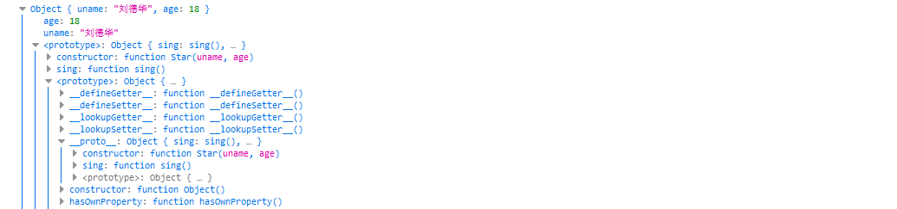
>
> MDN 上说`__proto__` 是不推荐使用的， 应该用`Object.getPrototypeOf/Reflect.getPrototypeOf` 和`Object.setPrototypeOf/Reflect.setPrototypeOf`来代替。
>
> 老版本浏览器的DevTools 的本意是想让你知道这个对象的原型是什么。
>
> 所以，切勿在代码中使用`__proto__` ，即便它能够被访问到。
>
> <span style="color:red">**记住，`__proto__` 对象原型，是指向该对象的构造函数的原型对象的`prototype`，二者是等价的**</span>

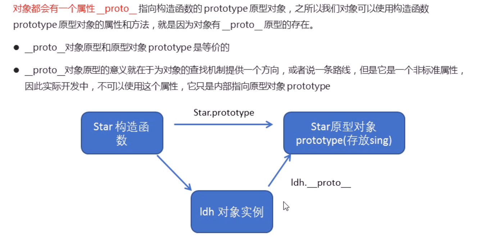

##### P28 06- 原型constructor 构造函数

<span style="color:red">对象原型（`__proto__`）</span> 和 <span style="color:red">构造函数原型对象（`prototype`）</span>里面都有一个<span style="color:red">`constructor`</span>属性， 我们称之为构造函数， 因为它指回构造函数本身。

 ```javascript
 function Person(name, age) {
   this.name = name;
   this.age = age;
 }
 let person1 = new Person("jay", 26);
 console.log(Person.prototype.constructor === Person, "--line6");//true
 console.log(person1.__proto__.constructor === Person, "--line7");//true
 ```

> **注意：** 如果我们修改了原来的原型对象， 给原型对象赋值的是一个对象， 则必须手动利用constructor指回原来的构造函数
>
> ```javascript
> function Person(name, age) {
>   this.name = name;
>   this.age = age;
> }
> Person.prototype = {
>   sing: function () {
>     console.log("i can sing", this, "--line7");
>   },
>   run: function () {
>     console.log("i can run", "--line10");
>   },
> };
> let person1 = new Person("jay", 26);
> console.log(Person.prototype.constructor, "--line6");//ƒ Object() { [native code] } '--line6'
> console.log(person1.__proto__.constructor, "--line7");//ƒ Object() { [native code] } '--line6'
> ```
>
> 这里是因为，直接给`Person.prototype` 赋值了一个对象， 当此时访问`Person.prototype.constructor`时，实际上在`Person.prototype` 上是找不到的， 但赋值的是一个对象， 于是向上查找，会指向 `Object`
>
> 这时候，手动设定一个`constructor` 属性并指定构造函数即可：
>
> ```javascript
> function Person(name, age) {
>   this.name = name;
>   this.age = age;
> }
> Person.prototype = {
>   constructor: Person,
>   sing: function () {
>     console.log("i can sing", this, "--line7");
>   },
>   run: function () {
>     console.log("i can run", "--line10");
>   },
> };
> let person1 = new Person("jay", 26);
> console.log(Person.prototype.constructor, "--line6");
> console.log(person1.__proto__.constructor, "--line7");
> // ƒ Person(name, age) {
> //   this.name = name;
> //   this.age = age;
> // } '--line7'
> ```
>
> 

##### P29 07- 构造函数实例和原型对象三角关系

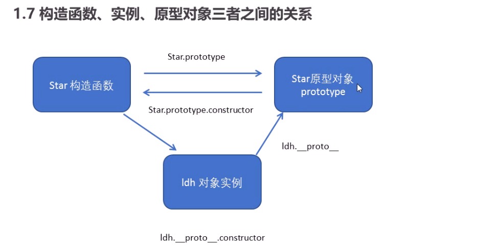

##### P30 08- 原型链

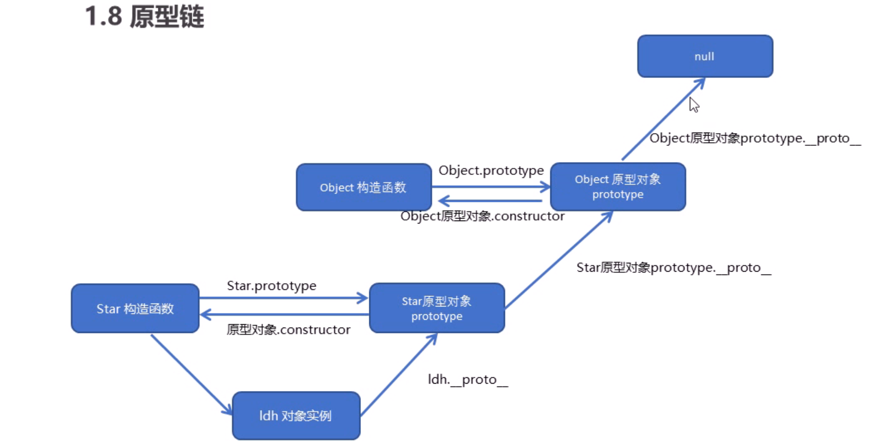

> 1. 只要是对象就有`__proto__` 原型， 指向原型对象
> 2. 我们Star 原型对象里面的`__ptoto__` 原型指向的是`Object.prototype`
> 3. 我们`Object.prototype` 原型对象里面的 `__proto__` 原型，指向为 `null`
>
> 下面是自己画的图@jayce
>
> 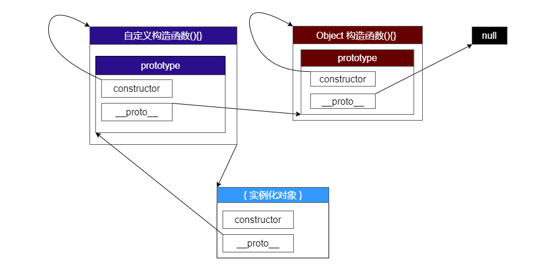
>
> > 图_三角关系


##### P31 09- 对象成员查找规则

1. 当访问一个对象的属性(包括方法)时，首先查找这个 <span style="color:red">对象自身</span> 有没有该属性。 
2. 如果没有就查找它的原型 （ 也就是 `__proto__` 指向的 <span style="color:red">`prototype` 原型对象</span>）。
3. 如果还没有就查找原型对象的原型 （ <span style="color:red">Object 的原型对象</span>）
4. 依此类推一直找到Object 为指，最后一层指向 <span style="color:red">`null`</span>


## 附件2： 几种继承方式的实现总结

**原型链继承实现：**

将子类构造函数的原型对象指向父类实例化对象。 

优点：

1. 简单

缺点：

1. 每一次实例化子类,`[[prototype]]` 指针，指向的都是同一个对象，即父类的实例化对象。 这意味着，所有实例化的子类对象，都将共享父类实例化对象中的引用值类型。

为了解决上述引用值共享的问题， 于是有了 “盗用构造函数” 也叫做 “经典继承” 的继承模式

**盗用构造函数 （“经典继承”）：**

通过在子类构造函数中调用`SuperType.call(this)` 的方式，实现将父类构造函数中定义的属性和方法，全部在子类实例化对象上定义一遍，从而实现的继承模式

优点：

1. 解决了原型链模式实现的继承的缺陷问题，即——父类原型对象中的引用值类型会被所有子类实例对象共享
2. 通过构造函数盗用的继承模式，可以实现在子类构造函数中向父类构造函数传参。

缺点：

1. 虽然实现了继承的目的，但是无法通过`instanceof` 或者 `isPrototypeOf()` 关键字去判断 父类 和子类实例化对象的关系。 即 `instance1 instanceof SuperType` 将会返回 `false`。

2. 由于实例对象和父类没有实际关联，所以无法通过原型链规则，去方位父类构造函数的原型上定义的方法， 所以，方法要想被继承，必须在父类构造函数中去定义。 

   而继承实现的核心是去调用父类构造函数，从而给实例化对象上添加方法，这就意味着，每次实例化，都会定义同名，同功能，但是不同地址的方法。 没有达到方法共用，继而会造成内存消耗上的浪费。 


而为了解决盗用构造函数这种继承模式（经典继承）所带来的缺陷，后继出现了 组合继承 ，也被称作 “伪经典继承”。

**组合继承** （伪经典继承）:

伪经典继承，是 原型链继承模式  和  经典继承模式 的结合体。

就是 在子类中 `SuperType.call(this);` 的形式去实现父类原型中定义的方法和属性， 同时，将子类构造函数的原型指向父类的实例对象。

这样做，在<u>父类构造函数原型上定义的方法</u>，都会被重用， 在<u>构造函数体内通过 `this` 添加的属性</u>都是独立的。 （`this`指向每一个通过`new` 关键字实例化的子类对象）

这样一来，就解决了以下问题(也是原型链继承模式和经典继承的缺陷)，或者说优点：

1. 可以通过`instanceof` 和 `isPrototypeOf()` 关键字和方法去判断父类和子实例化对象的关系。 
2. 引用值类型不会被共享状态
3. 父类原型上定义的方法得以被共享


组合继承（伪经典继承）也是ES6之前，JavaScript中使用最多的继承模式。


**原型式继承**

除了上述的组合继承，现任PayPal高级JavaScript架构师，也是《JavaScript 语言精粹》的作者 —— Douglas Crockford  在06年就提出的一种新的继承模式 —— 原型式继承


所谓原型式继承，其核心思想，是利用了一个临时的中间构造函数。

不易于口头描述，以下结合代码片段尝试表述：

核心代码如下:

```javascript
function object(o){
    function F(){};
    F.prototype = o;
    return new F();
}
let person = {
    name: "tom",
	friends: ["a", "b"],
}
let person_A = object(person)
let person_B = object(person)
```

定义中间构造函数`F` ,将其prototype原型对象指向需要继承的基本对象person， 并返回实例化F的对象。

这样做，有一个特点，就是每一次通过将person 对象传入`object(o)` 方法调用，返回的都是一个全新的对象，但是，所有新生成的对象的`[[prototype]]` 指针都指向的是同一个对象，即person. 

```javascript
console.log(person_A.__proto__ === person_B.__proto__);//true
console.log(person_A.__proto__ === person);//true
```

引用值类型会被共享状态。

其实，从结果上看，原型式继承和最开始提到的原型链继承，是一样的。

那么面试可能会问道的问题就是： 原型链继承模式 和 原型式继承 有什么区别 ？

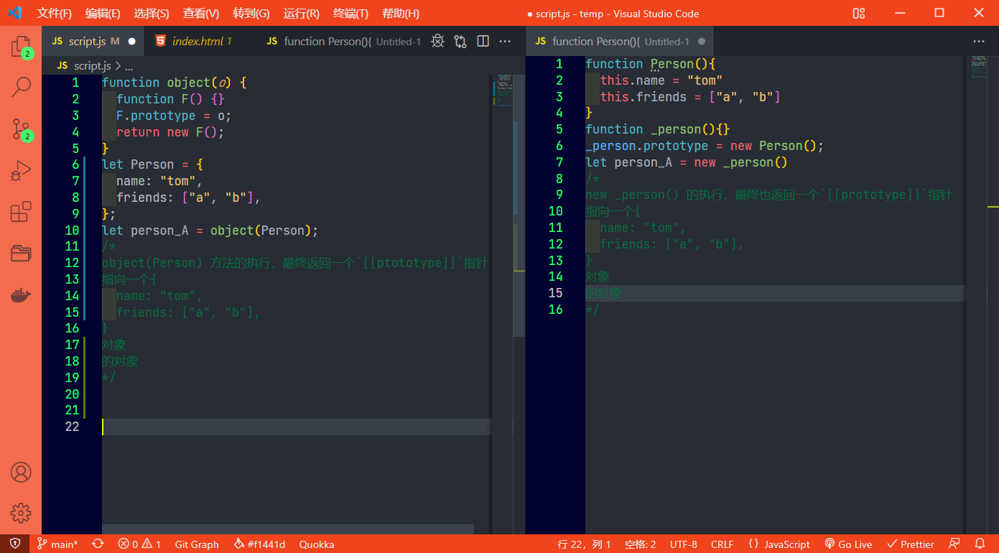

个人认为 都是将一个构造函数的原型对象指向一个对象。只不过是实现方式不一样罢了。 

只是有一个额外的点需要注意:

> ECMAScript5 通过增加`Object.create()` 方法，将原型式继承的概念规范化了。 这个方法接受两个参数：作为新对象原型的对象，以及给新对象定义额外属性的对象（第二个参数可选）。在只有一个参数时`Object.create()` 与这个里的`object()` 方法效果相同。
>
> 说白了，就是谈及原型式继承，就是`Object.create()` 方法， 而究其原理，就是对上述实现方式的封装和扩展。 
>
> 以下是一个使用实例：
>
> ```javascript
> let person = {
>     name:'tom',
>     friends:['a','b']
> };
> let person_A = Object.create(person);
> ```


