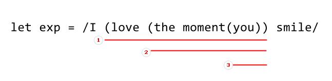
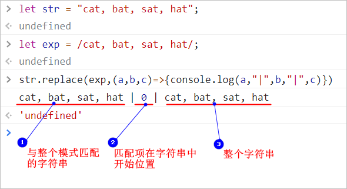

[toc]

## 1. RegExp 对象

JS 中像其他语言一样，有正则表达式的支持，即RegExp对象。 

该对象主要提供了两个对象方法，分别是：

1. `exec()`
2. `test()`

用法示例如下：

```javascript
let str = "cat bat";
let exp = /.at/g;
exp.exec(str); // ['cat', index: 0, input: 'cat bat', groups: undefined]
exp.exec(str); // ['bat', index: 4, input: 'cat bat', groups: undefined]
exp.exec(str); // null
```


```javascript
let str = "cat bat";
let exp = /.at/g;
exp.test(str); // true
```

更多参看这里 [link](https://www.cnblogs.com/jaycethanks/p/15592840.html)


## 2. 字符串模式匹配方法

但是在处理字符串时，以上方法并不常用，取而代之，`String` 类型专门为在字符串中实现模式匹配设计了几个方法。

1. `match()`;
2. `search()`;
3. `replace()`;

### 2.1 `match()` ， `search()`

其中， `match()` 和 `search()` 方法的使用较为类似。 二者的使用示例如下：

```javascript
let str = "cat, bat, sat, hat";
let pt = /.at/g;
let result = str.match(pt);
console.log(result);
/*
[
    "cat",
    "bat",
    "sat",
    "hat"
]
*/
```

```javascript
let str = "cat, bat, sat, hat";
let pt = /.at/g;
let result = str.search(pt);
console.log(result); // 0
```

这两个方法都是接受一个参数， 是一个 正则表达式字符串，或者RegExp 对象。

所不同的是， `match()` 返回被匹配的项， 如果是`/g` 匹配模式，则返回一组包含所有匹配项的数组，否则，返回第一个匹配的到的子串， 其返回解雇结果和`exec()` 的执行结果相同。 而`search()` 的返回结果则是首个匹配项的索引值，如果没有匹配项则返回`-1`。 


### 2.2 `replace()`

**重点的需要熟悉`replace()` 方法， 这是最常用的方法**


为了简化子字符串替换操作，ECMAScript 提供了 replace() 方法。 这个方法接收两个参数，第一个参数可以是一个RegExp对象，或者一个字符串（**这个字符串不会转换为正则表达式**），第二个参数可以是一个字符串或者一个函数。

也就是，`repalce()` 方法可以单纯的用于替换字符串中的子串，也可以用以替换匹配模式匹配的目标子串。

1. 替换子字符串，示例：

   ```javascript
   let str = "cat, bat, sat, hat";
   let result = str.replace("at","hello");// chello, bat, sat, hat
   ```

   > :warning: 注意： 如果第一个参数是字符串，那么只会替换第一个子字符串。要是想替换所有的子字符串，第一个参数必须为正则表达式并且开启了全局匹配模式。

2. 替换正则匹配项，示例：

   ```javascript
   let str = "cat, bat, sat, hat";
   let pt = /at/g;
   let result = str.replace(pt,"hello");
   console.log(result);// chello, bhello, shello, hhello
   ```


#### 2.2.1 第二个参数为字符串的应用情况


**<span style="color:red">第二个参数是字符串的情况下</span>，有几个特殊的字符序列，可以用来插入正则表达式操作的值。**

| 字符序列 | 替换文本                                                     |
| -------- | ------------------------------------------------------------ |
| `$$`     | `$`                                                          |
| `$&`     | 匹配整个模式的子字符串。等同RegExp.lastMatch                 |
| `$'`     | 匹配的子字符串之前的字符串。 —— RegExp.rightContext          |
| `` $` `` | 匹配的子字符串之后的字符串。 —— RegExp。leftContext          |
| `$n`     | 匹配第 `n` 个捕获组的子字符串， n ( 0~9 ), 若没有捕获组，值为空串。 |
| `$nn`    | 匹配第 `nn` 个捕获组， nn (01~99), 若没有捕获组，值为空串。  |

以下示例说明：

```javascript
let str = "I love the moment you smile";
let exp = /I (love (the moment(you)) smile/
```

> 该实例中，将会有三个捕获组：
>
> 

**`$$`**

```javascript
str.replace(exp,"$$"); // 将匹配到的子串替换为 `$` 符号
// '$'
```

:warning: 注意： 尽管是存在捕获组，但是因为整个模式就能匹配完整的源字符串， 还是直接全部被替换为了 `$` 符号。

**`$&`**

```javascript
str.replace(exp,"$&"); // 'I love the moment you smile'
```

**`$'` 、`` $` ``**

```javascript
str.replace(exp,"$'"); // ''
str.replace(exp,"$`"); // ''
// "I love the moment you smile "为首个完整匹配，其左侧，右侧都是空字符
```

**`$n`、`$nn`**

```javascript
str.replace(exp,"$1"); //'love the moment you'
str.replace(exp,"$2"); //'the moment'
str.replace(exp,"$3"); //'you'
```


**注意：**

1. 以上执行的含义是， 将第二个参数中的字符串，替换掉源字符串中被第一个参数（pattern）所匹配命中的子字符串。 

2. 以上的示例中，`$'`, ``$` `` 的输出都是空串，以及`$$` 直接返回`$`的原因是， `$&` 作为整个pattern 命中结果，已经和源字符串相同了，即整个完整的字符串被命中。 如果做以下修改，结果将不同：

   ```javascript
   let str = 'I love the moment you smile';
   let exp = /love (the moment (you))/;
   str.replace(exp,"$$")
   // 'I $ smile'
   str.replace(exp,"$'")
   // 'I  smile smile'
   str.replace(exp,"$`")
   // 'I I  smile'
   ```

所以， 一点小结： <span style="color:red">当字符串方法`replace()` 的第二个参数为字符串时， **`replace()` 方法的替换目标是 \$&**  </span>

以上述示例来描述，就是 字符串 "I love the moment you smile" 的原始值包装对象提供的`replace()` 方法， 在通过正则表达式`/love (the moment (you))/` 来进行内容替换时， 将会以整个pattern(表达式)匹配到的子串为目标，即 “love the moment you” 为替换目标，也就是`$&` 。 并无关于pattern 中是否有捕获组。


#### 2.2.2 第二个参数为函数的应用情况

**根据是否有捕获组，表现不同**

`replace()` 方法第二个参数还支持函数， 目的是用于更加灵活的替换规则，拓展捕获组的使用需求等。

该函数根据第一个参数中（pattern） 是否具有捕获组，函数的传递参数也不同：

1. 没有捕获组时 ： 函数收到3个参数 ：①. 与整个模式匹配的字符串 ②. 匹配项在字符串中的开始位置 ③. 整个字符串
2. 有捕获组时 : **每个匹配捕获组的字符串都会作为参数**传给这个函数，但是最后两个参数，依旧是 整个匹配模式开始的位置 和 原始字符串。 因此参数的个数时不确定的，为`n + 2`

以下是一些示例：

示例1 ：没有捕获组：




示例2 ： 只有一个捕获组：


示例3 ： 有多个捕获组：


**第二个参数为函数时的字符串替换示例：**

示例1：

```javascript
function htmlEscape(text) { 
  return text.replace(/[<>"&]/g, function(match, pos, originalText) { 
    switch(match) {  
      case "<": 
        return "&lt;"; 
      case ">": 
        return "&gt;"; 
      case "&": 
        return "&amp;"; 
      case "\"": 
        return "&quot;"; 
    } 
  }); 
} 
 
console.log(htmlEscape("<p class=\"greeting\">Hello world!</p>")); 
// "&lt;p class=&quot;greeting&quot;&gt;Hello world!</p>" 
```


**<span style="color:red">:question: ​这个地方存在一个疑问:</span>**

不知道当Pattern 中含有捕获组的时候要怎么去处理, 例如：

```javascript
let str = "i always love the way you lie";
let exp = /always (love) the way (you) lie/;
let res = str.replace(exp, function (...args) {
  for (let i = 0; i < args.length; i++) {
    if (args[i] === "love") {
      return "hate";
    } else if (args[i] === "you") {
      return "she";
    }
  }
});
console.log(res); //i hate
```

期望是将源字符串中的 "love"->"hate", "you" -> "she" 。

