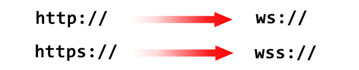

## 0. 前言

理解什么是Web Socket 的最好方式，应该是拿它和HTTP 做对比。 


> 图片引用自 [link](https://medium.com/@td0m/what-are-web-sockets-what-about-rest-apis-b9c15fd72aac#id_token=eyJhbGciOiJSUzI1NiIsImtpZCI6IjkzNDFhYmM0MDkyYjZmYzAzOGU0MDNjOTEwMjJkZDNlNDQ1MzliNTYiLCJ0eXAiOiJKV1QifQ.eyJpc3MiOiJodHRwczovL2FjY291bnRzLmdvb2dsZS5jb20iLCJuYmYiOjE2Mzg5MjU4MzksImF1ZCI6IjIxNjI5NjAzNTgzNC1rMWs2cWUwNjBzMnRwMmEyamFtNGxqZGNtczAwc3R0Zy5hcHBzLmdvb2dsZXVzZXJjb250ZW50LmNvbSIsInN1YiI6IjEwMjIyNDA5ODM0Mjk1MTEwNjIzNSIsImVtYWlsIjoic3Vuemhvbmd5aXRoYW5rc0BnbWFpbC5jb20iLCJlbWFpbF92ZXJpZmllZCI6dHJ1ZSwiYXpwIjoiMjE2Mjk2MDM1ODM0LWsxazZxZTA2MHMydHAyYTJqYW00bGpkY21zMDBzdHRnLmFwcHMuZ29vZ2xldXNlcmNvbnRlbnQuY29tIiwibmFtZSI6IkpheWNlIiwicGljdHVyZSI6Imh0dHBzOi8vbGgzLmdvb2dsZXVzZXJjb250ZW50LmNvbS9hLS9BT2gxNEdoZVlfR3E0SmJhdlluVlEyTERtN29OUlhwZEpHelgzdFFHdXFydGVnPXM5Ni1jIiwiZ2l2ZW5fbmFtZSI6IkpheWNlIiwiaWF0IjoxNjM4OTI2MTM5LCJleHAiOjE2Mzg5Mjk3MzksImp0aSI6IjliNzcyYjYyMmI3ZDI2YWY1ZmE1M2E3NTBiMDMyNTgzNTZkNzc5MDYifQ.XAcgf0usqbPSimW5GbTIb_g1wt05L6Fufm4gv3uPhWXPHyKsoK2CMiaQpH1lsBcu86SdllyNCHAAE2cRSkIkSeylQBzR1P6cAWXpWDR0qf1BoOMxSH-7BngSeQsLsW1B4Rd_eqil5xmKqggo0OJPpvHDmhyCg7BnunQKFHoWgi2TdJYkJDyGkVvlluqBG4BQbsD6FRvzGAj_1vO9fzu9cYBNnaRH38SIO54qfr_APVZugRHzc0Wt383dITVAx6yz4aVFWtvJFVYuY8wreu1OdjFJlzG_Yr2b6Ve9nYj7SiSSgUIoeakCySqEPPK4oTbtODxBXPNMusUvKQjgZadUyw)

我们知道，HTTP 协议 是一种 “一问一答” 式的通信方式， 即必须由客户端发起一次请求， 然后服务端返回一次响应。 而 Web Socket 不同之处在于， 客户端都可以主动的向对方发送数据，是一种 “对问对答” 的通信方式。 

往细了说， HTTP 是 无状态（stateless）协议，即自身不对请求和响应之间的通信状态进行保存。 协议对于发送过的请求或者响应都不做持久化处理，在这种情况之下， 每当有新的请求发送时， 就会有对应的新响应产生。

而对于Web Socket来说，它的目标是通过一个长时连接实现与服务器的全双工、双向的通信。

在创建Web Socket 的时候， 一个HTTP 请求会发送到服务器以初始化连接。 服务器响应后， 连接使用HTTP的Upgrade 头部从HTTP 协议切换到Web Socket 协议。


Web Socket 使用了自定义协议， 所以URL 稍有变化， 不在使用`http://` / `https://`  。使用自定义协议而非HTTP 协议的好处是，客户端与服务器之间可以发送非常少的数据，不会对HTTP 造成任何负担。 




## 1. API

通过给`WebSocket` 构造函数传入一个URL以实例化一个 `WebSocket` 对象。 

```javascript
let socket = new WebSocket("ws://www.example.com/server.php");
```

> 同源策略不适用于Web Socket, 因此可以打开到任意站点的连接。 

浏览器会在初始化 `WebSocket` 对象之后立即创建连接。 与 XHR 类似， WebSocket 也有一个 `readyState` 属性表示当前状态。 

- `WebSocket.OPENING(0)` : 连接正在建立；
- `WebSocket.OPEN(1)` : 连接已经建立；
- `WebSocket.CLOSING(2)` : 连接正在关闭；
- `WebSocket.CLOSE(3)` : 连接已经关闭

`readyState` 值从 0 开始， 任何时候都可以调用`close()` 方法关闭 Web Socket 连接： 

```javascript
socket.close();
```

调用后， `readyState` 立即变为2 (连接正在关闭), 并会在关闭后变为3 (连接已经关闭)。


## 2. 发送和接收数据

打开 Web Socket 之后， 可以通过连接发送和接收数据。 要向服务器发送数据， 使用`send()` 方法并传入一个字符串，ArrayBuffer 或者 Blob, 如：

```javascript
let socket = new WebSocket("ws://www.example.com/server.php");

let stringData = "hello world!";
let arrayBufferData = Uint8Array.from(['f','o','o']);
let blobData = new Blob(['f','o','o']);

socket.send(sringData);
socket.send(arrayBufferData.buffer);
socket.send(blobData);
```

服务端向客户端发送信息时，WebSocket 对象上会触发 message 事件。 这个 message 事件与其他消息协议类似， 可以通过event.data 属性访问到有效载荷：

```javascript
socket.onmessage = function(event){
    let data = event.data;
    //对数据执行某些操作
}
```

与通过`send()` 方法发送的数据类似， `event.data` 返回的数据也可能时`ArrayBuffer` 或 `Blob`。这由

WebSocket 对象


