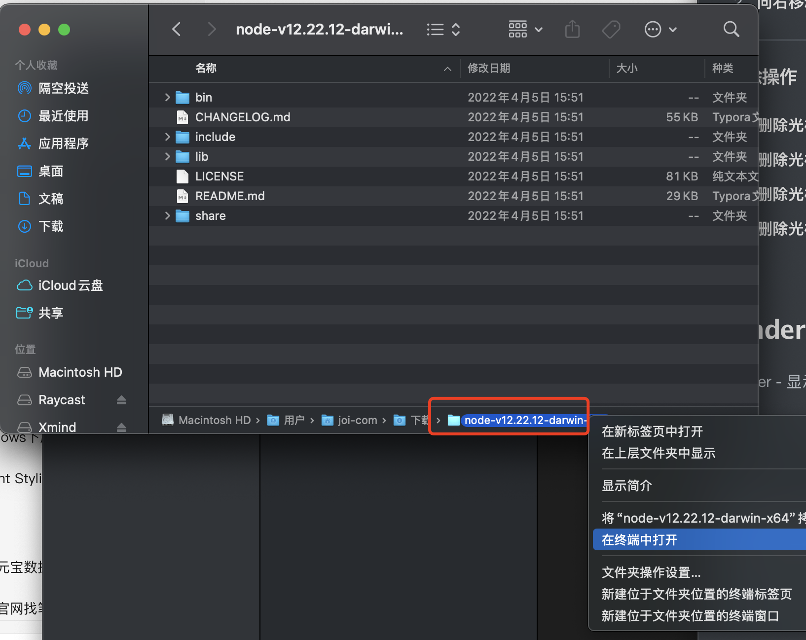
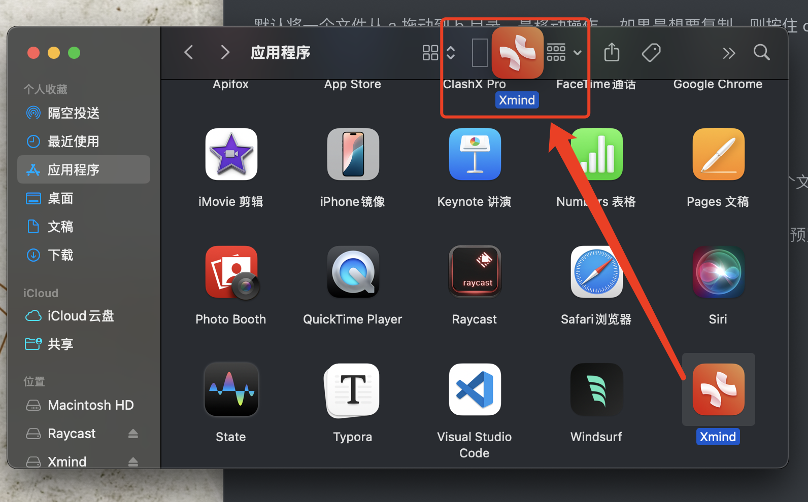
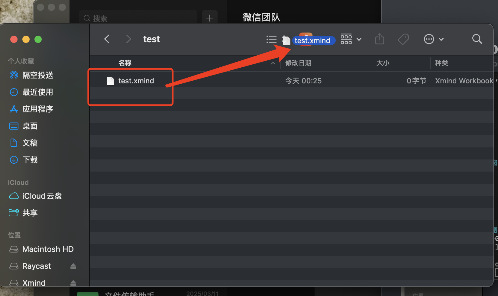

Mac 快捷指南

[toc]

## 终端光标移动

---

### 基础快捷键
1. **向左移动光标**：`Ctrl + B`（B 代表 Back）。
2. **向右移动光标**：`Ctrl + F`（F 代表 Forward）。
3. **移动到行首**：`Ctrl + A`（A 代表 Ahead）。
4. **移动到行尾**：`Ctrl + E`（E 代表 End）。

---

### 单词级移动
1. **向左移动一个单词**：`Option + ←`（向左箭头）。
2. **向右移动一个单词**：`Option + →`（向右箭头）。

---

### 删除操作
1. **删除光标前的字符**：`Ctrl + H`。
2. **删除光标后的字符**：`Ctrl + D`。
3. **删除光标前的单词**：`Ctrl + W`。
4. **删除光标后的单词**：`Option + D`。

## Finder 在当前目录打开终端

Finder - 显示 - 显示路径栏

然后双击(右键) 指定目录 - 终端打开

## Command 拖动 拖动被遮挡的窗口

假设现在有 B 窗口部分遮挡于 A 窗口之上， 按住 Command 键，然后拖动 A 窗口，就可以保持 A 不切换到视口最上层的同时移动窗口了。

## 窗口关闭与最小化

| 操作                                   | 命令                 | 等效操作                                                     |
| -------------------------------------- | -------------------- | ------------------------------------------------------------ |
| 关闭当前活动窗口                       | Command + w          | 红豆豆，关闭窗口按钮                                         |
| 关闭当前活动窗口且保留到dock右侧最小化 | Command + m          | 黄豆豆，最小化窗口按钮                                       |
| 关闭并退出当前活动程序                 | Command + q          | 双击 dock栏应用图标-退出                                     |
| 隐藏当前应用程序的所有窗口             | Command + h          | 顶部菜单栏 -  点击当前应用程序的名称，如 Safari -  Hide [应用程序名称] |
| 隐藏除了当前应用程序的所有其他应用窗口 | Option + Command + h |                                                              |
| 在同一个应用不同窗口之前快速切换       | Command + `          |                                                              |

## 拖动文件复制

默认将一个文件从 a 拖动到 b 目录，是移动操作， 如果是想要复制，则按住 option 键拖动。

## 文件剪切

不同于 windows， mac 上没有类似  ctrl + x 的按键。  默认 

Command + c 复制， 到指定目录后， 如果 command + v 那就是复制。 而如果 是 command + option + v 就是移动。 

## Quick look

在 Finder 中，选中一个文件，例如图片，然后按空格键就可以快速预览这个文件。 在按一次就会收起预览。 
如果选中某个文件后，按住空格不放，那么也会触发预览，松开空格会收起预览。 

对于预览图片来说，这是一个非常实用的功能。

## 切换 dock 栏显示/隐藏

option + command + d

实际上是切换 智能 隐藏 dock 栏开关。

## 快速查看网络信息如 ip

按住 option 键，点按状态栏 wifi 图标。

## 音量微调

Command + Option + 音量+/-

## Finder 文件显示简介快捷键

选中文件后 Command + i

## 唤起 Finder 并文件搜索

option+command + space 空格

## 把应用/文件 pin 到 Finder 的工具栏或者侧边栏

按住 Command 拖动应用/文件 到指定位置即可。  要移除同样按住 command 拖动到任意空白处即可。 

这样就可以拖动指定文件到这个应用打开

## 快速定位到dock栏中的应用在 finder 应用程序中的位置

shift + command + 鼠标点按 dock 栏目标应用图标。 

> 快速删除一些临时安装的应用挺好用的

## 企业微信截图

command + shift + a
