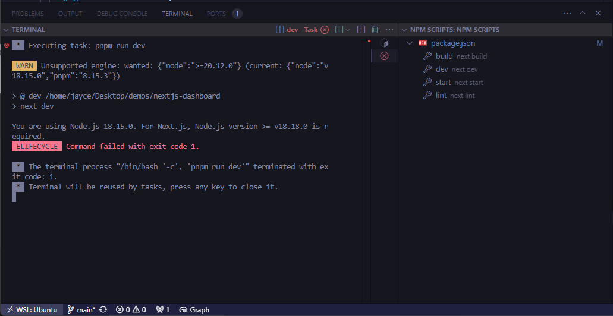
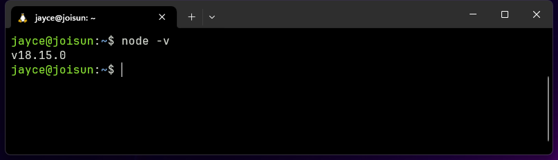

### 解决 Vscode 中 NPM SCRIPTS panel 点击执行时， 使用的环境为全局默认的 terminal 环境的问题





> 未解决 https://stackoverflow.com/questions/44700432/visual-studio-code-to-use-node-version-specified-by-nvm?rq=2

待更新....


### Volta For Windows Setup:

```powershell
# installation with powershell
winget install Volta.Volta
```

create `%LOCALAPPDATA%\Volta\hooks.json`, set some mirrors

```json
{
    "node": {
        "index": {
            "prefix": "https://npmmirror.com/mirrors/node/"
        },
        "distro": {
            "template": "https://npmmirror.com/mirrors/node/v{{version}}/{{filename}}"
        }
    },
    "npm": {
        "index": {
            "prefix": "https://registry.npmmirror.com/"
        },
        "distro": {
            "template": "https://registry.npmmirror.com/npm/-/{{filename}}"
        }
    },
    "pnpm": {
        "index": {
            "prefix": "https://registry.npmmirror.com/"
        },
        "distro": {
            "template": "https://registry.npmmirror.com/pnpm/-/{{filename}}"
        }
    }
}
```

done.
