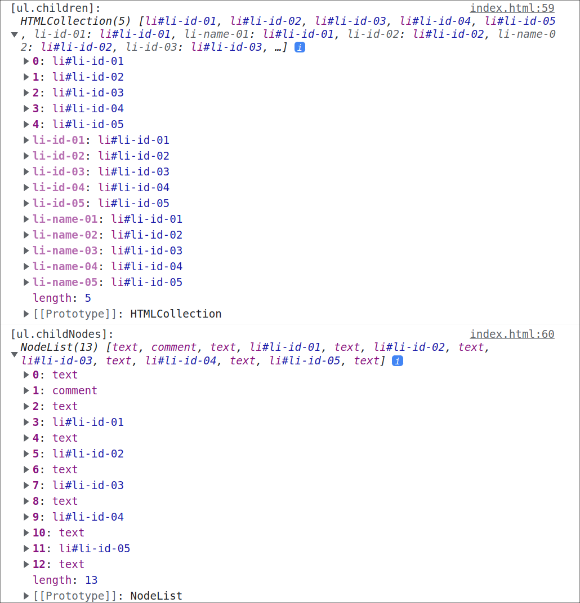

## 1. w3 关于这两者的定义

> ***HTMLCollection***: An `HTMLCollection` is a list of nodes. An individual node may be accessed by either ordinal index or the node's `name` or `id` attributes. *Note:* Collections in the HTML DOM are assumed to be *live* meaning that they are automatically updated when the underlying document is changed.
>
> ***NodeList***: The `NodeList` interface provides the abstraction of an ordered collection of nodes, without defining or constraining how this collection is implemented. `NodeList` objects in the DOM are [live](https://www.w3.org/TR/DOM-Level-3-Core/core.html#td-live).
>
> The items in the `NodeList` are accessible via an integral index, starting from 0.

`HTMLCollection` 和 `NodeList` 都是元素节点的集合， 前者可以按照索引/节点`name`/节点`id` 属性访问。 后者可以按照索引访问。 

### 1.1 实例属性

***HTMLCollection*** 和 ***NodeList***  都只有一个实例属性:

- `length`: 返回节点集合的长度

### 1.2 实例方法

| HTMLCollection                                               | NodeList                                                     |
| ------------------------------------------------------------ | ------------------------------------------------------------ |
| `HTMLCollection.item()`：<br />传入元素 `index` 返回特定的节点 | `NodeList.item()`：<br />传入索引返回特定节点                |
| `HTMLCollection.namedItem()`：<br />传入节点的 `name` 属性，返回特定的节点 | `NodeList.entries()`：<br />返回key-value 的迭代器           |
| :warning:<span style="color:red">HTMLCollection 没有 forEach 方法</span> | `NodeList.forEach()`：<br />节点遍历方法                     |
|                                                              | `NodeList.keys()`：<br />返回NodeList 的所有key值的迭代器，这里也就是索引 |
|                                                              | `NodeList.values()`<br />返回NodeList 的所有value值的迭代器，也就四节点本身 |

一些示例：

```html
  <body>
    <p name="p1" class="para">Lorem, ipsum dolor.</p>
    <p name="p2" class="para">Lorem ipsum dolor sit amet.</p>
    <p name="p3" class="para">Lorem ipsum dolor sit amet, consectetur adipisicing elit.</p>
  </body>
  <script>
    const paras = document.getElementsByClassName('para');
    console.log(paras.item(0).innerHTML);//Lorem, ipsum dolor.
    console.log(paras.namedItem('p3').innerHTML);//Lorem ipsum dolor sit amet, consectetur adipisicing elit.
  </script>
```

```html
  <body>
    <p name="p1" class="para">Lorem, ipsum dolor.</p>
    <p name="p2" class="para">Lorem ipsum dolor sit amet.</p>
    <p name="p3" class="para">Lorem ipsum dolor sit amet, consectetur adipisicing elit.</p>
  </body>
  <script>
    const paras = document.querySelectorAll('.para');
    console.log('log1:', paras.item(0).innerHTML);
    console.log('log2:', paras.entries());
    console.log('log3:', paras.entries().next());
    console.log('log4:', paras.keys());
    console.log('log5:', paras.keys().next());
    console.log('log6:', paras.values());
    console.log('log7:', paras.values().next());
    paras.forEach((p) => {
      console.log('[p.innerHTML]: ', p.innerHTML);
    });
  </script>
```


>  特别说明，在实例方法中， `NodeList/HTMLCollection.item()`方法仅接受索引值。 

## 2. 哪些常见操作会返回这二者？

***HTMLCollection***

- `document.getElementsByTagName` 

- `document.getElementsByClassName`

- `HTMLElement.children`
- `document.forms`
- `document.images`

***NodeList***:

- `document.getElementsByName`
- `document.querySelectorAll`
- `HTMLElement.childNodes`

## 3. 二者有什么相同点？

二者所包含的结点都是响应式的，也就是说，当所依赖的文档发生了变化，相应的DOM视图也会发生更新。 

**NodeList**

为了验证这一点，我们可以使用 `Array.from`(浅拷贝来测试一下)：

```js
  <script>
    const paras = document.querySelectorAll('.para');
    const copy = Array.from(paras);
    copy.forEach((cp) => {
      cp.innerHTML += new Date().toLocaleTimeString();
    });
    paras.forEach((p) => {
      console.log('[p.innerHTML]: ', p.innerHTML);
    });
      //[p.innerHTML]:  Lorem, ipsum dolor.9:42:54 AM
      //[p.innerHTML]:  Lorem ipsum dolor sit amet.9:42:54 AM
      //[p.innerHTML]:  Lorem ipsum dolor sit amet, consectetur adipisicing 
  </script>
```


说明拷贝对象中的DOM 元素发生了变化，视图会发生更新。 

**HTMLCollection**

对于 HTMLCollection 也是这样的， 

```html
  <script>
    const paras = document.getElementsByClassName('para');
    const copy = Array.from(paras);
    copy.forEach((cp) => {
      cp.innerHTML += new Date().toLocaleTimeString();
    });
    [...paras].forEach((p) => {
      console.log('[p.innerHTML]: ', p.innerHTML);
    });
      //[p.innerHTML]:  Lorem, ipsum dolor.9:42:54 AM
      //[p.innerHTML]:  Lorem ipsum dolor sit amet.9:42:54 AM
      //[p.innerHTML]:  Lorem ipsum dolor sit amet, consectetur adipisicing elit.9:42:54 AM
  </script>
```

需要注意的是，这里HTMLCollection 类数组是没有forEach 方法的， 所有我们用扩展元算符(其实也是浅拷贝)将其转换成了一个数组。

## 4. 二者有什么区别？

最重要的区别是， **HTMLCollection** 仅包含 tags(以及id/name分别标记的) 元素， 而 **NodeList** 包含所有的节点。 例如：

- 元素节点

- 属性节点

- 文本节点(空白字符也会被视作文本节点)

- 注释节点

  > [node types](https://www.w3schools.com/jsref/prop_node_nodetype.asp)

示例：

```html
  <body>
    <ul id="myList">
      <!-- List items -->
      <li name="li-name-01" id="li-id-01">List item 1</li>
      <li name="li-name-02" id="li-id-02">List item 2</li>
      <li name="li-name-03" id="li-id-03">List item 3</li>
      <li name="li-name-04" id="li-id-04">List item 4</li>
      <li name="li-name-05" id="li-id-05">List item 5</li>
    </ul>
  </body>
  <script>
    const ul = document.getElementById('myList');
    console.log('[ul.children]: ', ul.children);
    console.log('[ul.childNodes]: ', ul.childNodes);
  </script>
```



这意味着，对于有id节点的 HTMLCollection 返回类型， 你可以这样去访问：

```js
console.log('[li[0]]: ', li[0]); //li#li-01
console.log("[li['li-01']]: ", li['li-01']);//li#li-01
```

并且这二者完全一样：

```js
console.log(li[0] === li['li-01']);//true
```

> name 也是如此

另外，尽管如此，HTMLCollection/NodeList 的 item 方法依旧仅能通过索引访问，而不能够通过id/name 访问。

```js
const li = document.getElementsByTagName('li');
const _li = document.querySelectorAll('li');

//以下打印： li#li-03
console.log('[li.item(2)]: ', li.item(2));
console.log('[_li.item(2)]: ', _li.item(2));

//以下打印： li#li-01
console.log('[li.item("")]: ', li.item(''));
console.log('[li.item("li-03")]: ', li.item('li-03'));
console.log('[_li.item("")]: ', _li.item(''));
console.log('[_li.item("li-03")]: ', _li.item('li-03'));
```

> 即item参数如果接收一个非数值参数，将默认返回第一个元素，如果没有元素，那么返回 null