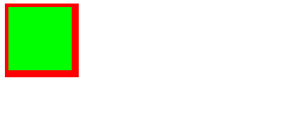
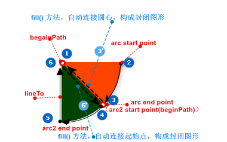
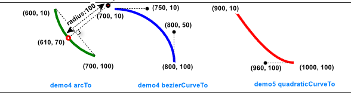

工作中用到canvas还是比较少，还是很久很久以前学html的时候学过，都忘记了，所以这会就打算重新学习学习。 下面会先复习+学习一遍 canvas 的特性，支持的 API， 然后做一个可爱的canvas 时钟:

[link](https://jaycethanks.github.io/demos/DemoPages/canvas-clock/dist/) 
[src](https://github.com/jaycethanks/jaycethanks.github.io/tree/master/demos/DemoPages/canvas-clock)


## 一、`<canvas>` 元素

### 1.1 canvas 元素属性

- `height` / `width` : 指定的画布大小，也是画布的坐标系统宽高，单位是css像素值，默认值为 `150`

  > **不要用css去定义canvas的尺寸**，canvas 标签属性定义的是画布的大小，如果css宽高不等于标签 `height`/`width` 属性设定值， 那么画布将会发生缩放， 会导致元素扭曲，模糊。

  > **画布大小限制**， canvas 的画布大小并不是任意指定的，具体的它取决于浏览器，在绝大多数情况下限制大小是 10,000 x 10,000 而在ios移动设备上通常是 4,096 x 4,096。

### 1.2 非闭合元素，以及后备（兜底）处理

canvas 不同与 img 元素， 必须提供闭合标签。

对于一些比较老旧的浏览器，可以提供一个子元素，用以兜底。 当浏览器不支持canvas的时候，就会渲染这个子元素。 

```html
<canvas>not support canvas</canvas>
```

### 1.3 canvas 的解耦渲染

canvas 可以通过 [`OffscreenCanvas`](https://developer.mozilla.org/en-US/docs/Web/API/OffscreenCanvas) API 去渲染，它是和 document 解耦的。好处就是  [worker thread](https://developer.mozilla.org/en-US/docs/Web/API/Web_Workers_API/Using_web_workers)  可以处理canvas的渲染，所有canvas操作就不会阻塞主线程的页面渲染了。 即便是处理复杂的渲染逻辑，页面上其他的元素也不会丢失响应性。 详细的去看 [`OffscreenCanvas`](https://developer.mozilla.org/en-US/docs/Web/API/OffscreenCanvas) API 。

 

## 二、canvas 坐标系统


和浏览器的坐标系统一样， 左上角坐标点即坐标原点 (0,0), x,y 就是定义的画布宽高，如果没有特别设定，那么一个单位尺寸，就是一个像素。

## 三、 绘制

canvas 和 svg 不同的是， canvas 仅仅支持三种主要的绘制图形： **矩形(rectangle)** 和 **路径(paths)** 。 所有其他的图形只能通过 路径 去组合实现。 

### 2.1 填充和描边

2d 画板中，着色有两种方式，分别是 **填充** 和 **描边**，顾名思义，分别是填充封闭区域的颜色，和为轮廓线着色。 

填充着色使用 `fill(fillStyle)`， 其中 `fillStyle` 指定了填充的样式。 描边着色使用 `stroke(strokeStyle)`， 其中 `strokeStyle` 制定了描边的样式。 `fillStyle` 以及 `strokeStyle` 都可以是字符串/渐变对象/图案对象， 它们的默认值都是 `#00000`, 支持任意的 CSS 颜色格式。 

当设定了 `fillStyle` 和 `strokeStyle`， 后续的绘制样式都会按照这个样式去绘制，除非再次修改。 

可以在 `const ctx = HTMLCanvasElement.getContext('2d')` 的上下文对象上访问到这些属性的默认值。 在设定和绘制的时候可以如下操作：

> 下方代码中，用到了path绘制，后文中会详细介绍。 

```js
const ctx = document.querySelector('canvas').getContext('2d');

ctx.strokeStyle = "red"
ctx.fillStyle = "#00ff00"
ctx.lineWidth = 10

ctx.beginPath()// 新建一个 path 路径
ctx.moveTo(0, 0)// 移动画笔到（0，0）坐标
ctx.lineTo(100, 0)// 绘制直线从上一个点为起点，到(100,0) 坐标
ctx.lineTo(100, 100)// 绘制直线从上一个点为起点，到(100,100) 坐标
ctx.lineTo(0, 100)// 绘制直线从上一个点为起点，到(0,100) 坐标
ctx.closePath()// 结束 path 路径，并自动连接起始点构建封闭图形

ctx.fill();// 填充着色
ctx.stroke();// 轮廓
```

以上代码绘制如下图形：



> 绘制结果中，边框之所以不同，是由于我们设定了线宽为10像素，在绘制的时候，实际计算方式是，以绘制中心线为基准，两侧各5各像素。上边和左边边框看上去只有一半，是因为贴合画布边缘，导致绘制中心线外侧被剪切掉了。要解决这个问题，应该将绘制向画布右下角移动一点距离。 


### 2.2 绘制 path 路径

path 就是一个点的集合，中间用线段进行连接，在 2d 上下文中可以通过 路径 创建更复杂的形状或者线条。 

要绘制一个 path, 大致步骤如下：

1. 调用 `beginPath()` 方法创建路径
2. 用各种方法创建所需路径
3. 调用 `closePath()` 方法闭合路径
4. 着色

**①首先**，需要调用上下文对象的 [`beginPath()`](https://developer.mozilla.org/en-US/docs/Web/API/CanvasRenderingContext2D/beginPath) 方法，该方法表示要开始绘制新路径。 接下来的任何绘制命令都将会应用到当前路径上。 接下来，有很多种 **②创建路径** 方法：

- `moveTo`: 不绘制线条，移动画笔到目标点。 
- `ctx.lineTo(x, y)`：绘制从起始点到 `(x, y)` 的直线

- ` ctx.arc(x, y, radius, startAngle, endAngle, counterClockwise)` : 以坐标 `(x, y)` 为圆心， 以 `radius` 为半径绘制一条弧线， 该弧线起始角度为 `startAngle`， 结束角度为 `endAngle`。 最后一个参数指定顺时针（默认）/逆时针。

  > 在使用这个方法的时候，注意，如果绘制完成，不调用`closePath()`, 直接调用 `fill()` 方法，那么路径会自动连接圆心或者起始点构成封闭图形

- `ctx.arcTo(x1, y1, x3, y2, radius)` ：以给定半径 `radius`， 从起始点，到以 `(x1, y1)` 为途径点，最后到 `(x2, y2)`为终点的弧线。 

- `ctx.bezierCurveTo(c1x, c1y, c2x, c3y, x, y)`: 三次贝塞尔去曲线， 以 `(c1x, c1y)` 和 `(c2x, c2y)` 为控制点， 绘制一条从起始点，到 `(x, y)` 的弧线。

- `ctx.quadraticCurveTo(cx, xy, x, y)`: 二次贝塞尔曲线，以 `(cx, cy)` 为控制点， 绘制一条从上一点到 `(x, y)`  的弧线。 

- `ctx.rect(x, y, width, height)`: 以 `(x, y)` 为起点，绘制一个宽为 `width`, 高为 `height` 的矩形。 

  > 该方法和 `strokeRect()/fillRect()` 的区别在于，它创建的是一条路径，而不是独立图形。 

**③创建路径之后， 可以使用 `closePath()` 方法**，它将绘制一条返回起点的线，使得路径所绘制的区域构成一个封闭区域。如果就是画线不需要闭合，就不用调这个方法。  路径创建完毕之后，就可以进行 **④着色处理**了(`fill()/stroke()`)

**clip() 方法**

有时候我们需要一个新的剪切区域用来作画， 例如将一张图片绘制在一个不规则图形上， 这时候就需要用到 `clip` 方法了。 

#### 示例：

<iframe height="500" style="width: 100%;" scrolling="no" title="【BLOG_POSTS】canvas path demos" src="https://codepen.io/Jaycethanks/embed/rNgzaed?default-tab=js%2Cresult&editable=true" frameborder="no" loading="lazy" allowtransparency="true" allowfullscreen="true">
  See the Pen <a href="https://codepen.io/Jaycethanks/pen/rNgzaed">
  【BLOG_POSTS】canvas path demos</a> by Jaycethanks (<a href="https://codepen.io/Jaycethanks">@Jaycethanks</a>)
  on <a href="https://codepen.io">CodePen</a>.
</iframe>

其中弧形(扇形)的绘制进一步步骤大致如下：



arc 弧度绘制相关方法的绘制辅助理解：


### 2.3 绘制矩形

矩形是 **唯一** 可以直接绘制的形状，矩形的绘制有三个 API：

- [`fillRect(x, y, width, height)`](https://developer.mozilla.org/en-US/docs/Web/API/CanvasRenderingContext2D/fillRect)： 绘制一个填充的矩形区域；
- [`strokeRect(x, y, width, height)`](https://developer.mozilla.org/en-US/docs/Web/API/CanvasRenderingContext2D/strokeRect)：绘制一个矩形框；
- [`clearRect(x, y, width, height)`](https://developer.mozilla.org/en-US/docs/Web/API/CanvasRenderingContext2D/clearRect)：清空一个矩形区域；

#### 示例：

<iframe height="500" style="width: 100%;" scrolling="no" title="【BLOG_POSTS】canvas rect demos" src="https://codepen.io/Jaycethanks/embed/ZENJYOv?default-tab=js%2Cresult&editable=true" frameborder="no" loading="lazy" allowtransparency="true" allowfullscreen="true">
  See the Pen <a href="https://codepen.io/Jaycethanks/pen/ZENJYOv">
  【BLOG_POSTS】canvas rect demos</a> by Jaycethanks (<a href="https://codepen.io/Jaycethanks">@Jaycethanks</a>)
  on <a href="https://codepen.io">CodePen</a>.
</iframe>

> 可以看到，矩形的绘制，不需要像 path 路径绘制那样，先 `beginPath`, 绘制完毕后还要 `closePath`。 路径绘制中的 `fill` 方法也被 `fillRect()` 方法替换， `stroke()` 方法则被 `strokeRect()` 方法替换。


### 2.4 绘制文本

canvas 中绘制文本，可以通过两个方法：

- `fillText()` : 最常用的， 用于填充文字
- `strokeText()`：描边着色，如果不指定`fillStyle`， 那么中空填充色为默认 `#000000`

这两个方法都接收 4 个参数： 要绘制的字符串，x坐标，y坐标，可选最大像素宽度

这两个方法的绘制效果被以下上下文对象属性所影响：

- `ctx.font` : css 语法指定样式、大小、字体， 例如： `10px Arial`
- `ctx.textAlign`: 文本对齐方式： `"start"` |  `"end"` |  `"left"` |  `"right"` | `"center"`
- `textBaseLine`: 文本基线： `"top"` |  `"middle"` |  `"bottom"` |  `"hanging"` | `"alphabetic"` | `"ideographic"`

文本的绘制方式非常的丰富，可以实现各种效果，以下是一些特性示例：

#### 示例：

<iframe height="500" style="width: 100%;" scrolling="no" title="canvas-tutorial-text" src="https://codepen.io/Jaycethanks/embed/abrybeK?default-tab=js%2Cresult&editable=true" frameborder="no" loading="lazy" allowtransparency="true" allowfullscreen="true">
  See the Pen <a href="https://codepen.io/Jaycethanks/pen/abrybeK">
  canvas-tutorial-text</a> by Jaycethanks (<a href="https://codepen.io/Jaycethanks">@Jaycethanks</a>)
  on <a href="https://codepen.io">CodePen</a>.
</iframe>

关于 `fillText()` 和 `strokeText()` 方法的第四个参数 `maxWith` ，指定了文字渲染的最大宽度，文字会被 "挤" 在 这个宽度内。以下是一些简单演示：
<iframe height="300" style="width: 100%;" scrolling="no" title="【BLOG_POSTS】canvas text maxWith param" src="https://codepen.io/Jaycethanks/embed/oNRegGr?default-tab=js%2Cresult&editable=true" frameborder="no" loading="lazy" allowtransparency="true" allowfullscreen="true">
  See the Pen <a href="https://codepen.io/Jaycethanks/pen/oNRegGr">
  【BLOG_POSTS】canvas text maxWith param</a> by Jaycethanks (<a href="https://codepen.io/Jaycethanks">@Jaycethanks</a>)
  on <a href="https://codepen.io">CodePen</a>.
</iframe>

#### **`measureText()` 文字大小确定辅助方法** 

关于文字的自适应绘制， 文字绘制在canvas中是一项很复杂的工作，有时候我们有固定宽度的容器，我们希望文字在不被压缩的情况下，自适应的被绘制在该容器中。  

canvas 提供了一个有意思的方法，该方法专门用于辅助文字大小的确定。 `measureText()`，它仅返回一个对象属性`width`, 表示以当前的字体样式绘制将会占据的像素宽度。 以下是一个示例。

我们希望将 `"你好啊！兄嘚！"` 这段文字合适的放置在不同大小的容器。 

<iframe height="500" style="width: 100%;" scrolling="no" title="【BLOG_POSTS】canvas text measureText" src="https://codepen.io/Jaycethanks/embed/WNBEbmd?default-tab=js%2Cresult&editable=true" frameborder="no" loading="lazy" allowtransparency="true" allowfullscreen="true">
  See the Pen <a href="https://codepen.io/Jaycethanks/pen/WNBEbmd">
  【BLOG_POSTS】canvas text measureText</a> by Jaycethanks (<a href="https://codepen.io/Jaycethanks">@Jaycethanks</a>)
  on <a href="https://codepen.io">CodePen</a>.
</iframe>


### 2.5 变换

canvas 支持所有常见的变形变换效果，常见的变换方法如下：

- `rotate(angle)`: 围绕原点旋转 angle 弧度

- `scale(scaleX, scaleY)`, x/y 方向缩放

- [`translate(x, y)`](https://developer.mozilla.org/en-US/docs/Web/API/CanvasRenderingContext2D/transform): 将原点移动到 `(x,y)`，**可以理解为修改了坐标原点 `(0,0)` 到 `(x,y)`**， 此操作是累积的，也就是说，多次调用 `translate` 会将所有的平移效果叠加在一起。

- `transform(m1_1, m1_2, m2_1, m2_2, dx, dy)`: 矩阵变化, 可以像下面这样通过矩阵乘法直接修改。 transform方法可以实现以上所有的变换。
  $$
  \begin{pmatrix}
  m1_1水平缩放 & m1_2垂直倾斜 & dx水平移动 \\
  m2_1水平倾斜 & m2_2垂直缩放 & dy垂直移动 \\
  0 & 0 & 1
  \end{pmatrix}
  $$

  > ```js
  > // 应用变换：水平缩放2倍，垂直倾斜0.5，水平移动100，垂直移动50    
  > ctx.transform(水平缩放, 垂直倾斜, 水平倾斜, 垂直缩放, 水平移动, 垂直移动);
  > ctx.transform(2, 0, 0.5, 1, 100, 50);
  > ```

- `setTransform(m1_1, m1_2, m2_1, m2_2, dx, dy)`: 重置矩阵为默认值，再将参数传入调用 `transform` 方法。

  > **此方法直接设置当前的变换矩阵为指定的值。这将替代之前所有的变换（包括旋转rotate、缩放scale、平移translate等**)

以下是一些变换的示例：

#### 示例：

<iframe height="500" style="width: 100%;" scrolling="no" title="【BLOG_POSTS】canvas text transform demos" src="https://codepen.io/Jaycethanks/embed/YzbxyNv?default-tab=js%2Cresult&editable=true" frameborder="no" loading="lazy" allowtransparency="true" allowfullscreen="true">
  See the Pen <a href="https://codepen.io/Jaycethanks/pen/YzbxyNv">
  【BLOG_POSTS】canvas text transform demos</a> by Jaycethanks (<a href="https://codepen.io/Jaycethanks">@Jaycethanks</a>)
  on <a href="https://codepen.io">CodePen</a>.
</iframe>

### 2.6 绘制图像

canvas 中，可以通过 `drawImage()` 方法绘制图像， 该方法接收 3 组不同的参数：

1. 简单绘制 HTMLImageElement 元素到指定坐标：`ctx.drawImage(img, x, y)`

   ```js
   const img = document.querySelector('img');
   ctx.drawImage(img, 10, 10);// 将 img 元素绘制到 (10, 10) 坐标位置
   ```

2. 将图像绘制到指定位置，并缩放：`ctx.drawImage(img, x, y, width, height)`

   ```js
   const img = document.querySelector('img');
   ctx.drawImage(img, 10, 10, 20, 20);// 将 img 元素绘制到 (10, 10) 坐标位置, 目标宽/高都是 20 个像素
   ```

3. 把图像的一部分绘制到指定区域：`drawImage(img, 源图像x坐标, 源图像y坐标, 源图像width, 源图像height, 目标区域x坐标, 目标区域y坐标, 目标区域width, 目标区域height)`

   ```js
   const img = document.querySelector('img');
   context.drawImage(image, 0, 0, 100, 100, 0, 0, 200, 200);// 将图像以 (0, 0)坐标开始，100 宽高大小，绘制到画布 （0, 0）坐标位置，宽/高 200/200 像素区域
   ```

   

   利用这个特性,我们可以做点有意思的事情，比如，做个n宫格图：

   <iframe height="500" style="width: 100%;" scrolling="no" title="【BLOG_POSTS】canvas rect drawImage" src="https://codepen.io/Jaycethanks/embed/jOoLVoo?default-tab=js%2Cresult&editable=true" frameborder="no" loading="lazy" allowtransparency="true" allowfullscreen="true">
     See the Pen <a href="https://codepen.io/Jaycethanks/pen/jOoLVoo">
     【BLOG_POSTS】canvas rect drawImage</a> by Jaycethanks (<a href="https://codepen.io/Jaycethanks">@Jaycethanks</a>)
     on <a href="https://codepen.io">CodePen</a>.
   </iframe>

   

## 四、效果

### 4.1 阴影

canvas 上下文对象中有一些属性用以控制阴影：

- `shadowColor` : 阴影颜色，默认黑色，支持css颜色值
- `shadowOffsetX/shadowOffsetY`: 水平/垂直 偏移， 默认为0
- `shadowBlur`: 阴影模糊，默认为0

#### 示例：


```js
const ctx = document.querySelector('canvas').getContext('2d');

ctx.strokeStyle = "red"
ctx.lineWidth = 3

ctx.shadowColor = 'white';
ctx.shadowOffsetX = 1
ctx.shadowOffsetY = 20
ctx.shadowBlur = 5

ctx.moveTo(0, 0)// 移动画笔到（0，0）坐标
ctx.beginPath()// 新建一个 path 路径
ctx.arc(0, 0, 200, 0, Math.PI / 3)
ctx.stroke();// 轮廓
```

### 4.2 渐变

canvas 中支持通用的渐变，包括线性，径向，锥形渐变

#### 4.2.1 线性渐变 `createLinearGradient()`

canvas 中渐变需要通过 `createLinearGradient()` 方法返回的`CanvasGradient` 实例进行创建， 然后作为样式传递给着色函数。该方法接收四个参数， 分别是： `createLinearGradient(起点x坐标，起点y坐标，终点x坐标，终点y坐标)`。 该方法调用会返回一个指定创建的 `CanvasGradient` 实例对象。 

有了 gradient 对象后，需要使用 `addColorStop()` 方法创建渐变色标点， 这个方法接收两个参数，分别是`addColorStop(色标位置（0-1）， CSS 颜色表示字符串)`。


#### 4.2.2 径向渐变  `createRadialGradient()`

径向渐变对象的创建需要 6 个参数，分别是：`createRadialGradient(起点圆心x, 起点圆心y, 起点圆半径, 终点圆心x, 终点圆心y, 终点圆半径,)`

同样的，径向渐变对象也是通过 `addColorStop()` 方法创建渐变色标点。


#### 4.2.4 锥形渐变 `createConicGradient()`

锥形渐变对象 的创建需要三个参数， 分别是：`createConicGradient(渐变开始的角度，中心x, 中心y)`

同样的，径向渐变对象也是通过 `addColorStop()` 方法创建渐变色标点。


> 特别值得注意的一点是， canvas中的渐变是通过先在画布上绘制一个渐变区域， 然后为某个形状进行着色的区域才会显示出来。 可以理解为，是先绘制渐变效果，然后套用到对应图形区域。 

##### 示例：

<iframe height="300" style="width: 100%;" scrolling="no" title="【BLOG_POSTS】canvas gradient demos" src="https://codepen.io/Jaycethanks/embed/NWVvdLP?default-tab=js%2Cresult&editable=true" frameborder="no" loading="lazy" allowtransparency="true" allowfullscreen="true">
  See the Pen <a href="https://codepen.io/Jaycethanks/pen/NWVvdLP">
  【BLOG_POSTS】canvas gradient demos</a> by Jaycethanks (<a href="https://codepen.io/Jaycethanks">@Jaycethanks</a>)
  on <a href="https://codepen.io">CodePen</a>.
</iframe>

### 4.3 图案 pattern

canvas中，可以用 `createPattern()` 这个方法创建重复性的图案。它接收两个参数，分别是：`createPattern(img数据源，绘制规则)`， 其中数据源可以是HTMLImgElement, 也可以是另一个canvas,甚至可以是一个 video 元素。  绘制规则和css `background-repeat` 规则一样，可取值："repeat"、"repeat-x"、"repeat-y"和"no-repeat"

##### 示例

<iframe height="300" style="width: 100%;" scrolling="no" title="【BLOG_POSTS】canvas pattern demos" src="https://codepen.io/Jaycethanks/embed/OJYjWBK?default-tab=js%2Cresult&editable=true" frameborder="no" loading="lazy" allowtransparency="true" allowfullscreen="true">
  See the Pen <a href="https://codepen.io/Jaycethanks/pen/OJYjWBK">
  【BLOG_POSTS】canvas pattern demos</a> by Jaycethanks (<a href="https://codepen.io/Jaycethanks">@Jaycethanks</a>)
  on <a href="https://codepen.io">CodePen</a>.
</iframe>


### 4.4 合成

2D 上下文中绘制的所有内容都会应用两个属性：globalAlpha 和 globalComposition Operation，
其中，globalAlpha 属性是一个范围在 0~1 的值（包括 0 和 1），用于指定所有绘制内容的透明度，默认值为 0。

这些属性会最终影响相叠加元素的最终绘制结果， 内容比较繁多，用的比较少，可以作为了解。 建议直接看 [MDN](https://developer.mozilla.org/en-US/docs/Web/API/CanvasRenderingContext2D/globalCompositeOperation)


## 五、图像数据

canvas 2d 上下文中，有一个强大的能力，值得单独说明。 可以通过 `getImageData()` 方法获取原始图像的数据。 该方法接收 4 个参数，分别是：`getImageData(选取点x，选取点y, 宽度，高度)`， 其中选取点是数据源的坐标系。 

该方法将会返回一个 ImageData 的实例对象，这个对象中，包含了三个属性，`width`, `height`, `data`， `data` 属性是一个包含了图像的原始像素信息的 Uint8ClampedArray 数字数组。 每个像素在 data 数组中都由 4 个值表示，分别代表 红、绿、蓝，以及透明度。

> 

与get 方法对应的， 还有一个 `putImageData` 方法, 它用于将之前通过 `getImageData` 获取的像素数据重新绘制回canvas画布上。它支持的参数列表如下：

```javascript
ctx.putImageData(imagedata, dx, dy, dirtyX, dirtyY, dirtyWidth, dirtyHeight);
```

- `imagedata`: 一个`ImageData`对象,包含要绘制的像素数据。这个对象通常是由`getImageData()`方法获取的。
- `dx`: 在目标画布上绘制像素数据的目标矩形的x坐标。
- `dy`: 在目标画布上绘制像素数据的目标矩形的y坐标。
- `dirtyX` (可选): 在像素数据中开始绘制的矩形的x坐标。如果未提供,则从像素数据的左上角开始。
- `dirtyY` (可选): 在像素数据中开始绘制的矩形的y坐标。如未提供,则从像素数据的左上角开始。
- `dirtyWidth` (可选): 要绘制像素数据的矩形的宽度。如果未提供,则使用整个像素数据的宽度。
- `dirtyHeight` (可选): 要绘制像素数据的矩形的高度。如果未提供,则使用整个像素数据的高度。

这两个方法让我们具备了直接操作像素点的能力，可以有很多高深的应用。 

下面是一个图片效果调整的实现demo：
<iframe height="300" style="width: 100%;" scrolling="no" title="【BLOG_POSTS】canvas getImageData" src="https://codepen.io/Jaycethanks/embed/wvbqJWG?default-tab=js%2Cresult&editable=true" frameborder="no" loading="lazy" allowtransparency="true" allowfullscreen="true">
  See the Pen <a href="https://codepen.io/Jaycethanks/pen/wvbqJWG">
  【BLOG_POSTS】canvas getImageData</a> by Jaycethanks (<a href="https://codepen.io/Jaycethanks">@Jaycethanks</a>)
  on <a href="https://codepen.io">CodePen</a>.
</iframe>