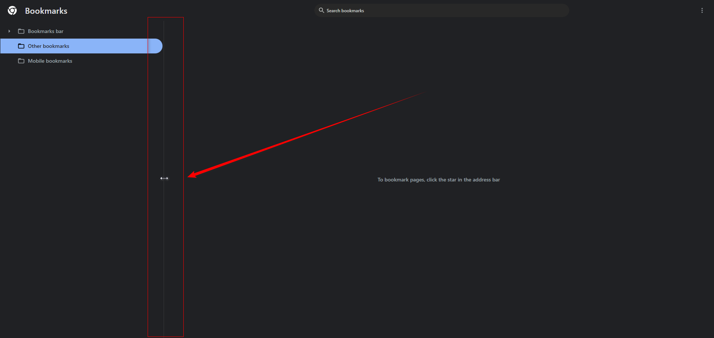
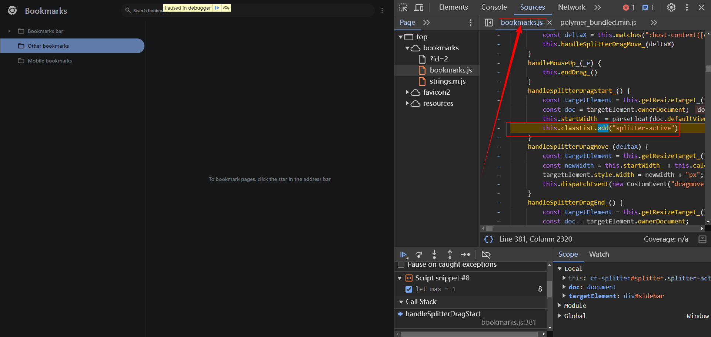

我算是 Google Chrome Bookmarks 的重度依赖用户了。 今天偶然看了下实现源码， 发现它是用原生 JS 写的， 而且采用面向对象的工程化思想写的。 想着多看看，学习学习， 那么最好的方式当然就是抄一个了。 


## 项目初始化

直接用 [omed](https://github.com/jaycethanks/omed) 来启动一个原生项目：

```bash
dm ChromeBookmarks
```

先做一个基本的布局：


```html
<div id="app">
<header class="bg-slate-500 h-12">header</header>
<main class="h-screen ">
  <aside class=" bg-slate-700">aside</aside>
  <div class="main-content bg-slate-800">content</div>
</main>
</div>
```

为了样式结构更清晰， 我们使用 sass 

```scss
$header-height: 3rem;
#app {
  header {
    height: $header-height;
  }
  main {
    height: calc(100vh - $header-height);
    display: flex;
    aside {
      min-width: 256px;
      max-width: 40%;
    }
    .main-content {
      flex: 1;
    }
  }
}

```

### 拖拽条

可以看到 Chrome Bookmarks 中的侧边栏支持拖拽



为什么不直接使用 `resize` css 属性呢？ 我们自己尝试一下：
```diff
    aside {
+    resize: horizontal; /* required */
+    overflow: auto; /* required */
      min-width: 256px;
      max-width: 40%;
+   &:hover {
+      border-right: 1px solid red;
+   }
    }
```


可以发现，只有拖拽元素的右下角的 Handler 才行， 元素的边缘部分是不行的。 

那 Chrome Bookmarks 是怎么做的呢？


可以看到， 它做了一个单独的 15 像素宽的分割条。 并且是一个自定义元素，那它是怎么做的呢？

#### 如何创建一个自定义元素？

创建一个自定义元素通过 `window.customElements.define` 方法来实现 [MDN](https://developer.mozilla.org/en-US/docs/Web/API/CustomElementRegistry/define) 。

```js
// 语法
define(name, constructor)
define(name, constructor, options)
```

> 其中 name 的命名有一定要求，简单来说就是小写字母开头，并且必须包含一个中划线 `-`, 还有一些被占用的元素不可用，详细看这里 [link](https://developer.mozilla.org/en-US/docs/Web/API/CustomElementRegistry/define#valid_custom_element_names).

下面写一个示例：


#### 拖拽条的实现

作为开头，我们直接看看 Chrome Bookmarks 是怎么做的吧，来看看怎么找到对应的源代码：

先给这个 拖拽条 打个断点：


拖动一下，就会跳转到源代码对应行：



我这里直接将对应的代码拷贝过来， 然后转写一下为 Typescript，虽然能跑，但是一片红。 

为了工程化实践，我们将它模块化：


然后在页面中引入它：


试一下：


Working Perfect !

不过不是自己写的， 接下来研究下它怎么实现的， 怎么做到的如此解耦，单一个自定义元素就搞定了。 

首先我们应该带着一点想法和问题，这样才好理解它的源代码。 

如果我们自己实现，大致应该是一个什么过程？ 好像其实挺简单

监听这个 拖拽条的 拖拽事件，然后获取拖动的 DeltaX 的值， 然后不断在拖动过程中去更新前面这个 `aside` 元素的值。 

<iframe height="500" style="width: 100%;" scrolling="no" title="DragBar_IMPL[blog]" src="https://codepen.io/Jaycethanks/embed/oNrbdKw?default-tab=js%2Cresult&editable=true" frameborder="no" loading="lazy" allowtransparency="true" allowfullscreen="true">
  See the Pen <a href="https://codepen.io/Jaycethanks/pen/oNrbdKw">
  DragBar_IMPL[blog]</a> by Jaycethanks (<a href="https://codepen.io/Jaycethanks">@Jaycethanks</a>)
  on <a href="https://codepen.io">CodePen</a>.
</iframe>

短短几行，我们其实就可以实现了， 但是 Chrome Bookmarks 的实现，该自定义元素的代码高达 130 行

可能是不想有这个默认的东西？


或者是考虑一些兼容性问题？ 性能？ 健壮性？

确实是这样的， 他的实现逻辑首先是兼容了 触屏设备的 `touch` 事件， 以及 `mouse` 事件。 然后统一派发处理逻辑。  只不过它做了更多的额外处理。 例如兼容 阿拉伯语系 RTL 排版:

```js
 // 做兼容性处理， 默认浏览器的文字排版时从左到右， 但是有一些国家，例如阿拉伯语国家， 是从右到左， 这时候的 deltaX 的计算规则不同。 
 // this指的是当前元素实例， 元素实例上的 matches 方法用于匹配css选择器。 
const deltaX = this.matches(":host-context([dir=rtl]) cr-splitter") ? this.startX_ - clientX : clientX - this.startX_;
```

 广播 `drag` 相关事件：

```js
// ......
this.dispatchEvent(new CustomEvent("dragmove"))
// ......
this.dispatchEvent(new CustomEvent("resize"))
```

其他的逻辑其实和我们上面的 demo 实现原理是一样的。

不过他的实现中，有一些设计和逻辑指的学习：

1. 首先这种自定义元素的设计有什么好处？ ——> 解构

   通过这种方式，所有和这个拖拽条相关的事件逻辑处理都在这个类中处理。如果外部需要相关事件，就通过派发自定义事件， 然后其他的需要消费的地方监听就可以了

2. 在拖拽条这个元素内部，他是怎么做到调整的 `aside` 元素的宽度的？

   他用到了一个我们平常很少用到的属性。`previousElementSibling`, 具体的它是通过 `getResizeTarget_` 这个函数拿到的。
   ```js
   getResizeTarget_() {
       const target = this.resizeNextElement ? this.nextElementSibling : this.previousElementSibling;
       return target as HTMLElement | null
   }
   ```

   > resizeNextElement 是构造器中的值， 为了获取拖拽条左边或者右边的元素，他在构造器中初始化。 这可能是一种扩展性设计， 防止未来如果布局 aside 元素移动到 拖拽条 右边的情况， 只需要改一下这个布尔值就可以了。 

   nextElementSibling 这个可能还用过，就是拿到后面的相邻元素，previousElementSibling 就是拿前面的元素。 

3. 

更新中...