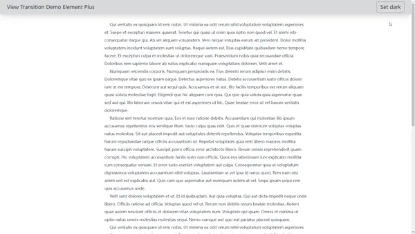
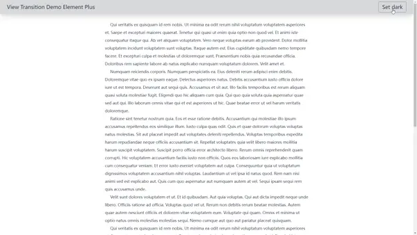

## 引入

相信作为前端的你，一定好奇过下面这种动画效果是怎么实现的：


> 小红书


> Apple App Store


>  Instagram


这些动画其实有一个专门的描述词，叫做 **共享元素转场** (Shared Element Transition)， 或者叫做 **英雄动画** (Hero Animation)


这种动画效果的主要特点是 元素看起来像是从一个页面"飞"到另一个页面，而不是突然消失再出现。给人的直观感受就是 非常的丝滑流畅， 视觉上连续性很强。 

这么做在用户体验设计上来说， 是一种非常友好的设计。 主要方面在于：

1. 空间关系：视觉的连续性可以帮助用户理解两个页面之间的空间关系。
2. 焦点引导：引导用户的注意力从一个视图到另一个视图。


接下来，我们将通过学习 View Transition API 来实现类似的过渡动画效果。


## View Transition API 的概念

我们知道， 在同一个页面上， 我们有很多的方式去实现元素的动画效果。 例如 纯CSS 动画， 或者是像一些 CSS 动画库, 如 [animate.css](https://animate.style/)； 又或者像 [Gsap](https://gsap.com/) 这种强大的 JS 动画库。 然是，通常来说，如果想要实现跨页面的动画过渡，会尤其的麻烦，需要开发者手动的维护很多的额外代码。 例如处理新旧页面的元素的位置，根据新旧页面去创建复杂动画等等工作量。 

但是现在， View Transition API 提供了一种简单的方式，让用户实现跨页面的过渡动画。 View 即视图， View transition 就是视图过渡。 视图的过渡，包括 SPA， 和 MPA 应用。  


### View Transition API 的实现原理

#### **视图过渡伪元素**

首先，重新理解一下过渡动画，什么是过渡动画呢？简单的来说， 过渡动画常规理解，就是 一次页面瞬时的变化的前后，应用动画的过程。  换句话说，过渡动画就是是从一个新的页面视图，通过某种动画过渡到一个新的页面视图。 

那么，基于此，要想处理这两个状态中间的过渡态， 我们就需要一种机制，能够同时处理这个两个新的视图状态。 换言之，至少我得能访问到新旧的页面视图，我才能进行动画过渡的处理。  这个在 SPA 应用中可能好理解，也相对容易实现。  不过 MPA 怎么办呢？ 页面直接就刷新了。 而不是 SPA 中的路由跳转模拟的局部刷新。 

为了解决这个问题，所以构建了一种新的伪元素。 用于保存新旧视图的状态。 就是 **视图过渡伪元素**。 我们通常管视图的状态叫做 **快照**。 核心的视图过渡伪元素就两个，分别是 ` ::view-transition-old(view-transition-name)` 和 ` ::view-transition-new(view-transition-name)`。

和普通的 DOM元素相比较而言，它们特殊之处在于：

1. 它们专门用于处理视图过渡动画
2. 它们仅在视图过渡期间短暂的存在，随后被立即销毁
3. 也可以通过 CSS 指定样式


> @joisun: 上面提到了 SPA 和 MPA，可不要对 SPA 有过多的猜测， View Transition API 机制的设计是框架无关的， 并且， 所谓 SPA 其实往简单了说，就是一个大一点的单个 html 文件罢了。 也就意味着，该 API 理论上同样可以实现普通的过渡动画。 只要页面视图发生了变化。 

#### **视图过渡伪元素树**

> The view transition pseudo-element tree

View Transition API 实现从当前页面到新页面的过渡机制是围绕一棵伪元素树来实现的。 这棵树的结构如下：

```bash
::view-transition # 整个过渡效果的根元素，覆盖在页面内容之上
└─ ::view-transition-group(root) # 每个过渡快照组的容器
  └─ ::view-transition-image-pair(root)
      ├─ ::view-transition-old(root) # 旧页面元素的静态快照
      └─ ::view-transition-new(root) # 新页面元素的实时快照
      
# 默认情况下，root 指的是 :root 元素, 可以通过 CSS属性 view-transition-name 更改默认的 root 元素
# 例如：
:root{
	view-transition-name: app
}
```


### View transition（视图过渡） 的工作过程

在了解了一些基本的前置概念和原理后，我们可以看看一次视图过渡过程，将会如何被 View Transition API 处理。 

1. **触发** 视图过渡：通过 `document.startViewTransition()` 方法触发； 

2. 当前（**旧**）视图捕获**快照**：API 捕获带有<u>`view-transition-name`</u> 声明的元素快照, (`::view-transition-old`)。

3. 发生 **视图变更**：响应用户操作，将<u>具体更新DOM的事件</u>交给 API， 放在 `startViewTransition()` 的回调函数中在适当时机去自动执行, 例如路由跳转。注意并不只是路由跳转，任何会引起页面更新的事件都可以。

4. **动画准备**阶段：

   - API从新视图捕获快照, 也就是记录为 `::view-transition-new`。

   - `ViewTransition.ready` 这个 Promise fulfill 表示准备就绪，**即将开始动画**。 

     > ⚠️注意：​这时， 开发者可以取消默认动画， 实现自定义动画。 

5. 过渡**动画执行** (默认动画)：
   - 旧视图快照动态淡出（opacity从1到0）,新视图快照动态淡入（opacity从0到1）。

6. 过渡**完成**：动画结束后 ([`ViewTransition.finished`](https://developer.mozilla.org/en-US/docs/Web/API/ViewTransition/finished))，可以响应完成事件 。


这个过程中有几个点值得注意：

1. 整个过程中，`ViewTransition` 对象提供了多个Promise（如`updateCallbackDone`、`ready`、`finished`），允许在过渡的不同阶段执行代码。
2. 跨文档(**MPA**)过渡， 不同于同文档(**SPA**)过渡, 视图过渡的触发是通过导航到新文档而触发的， 并且需要同源并在CSS中包含 `@view-transition`规则
3. 再就是第3步，也就是 “视图变更”， 跨文档(**MPA**)过渡, 就是在当前和目标文档间进行导航，而不是同页面元素状态的更新。 


现在，让我们看看具体的实例吧！


## View Transition API 的示例

在 MDN 的 [文档](https://developer.mozilla.org/en-US/docs/Web/API/View_Transitions_API#examples) 中 给出了两个很简单的示例，我们可以简单的看一看。 

### [Gallery 页面](https://mdn.github.io/dom-examples/view-transitions/spa/#)

该页面的[程序逻辑部分](https://mdn.github.io/dom-examples/view-transitions/spa/script.js) ， 大致是这样的：
```js
// 初始化
function init(){
	// 创建元素， 初始化页面图片，事件绑定等
}

 // 处理用户点击
function updateView(){
    const displayNewImage = ()=>{
        // 更新img 的 src 属性 +  更新 caption 描述
    }
    
    // 核心
     const transition = document.startViewTransition(() => displayNewImage());
}
```

可以看到程序部分相当简单， 就一行核心代码，就是把视图更新的具体函数，放到 `startViewTransition` 的回调中交给 API 的执行。 

再看看样式部分：
```css
/* View Transitions CSS */
::view-transition-group(root) {
  animation-duration: 0.5s;
}
figcaption {
  view-transition-name: figure-caption;
}
/* Simple final style */
::view-transition-group(figure-caption) {
  height: 100%;
}
```

可以看到，相关的样式部分也非常简单。

我其实认为这个示例并不好，徒增了新的学习者的理解成本。 让我们单独来看吧，更容易理解。 

首先：

```css
::view-transition-group(root) {
  animation-duration: 0.5s;
}
```

这里是指定 root 元素的过渡动画时长。这个 root 是什么呢？ 它其实指的是  名为 "root" 的 `view-transition-name` 的目标元素。它是整个文档根元素，也就是 document 元素(html)。 API 通过这种方式记录需要过渡的元素。 这里省略了一个默认设定：
```css
:root{
    view-transition-name: 'root'
}
```

这下一眼就能明白了吧， 上面那行代码实际上是在指定 整个 document 元素的动画时长。 

紧接着：
```css
figcaption {
  view-transition-name: figure-caption;
}
```

这里是在 通过 `view-transition-name` 给 `<figcaption>` **这个** 需要过渡动画的元素   **定义**  一个视图过渡名称。 你可以为任何选择器的元素指定一个视图动画，例如指定某个 `id` 名为 "list-item-1" 的 `<li>` 元素:
```css
li#list-item-1{
    view-transition-name: any-name-you-want;
}

/* 你还可以覆盖默认的动画名称 */
:root{
    view-transition-name: app-blog
}
```

> 值得注意的是   **定义** view-transition-name 必须是全局唯一的。 

最后的：

```css
::view-transition-group(figure-caption) {
    /* 这里指定的是figure-caption 这个视图过渡动画组的样式，会在整个过渡动画过程中生效 */ 
  height: 100%;
}
```

不过这里的  `height:100%` 并不明显， 让我们做一些修改，看看会如何表现：

```css
::view-transition-group(figure-caption) {
  /* height: 100%; */
  border: 4px solid red;
}

```


你看到了吗，我们设定的 border 样式会作用于整个过渡周期。 包括新旧 目标元素。 

你观察到了动画效果吗， 目前全部都是默认的动画效果 cross-fade 交叉淡出淡入， 不过如果你观察的更仔细一点，你可能会发现这个  figurecaption 元素的高度和宽度似乎也参与到了动画。 确实， 这是因为 `::view-transition-group` 也有 默认动画 ([#refer](https://developer.chrome.com/docs/web-platform/view-transitions/same-document#transition_multiple_elements))， 它包括了 `position`, `height`,`width`。

> 

### [MPA 页面跳转](https://mdn.github.io/dom-examples/view-transitions/mpa/index.html)

这个示例保持了最简单的情况，没有 Js 程序逻辑部分。 两个页面的 样式也是一样，让我们看一看：

```css
/* Turn cross-document view-transitions on */
/* Note that this at-rule is all that is needed to create the default cross-fade animation  */
@view-transition {
  navigation: auto;
}
/* Customize the default animation behavior */
::view-transition-group(root) {
  animation-duration: 0.5s;
}
/* Create a custom animation */
@keyframes move-out {
  from {
    transform: translateY(0%);
  }
  to {
    transform: translateY(-100%);
  }
}
@keyframes move-in {
  from {
    transform: translateY(100%);
  }
  to {
    transform: translateY(0%);
  }
}
/* Apply the custom animation to the old and new page states */
::view-transition-old(root) {
  animation: 0.4s ease-in both move-out;
}
::view-transition-new(root) {
  animation: 0.4s ease-in both move-in;
}

```

首先，在两个页面中，都需要先开启页面过渡

```css
@view-transition {
  navigation: auto;
}
```

然后定义了一套 css 动画， 动画就是新的页面从底部移入， 旧的页面从上面移出。

可以看到， MPA 的过渡动画设定非常简单，甚至都不需要用到 JS 逻辑。 

但是我们也容易发现这个动画割裂感挺重的， 原因他们的动画都是一样的， 我们可以做一些优化。 

例如 从 A -> B 页面时（A页面中），我们让即将跳转的 新的视图B 从下面移入， 然后当前页面A，也就是即将变做旧的视图从视口上面移出。 在从 B -> A 页面时（B页面中），我们让新的视图 A从上面移入，让旧的视图 B 从下面移出。 关键代码如下：

```css
/* Page A */ 

/* Turn cross-document view-transitions on */
@view-transition {
    navigation: auto;
}

/* Customize the default animation behavior */
/* ::view-transition-group(root) {
    animation-duration: 0.2s;
} */

/* Create a custom animation */
@keyframes top-move-out {
    from {
        transform: translateY(0%);
    }

    to {
        transform: translateY(-100%);
    }
}

@keyframes bottom-move-in {
    from {
        transform: translateY(100%);
    }

    to {
        transform: translateY(0%);
    }
}

/* Apply the custom animation to the old and new page states */
::view-transition-old(root) {
    animation: 0.4s ease-in top-move-out;
}

::view-transition-new(root) {
    animation: 0.4s ease-in bottom-move-in;
}


/* Page B */ 
a {
    color: rgb(124, 124, 255);
    font-size:2rem

}

/* Turn cross-document view-transitions on */
@view-transition {
    navigation: auto;
}

/* Customize the default animation behavior */
/* ::view-transition-group(root) {
    animation-duration: 0.2s;
} */

/* Create a custom animation */
@keyframes bottom-move-out {
    from {
        transform: translateY(0%);
    }

    to {
        transform: translateY(100%);
    }
}

@keyframes top-move-in {
    from {
        transform: translateY(-100%);
    }

    to {
        transform: translateY(0%);
    }
}

/* Apply the custom animation to the old and new page states */
::view-transition-old(root) {
    animation: 0.4s ease-in bottom-move-out;
}

::view-transition-new(root) {
    animation: 0.4s ease-in top-move-in;

}
```

你可以在这里看到页面效果 [link](https://joisun.github.io/demos/DemoPages/view-transition-demo-mpa/dist/), [bak](https://joisun-github-mje5o68nm-joi-sun.vercel.app/demos/DemoPages/view-transition-demo-mpa/dist/). 可以在 [这里](https://github.com/joisun/joisun.github.io/tree/main/demos/DemoPages/view-transition-demo-mpa) 看到源码.


## 在流行框架中使用 View Transition API

大多框架中的路由导航是异步执行的：
```ts
document.startViewTransition(() => {
	router.jump('xxxx');// 这里通产是异步的
});
```

然而 `document.startViewTransition` 期望在其回调函数中立即发生 DOM 变化。

下面我们来尝试看看分别在 React 和 Vue 中去尝试实现。 

### 项目初始化

分别初始化两个最基本的项目，React 因为之前  [omed](https://www.npmjs.com/package/@sunzhongyi/omed)  配置过一个router+tailwind 的最简模板，我们就使用它来创建。 Vue 就直接 `pnpm create vite@latest` 。

```bash
# react
dm view-transition-demo-react
# vue
pnpm create vite@latest view-transition-demo-vue
```

简单的初始化项目，这个项目有两个路由页面，分别是首页和详情页，点击首页中的列表项， 就会跳转到详情页面：


接下来的探究中，我们只关心最核心的部分逻辑就好：

### React

#### 快速尝试

给首页的 `` 元素注册了点击事件， 
```ts
const handleClick = (i: number, e: React.MouseEvent<HTMLImageElement>) => {
    document.startViewTransition(() => {
        navigate(`/detail/${i}`)
    })
}
```

给详情页的返回按钮注册返回事件
```ts
const handleBack = ()=>{
    document.startViewTransition(() => {
        navigate(-1)
    })
}
```

来试试看，会发生什么：


没错 默认的 root view transition 动画(cross-fade) 被触发了

#### 给img加上单独的动画

现在我们尝试给 img 元素添加单独的动画效果。首先，在全局的样式表中，定义一个 `view-transition-name`,

```css
/* global.css */
.dog-card{
    view-transition-name: dog-card;
}
```

注意， 这里 `.dog-card` class 选择器匹配的是详情页中的那个 img 元素：
```html
 (
        <div className="item " v-for="(image, index) in 16" key={index} >
            
```

所以我们不能直接给所有 img 元素加上 `view-transition-name: dog-card` 这个css 属性。 我们可以动态的添加，

在首页点击 img 元素的事件handler中：

```ts
const handleClick = (i: number, e: React.MouseEvent<HTMLImageElement>) => {
    const target = e.target as HTMLImageElement
    (target.style as any).viewTransitionName = 'dog-card'
    document.startViewTransition(() => {
        navigate(`/detail/${i + 1}`)
    })
}
```

现在， 来看看效果如何：


为什么没有生效呢？

原因是现代框架中，对页面渲染，各框架通常都做了不同的优化。 在 React 中，React 的状态更新和渲染是使用 虚拟DOM 和 批量更新机制来优化性能。 当我们这里调用  `navigate` 的时候， React 并不会立即更新 DOM， 而是将更新放入队列中， 等待下一个渲染周期。 

而 View Transition API 的工作方式是它期望在其回调函数中立即发生 DOM 变化。 因此，在 React 完成页面更新的时候可能都已经结束了。 自然就不生效了。

那么同理的， 在 Vue 中也是会遇到这种情况。 

不过在 React-Router中，很早就有人提到过这个问题 [issue#10276](https://github.com/remix-run/react-router/discussions/10276), 官方页给出了两种解决方案。

1. 使用 `flushSync` 包裹 `navigate` 让其强制同步更新
2. 给 `navigate` 传入一个 `unstable_viewTransition` option， 让React-Router 内部去黑盒操作。 

我们来试一试：

```diff
// 首页
 const handleClick = (i: number, e: React.MouseEvent<HTMLImageElement>) => {
     const target = e.target as HTMLImageElement
     (target.style as any).viewTransitionName = 'dog-card'
     document.startViewTransition(() => {
-       navigate(`/detail/${i}`)
+       navigate(`/detail/${i}`, { unstable_viewTransition: true })

+ //    或者也可以像下面这样写
+ //    flushSync(
+ //        ()=>navigate(`/detail/${i}`)
+ //    )
     })
 }
```


生效了，且由于默认的 `::view-transition-group(dog-card)` 动画，让图片元素的位置和大小自动的过渡了。 

不过不难发现，返回的时候，动画好像还是默认的 cross-fade 动画， 这是为什么呢？

其实很好理解， 详情页中，`.dog-card` 匹配的元素是固定的，但是首页中，为了避免 `view-transition-name` 重复， 所以我们是在点击的时候动态添加的
```ts
 (target.style as any).viewTransitionName = 'dog-card'
```

因此，从首页过渡到详情页的时候，新旧元素的快照都能够顺利找到，自然可以开启过渡动画了。 但是，从详情页返回到首页的时候，之前标记 ` 'dog-card'` view-transition-name 的元素由于更新，是消失了的。 

所以要解决这个问题，我们就需要记住当前点击的这个卡片是哪一个，然后在返回的时候，先给这个卡片再次设定一下 view-transition-name， 那么该怎么做呢？

其实很简单，把这个状态存下来， 不管用什么方式，我们这里图方便，就直接放 sessionStorage 好了，我们更新一下 handleClick

```ts
const getCache = ()=>{
    return +(sessionStorage.getItem('cache-dog-card-index')||0)}
console.log('getCache',getCache())

const handleClick = (i: number, e: React.MouseEvent<HTMLImageElement>) => {
    // 将当前点击图片的索引存储在 sessionStorage 中
    // 这使我们能在从详情页返回时恢复 view-transition-name，确保平滑的过渡动画
    sessionStorage.setItem('cache-dog-card-index', i + '')

    // 清除所有图片现有的 view-transition-name
    // 这么做是因为：
    // 1. view-transition-name 必须在全局范围内唯一
    // 2. 我们需要为新点击的图片设置新的 view-transition-name
    // 3. 这可以防止在为新目标设置 viewTransitionName 时出错
    for (let img of document.querySelectorAll('img')){
        (img.style as any).viewTransitionName = 'unset'
    }

    // 为被点击的图片设置 view-transition-name
    const target = e.target as HTMLImageElement
    (target.style as any).viewTransitionName = 'dog-card'
    document.startViewTransition(() => {
        navigate(`/detail/${i}`, { unstable_viewTransition: true })
    })
}
```

> 注意：viewTransitionName 尚未标准化，ts还不认识， 所以我们使用 'any' 类型断言

然后在 Dom 上：

```jsx
// ......
                {
                    Array.from({ length: 16 }).map((_, index) => (
                        <div className="item " v-for="(image, index) in 16" key={index} >
                             不必担心 viewTransitionName 不唯一，你还记得吗，刚才，我们在 handleClick 中已经清除了所有的 img 元素的 viewTransitionName, 这样就能够保证页面在从详情页返回的时候，View Transition API 能够顺利找到 `::view-transition-new(dog-card)` 伪元素了， 从而让过渡动画顺利执行。 

现在我们再来看看效果吧。 


完美！！！ [demo](https://joisun.github.io/demos/DemoPages/view-transition-demo-react/dist/),  [完整代码](https://github.com/joisun/joisun.github.io/tree/main/demos/DemoPages/view-transition-demo-react)。

当然，由于 View Transition API 动画是CSS 实现的， 所以你还可以根据 css 动画库，比如 animate.css 来实现一些奇奇怪怪的效果：
```css


.dog-card {
    view-transition-name: dog-card;
}

::view-transition-group(dog-card) {
    animation-duration: .3s;// 整体动画时长，会被具体的 new/old 设定覆盖
}

::view-transition-old(dog-card),
::view-transition-new(dog-card) {
    animation: .3s scale both;
    -webkit-animation-duration: 1.3s;
    animation-duration: 1.3s;
    -webkit-animation-duration: 1.3s;
    animation-duration: 1300ms;
    -webkit-animation-name: heartBeat;
    animation-name: heartBeat;
    -webkit-animation-timing-function: ease-in-out;
    animation-timing-function: ease-in-out
}

@keyframes heartBeat {
    0% {
        -webkit-transform: scale(1);
        transform: scale(1)
    }

    14% {
        -webkit-transform: scale(1.3);
        transform: scale(1.3)
    }

    28% {
        -webkit-transform: scale(1);
        transform: scale(1)
    }

    42% {
        -webkit-transform: scale(1.3);
        transform: scale(1.3)
    }

    70% {
        -webkit-transform: scale(1);
        transform: scale(1)
    }
}
```


### Vue

> Vue 有点问题，Vue-router 好像只能异步执行，官方似乎没有支持。 提了个 [Discussion](https://github.com/vuejs/router/discussions/2316), 等我发现了解决方案再来更新这部分内容。 另外 View Transition API 还不是标准阶段，一些浏览器还没有兼容， 这个特性目前并不适合生产使用。 如果你生产项目中有需要可以看看这个 [antfu/vue-starport](https://github.com/antfu/vue-starport)。

#### 快速尝试

```diff
 const handleClick = (i: number) => {
+    document.startViewTransition(() => {
         router.push(`/detail/${i}`)
+    })
 }
```

先不管这个 API 什么意思， 我们看看现在的页面有什么效果变化吗

![[video-to-gif output image]](./assets/ezgif-3-32301217a2.gif)

可以看到会有一个简单的过渡效果， 看上去是透明度 + 叠加的变化效果。 这是 View Transition API 的默认过渡效果。 显然这并不能达到我们期望的效果。 所以接下来，让我们详细认识一下这个 API， 以及如何实现我们需要的效果。 

> 待更新内容......


## 不止路由过渡动画——实现 和 Element Plus 一样的主题切换动画效果

不知道你是否有留意过 [element plus](https://element-plus.org/en-US/) 官方文档的主题切换效果？


其实它就是借助于 View Transition API 来实现的， 让我们也来试试吧。 

先用 omed 起一个 vanilla 项目：

```bash
dm view-transition-demo-elementplus
```

然后实现一个最基本的主题切换效果：



主题切换按钮的 Handler很简单：
```ts
function handleThemeSwitch() {
    isDark = document.documentElement.classList.toggle('dark')
}
// switch button click handler
function handleClick(e: MouseEvent) {
    handleThemeSwitch()
}
```

然后利用 `transition.ready` 这个 API 结合 `animate`  去创建我们自定义的动画。
```js
function handleClick(e: MouseEvent) {
    // 兼容性处理
    if (!(document as any).startViewTransition) {
        handleThemeSwitch()
        return;
    }

    // 获取点击事件位置
    const x = e?.clientX ?? innerWidth / 2;
    const y = e?.clientY ?? innerHeight / 2;
    // 计算最大半径
    const endRadius = Math.hypot(
        Math.max(x, innerWidth - x),
        Math.max(y, innerHeight - y),
    );

    // 创建过渡
    const transition = (document as any).startViewTransition(() => {
        console.log("trigger")
        handleThemeSwitch()
    });

    // 等待伪元素创建
    transition.ready.then(() => {
        // 自定义动画执行
        document.documentElement.animate(
            {
                clipPath: [
                    `circle(0 at ${x}px ${y}px)`,
                    `circle(${endRadius}px at ${x}px ${y}px)`,
                ],
            },
            {
                duration: 400,
                direction: isDark ? 'reverse' : 'normal',
                easing: "ease-in",
                // 指定目标动画伪元素
                pseudoElement: "::view-transition-new(root)",
            },
        );
    });
}
```



不过现在看起来有些奇怪， 切换的时候被遮住了， 加点盐：

```css
  ::view-transition-old(root),
  ::view-transition-new(root) {
    /* 这行代码禁用了默认的过渡动画 */
    animation: none;
    /* 设置了元素的混合模式为"正常" */
    mix-blend-mode: normal;
  }
```


Done！本示例 [演示](https://joisun.github.io/demos/DemoPages/view-transition-demo-elementplus/dist/), [源码](https://github.com/joisun/joisun.github.io/tree/main/demos/DemoPages/view-transition-demo-elementplus) 。


参考：

1. https://developer.chrome.com/docs/web-platform/view-transitions
2. https://developer.mozilla.org/en-US/docs/Web/API/View_Transitions_API
3. https://developer.mozilla.org/en-US/docs/Web/API/View_Transitions_API/Using
4. https://developer.chrome.com/docs/web-platform/view-transitions/#example


