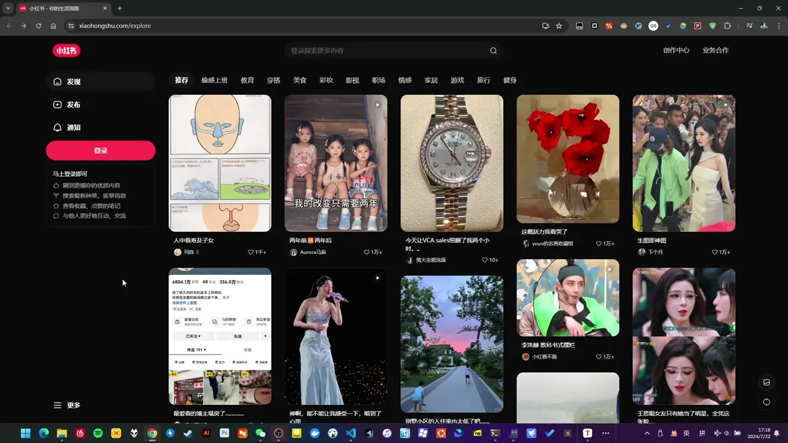
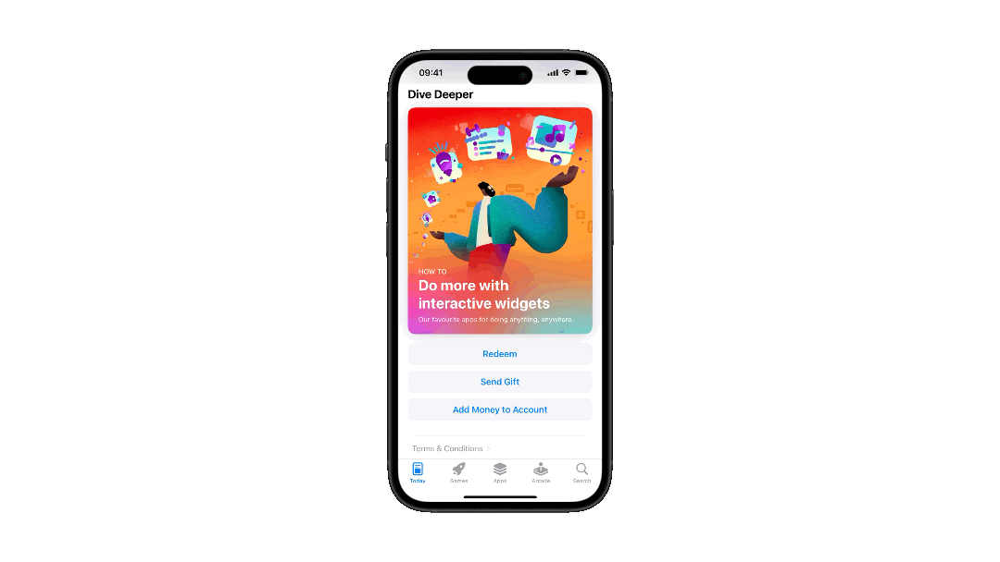
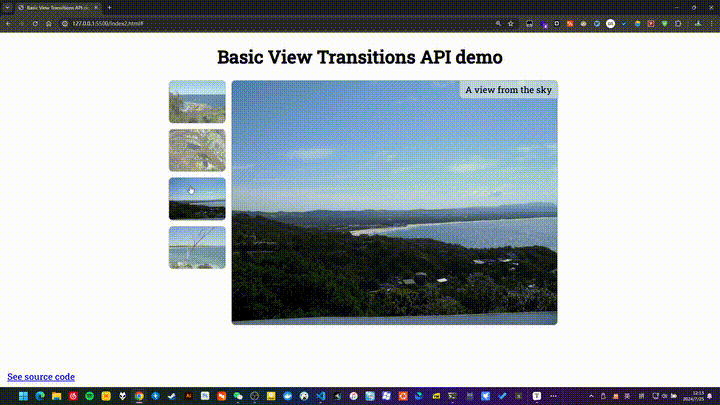
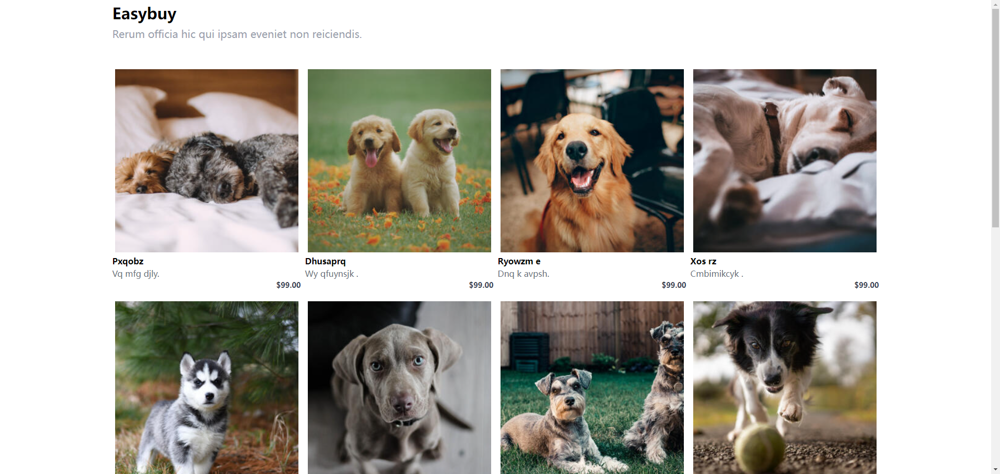

## 引入

相信作为前端的你，一定好奇过下面这种动画效果是怎么实现的：




> 小红书




> Apple App Store


>  Instagram


这些动画其实有一个专门的描述词，叫做 **共享元素转场** (Shared Element Transition)， 或者叫做 **英雄动画** (Hero Animation)


这种动画效果的主要特点是 元素看起来像是从一个页面"飞"到另一个页面，而不是突然消失再出现。给人的直观感受就是 非常的丝滑流畅， 视觉上连续性很强。 

这么做在用户体验设计上来说， 是一种非常友好的设计。 主要方面在于：

1. 空间关系：视觉的连续性可以帮助用户理解两个页面之间的空间关系。
2. 焦点引导：引导用户的注意力从一个视图到另一个视图。


接下来，我们将通过学习 View Transition API 来实现类似的过渡动画效果。


## View Transition API 的概念

我们知道， 在同一个页面上， 我们有很多的方式去实现元素的动画效果。 例如 纯CSS 动画， 或者是像一些 CSS 动画库, 如 [animate.css](https://animate.style/)； 又或者像 [Gsap](https://gsap.com/) 这种强大的 JS 动画库。 然是，通常来说，如果想要实现跨页面的动画过渡，会尤其的麻烦，需要开发者手动的维护很多的额外代码。 例如处理新旧页面的元素的位置，根据新旧页面去创建复杂动画等等工作量。 

但是现在， View Transition API 提供了一种简单的方式，让用户实现跨页面的过渡动画。 View 即视图， View transition 就是视图过渡。 视图的过渡，包括 SPA， 和 MPA 应用。  


### View Transition API 的实现原理

#### **视图过渡伪元素**

首先，重新理解一下过渡动画，什么是过渡动画呢？简单的来说， 过渡动画常规理解，就是 一次页面瞬时的变化的前后，应用动画的过程。  换句话说，过渡动画就是是从一个新的页面视图，通过某种动画过渡到一个新的页面视图。 

那么，基于此，要想处理这两个状态中间的过渡态， 我们就需要一种机制，能够同时处理这个两个新的视图状态。 换言之，至少我得能访问到新旧的页面视图，我才能进行动画过渡的处理。  这个在 SPA 应用中可能好理解，也相对容易实现。  不过 MPA 怎么办呢？ 页面直接就刷新了。 而不是 SPA 中的路由跳转模拟的局部刷新。 

为了解决这个问题，所以构建了一种新的伪元素。 用于保存新旧视图的状态。 就是 **视图过渡伪元素**。 我们通常管视图的状态叫做 **快照**。 核心的视图过渡伪元素就两个，分别是 ` ::view-transition-old(view-transition-name)` 和 ` ::view-transition-new(view-transition-name)`。

和普通的 DOM元素相比较而言，它们特殊之处在于：

1. 它们专门用于处理视图过渡动画
2. 它们仅在视图过渡期间短暂的存在，随后被立即销毁
3. 也可以通过 CSS 指定样式


> @joisun: 上面提到了 SPA 和 MPA，可不要对 SPA 有过多的猜测， View Transition API 机制的设计是框架无关的， 并且， 所谓 SPA 其实往简单了说，就是一个大一点的单个 html 文件罢了。 也就意味着，该 API 理论上同样可以实现普通的过渡动画。 只要页面视图发生了变化。 

#### **视图过渡伪元素树**

> The view transition pseudo-element tree

View Transition API 实现从当前页面到新页面的过渡机制是围绕一棵伪元素树来实现的。 这棵树的结构如下：

```bash
::view-transition # 整个过渡效果的根元素，覆盖在页面内容之上
└─ ::view-transition-group(root) # 每个过渡快照组的容器
  └─ ::view-transition-image-pair(root)
      ├─ ::view-transition-old(root) # 旧页面元素的静态快照
      └─ ::view-transition-new(root) # 新页面元素的实时快照
      
# 默认情况下，root 指的是 :root 元素, 可以通过 CSS属性 view-transition-name 更改默认的 root 元素
```


### View transition（视图过渡） 的工作过程

在了解了一些基本的前置概念和原理后，我们可以看看一次视图过渡过程，将会如何被 View Transition API 处理。 

1. **触发** 视图过渡：通过 `document.startViewTransition()` 方法触发； 

2. 当前（**旧**）视图捕获**快照**：API 捕获带有<u>`view-transition-name`</u> 声明的元素快照, (`::view-transition-old`)。

3. 发生 **视图变更**：响应用户操作，将具体更新DOM的事件交给 API， 放在 `startViewTransition()` 的回调函数中在适当时机去自动执行。

4. **动画准备**阶段：

   - API从新视图捕获快照, 也就是记录为 `::view-transition-new`。

   - `ViewTransition.ready` 这个 Promise fulfill 表示准备就绪，**即将开始动画**。 

     > ⚠️注意：​这时， 开发者可以取消默认动画， 实现自定义动画。 

5. 过渡**动画执行** (默认动画)：
   - 旧视图快照动态淡出（opacity从1到0）,新视图快照动态淡入（opacity从0到1）。

6. 过渡**完成**：动画结束后 ([`ViewTransition.finished`](https://developer.mozilla.org/en-US/docs/Web/API/ViewTransition/finished))，可以响应完成事件 。


这个过程中有几个点值得注意：

1. 整个过程中，`ViewTransition`对象提供了多个Promise（如`updateCallbackDone`、`ready`、`finished`），允许在过渡的不同阶段执行代码。
2. 跨文档(**MPA**)过渡， 不同于同文档(**SPA**)过渡, 视图过渡的触发是通过导航到新文档而触发的， 并且需要同源并在CSS中包含 `@view-transition`规则
3. 再就是第3步，也就是 “视图变更”， 跨文档(**MPA**)过渡, 就是在当前和目标文档间进行导航，而不是同页面元素状态的更新。 


现在，让我们看看具体的实例吧！


## View Transition API 的示例

在 MDN 的 [文档](https://developer.mozilla.org/en-US/docs/Web/API/View_Transitions_API#examples) 中 给出了两个很简单的示例，我们可以简单的看一看。 

### [Gallery 页面](https://mdn.github.io/dom-examples/view-transitions/spa/#)

该页面的[程序逻辑部分](https://mdn.github.io/dom-examples/view-transitions/spa/script.js) ， 大致是这样的：
```js
// 初始化
function init(){
	// 创建元素， 初始化页面图片，事件绑定等
}

 // 处理用户点击
function updateView(){
    const displayNewImage = ()=>{
        // 更新img 的 src 属性 +  更新 caption 描述
    }
    
    // 核心
     const transition = document.startViewTransition(() => displayNewImage());
}
```

可以看到程序部分相当简单， 就一行核心代码，就是把视图更新的具体函数，放到 `startViewTransition` 的回调中交给 API 的执行。 

再看看样式部分：
```css

/* View Transitions CSS */

::view-transition-group(root) {
  animation-duration: 0.5s;
}

figcaption {
  view-transition-name: figure-caption;
}

/* Simple final style */

::view-transition-group(figure-caption) {
  height: 100%;
}

/* Alternative custom animation style */

/* @keyframes grow-x {
  from { transform: scaleX(0); }
  to { transform: scaleX(1); }
}

@keyframes shrink-x {
  from { transform: scaleX(1); }
  to { transform: scaleX(0); }
}

::view-transition-group(figure-caption) {
  height: auto;
  right: 0;
  left: auto;
  transform-origin: right center;
}

::view-transition-old(figure-caption) {
  animation: 0.25s linear both shrink-x;
}

::view-transition-new(figure-caption) {
  animation: 0.25s 0.25s linear both grow-x;
} */
```

可以看到，除去注释掉的代码块。 相关的样式部分也非常简单。

我其实认为这个示例并不好，徒增了新的学习者的理解成本。 让我们单独来看吧，更容易理解。 

首先：

```css
::view-transition-group(root) {
  animation-duration: 0.5s;
}
```

这里是指定 root 元素的过渡动画时长。这个 root 是什么呢？ 它其实指的是  名为 "root" 的 `view-transition-name` 的目标元素。 API 通过这种方式记录需要过渡的元素。 这里省略了一个默认设定：
```css
:root{
    view-transition-name: 'root'
}
```

这下一眼就能明白了吧， 上面那行代码实际上是在指定 整个 document 元素的动画时长。 


紧接着：
```css
figcaption {
  view-transition-name: figure-caption;
}
```

这里是在 **定义** 一个需要过渡动画的元素， 它类似为某个/类元素定义别名。 你可以为任何选择器的元素指定一个视图动画，例如指定某个类名为 "list-item" 的 `<li>` 元素:
```css
li.list-item{
    view-transition-name: any-name-you-want;
}

/* 你还可以覆盖默认的动画名称 */
:root{
    view-transition-name: app-blog
}
```

最后的：
```css
::view-transition-group(figure-caption) {
    /* 这里指定的是figure-caption 这个视图过渡动画组的样式，会在整个过渡动画过程中生效 */ 
  height: 100%;
}
```

不过这里的  `height:100%` 并不明显， 让我们做一些修改，看看会如何表现：

```css
::view-transition-group(figure-caption) {
  /* height: 100%; */
  border: 4px solid red;
}

```



### [MPA 页面跳转]()


## 在 Vue 中使用 View Transition API

### 项目初始化

使用 Vite+vue 简单的初始化项目，这个项目有两个页面，分别是首页和详情页，点击首页中的列表项， 就会跳转到详情页面：




项目核心的目录解构为：

```bash
├── src
│   ├── App.vue
│   ├── assets
│   │   └── main.css
│   ├── main.ts
│   ├── router
│   │   └── index.ts
│   └── views
│       ├── DetailtView.vue
│       └── HomeView.vue
```

### 快速尝试 View Transition API

```diff
 const handleClick = (i: number) => {
+    document.startViewTransition(() => {
         router.push(`/detail/${i + 1}`)
+    })
 }
```

先不管这个 API 什么意思， 我们看看现在的页面有什么效果变化吗

![[video-to-gif output image]](./assets/ezgif-3-32301217a2.gif)

可以看到会有一个简单的过渡效果， 看上去是透明度 + 叠加的变化效果。 这是 View Transition API 的默认过渡效果。 显然这并不能达到我们期望的效果。 所以接下来，让我们详细认识一下这个 API， 以及如何实现我们需要的效果。 


## 实现 和 Element Plus 一样的主题切换动画效果


参考：

1. https://developer.mozilla.org/en-US/docs/Web/API/View_Transitions_API
2. https://developer.chrome.com/docs/web-platform/view-transitions
