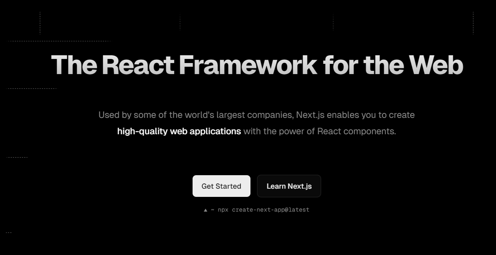
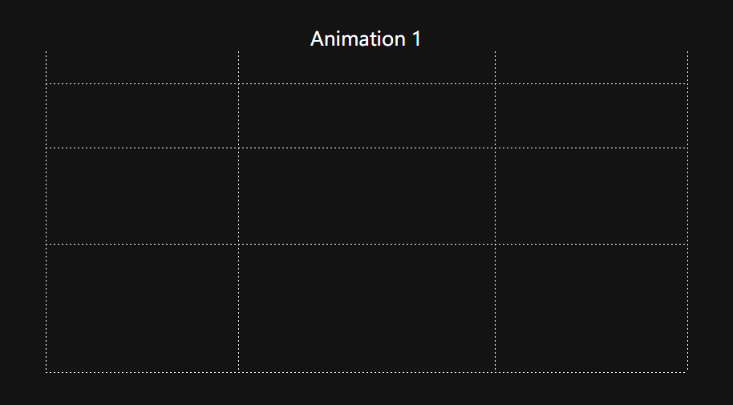
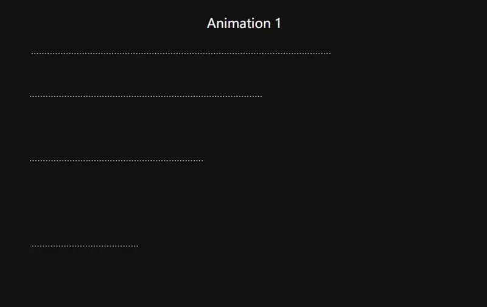
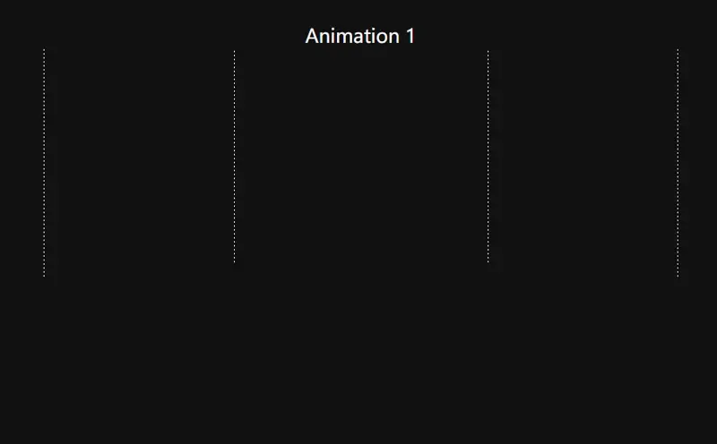
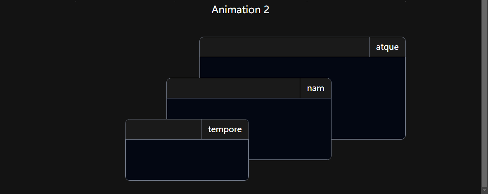
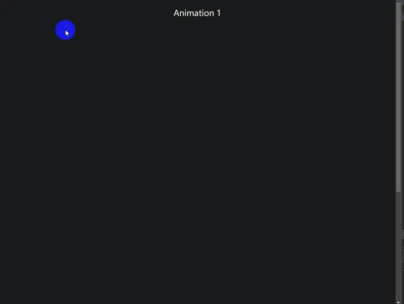
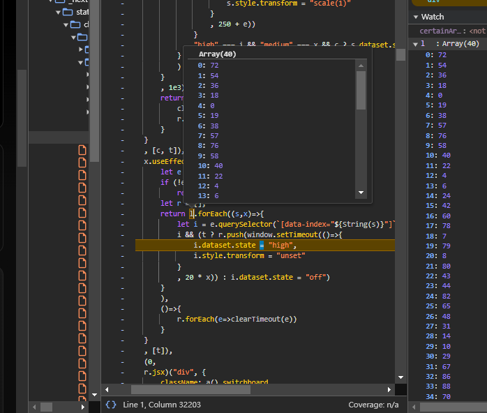
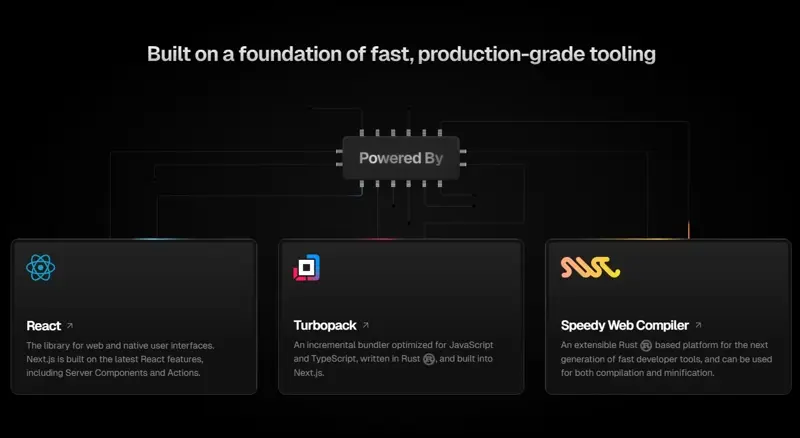
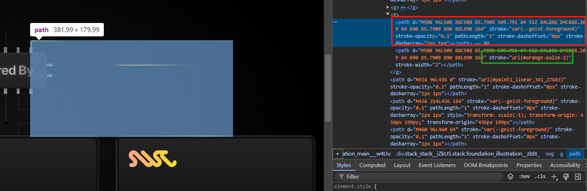
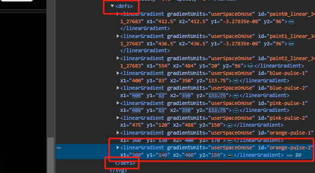

## 引言

距离上一次打开 Next 官网已经快一年了，最近听说有了很多特性更新，想着重新看一看，玩一玩，发现官方多了一些有意思的小动画，今天来研究一下。

### 动画一


#### 动画分析：

起始动画帧：




该动画有 4 x 2 一共8条线，的运动构成， 有偏移动画，和透明度变化。 

仔细观察， x 轴方向的动画似乎有一个阶梯的延迟， 如果对比 开始和结束动画帧， 可以发现，y 轴方向的 中间两条线运动比两侧的运动速度要快。


#### 动画的实现：

用 [omed](https://www.npmjs.com/package/@sunzhongyi/omed) 初始化一个 vinilla 项目：
```bash
dm nextjs-official-ani
```

构建一个基本UI（tailwind + css）：

```html
<section class="ani-1 relative h-[400px] w-[800px] overflow-hidden">
  <!-- x -->
  <div class="x-line top-[10%]"></div>
  <div class="x-line top-[30%]"></div>
  <div class="x-line top-[60%]"></div>
    <!-- 减去line-width是因为 overflow-hidden 会遮住100%偏移的元素 -->
  <div class="x-line top-[calc(100%-var(--line-width))]"></div>

  <!-- y -->
  <div class="y-line  left-0"></div>
  <div class="y-line  left-[30%]"></div>
  <div class="y-line  left-[70%]"></div>
  <div class="y-line  left-[calc(100%-var(--line-width))]"></div>
</section>
```

```css

:root {
  --line-width: 1px;
  --line-gap: 5px;
  --line-color: white;
}

section.ani-1 {
  .x-line {
    position: absolute;
    background: linear-gradient(
      to right,
      var(--line-color),
      var(--line-color) 50%,
      transparent 0,
      transparent
    );
    background-size: var(--line-gap) var(--line-width);
    width: 100%;
    height: var(--line-width);
  }

  .y-line {
    position: absolute;
    background: linear-gradient(
      180deg,
      var(--line-color),
      var(--line-color) 50%,
      transparent 0,
      transparent
    );
    background-size: var(--line-width) var(--line-gap);
    width: var(--line-width);
    height: 100%;
  }
}
```

基本效果如下：



先让 x 轴方向的线动起来：

```diff

:root {
    --line-width: 1px;
    --line-gap: 5px;
    --line-color: white;
+    /* 定义延迟变量 */
+    --delay: 0.1s;
+    /* 定义动画时长 */
+    --duration: 0.3s;
  }
  
  section.ani-1 {
    .x-line {
      position: absolute;
      background: linear-gradient(
        to right,
        var(--line-color),
        var(--line-color) 50%,
        transparent 0,
        transparent
      );
      background-size: var(--line-gap) var(--line-width);
      width: 100%;
      height: var(--line-width);
+      animation: var(--duration) offset-x infinite;
+      /* 设定初始位置 */
+      left: -100%;
+    }
+    /* 从第二个元素开始累加延时 */
+    .x-line:nth-child(2) {
+      animation-delay: calc(var(--delay) + 0.2s);
+    }
+    .x-line:nth-child(3) {
+      animation-delay: calc(var(--delay) + 0.4s);
+    }
+    .x-line:nth-child(4) {
+      animation-delay: calc(var(--delay) + 0.6s);
+    }
+  @keyframes offset-x {
+    from {
+      left: -100%;
+    }
+    to {
+      left: 0;
+    }
+  }
```



让y 轴方向的线动起来：

```diff
  .y-line {
    position: absolute;
    background: linear-gradient(
      180deg,
      var(--line-color),
      var(--line-color) 50%,
      transparent 0,
      transparent
    );
    background-size: var(--line-width) var(--line-gap);
    width: var(--line-width);
    height: 100%;
+    animation: var(--duration) offset-y infinite;
+    /* 设定初始位置 */
+    top: -100%;
+  }
+
+  /* 从第y向中间两条线运动更快，但是有延迟 */
+  .y-line:nth-child(6) {
+    animation-delay: calc(var(--delay) + 0.2s);
+    animation-duration: calc(var(--duration) - 0.5s);
+  }
+  .y-line:nth-child(7) {
+    animation-delay: calc(var(--delay) + 0.2s);
+    animation-duration: calc(var(--duration) - 0.5s);
+  }


+ @keyframes offset-y {
+     from {
+       top: -100%;
+     }
+     to {
+       top: 0;
+     }
+   }
+   
```



同时开启， 添加透明度过渡动画，动画模式修改为 forwards：

```diff
.x-line {
-  animation: var(--duration) offset-x infinite;
+  animation: var(--duration) offset-x forwards;
}
.y-line{
-   animation: var(--duration) offset-y infinite;
+   animation: var(--duration) offset-y forwards;
}

@keyframes offset-x {
  from {
    left: -100%;
+    opacity: 1;
  }
  to {
    left: 0;
+    opacity: 0.2;
  }
}

@keyframes offset-y {
  from {
    top: -100%;
+    opacity: 1;
  }
  to {
    top: 0;
+    opacity: 0.2;
  }
}
```


### 动画二


#### 动画分析：

页面在滚动到视图区域后，动画执行一次，而后再次进入视图不再触发，除非页面刷新。

具体的动画， 动画本身比较简单， 三个卡片延迟斜向动画。

**如何实现页面到视口区域后仅触发一次动画？**

可以借助 Intersection Observer API  + animationPlayState 来实现。

#### 动画的实现：

先实现一下基本 UI 布局：



```html
<h2 class="text-white text-2xl">Animation 2</h2>
<section  class="ani2 relative h-[400px] w-[800px] overflow-hidden text-white">
  <div class="card1 absolute rounded-xl border border-gray-500 w-[500px] h-[250px] overflow-hidden">
    <div class="header bg-[#1a1a1a]  flex h-12">
      <div class="flex-1"></div>
      <div class="border-l border-gray-500 flex justify-center items-center text-xl px-4">atque</div>
    </div>
    <div class="main border border-t  border-gray-500 bg-gray-950  h-[calc(100%-3rem)]"></div>
  </div>
  <div class="card2 absolute rounded-xl border border-gray-500 w-[400px] h-[200px] overflow-hidden">
    <div class="header bg-[#1a1a1a]  flex h-12">
      <div class="flex-1"></div>
      <div class="border-l border-gray-500 flex justify-center items-center text-xl px-4">nam</div>
    </div>
    <div class="main border border-t  border-gray-500 bg-gray-950  h-[calc(100%-3rem)]"></div>
  </div>
  <div class="card3 absolute rounded-xl border border-gray-500 w-[300px] h-[150px] overflow-hidden">
    <div class="header bg-[#1a1a1a]  flex h-12">
      <div class="flex-1"></div>
      <div class="border-l border-gray-500 flex justify-center items-center text-xl px-4">tempore</div>
    </div>
    <div class="main border border-t  border-gray-500 bg-gray-950  h-[calc(100%-3rem)]"></div>
  </div>
</section>
```

开启动画：

```css
section.ani2 {
  --duration: 2s;
  --delay: 0.1s;
  .card1,
  .card2,
  .card3 {
    animation: var(--duration) move-tr infinite;
    opacity: 0;
  }
  .card1 {
    left: 300px;
    bottom: 100px;
    z-index: 1;
  }
  .card2 {
    left: 220px;
    bottom: 50px;
    z-index: 2;
    animation-delay: calc(var(--delay) + 0.5s);
  }
  .card3 {
    left: 120px;
    bottom: 0px;
    z-index: 3;
    animation-delay: calc(var(--delay) + 1s);
  }
}

@keyframes move-tr {
  from {
    transform: translateX(-100px) translateY(100px);
    opacity: 0;
  }
  to {
    transform: translateX(0px) translateY(0px);
    opacity: 1;
  }
}

```


实现元素与视口交叉后开启动画：

首先给动画加一个控制开关, 通过css 变量控制动画启停

```diff
section.ani2 {
  --duration: 2s;
  --delay: 0.1s;
  .card1,
  .card2,
  .card3 {
-    animation: var(--duration) move-tr infinite;
+    animation: var(--duration) move-tr forwards;
+    animation-play-state: var(--play-state);
    opacity: 0;
  }
```

给 html 中加一个默认的 css 变量：

```diff
- <  class="ani2 relative h-[400px] w-[800px] overflow-hidden text-white">
+ <section style="--play-state:paused" class="ani2 relative h-[400px] w-[800px] overflow-hidden text-white">
```

通过 Intersection Observer API 检测元素与视口交叉，开启动画：

```ts
// ani2
const options = {
    threshold: 0.2// 元素交叉20%时触发

}
const target = document.querySelector(".ani2") as HTMLDivElement
const callback: IntersectionObserverCallback = function (entries) {
    // 元素交叉时，开启动画
    if (entries[0].isIntersecting) {
        target && (target.style.setProperty('--play-state', 'running'))
    }
}
const observer = new IntersectionObserver(callback, options)
target && observer.observe(target)
```




### 动画三


#### 动画分析：

看起来像是一个随机点亮的星光闪烁效果， 当点亮时，有一个微亮到闪耀的动画。

鼠标hover 之后，可以看到时点亮了一个 NEXT 文字路径， 所以其实并不是在所有点位随机点亮， 而是只是路径上的点会亮。


观察dom， 发现

1. 这些点位有三个状态 "off" | "medium" | "high"
2. 闪烁效果通过伪元素实现的。 
3. 一共有90个点位，并通过自定义属性 data-index 记录
4. 固定路径点位上会亮的是固定的部分点位
5. 并不是每次点亮的时候一定会 闪烁(通过 scale 实现)

#### 动画的实现：

首先单独尝试实现单独的三个状态：

```html
<section class="ani-3 relative h-[400px] w-[800px] overflow-hidden">
  <div data-light data-state="off" class="spark"></div>
  <div data-light data-state="medium" class="spark"></div>
  <div data-light data-state="high" class="spark"></div>
</section>
```

```css
section.ani-3 {
  .spark[data-light] {
    /* 三种状态的样式颜色 */
    --light: #3291ff;
    --lighter: #d3e5ff;
    --default: #fff;
    width: 1px;
    height: 1px;
    background-color: var(--default);
    margin: 10px;
    position: relative;
    border-radius: 9999px;
  }
  /* 设置伪元素 */
  .spark[data-light]:before,
  .spark[data-light]:after {
    content: "";
    position: absolute;
    inset: 0;
    opacity: 0;
    width: inherit;
    height: inherit;
    border-radius: inherit;
    transition: opacity 0.5s ease;
  }

  /* 伪元素样式 */
  .spark[data-light]:after {
    background: var(--default);
    box-shadow: 0 0 1px 1px rgba(50, 145, 255, 0.8),
      0 0 2px 1px rgba(50, 145, 255, 0.25);
  }

  .spark[data-light]:before {
    background: var(--light);
    box-shadow: 0 0 2px 1px rgba(50, 145, 255, 0.25);
  }

  /* medium | high 的样式 */
  .spark[data-state="medium"]:before,
  .spark[data-state="high"]:after {
    opacity: 1;
  }
  .spark[data-state="off"] {
    background-color: var(--default);
  }
}
```


接下来， 我们需要做到的是，先随机点亮路径上的点，然后随机让它闪烁，值得注意的是，从观察上看， 只有点位状态的 `data-state=high` 的时候，才有可能会闪烁。 我们接下来一步步实现。 

先创建 90 个点位， 我们选择使用 js 来创建。 

```ts
const template = document.getElementById('spark') as HTMLTemplateElement
const section3 = document.querySelector('.ani-3')
for (let i = 0; i < 90; i++) {
    const $newSpark = template && template.content.firstElementChild?.cloneNode(true) as Element
    $newSpark.setAttribute('data-index', i.toString())
    section3?.appendChild($newSpark)
}
```

```html
<section class="ani-3  grid  grid-cols-[repeat(18,minmax(0,1fr))]  relative   w-[400px] overflow-hidden">
  <template id="spark">
    <div data-light data-state="off" class="spark"></div>
  </template>
</section>
```


我们先尝试点亮所有  Next 文本路径的点位，debug 找出所有列表索引：


```diff
const template = document.getElementById('spark') as HTMLTemplateElement
const section3 = document.querySelector('.ani-3')
for (let i = 0; i < 90; i++) {
    const $newSpark = template && template.content.firstElementChild?.cloneNode(true) as Element
    $newSpark.setAttribute('data-index', i.toString())
    section3?.appendChild($newSpark)
}
+ const next_path = [72, 54, 36, 18, 0, 19, 38, 57, 76, 58, 40, 22, 4, 6, 24, 42, 60, 78, 7, 79, 8, 80, 43, 44, 82, 65, 48, 31, 14, 10, 29, 67, 86, 88, 70, 52, 34, 16, 15, 17]
+ next_path.forEach((p, ind) => {
+     if (!section3) return
+     let i = section3.querySelector(`[data-index="${String(p)}"]`);
+     i?.setAttribute('data-state', 'high')
+     i && (i.style.transform = 'scale(2.4)')
+     // spark.setAttribute
+ })
```


完善逻辑，随机点亮

```diff

const template = document.getElementById('spark') as HTMLTemplateElement
const section3 = document.querySelector('.ani-3')
for (let i = 0; i < 90; i++) {
    const $newSpark = template && template.content.firstElementChild?.cloneNode(true) as Element
    $newSpark.setAttribute('data-index', i.toString())
    section3?.appendChild($newSpark)
}
const next_path = [72, 54, 36, 18, 0, 19, 38, 57, 76, 58, 40, 22, 4, 6, 24, 42, 60, 78, 7, 79, 8, 80, 43, 44, 82, 65, 48, 31, 14, 10, 29, 67, 86, 88, 70, 52, 34, 16, 15, 17]

+ const duration = 1000
+ let timerSparking: undefined | number
+ 
+ 
+ function setOff(el: HTMLDivElement, delay: number) {
+     if (!el) return
+ 
+     let timerOff: undefined | number
+     clearTimeout(timerOff)
+     timerOff = setTimeout(() => {
+         el.setAttribute('data-state', 'off')
+         el.style.transform = 'unset'
+     }, delay)
+ }
+ function sparking() {
+     next_path.forEach((p) => {
+         if (!section3) return
+         let i = section3.querySelector(`[data-index="${String(p)}"]`) as HTMLDivElement
+         // 如果 date-state 不是 off 则说明上一轮的处理还没有完成
+         if (i.getAttribute('data-state') === 'off') {
+             // 随机设定不同状态 off / medium
+             const random = Math.random()
+             const type = random > .5 ? 'medium' : 'off'
+ 
+             // init
+             i.style.transform = 'unset'
+             // set type
+             i.setAttribute('data-state', type)
+ 
+             // 为 medium 的点位才有可能 high
+             if (type === 'medium') {
+                 // 随机闪烁
+                 if (Math.random() > .7) {
+                     setTimeout(() => {
+                         i.setAttribute('data-state', 'high')
+                         i.style.transform = 'scale(2.4)'
+                         // 持续闪烁 至少400ms
+                         setOff(i, Math.random() * duration + 400)
+                     }, Math.random() * duration)
+                     // 持续随机时长的 medium 状态后闪烁
+ 
+                 } else {
+                     // 持续随机时长的 medium 状态
+                     setOff(i, Math.random() * duration)
+                 }
+             }
+         }
+ 
+ 
+     })
+     // 循环执行
+     clearTimeout(timerSparking)
+     timerSparking = setTimeout(() => {
+         sparking()
+     }, duration)
+ }
+ sparking()
```


实现hover时，鼠标全部点亮

```ts
function highAll() {
    if (!section3) return;
    enableSparking = false
    next_path.forEach((p, ind) => {
        let i = section3.querySelector(`[data-index="${String(p)}"]`) as HTMLDivElement
        setTimeout(() => {
            i.setAttribute('data-state', 'high')
            i.style.transform = "scale(2.4)"
        }, 10 * ind)
    })

}
function offAll() {
    if (!section3) return;
    enableSparking = false
    next_path.forEach((p, ind) => {
        let i = section3.querySelector(`[data-index="${String(p)}"]`) as HTMLDivElement
        setTimeout(() => {
            i.setAttribute('data-state', 'off')
            i.style.transform = "unset"
        }, 10 * ind)
    })
    enableSparking = true;
    sparking()

}
section3?.addEventListener("mouseenter", highAll)
section3?.addEventListener("mouseout", offAll)
```


### 动画四



#### 动画分析：

这是一个 SVG 路径动画，它的大致实现如下：

每一个路径分为一个组， 该组中两条 path， 重叠



上面的路径通过背景的动态改变，来实现动画效果：



#### 动画的实现：

该动画效果的实现需要通过设计工具画大量线稿，太麻烦了，这里只做一个示例效果，重点在于其实现原理的理解。 

在 [boxy-svg](https://boxy-svg.com/app) 或者  [svg-path-editor](https://yqnn.github.io/svg-path-editor/) 随便画个路径, 调整 stroke 和 大小颜色


复制一层叠加：


```html
    <section class="ani-4">
      <svg id="mySvg" style="width: 400px;height:400px" viewBox="0 0 500 500" xmlns="http://www.w3.org/2000/svg">
        <defs>
          <linearGradient gradientUnits="userSpaceOnUse" id="gradient-0" x1="746.3240441607777" y1="250.00944750441704"
            x2="767.7458673719084" y2="384.3032596510602">
            <stop stop-color="#FF7432" stop-opacity="0"></stop>
            <stop offset="0.0531089" stop-color="#FF7432"></stop>
            <stop offset="0.415114" stop-color="#F7CC4B"></stop>
            <stop offset="1" stop-color="#F7CC4B" stop-opacity="0"></stop>
          </linearGradient>
        </defs>
        <path
          d="M 410.001 116.667 L 490 116.667 L 490 276.668 L 276.666 276.668 L 276.666 383.333 L 89.999 383.333 L 89.999 196.666 L 10 196.666 L 10 116.667"
          fill="none" style="stroke: rgb(0, 0, 0); stroke-width: 4px; stroke-opacity: 0.6;"></path>
        <path
          d="M 410.001 116.667 L 490 116.667 L 490 276.668 L 276.666 276.668 L 276.666 383.333 L 89.999 383.333 L 89.999 196.666 L 10 196.666 L 10 116.667"
          fill="none" style="stroke-width: 4px; stroke-opacity: 0.6; stroke: url(#gradient-0);"></path>
      </svg>
    </section>
```


```ts
const svg = document.getElementById('mySvg');
const gradient = document.getElementById('gradient-0');

function animate() {
    if (!gradient) return
    const time = Date.now() * 0.001; // 当前时间（秒）

    // 调整这些值来改变光脉的长度和移动速度
    const speed = 0.9; // 控制移动速度
    const length = 0.2; // 控制光脉长度，值越小，光脉越短

    const x1 = (Math.sin(time * speed) * 0.5 + 0.5) * 100;
    const y1 = (Math.cos(time * speed) * 0.5 + 0.5) * 100;
    const x2 = (Math.sin(time * speed + length) * 0.5 + 0.5) * 100;
    const y2 = (Math.cos(time * speed + length) * 0.5 + 0.5) * 100;

    gradient.setAttribute('x1', `${x1}%`);
    gradient.setAttribute('y1', `${y1}%`);
    gradient.setAttribute('x2', `${x2}%`);
    gradient.setAttribute('y2', `${y2}%`);

    requestAnimationFrame(animate);
}
animate();
```


全部示例 见 [link](https://joisun.github.io/demos/DemoPages/nextjs-official-ani/dist/),  示例源码见 [link](https://github.com/joisun/joisun.github.io/tree/main/demos/DemoPages/nextjs-official-ani).

