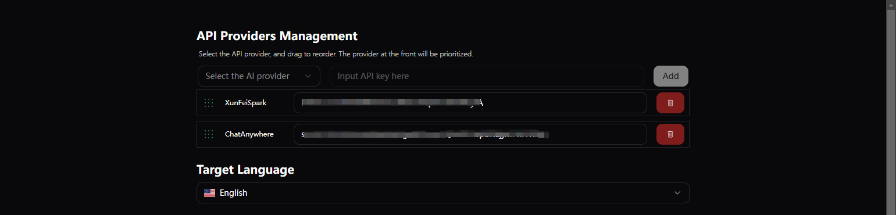
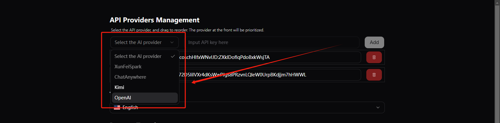

在开发 AI 应用时，我们经常需要集成多个 AI 服务提供商的 API。本文将分享一个实际浏览器扩展开发案例，展示如何使用 Langchain 重构传统的 AI 接口集成方案，使代码更加清晰、可维护且易于扩展。

## 重构前的集成 AI 提供商的逻辑

为了认识到重构的目的， 让我们先深入了解重构前的代码架构和实现方式。

### 一：服务类型定义

我定义了一个枚举类型，枚举了服务类型

**typings\aiModelAdaptor.ts**

```ts
export enum AgentsType {
    // UI 展示名 = 代码层面服务的名称
    "XunFeiSpark" = "XunFeiSpark",
    "ChatAnywhere" = "ChatAnywhere",
}
```

这个枚举的作用不仅是类型定义，还直接影响了 Options 页面的 UI 配置。当添加新的枚举值时，系统会自动在配置页面生成对应的 API key 配置选项：

**entrypoints\options\components\ApiKeysConfigComponent.tsx**

```ts
import { AgentsType, AiAgentApiKeys } from '@/typings/aiModelAdaptor';
//......
function generateOptions() {
    const agents = Object.values(AgentsType);
    return agents.map((agent, index) => {
        return {
            name: agent,
            id: index
        }
    })

}
```

AgentsType 枚举值将会被转换为 UI 选项，使用户可以为每个 AI 服务配置对应的 API key：



当你新增了一个枚举值后，这里就会多出一个填写选项可供选择：

```diff
  export enum AgentsType {
      "XunFeiSpark" = "XunFeiSpark",
      "ChatAnywhere" = "ChatAnywhere",
      "Kimi" = "Kimi",
+     "OpenAI" = "OpenAI"
  }
```



但是这只是 UI 的配置入口， 对应的代码逻辑也不可缺少。 

### 二：AI服务基类

在重构前的方案中，我们定义了一个基类来统一 AI 服务的实现：

**lib\aiModels\index.ts**

```ts
import { AgentsType } from "@/typings/aiModelAdaptor";
import { API_ERROR_TYPE, RequestFn } from "@/typings/app";
import { APIException } from "@/utils/APIException";
import { log } from "@/utils/app";

// 定义 AI 接口的统一结构
export interface AIModelInterface {
  /**API 的 名字 */
  name?: AgentsType;
  /**API 的 URL 请求地址 */
  apiUrl?: string;
  /**API 所应用的模型列表 */
  modelList: string[];
  chatCompletion(input: string): Promise<string>;
}

export class AiApiBasic implements AIModelInterface {
  name: AgentsType;
  apiUrl: string;
  modelList: string[];
  requestFn: RequestFn;
  constructor(
    name: AgentsType,
    apiUrl: string,
    modelList: string[],
    requestFn: RequestFn
  ) {
    this.modelList = modelList;
    this.name = name;
    this.apiUrl = apiUrl;
    this.requestFn = requestFn;
  }
  // AI 服务应该在自己内部尝试多轮 模型尝试,直到全部失败才抛出错误
  async chatCompletion(input: string): Promise<string> {
    const apiKey = await getAgentApiKey(this.name);
    if (!apiKey) {
      throw new Error(`AI API: ${this.name} 未设置apikey，请在setting中设置`);
    }
    for (const model of this.modelList) {
      try {
        // 依次尝试调用各个服务
        const response = await this.requestFn({
          apikey: apiKey,
          apiUrl: this.apiUrl,
          model: model,
          userMessage: input,
          // maxTokens: await greetingWordsLimit.getValue()
        });
        return Promise.resolve(response);
      } catch (error) {
        if (error instanceof APIException) {
          log(
            `${this.name} API failed for model ${model}: \n ${error.type}: ${error.message}`,
            "error"
          );
        }
        continue; // 尝试下一个model
      }
    }
    // 如果所有模型的请求都失败了,那么就会抛出错误
    throw new APIException(
      `All Model for ${this.name} services failed`,
      API_ERROR_TYPE.APIError
    );
  }
}
```

这个基类实现了错误重试和模型切换的核心逻辑，所有具体的 AI 服务适配器都继承自这个基类。

### 三：提供商具体服务类

以 Kimi 服务为例，看看具体适配器的实现：

我们需要先创建一个对应的文件 **lib\aiModels\kimi.ts**

```ts
// lib\aiModels\kimi.ts
import { AgentsType } from "@/typings/aiModelAdaptor";
import { AiApiBasic } from ".";
import { RequestFn } from "@/typings/app";

// 定义KIMI api 的请求方法和响应处理
const kimiAPI: RequestFn = function ({ apikey, apiUrl, model, userMessage }) {
    return new Promise((resolve, reject) => {
        const options = {
            method: 'POST',
            headers: {
                'Authorization': `Bearer ${apikey}`, // 替换成你的 API key
                'Content-Type': 'application/json',
                'accept': 'application/json',
            },
            body: JSON.stringify({
                model: model,
                messages: [
                    {
                        role: "user",
                        content: userMessage
                    }
                ],
                temperature: 0.3
            })
        };

        fetch(apiUrl, options)
            .then(response => response.json())  // 处理 JSON 响应
            .then(result => {
                if (result.choices && result.choices[0].message) {
                    resolve(result.choices[0].message.content);  // 返回结果
                } else {
                    reject("接口获取信息错误，请排查：moonshot api");
                }
            })
            .catch(error => reject(error));  // 捕获错误
    });
}

// 通过继承 AiApiBasic 类实现kimiAPIAIService 并导出
export class kimiAPIAIService extends AiApiBasic {
    constructor(modelList: string[]) {
        const apiUrl = 'https://api.moonshot.cn/v1/chat/completions'
        super(AgentsType.Kimi, apiUrl, modelList, kimiAPI)
    }
}
```

这个实现展示了如何处理特定 AI 服务的 API 调用、响应解析和错误处理。

### 四：服务调度器

旧方案中的服务调度是通过 `AiApiAdaptor` 类实现的，`AiApiAdaptor` 是 AI 接口的调度器。这个调度器负责管理多个 AI 服务，实现了服务的初始化、调用和错误处理。

在内部实现上， 它暴露了一个 `initServices` 的方法，并接收一个 AI 服务的实例列表，当被调用时，将会按照用户的配置顺序依次排序 AI 服务对象。 它还实现了一个  `chat` 方法， 当它被调用的时候，会依次尝试定义的 AI 服务，如果某个 AI 服务的响应异常，那么会暂时移除该服务并尝试下一个 AI 服务，以确保尽力获取 AI 响应。 

具体的实现如下：

**lib\aiModels\index.ts**

```ts
/**
 * AI 接口调度器, 自动化尝试调用各个 AI 服务, 包括所有 AI 接口提供的不同模型
 */
export class AiApiAdaptor {
  private services!: AIModelInterface[];
  private toRemoveServices: AIModelInterface[] = [];
  constructor() {}

  /**
   * Initialize the AI model services to be used in the current session. The input services
   * will be filtered by the agentApiKeys stored in the storage. The agentApiKeys will be
   * mapped to the corresponding AI model services and the services that do not have a
   * corresponding agentApiKey will be filtered out.
   * @param services The AI model services to be used in the current session.
   * @returns A promise that resolves when the services are initialized.
   */
  initServices(services: AIModelInterface[]) {
    return agentsStorage.getValue().then((agentApiKeys) => {
      this.services = agentApiKeys
        .map((agentApi) => {
          return services.find(
            (service) => service.name === agentApi.agentName
          )!;
        })
        .filter((service) => service !== undefined);
    });
  }
  /**
   * 当某个服务请求失败的时候，就在该轮循环中结束的时候，暂时移除，避免每次都重试该失败的 服务
   */
  private removeInvalidServices() {
    for (const service of this.toRemoveServices) {
      const index = this.services.indexOf(service);
      if (index !== -1) {
        this.services.splice(index, 1); // 从数组中删除元素
        log(`暂时移除无效的 API 服务 ${service.name}`, "warn");
      }
    }
  }

  async chat(input: string): Promise<string> {
    if (!this.services) {
      throw new APIException(
        "Services is not prepared! Please initialize the AiApiAdaptor first.",
        API_ERROR_TYPE.APINETEXCEPTION
      );
    }

    for (const service of this.services) {
      try {
        // 依次尝试调用各个服务
        const response = await service.chatCompletion(input);
        this.removeInvalidServices();
        return response;
      } catch (error) {
        if (error instanceof APIException) {
          log(`${error.type}: ${error.message} `, "error");
        }
        // 收集需要移除的 service
        this.toRemoveServices.push(service);
        console.log("error", error);
        continue; // 尝试下一个服务
      }
    }
    throw new APIException("All AI services failed", API_ERROR_TYPE.APIError);
  }
}
```


### 五：初始化 AI 调度器实例并使用

我们是如何初始化并使用 api 的

**entrypoints\sidepanel\components\NewRecord.tsx**

```ts
import { AiApiAdaptor } from '@/lib/aiModels'
//......
let AI: AiApiAdaptor | null = null
async function initAiApiAdaptor() {
    AI = new AiApiAdaptor()
    await AI.initServices([
      new chatanywhereAIService(['gpt-4o-mini', 'gpt-3.5-turbo', 'gpt-4o', 'gpt-4']),
      new xunfeiSparkAPIAIService(['generalv3']),
    ])
}
//......
// ai 对象的调用
const sendToAi = async (payload: any) => {
	if (!AI) {
    	await initAiApiAdaptor()
	}
	const response = await AI.chat(processedMsg)
}
//......
```

### 六：集成新的 AI 提供商API

在需要集成新的 AI 提供商的API 的时候，我们需要先新增一个 AgentsType 枚举值：

```diff
export enum AgentsType {
    "XunFeiSpark" = "XunFeiSpark",
    "ChatAnywhere" = "ChatAnywhere",
+   "Kimi" = "Kimi"
}
```

然后通过继承 `AI服务基类` 实现该 `提供商具体服务类`, 最后要在`初始化 AI 调度器实例` 的时候将实例传入初始化列表。

```diff
async function initAiApiAdaptor() {
    AI = new AiApiAdaptor()
    await AI.initServices([
      new chatanywhereAIService(['gpt-4o-mini', 'gpt-3.5-turbo', 'gpt-4o', 'gpt-4']),
      new xunfeiSparkAPIAIService(['generalv3']),
+     new kimiAPIAIService(['moonshot-v1-8k']),
    ])
}
```


## 存在的问题

在开发浏览器扩展的过程中，我们需要集成多个 AI 服务提供商的 API。以上实现采用了传统的适配器模式，虽然能够工作，但存在以下显著问题：

- **代码重复**：每个 AI 服务都需要实现类似的请求逻辑和错误处理

- **服务切换复杂**：当一个服务失败时，切换到备用服务的逻辑较为复杂

- **扩展性限制**：添加新的 AI 服务需要编写大量样板代码， 需要扩展的代码逻辑分散，需要改好几个地方
- **代码不够健硕**：代码逻辑不够缜密健壮

正是因为这些原因， 所以需要对它进行重构。 


## 引入 Langchain 来优化逻辑

**LangChain** 是一个用于开发 LLM（Large Language Model）应用的开源框架。它提供了一套完整的工具和抽象，使得构建基于 LLM 的应用变得更加简单和规范。选择 LangChain 进行重构有以下几个关键原因：

1. **统一的抽象层**
   - LangChain 提供了统一的模型接口抽象，无论是 OpenAI、Anthropic 还是其他 AI 提供商的模型，都可以通过相同的接口进行调用
   - 这种抽象让我们能够轻松切换不同的模型提供商，而无需修改上层业务逻辑
2. **链式调用支持**
   - LangChain 的 Chain 概念允许我们将多个操作（如提示词处理、模型调用、结果解析等）组合成一个流程
   - 这种链式设计使得代码更加模块化，便于维护和扩展
3. **内置的错误处理**
   - 提供了统一的错误处理机制
   - 支持重试逻辑和错误恢复
4. **强大的工具集成**
   - 内置了许多常用的工具和功能，如提示词管理、记忆系统等
   - 这些工具可以帮助我们更好地构建复杂的 AI 应用

在确定使用 LangChain 作为重构的核心框架后，我们需要设计一个清晰的架构来组织代码。这个新架构主要包含三个核心部分：适配器工厂、LangChain 服务层和服务管理器。让我们逐一深入了解每个部分的实现。

### 一：适配器工厂

首先，我们需要一个统一的方式来创建和管理不同的 AI 模型。适配器工厂模式非常适合这个需求，它能够：

- 统一模型的创建接口
- 隔离具体实现细节
- 方便添加新的模型支持

让我们看看具体实现：

**lib\aiModels\adapters\index.ts**

```ts
import { AgentsType } from '@/typings/aiModelAdaptor';
import { BaseLanguageModel } from "@langchain/core/language_models/base";
import { ChatOpenAI } from "@langchain/openai";

export interface AIModelAdapter {
    createModel(apiKey: string): BaseLanguageModel;
}

class ChatAnywhereAdapter implements AIModelAdapter {
    createModel(apiKey: string): BaseLanguageModel {
        return new ChatOpenAI({
            openAIApiKey: apiKey,
            modelName: "gpt-3.5-turbo",
            temperature: 0.7,
            streaming: false,
            configuration: {
                baseURL: "https://api.chatanywhere.tech/v1"
            }
        });
    }
}

class XunFeiSparkAdapter implements AIModelAdapter {
    createModel(apiKey: string): BaseLanguageModel {
        // 这里需要实现讯飞的具体适配逻辑
        return new ChatOpenAI({
            openAIApiKey: apiKey,
            modelName: "spark",
            temperature: 0.7,
            streaming: false,
            configuration: {
                baseURL: "https://spark-api.xf-yun.com/v1"
            }
        });
    }
}

class KimiAdapter implements AIModelAdapter {
    createModel(apiKey: string): BaseLanguageModel {
        return new ChatOpenAI({
            openAIApiKey: apiKey,
            modelName: "kimi",
            temperature: 0.7,
            streaming: false,
            configuration: {
                baseURL: "https://api.moonshot.cn/v1"
            }
        });
    }
}

// 适配器工厂
export class AIModelAdapterFactory {
    private static adapters: Map<AgentsType, AIModelAdapter> = new Map([
        [AgentsType.ChatAnywhere, new ChatAnywhereAdapter()],
        [AgentsType.XunFeiSpark, new XunFeiSparkAdapter()],
        [AgentsType.Kimi, new KimiAdapter()],
    ]);

    static getAdapter(type: AgentsType): AIModelAdapter {
        const adapter = this.adapters.get(type);
        if (!adapter) {
            throw new Error(`No adapter found for model type: ${type}`);
        }
        return adapter;
    }

    // 用于动态注册新的适配器
    static registerAdapter(type: AgentsType, adapter: AIModelAdapter) {
        this.adapters.set(type, adapter);
    }
}
```

通过这个工厂模式的实现，我们成功统一了不同 AI 服务的创建过程。但是，仅有模型创建的统一还不够，我们还需要一个服务层来处理实际的 AI 交互逻辑。

### 二：langchainService

服务层用来封装与这些模型的交互逻辑。这一层主要负责：

- 管理模型的生命周期
- 处理消息模板
- 执行实际的 AI 调用

下面是具体的服务层实现：

**lib\aiModels\langchainService.ts**

```ts
import { AgentsType } from '@/typings/aiModelAdaptor';
import { PromptTemplate } from "@langchain/core/prompts";
import { RunnableSequence } from "@langchain/core/runnables";
import { StringOutputParser } from "@langchain/core/output_parsers";
import { BaseLanguageModel } from "@langchain/core/language_models/base";
import { AIModelAdapterFactory } from './adapters';
import { targetLanguage, promptTemplate } from "@/utils/storage";

export class LangchainService {
  private models: Map<AgentsType, BaseLanguageModel>;

  constructor() {
    this.models = new Map();
  }

  async initializeModel(type: AgentsType, apiKey: string) {
    try {
      const adapter = AIModelAdapterFactory.getAdapter(type);
      const model = adapter.createModel(apiKey);
      this.models.set(type, model);
    } catch (error) {
      console.error(`Failed to initialize model ${type}:`, error);
      throw error;
    }
  }

  async explain(type: AgentsType, selection: string): Promise<string> {
    const [language, template] = await Promise.all([
      targetLanguage.getValue(),
      promptTemplate.getValue()
    ]);

    // 每次请求创建新的 PromptTemplate
    const _promptTemplate = PromptTemplate.fromTemplate(template);

    const model = this.models.get(type);
    if (!model) {
      throw new Error(`Model ${type} not initialized`);
    }

    const chain = RunnableSequence.from([
      _promptTemplate,
      model,
      new StringOutputParser(),
    ]);

    try {
      const response = await chain.invoke({
        LANGUAGE: language,  
        SELECTION: selection 
      });

      return response;
    } catch (error) {
      console.error(`Error in ${type} explanation:`, error);
      throw error;
    }
  }

  isModelAvailable(type: AgentsType): boolean {
    return this.models.has(type);
  }
}

// 创建单例实例
export const langchainService = new LangchainService(); 
```

服务层解决了与 AI 模型交互的问题，但我们还需要一个更高层的抽象来协调多个服务之间的关系，这就是为什么我们需要服务管理器。

### 三：AiServiceManager

服务管理器采用单例模式，主要负责：

- 统一管理所有 AI 服务
- 处理服务的初始化和释放
- 实现服务之间的故障转移

这是服务管理器的具体实现：

**lib\aiModels\aiServiceManager.ts**

```ts
import { AgentsType } from '@/typings/aiModelAdaptor';
import { langchainService } from './langchainService';
import { agentsStorage } from '@/utils/storage';

export class AIServiceManager {
  private static instance: AIServiceManager;
  private initialized = false;

  private constructor() {}

  static getInstance(): AIServiceManager {
    if (!AIServiceManager.instance) {
      AIServiceManager.instance = new AIServiceManager();
    }
    return AIServiceManager.instance;
  }

  async initialize() {
    if (this.initialized) return;

    try {
      const agents = await agentsStorage.getValue();
      if (!agents) return;

      for (const agent of agents) {
        await langchainService.initializeModel(
          agent.agentName,
          agent.apiKey
        );
      }

      this.initialized = true;
    } catch (error) {
      console.error('Failed to initialize AI services:', error);
      throw error;
    }
  }

  async getExplanation(selection: string): Promise<string> {
    if (!this.initialized) {
      await this.initialize();
    }

    // 获取所有已配置的模型
    const agents = await agentsStorage.getValue() || [];
    
    // 按配置顺序尝试不同的模型
    for (const agent of agents) {
      if (langchainService.isModelAvailable(agent.agentName)) {
        try {
          return await langchainService.explain(agent.agentName, selection);
        } catch (error) {
          console.error(`Failed to get explanation from ${agent.agentName}:`, error);
          continue;
        }
      }
    }

    throw new Error('No available AI service');
  }
}

export const aiServiceManager = AIServiceManager.getInstance(); 
```

通过这三层架构的配合，我们成功构建了一个灵活、可扩展且健壮的 AI 服务集成系统。每一层都有其明确的职责：工厂负责创建，服务层负责执行，管理器负责协调。这种分层设计不仅使代码结构更清晰，也让系统的维护和扩展变得更加容易。


当我们需要新增一个 AI 服务提供商 API 的时候， 我们只需要新增一个  `AgentsType` 枚举类型，用于暴露给动态的 UI 生成，以提供用户配置 API key  的能力。 然后只需要在 `适配器工厂` 中新增一个对应服务的适配器即可。 非常的解耦方便。 


好的，以下是新增的 **总结** 章节：

------

## 总结

在本次重构中，我们通过引入 **LangChain**，优化了原有的 AI 接口集成方案，使其更加模块化、可维护且易扩展。

### **主要改进点**

1. **适配器模式替换硬编码实现**：通过 **适配器工厂 (AIModelAdapterFactory)**，统一管理不同 AI 提供商的创建逻辑，使得新增 AI 服务变得更加简单。
2. **LangChain 统一 API 调用**：使用 **LangChain 的 BaseLanguageModel** 适配不同 AI 服务，减少代码重复，提高可读性。
3. **提升容错性和扩展性**：借助 LangChain 内置的错误处理和链式调用，使得服务切换更高效，避免了原方案中复杂的错误处理逻辑。

### **重构后的优势**

✅ **更清晰的架构** —— 通过工厂模式和 LangChain 统一接口管理不同 AI 服务。
 ✅ **更容易扩展** —— 仅需新增适配器即可支持新的 AI 提供商，而无需修改多处代码。
 ✅ **更强的健壮性** —— 内置错误处理和重试机制，提高服务调用的稳定性。


