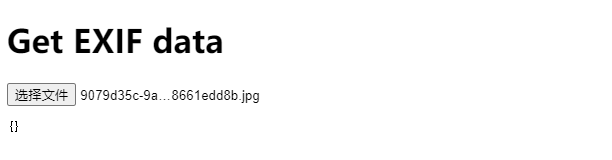
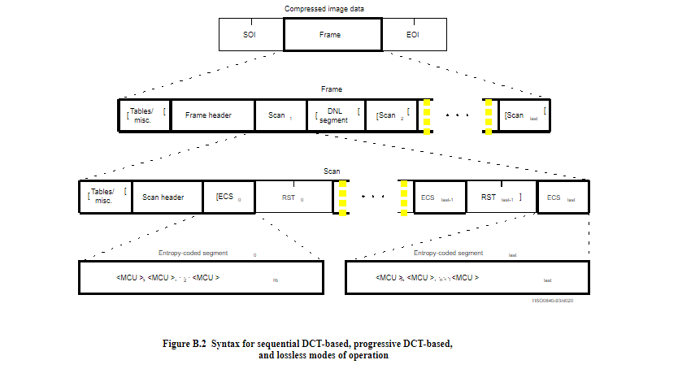
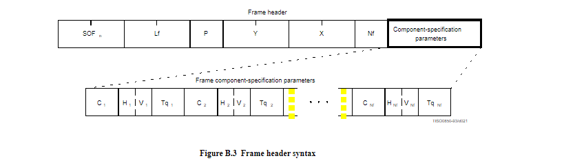

## 引入

最近业务上有要求，要求如果是 Jpeg 格式文件， 前端在上传的时候要求判断一下这个文件是否 CMYK 颜色模式(color mode/ color space)。 这个颜色模式是打印行业需要的。如果不是则禁止上传，并提示用户。 

一开始我以为这个应该存储在 exif 文件信息中， 去拿一下就好了， 但是简单测试发现两个问题:

1. 文件是否携带 exif 信息是不确定的， 即便出自设计师导出文件， 有可能也是不携带颜色模式信息的。  
2. 除此之外， 依靠 exif 信息去判断，严格来说，即便携带，也是不准确的， 因为这个信息是可以被人为修改的。 

经过一番研究， 我暂时发现可能有两种方式，去达成目的。 但是这篇文章实际不是以解决问题为导向，而是期望尽可能的深入一丢丢。 如果急于找到解决方案， 直接翻到文章底部查看具体 [编码实现](#编码实现) 即可。 

## 什么是 CMYK 颜色模式？

> [了解 Photoshop 颜色模式 (adobe.com)](https://helpx.adobe.com/cn/photoshop/using/color-modes.html)

CMYK 是一种颜色模式，它表示四种颜色通道：青色（Cyan）、品红色（Magenta）、黄色（Yellow）和黑色（Key，通常表示黑色）。这种颜色模式主要用于印刷和彩色印刷工作中。

以下是 CMYK 颜色模式中各颜色通道的简要介绍：

1. **青色 (Cyan):** 表示蓝绿色。在印刷中，它用于调整蓝色和绿色的浓度。
2. **品红色 (Magenta):** 表示品红或洋红色。在印刷中，它用于调整红色和蓝色的浓度。
3. **黄色 (Yellow):** 表示黄色。在印刷中，它用于调整红色和绿色的浓度。
4. **黑色 (Key):** 通常表示黑色。在印刷中，黑色是通过使用黑色油墨单独添加的，以增加图像的深度和对比度。在 CMYK 模式中，K 代表 Key，以避免与蓝色 (B) 冲突。

这四个颜色通道可以叠加在一起以创建各种颜色。通过调整每个通道的浓度，可以实现广泛的颜色表达。CMYK 被广泛用于印刷领域，因为它能够准确地模拟很多颜色，并提供了在印刷过程中需要的色彩控制。

与 RGB（红绿蓝）颜色模式不同，CMYK 是一种适合印刷的颜色模式，因为它更好地反映了油墨混合的方式，并考虑到印刷物质上的光的特性


## 怎么在web判断一个 jpeg/jpg 文件 颜色模式是否 cmyk ?

简单说一下这两种方法， 实际上是同一种原理， 因为对于一张图片而言， 它除了携带有 exif 文件元信息之外， 还有文件头信息。 

既然不能通过 exif 元信息去判断， 那么我们可以通过文件头信息去做判断。 

首先，简单测试可以发现， 即便一个 cmyk 图片没有  exif 描述元信息标识这是一个  cmyk 颜色模式的图片， 但是 各种设计类软件都能够标记出来。 以ps为例：


但是 exif 信息中是没有的：


甚至一些解析库，就连最基本携带的元信息都没读出来：

> https://stackblitz.com/edit/exif-js-yk7nnb?file=ImageMega.js




### 为什么设计软件可以标记出这个图片是否是 cmyk 颜色模式？

这个问题， 我在网上翻了很久，确实是找不到相关文章有阐述设计软件的原理。 不过Ai 的回答是这样的， 具备一定的参考性：

> 有朋友找到了记得踢我一脚，这里提前感谢啦~


## 用 ImageMagic 解析图片文件

> **什么是 imageMagic ?**
>
>
> ImageMagick 主要由大量的命令行程序组成，而不提供像 Adobe Photoshop、GIMP 这样的图形界面。它还为很多程序语言提供了 API 库。
>
> ImageMagick 的功能包括：
>
> * 查看、编辑位图文件
> * 进行图像格式转换
> * 图像特效处理
> * 图像合成
> * 图像批处理
>
> ImageMagick 广泛用于图像处理、图形设计、Web 开发等领域。它是许多开源软件项目的重要组成部分，例如 GIMP、Inkscape、Linux 系统中的图像工具等。
>
> ImageMagick 的优势包括：
>
> * 功能强大，支持多种图像格式和图像处理功能
> * 开放源代码，免费使用
> * 、、可移植性强，支持多种操作系统
>
> > @jayce: imageMagic 类似于 ffmpeg, 只不过它专注图像处理


我们可以利用 ImageMagic 的 `identify` 工具命令 去解析图片以查看一些信息：


加上 `-verbose` 选项可以查看更多详细信息：
```bash
$ ./magick identify -verbose ./CMYK.jpg
$ ./magick identify -verbose ./RGB.jpg
```


这些数据是什么？ 从哪里解析出来的呢？ 这个需要看一下 jpeg 文件的一些标准文件结构


## ISO/IEC 10918-1 和 ISO/IEC 10918-5

这两个文件都是 JPEG 的标准文档，只是不同的部分，wiki 上对二者描述大致是 5 是 对 1 的很多细节的展开和补充。是补充规范 

### JPEG File Interchange Format （JFIF） 和 Exif

JFIF（JPEG File Interchange Format）和 EXIF（Exchangeable image file format）是两种与 JPEG 图像相关的标准，但它们具有不同的目的和功能。

[JFIF](https://en.wikipedia.org/wiki/JPEG_File_Interchange_Format) 是一个图片文件格式标准， 它被发布于 10918-5， 是对 10918-1 的细节补充。 

1. **JFIF (JPEG File Interchange Format):**
   - **目的：** JFIF 是一种用于在不同设备和平台之间交换 JPEG 图像的简单格式。它定义了 JPEG 文件的基本结构，以确保文件在不同系统中的一致性和可互操作性。
   - **特点：** JFIF 文件通常包含了基本的图像数据，但不一定包含元数据信息。它主要关注图像的编码和解码，而不太关心图像的其他详细信息。JFIF 文件通常使用 .jpg 或 .jpeg 扩展名。
2. **EXIF (Exchangeable image file format):**
   - **目的：** EXIF 是一种在数字摄影中广泛使用的标准，用于嵌入图像文件中的元数据信息。这些元数据可以包括拍摄日期、相机型号、曝光时间、光圈值等。EXIF 提供了更丰富的信息，有助于记录和存储与拍摄有关的详细数据。
   - **特点：** EXIF 数据以二进制格式嵌入在 JPEG 图像中，提供了关于图像和拍摄条件的详细信息。这对于数字相机和其他支持 EXIF 的设备非常有用。EXIF 文件通常使用 .jpg 或 .jpeg 扩展名。


## JPEG 文件标准结构语法

jpeg 作为压缩数据结构， 是一个非常复杂的数据组织， 我们的关注点只在关系到我们想要解决的问题。 标准文档 [ISO/IEC 10918-1 : 1993(E)](https://www.digicamsoft.com/itu/itu-t81-38.html).中有部分相关说明。

### 概要：

结构上来说， jpeg 的数据格式由以下几个部分，有序组成： parameters, markers, 以及 entropy-coded data segments,  其中 parameters 和 markers 部分通常被组织到 marker segments, 因为它们都是用字节对齐的代码表， 都是由8位字节的有序序列组成。

### Parameters

这部分携带有参数编码关键信息， 是图片成功被解析的关键。 

### Markers

Markers 标记用于标识压缩数据格式的各种结构部分。大多数标记开始包含一组相关参数的标记段;有些标记是单独存在的。所有标记都被分配了两个字节的代码

例如 `SOI` :  从 `0xFF,0xD8`这两个字节开始，标记为图片文件的文件头开始， `SOF0`: 从 `0xFF, 0xD8`这两个字节开始，标记了 ”帧“ 的开始，它实际上会携带有图片的一些基本信息， 例如宽高，以及**颜色通道**等。 这个颜色通道其实也是我们主要需要关注的地方。

下表是完整的标记代码：

****

>@refer:
>
>https://www.digicamsoft.com/itu/itu-t81-35.html
>https://www.digicamsoft.com/itu/itu-t81-36.html

wiki 上也有相关的帧头部字段说明：

|            |                         |                 |                                                              |                                                              |
| :--------: | :---------------------: | :-------------: | :----------------------------------------------------------: | :----------------------------------------------------------: |
| Short name |          Bytes          |     Payload     |                             Name                             |                           Comments                           |
|    SOI     |       0xFF, 0xD8        |     *none*      |                        Start Of Image                        |                                                              |
|    SOF0    |       0xFF, 0xC0        | *variable size* | Start Of Frame (baseline [DCT](https://en.wikipedia.org/wiki/Discrete_cosine_transform)) | Indicates that this is a baseline DCT-based JPEG, and specifies the width, height, number of components, and component subsampling (e.g., 4:2:0). |
|    SOF2    |       0xFF, 0xC2        | *variable size* |               Start Of Frame (progressive DCT)               | Indicates that this is a progressive DCT-based JPEG, and specifies the width, height, number of components, and component subsampling (e.g., 4:2:0). |
|    DHT     |       0xFF, 0xC4        | *variable size* |                   Define Huffman Table(s)                    |            Specifies one or more Huffman tables.             |
|    DQT     |       0xFF, 0xDB        | *variable size* |                 Define Quantization Table(s)                 |          Specifies one or more quantization tables.          |
|    DRI     |       0xFF, 0xDD        |     4 bytes     |                   Define Restart Interval                    | Specifies the interval between RST*n* markers, in Minimum Coded Units (MCUs). This marker is followed by two bytes indicating the fixed size so it can be treated like any other variable size segment. |
|    SOS     |       0xFF, 0xDA        | *variable size* |                        Start Of Scan                         | Begins a top-to-bottom scan of the image. In baseline DCT JPEG images, there is generally a single scan. Progressive DCT JPEG images usually contain multiple scans. This marker specifies which slice of data it will contain, and is immediately followed by entropy-coded data. |
|   RST*n*   | 0xFF, 0xD*n* (*n*=0..7) |     *none*      |                           Restart                            | Inserted every *r* macroblocks, where *r* is the restart interval set by a DRI marker. Not used if there was no DRI marker. The low three bits of the marker code cycle in value from 0 to 7. |
|   APP*n*   |      0xFF, 0xE*n*       | *variable size* |                     Application-specific                     | For example, an [Exif](https://en.wikipedia.org/wiki/Exif) JPEG file uses an APP1 marker to store metadata, laid out in a structure based closely on [TIFF](https://en.wikipedia.org/wiki/TIFF). |
|    COM     |       0xFF, 0xFE        | *variable size* |                           Comment                            |                   Contains a text comment.                   |
|    EOI     |       0xFF, 0xD9        |     *none*      |                         End Of Image                         |                                                              |

>  [Syntax and structure](https://en.wikipedia.org/wiki/JPEG#Syntax_and_structure)


### 整体结构



> @refer: https://www.digicamsoft.com/itu/itu-t81-38.html


### Frame Header




> @refer: https://www.digicamsoft.com/itu/itu-t81-35.html

SOF<sub>n</sub> : 帧开始标记标记帧参数的开始。下标n标识编码过程是基线顺序、扩展顺序、渐进还是无损，以及使用哪种熵编码过程。

在其标准文档中，我们有找到 SOF<sub>n</sub> 的子字段说明，不过在其他地方，倒是看到了不少描述：

特别是在这里 [JPEG File Layout and Format](https://mykb.cipindanci.com/archive/SuperKB/1294/JPEG%20File%20Layout%20and%20Format.htm)


可以看到，在 SOF<sub>n</sub> 这个标记中， 有一个字段为会指明 components 的数量，它代表的实际上颜色通道， 如果是 1，那么就是灰度图， 如果是3，那就是RGB， 如果是 4 就是 CMYK.

到这里我们就知道了， 我们可以读取到这个对应的字节段，从而判断一个图片的颜色模式了。 


## 怎么读取呢？

这篇资料说了明了 Jpeg 文件格式中字节和上述字段的关联关系: [Anatomy of a JPEG](https://www.ccoderun.ca/programming/2017-01-31_jpeg/)

注意这篇资料中有一段描述，会影响到我们后续的逻辑判断：


> 就是 SOF<sub>0</sub> 是必须的，但是可以被 SOF<sub>n>=1</sub> 替换。 所以在做逻辑判断的时候，后续的也要判断。


我们可以先大概看看一个图片文件的字节流数据长什么样子：(因为所有的字段都是 FF 字节位开头，所以高亮了)


> 以上页面可以在这里访问： https://jaycethanks.github.io/demos/DemoPages/image_binary_render/dist/

但样太不便于阅读了， 而且实在太长了。 这里有个网站 [here](https://cyber.meme.tips/jpdump/#)，可以将关键的字节段截取出来：


我们主要看这里：


可以看到 components 为 4.

如果是 RGB：


这里就是 3，

如果是灰度图，components 就会是1


### EXIF 在哪里？

一个额外的小问题， 我们常见的 exif 元信息存储在哪里呢？

其实上面的 [Markers](#Markers) 部分给出的表格中也说明了 ，在 App<sub>n</sub> 中可以找到 exif 信息， 但是wiki 上说的是 App<sub>0</sub>， 在这个解析网站中，我们可以看到：


## 编码实现

有了上述具体的分析， 我们就能有大致思路， 这里直接给出相关代码：

> 代码参考 `github.com/zengming00/node-jpg-is-cmyk`

```ts

/**
 * @refer https://github.com/zengming00/node-jpg-is-cmyk/blob/master/src/index.ts
 * @refer https://cyber.meme.tips/jpdump/#
 * @refer https://mykb.cipindanci.com/archive/SuperKB/1294/JPEG%20File%20Layout%20and%20Format.htm
 * @refer https://www.ccoderun.ca/programming/2017-01-31_jpeg/
 * 
 * 通过 jpg 文件头判断是否是 CMYK 颜色模式
 * @param { Uint8Array } data 
 */
function checkCmyk(data: Uint8Array) {
    let pos = 0;
    while (pos < data.length) {
        pos++;
        switch (data[pos]) {
            case 0xd8: {// SOI - Start of Image
                pos++;
                break;
            }
            case 0xd9: {// EOI - End of Image
                pos++;
                break;
            }
            case 0xc0: // SOF0 - Start of Frame, Baseline DCT
            case 0xc1: // SOF1 - Start of Frame, Extended Sequential DCT
            case 0xc2: { // SOF2 - Start of Frame, Progressive DCT
                pos++;
                const len = (data[pos] << 8) | data[pos + 1];
                const compoNum = data[pos + 7];
                if (compoNum === 4) {
                    // 如果components 数量为4， 那么就认为是 cmyk
                    return true;
                }
                pos += len;
                break;
            }
            case 0xc4: { // DHT - Define Huffman Table
                pos++;
                const len = (data[pos] << 8) | data[pos + 1];
                pos += len;
                break;
            }
            case 0xda: { // SOS - Start of Scan
                pos++;
                const len = (data[pos] << 8) | data[pos + 1];
                pos += len;
                break;
            }
            case 0xdb: { // DQT - Define Quantization Table
                pos++;
                const len = (data[pos] << 8) | data[pos + 1];
                pos += len;
                break;
            }
            case 0xdd: { // DRI - Define Restart Interval
                pos++;
                const len = (data[pos] << 8) | data[pos + 1];
                pos += len;
                break;
            }
            case 0xe0: { // APP0 - Application-specific marker
                pos++;
                const len = (data[pos] << 8) | data[pos + 1];
                pos += len;
                break;
            }
            case 0xfe: { // COM - Comment
                pos++;
                const len = (data[pos] << 8) | data[pos + 1];
                pos += len;
                break;
            }
            default: {
                pos++;
                const len = (data[pos] << 8) | data[pos + 1];
                pos += len;
            }
        }
    }
    return false;
}
```


## 有没有其他的方法？

既然 imageMagic 这么成熟且强大， 我们有办法利用它来做判断吗？

我们可以通过 wasm， 在web中去利用这些工具， 我找到了 [WASM-ImageMagick](https://github.com/KnicKnic/WASM-ImageMagick) 这个， 但是他的打包好像有些问题  vite 引入的时候会报错，看着好像也没有要修复的意思， issue 里面有老哥自己修改了打包配置进行了修复在这里:  [image-magick](https://github.com/xn-sakina/image-magick)

我们就写的demo测试函数：

```ts
import * as Magick from '@xn-sakina/image-magick'

export default function (file: File) {
    if (!file) return;
    // 创建FileReader对象
    var reader = new FileReader();
    // 当读取完成时的回调函数
    reader.onload = async function (e) {
        // 获取ArrayBuffer
        var arrayBuffer = e.target?.result as ArrayBuffer;
        if (arrayBuffer) {
            // 将 ArrayBuffer 转换为 Uint8Array
            const sourceBytes = new Uint8Array(arrayBuffer);
            const inputFiles = [{ name: 'srcFile.png', content: sourceBytes }]
            let commands: string[] = ["identify srcFile.png"]
            const { stdout } = await Magick.execute({inputFiles, commands});
            
            // 这里打印一下结果
            console.log('stdout:',stdout[0]) 
    
        }
    };
    // 读取文件为ArrayBuffer
    reader.readAsArrayBuffer(file);
}
```

```ts
import isCmyk from '../utils/isCmyk.ts'
const handleFileChange = (e: Event) => {
    const file = (e.target as HTMLInputElement)?.files?.[0]
	isCmyk(file) // 这里文件上传调用一下
......    
```

测试几个文件


可以看到， Gray, RGB, CMYK 检测都可以正常输出， 说明可以这么干。 

> 但是这个库， 文档写的太乱了。 - -


这个库的大小有 5 m之大 - -， npm 上找了下， 目前相关的包，也没有比这个更小的好像。


