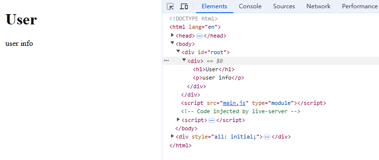

## 回顾 + 去 React 化

回顾一些基本的React用法和概念。 我们知道，一个最基本的 React 使用，是这样开始的。 

```js
const element = <h1 title="foo">Hello</h1>
const container = document.getElementById("root")
ReactDOM.render(element, container)
```

1. 首先通过 JSX 定义了React元素
2. 然后获取了目标dom元素作为挂载容器
3. 将React 元素挂载渲染到了目标容器


React 利用 Babel 或者 SWC 可以将 JSX 语法转义为 React.createElement 方法的调用。 这个方法最终会返回一个对象，也就是虚拟 DOM。 为了更加明确的认识到这一点，我们可以创建一个 demo 实例。 

### 使用 Babel 或者 SWC 对 JSX 语法转译

```bash
$ mkdir jsx2reactElementDemo; cd jsx2reactElementDemo
jsx2reactElementDemo$ npm init -y
# 将 package.json - type 字段设定为 module esm
jsx2reactElementDemo$ npm pkg set type=module
jsx2reactElementDemo$ pnpm install @babel/core @babel/preset-env @babel/preset-react
jsx2reactElementDemo$ touch index.js app.jsx
```

```jsx
// app.jsx
const Card = () => {
    return <>
        <div >
            <div >
                <div >The Coldest Sunset</div>
                <p >
                    Lorem ipsum dolor sit amet, consectetur adipisicing elit.
                    Voluptatibus quia, nulla! Maiores et perferendis eaque,
                    exercitationem praesentium nihil.
                </p>
            </div>
            <div >
                <span >
                    #photography
                </span>
                <span >
                    #travel
                </span>
                <span >
                    #winter
                </span>
            </div>
        </div>
    </>
}
export default Card
```

```js
// index.js
import Babel from '@babel/core'
import presetEnv from '@babel/preset-env'
import fs from 'node:fs'
import react from '@babel/preset-react'
const file = fs.readFileSync('./app.jsx', 'utf8')
const result = Babel.transform(file, {
    presets: [
        // [presetEnv, { useBuiltIns: "usage", corejs: 3 }], 这行是转译 ECMA 新语法和 polyfill 新特新，这里可以不使用
        react
    ]
})

fs.writeFileSync('./app.output.js', result.code)
```

使用 node 执行 index.js 文件: `node index.js` , 并查看输出文件 `app.output.js` :
```js
const Card = () => {
  return /*#__PURE__*/ React.createElement(
    React.Fragment,
    null,
    /*#__PURE__*/ React.createElement(
      "div",
      null,
      /*#__PURE__*/ React.createElement(
        "div",
        null,
        /*#__PURE__*/ React.createElement("div", null, "The Coldest Sunset"),
        /*#__PURE__*/ React.createElement(
          "p",
          null,
          "Lorem ipsum dolor sit amet, consectetur adipisicing elit. Voluptatibus quia, nulla! Maiores et perferendis eaque, exercitationem praesentium nihil."
        )
      ),
      /*#__PURE__*/ React.createElement(
        "div",
        null,
        /*#__PURE__*/ React.createElement("span", null, "#photography"),
        /*#__PURE__*/ React.createElement("span", null, "#travel"),
        /*#__PURE__*/ React.createElement("span", null, "#winter")
      )
    )
  );
};
export default Card;
```

我们可以看到，JSX 语法都被转译成了 `React.createElement` 方法执行。

上面这个过程也可以使用 swc 来完成，swc 使用 rust 编写，提供了极快的速度和开箱即用的api。 为了了解swc 这个现代工具，我们下面是一个快速的演示。 

```bash
$ mkdir jsx2reactElementDemoSWC
jsx2reactElementDemoSWC$ npm init -y; npm pkg set type=module;touch index.js app.jsx
jsx2reactElementDemoSWC$pnpm install @swc/core
```

```js
// index.js
import swc from "@swc/core";
const result = swc.transformFileSync("./app.jsx", {
  jsc: {
    parser: {
      syntax: "ecmascript",
      jsx: true,
    },
  },
});
fs.writeFileSync("./app.output.js", result.code);
```

就这么简单的配置，就可以将 jsx 语法转换为 `React.createElement`。

现在，我们就可以将：

```jsx
const element = <h1 title="foo">Hello</h1>
const container = document.getElementById("root")
ReactDOM.render(element, container)
```

转换成下面的内容了：

```js
const element = React.createElement("h1", { title: "foo" }, "Hello");
const container = document.getElementById("root");
ReactDOM.render(element, container);
```


那么 `React.createElement` 返回的 虚拟DOM 长什么样子呢？ 让我们直接引入 react 包来一探究竟。

### `React.createElement` 返回的是什么？

其实我们之前的基础告诉我们了 `React.createElement(元素type，组件props, 以及...子组件)` 方法会返回虚拟DOM。那么我们通过一个简单的小demo 具体来看看它究竟长什么样。

```bash
$ mkdir resultOfReactCreateElement
resultOfReactCreateElement$ npm init -y; npm pkg set type=module;pnpm install react;
resultOfReactCreateElement$ touch app.output.js
```

在我们的 app.output.js 文件中，我们复制我们上面的demo中产出的 app.output.js 文件，然后引入 React, 将输出写入到 `./app.output.json` 

```diff
+ import React from "react";
+ import fs from 'node:fs'
  var Card = function () {
    return /*#__PURE__*/ React.createElement(
      React.Fragment,
      null,
      /*#__PURE__*/ React.createElement(
        "div",
        null,
        /*#__PURE__*/ React.createElement(
          "div",
          null,
          /*#__PURE__*/ React.createElement("div", null, "The Coldest Sunset"),
          /*#__PURE__*/ React.createElement(
            "p",
            null,
            "Lorem ipsum dolor sit amet, consectetur adipisicing elit. Voluptatibus quia, nulla! Maiores et perferendis eaque, exercitationem praesentium nihil."
          )
        ),
        /*#__PURE__*/ React.createElement(
          "div",
          null,
          /*#__PURE__*/ React.createElement("span", null, "#photography"),
          /*#__PURE__*/ React.createElement("span", null, "#travel"),
          /*#__PURE__*/ React.createElement("span", null, "#winter")
        )
      )
    );
  };
  export default Card;
+ fs.writeFileSync('./app.output.json', JSON.stringify(Card()));
```

现在看看 `app.output.json` 文件的内容。


可以看到， 最终返回的是一个JSON数据的虚拟 DOM 树。

现在，让我们只关注 `type` 和 `props` 字段， 然后我们将 `React.createElement`方法进一步修改：

```js
const element = React.createElement("h1", { title: "foo" }, "Hello");
const container = document.getElementById("root");
ReactDOM.render(element, container);
```

### 替换 JSX 语法部分为虚拟 dom

我们将第一行，手写修改为 JSON 对象，这样，我们就可以暂时摆脱  React.createElement 这个方法了。 

```diff
- const element = React.createElement("h1", { title: "foo" }, "Hello");
+ const element = {
+   type: "h1",
+   props: {
+     title: "foo",
+     children: "Hello",
+   },
+ };
  const container = document.getElementById("root");
  ReactDOM.render(element, container);
```

还没有完成，我们还是用到了 `React.render` 方法, 让我们想办法脱离它吧！

### 替换 React.render 方法

```js
const element = {
  type: "h1",
  props: {
    title: "foo",
    children: "Hello",
  },
};
const container = document.getElementById("root");
// ReactDOM.render(element, container);

render(element, container);
function render(element, container) {
  const node = document.createElement(element.type);
  node["title"] = element.props.title;

  const text = document.createTextNode("");
  text["nodeValue"] = element.props.children;

  node.appendChild(text);
  container.appendChild(node);
}
```

到这里， 我们就完成了 React 基本功能， 但是我们脱离了 React。 这个过程可以很好的解释 React 的基本工作原理。  那么接下来， 让我更进一步，开始做一个我们自己的 丐版 React。

我们先创建一个新的项目目录：

```bash
$ mkdir SimpleReact
SimpleReact$ touch core.js
```


## 第一步：`createElement` 函数的实现。

我们观察 `React.createElement` 方法， 可以发现这个函数接受了 `type`, `props`, `children` 参数。 并返回一个 JSON 对象。 

例如： 

```js
React.createElement("div")
// 返回
{
    "type": "div",
    "props": {
        "children": []
    }
}
```

```js
React.createElement("div", null, "Hello")
// 返回
{
    "type": "div",
    "props": {
        "children": "Hello"
    }
}
```

```js
React.createElement("div",null,"Hello","world")
// 返回
{
    "type": "div",
    "props": {
        "children": ["Hello","world"]
    }
}
```

我们可以有如下实现：

```js
// core.js
const SimpleReact = {
    createElement(type, props, ...children) {
        return {
            type,
            props: {
                ...props,
                children,
            }
        }
    }
}

export default SimpleReact
```


但是，其实数组children 中除了可以是 虚拟 DOM 节点之外，还可以是原始值类型，例如文本，所以，让我们为它们创建一个特殊的类型：`TEXT_ELEMENT`。

```diff
  // core.js
  const SimpleReact = {
    createElement(type, props, ...children) {
      return {
        type,
        props: {
          ...props,
-         children,
+         children: children.map((child) =>
+           typeof child === "object" ? child : SimpleReact.createTextNode(child)
+         ),
        },
      };
    },
+   createTextNode(text) {
+     return {
+       type: "TEXT_ELEMENT",
+       props: {
+         nodeValue: text,
+         children: [],
+       },
+     };
+   },
  };
  export default SimpleReact;
```

好了，我们的基本实现 `createElement` 方法。 现在有个问题， 我们希望测试它，也就意味着我们需要使用 JSX 语法， 同时我们又需要用我们自己的 createElement 方法产生编译结果，就像 `SimpleReact.createElement`这样。


我们现创建一个测试目录：

```bash
SimpleReact$ mkdir test; cd test
SimpleReact$ touch App.jsx compile.js
SimpleReact$ npm init -y; npm pkg set type=module
SimpleReact$ pnpm install @babel/core @babel/preset-react
```

**App.jsx**

```jsx
const User = ()=>{
    return <div>
        <h1>User</h1>
        <p>user info</p>
    </div>
}
```

**compile.js**

```js
// index.js
import Babel from "@babel/core";
import fs from "node:fs";
import react from "@babel/preset-react";
const file = fs.readFileSync("./App.jsx", "utf8");
const result = Babel.transform(file, {
  presets: [react],
});

fs.writeFileSync("./output.js", result.code);
```

在 babel 中很简单，我们可以通过注释的方式，告知 babel 使用我们自己的 `createElement` 方法进行编译。

**App.jsx**

```diff
+ /** @jsx SimpleReact.createElement */
  const User = () => {
    return (
      <div>
        <h1>User</h1>
        <p>user info</p>
      </div>
    );
  };
```

我们测试看看， 直接使用 `node` 执行  `compile.js`

```bash
$ node compile.js
```

```js
// output.js
/** @jsx SimpleReact.createElement */
const User = () => {
  return SimpleReact.createElement("div", null, SimpleReact.createElement("h1", null, "User"), SimpleReact.createElement("p", null, "user info"));
};
```

可以看到，babel 将转译结果中 `React.createElement` 方法替换为了 `SimpleReact.createElement`。

> 如果使用 SWC 来编译，我们需要定义一些配置就行
>
> ```js
> // compile.js
> import swc from "@swc/core";
> import fs from 'node:fs'
> const result = swc.transformFileSync("./App.jsx", {
>   jsc: {
>     transform: {
>       react: {
>         runtime:'classic', 
>         pragma: "SimpleReact.createElement", // 自定义 JSX 转换方法
>       },
>     },
>     parser: {
>       syntax: "ecmascript",
>       jsx: true,
>     },
>   },
> });
> 
> fs.writeFileSync("./output.js", result.code);
> ```


## 第二步：`render` 函数

**SimpleReact/core.js**

```diff
  const SimpleReact = {
    createElement(type, props, ...children) {...},
    createTextNode(text) {...},
+   render(element, container){
+     const dom = document.createElement(element.type);
+     container.appendChild(dom);
+   }
  };
  export default SimpleReact;
```

首先，我们需要使用元素类型，创建DOM节点，然后将新节点附加到容器。 

但是 输入的 element 是一个虚拟 dom 树， 所以我们需要对其进行递归遍历, 对所有子节点做这件事情。 

```diff
  const SimpleReact = {
    createElement(type, props, ...children) {...},
    createTextNode(text) {...},
    render(element, container) {
      const dom = document.createElement(element.type);
+     element.props.children.forEach((child) => {
+       SimpleReact.render(child, dom);
+     });
      container.appendChild(dom);
    },
  };
  export default SimpleReact;
```

我们还需要处理文本元素，如果元素类型是 `TEXT_ELEMENT` 我们就创建一个文本节点而不是常规节点。

```diff
  const SimpleReact = {
    createElement(type, props, ...children) {...},
    createTextNode(text) {...},
    render(element, container) {
-     const dom = document.createElement(element.type);
+    const dom =
+       element.type === "TEXT_ELEMENT"
+         ? document.createTextNode("")
+         : document.createElement(element.type);
      element.props.children.forEach((child) => {
        SimpleReact.render(child, dom);
      });
      container.appendChild(dom);
    },
  };
  export default SimpleReact;
```

现在，我们还有最后一件事需要做， 就是将虚拟dom的 `props` 分配给节点。

```diff
  const SimpleReact = {
    createElement(type, props, ...children) {...},
    createTextNode(text) {...},
    render(element, container) {
      const dom =
        element.type === "TEXT_ELEMENT"
          ? document.createTextNode("")
          : document.createElement(element.type);
+     Object.keys(element.props)
+       .filter((prop) => prop !== "children") // children 不是dom 属性，而是子元素
+       .forEach((prop) => {
+         dom[prop] = element.props[prop];
+       });
      element.props.children.forEach((child) => {
        SimpleReact.render(child, dom);
      });
      container.appendChild(dom);
    },
  };
  export default SimpleReact;
```

现在，我们已经完成了一个可以将 JSX 元素渲染到 DOM 的库了。 让我们看看 core.js 现在的实现：

```js
// core.js
const SimpleReact = {
  createElement(type, props, ...children) {
    return {
      type,
      props: {
        ...props,
        children: children.map((child) =>
          typeof child === "object" ? child : SimpleReact.createTextNode(child)
        ),
      },
    };
  },
  createTextNode(text) {
    return {
      type: "TEXT_ELEMENT",
      props: {
        nodeValue: text,
        children: [],
      },
    };
  },
  render(element, container) {
    const dom =
      element.type === "TEXT_ELEMENT"
        ? document.createTextNode("")
        : document.createElement(element.type);

    Object.keys(element.props)
      .filter((prop) => prop !== "children") // children 不是dom 属性，而是子元素
      .forEach((prop) => {
        dom[prop] = element.props[prop];
      });

    element.props.children.forEach((child) => {
      SimpleReact.render(child, dom);
    });

    container.appendChild(dom);
  },
};

export default SimpleReact;
```

相当的简单， 让我们试一试：

现在的目录结构：

```bash
SimpleReact$ tree
.
└── core.js
```

```bash
SimpleReact$ npm init -y; npm pkg set type=module;
SimpleReact$ pnpm install @swc/core
SimpleReact$ touch App.jsx compilte.js index.html main.js
```

现在的目录结构如下：

```bash
SimpleReact$ tree -I node_modules
.
├── App.jsx # JSX 语法组件
├── compilte.js # 使用 swc 编译 App.jsx
├── core.js # 我们刚才完成的 SimpleReact
├── index.html # html 文件
├── main.js # 我们即将使用的 入口文件
├── package.json
└── pnpm-lock.yaml
```

直接复制我们上面实现的 compilte.js 文件内容：

```js
// compile.js
import swc from "@swc/core";
import fs from 'node:fs'
const result = swc.transformFileSync("./App.jsx", {
  
  jsc: {
    transform: {
      react: {
        runtime:'classic', 
        pragma: "SimpleReact.createElement", // 自定义 JSX 转换方法
      },
    },
    parser: {
      syntax: "ecmascript",
      jsx: true,
    },
  },
});


fs.writeFileSync("./output.js", result.code);
```

**App.jsx**

```jsx
import SimpleReact from "../core.js"; // 注意这里需要引入，否则后面文件引入的时候，由于 jsx 被编译成了 SimpleReact.createElement 会导致找不到 SimpleReact 变量的错误

const User = ()=>{
    return <div>
        <h1>User</h1>
        <p>user info</p>
    </div>
}

export default User
```


然后编译 App.jsx, 输出 output.js

```bash
$ node compile.js
```

**main.js**

```js
import SimpleReact from "../core.js";
import App from "./output.js";

const root = document.getElementById("root");
SimpleReact.render(App(), root)
```

就像我们使用 React 那样使用它。

然后在 index.html 文件中引入 main.js

**index.html**

```html
<!DOCTYPE html>
<html lang="en">
<head>
    <meta charset="UTF-8">
    <meta name="viewport" content="width=device-width, initial-scale=1.0">
    <title>Document</title>
</head>
<body>
    <div id="root"></div>
    <script src="main.js" type="module"></script>
</body>
</html>
```

浏览器打开看看：



一切正常。


## 第三步：Concurrent 并发模式

现在我们需要对现有的代码进行一些重构，因为有一个问题存在。就是在 `render` 函数中，我们使用了的是 <u>递归遍历</u>

```js
element.props.children.forEach((child) => {
  SimpleReact.render(child, dom);
});
```

这里存在的问题是，一旦我们开始渲染，那么直到遍历整个虚拟dom树完成，我们是无法终止的，这样一来，如果这个组件是一个超复杂的大型组件，那么递归导致的持续占用主线程，这会导致用户其他的操作，例如点击事件，动画渲染等优先级别比较高的行为执行会被阻塞，从而造成很差的用户体验。

所以，为了解决这个问题，我们需要将渲染任务切分为更小的渲染任务单元，然后当用户有更加高优先级的行为，我们让浏览器在完成当前的小任务单元的时候暂停渲染，去执行更加高优先级别的操作，待操作完成后，接着执行未完成的渲染任务。也就是利用浏览器每一帧的任务空闲，去执行我们的任务单元。 


> https://w3c.github.io/requestidlecallback/#introduction

我们先关注核心的实现：

```js
let nextUnitOfWork = null;

function workLoop(deadline) {
  let shouldYield = false; // 是否应该让出
  while (nextUnitOfWork && !shouldYield) {
    nextUnitOfWork = performUnitOfWork(nextUnitOfWork);
    shouldYield = deadline.timeRemaining() < 1;
  }
  requestIdleCallback(workLoop);
}

requestIdleCallback(workLoop);


function performUnitOfWork(nextUnitOfWork) {
  // TODO
}
```

这里，我们设计了大致的逻辑结构。

首先，我们定一个了一个 `nextUnitOfWork` 它表示了下一个渲染的最小任务单元

我们使用了 `requestIdleCallback` 来递归执行，你可以把它当作 `setTimeout`, 只不过不是由我们去触发调用，而是浏览器会在任务空闲的时候去调用它 (注意，React现在并不是用它去执行的， 而是使用  *[scheduler package](https://github.com/facebook/react/tree/master/packages/scheduler).*) 这里我们就使用它。

`requestIdleCallback` 函数，会给我们一个 `deadline` 对象参数，我们可以使用它来确定到下一次浏览器再次调用的时候还有多少剩余时间，因此，我们上面的判断中：

```js
 shouldYield = deadline.timeRemaining() < 1;
```

就是如果剩余利用时间小于1，那么就应该让出，不要执行我们的渲染任务了。 

有一个核心的函数，我们还没有完全实现 `performUnitOfWork`, 这个函数的任务是执行任务单元，同时还需要返回下一个任务单元。

## 第四步：Fibers

要想组织我们的工作任务单元，那么我们必须将树形结构的 虚拟 dom 先转换为线性结构，才能满足我们的逻辑。也就是 fiber tree。

> fiber 树其实也是对 DOM 结构的抽象，所以它也是虚拟dom。

在 `performUnitOfWork` 函数中，对每一个  fiber, 我们需要做三件事：

1. 将元素添加到 dom
2. 为该元素的子元素创建 fibers
3. 选择下一个任务单元

为了便于找到下一个任务单元， 所以我们的fiber 设计上需要链接到第一个子元素，然后兄弟节点，和父节点。
