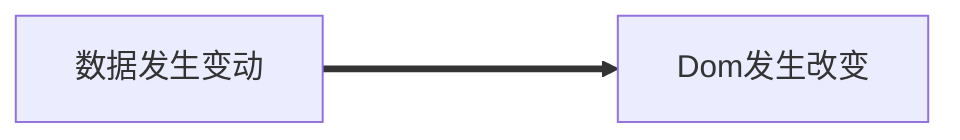
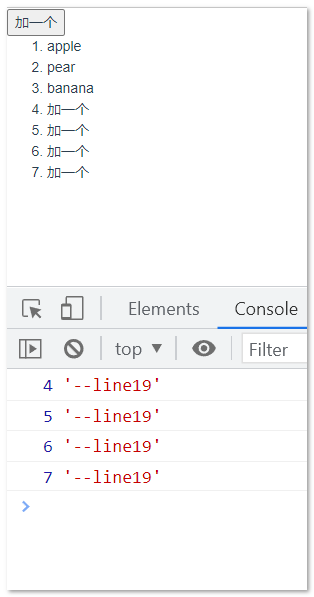

## 1. 这究竟是个什么问题 ？

在Vue 中， 视图的渲染是由数据驱动的， Vue 不鼓励我们直接去操作 Dom，它让我们仅关注业务层面的逻辑。

数据驱动视图，也就意味着：



但是， Dom 的更新渲染是一个异步的过程，这也就意味着，当你在修改可能会导致视图改变的数据后，如果立刻用同步代码去访问视图，那么由于视图的异步渲染问题。 在你访问Dom的时刻，Dom还没有完成更新渲染。 

这将导致，你只能访问到还未来得及更新的Dom。 如果这个访问过程是重复的，那么从表现上看，就像你始终在访问上一次的 Dom。 也就是 数据和视图 好像并不 “同步”。


而 `$nextTick()` ， 解决了什么问题呢 ？

`vm.nextTick`  又叫做异步更新队列。它的作用，就是将你对 Dom 的访问 延迟到下一轮视图更新完成后，再去执行，这样，就能解决上述的因为异步渲染导致的 Dom 访问问题了。

## 2. 什么时候需要注意到这个问题？

当你需要访问由数据驱动渲染的视图 Dom 的时候，你始终应该注意这个问题。 


## 3. 实验示例

以下是一个实验示例：

```html
<template>
  <div>
    <button @click="handleClick">加一个</button>
    <ol ref="ol">
      <li v-for="(item, index) in list" :key="index">{{ item }}</li>
    </ol>
  </div>
</template>
<script>
export default {
  data() {
    return {
      list: ["apple", "pear", "banana"],
    };
  },
  methods: {
    handleClick() {
      this.list.push("加一个");
      console.log(this.$refs.ol.childNodes.length, "--line19");
    },
  },
};
</script>

```


**nextTick**

```javascript
<template>
  <div>
    <button @click="handleClick">加一个</button>
    <ol ref="ol">
      <li v-for="(item, index) in list" :key="index">{{ item }}</li>
    </ol>
  </div>
</template>
<script>
export default {
  data() {
    return {
      list: ["apple", "pear", "banana"],
    };
  },
  methods: {
    handleClick() {
      this.list.push("加一个");
      this.$nextTick(() => {
        console.log(this.$refs.ol.childNodes.length, "--line19");
      });
    },
  },
};
</script>

```

