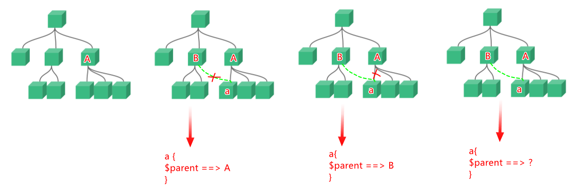
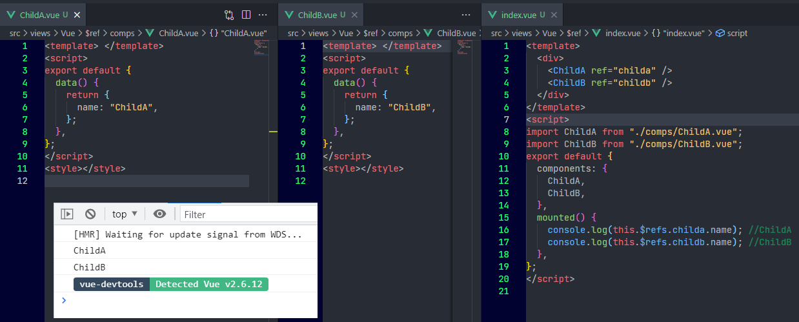
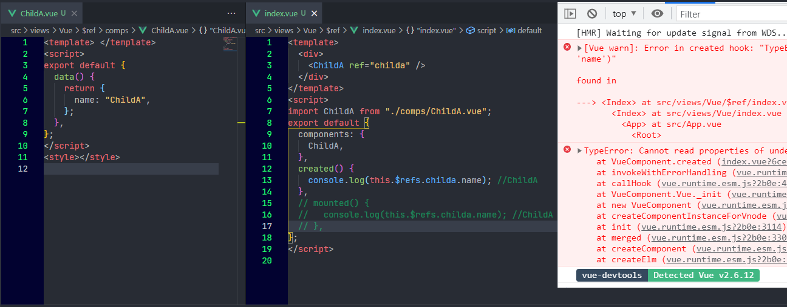
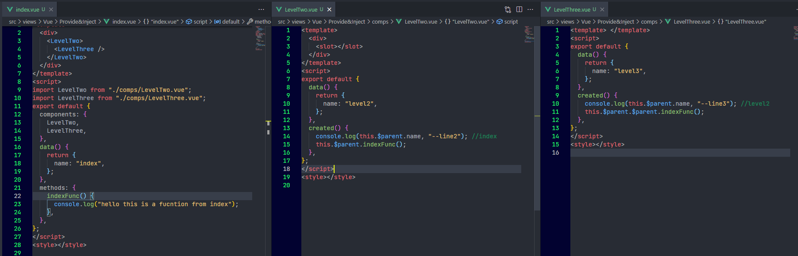

[toc]

## 1. `vm.$root`

### 1.1 描述

> 当前组件树的根 Vue 实例。如果当前实例没有父实例，此实例将会是其自己。

在Vue 中， 什么是一个组件树的根实例？ 实际上，通过Vue Devtools 能够很清楚的看到：


具体的，在代码中，Vue 项目的入口文件`main.js` 中，一般的会有这样的代码段：

```javascript
new Vue({
  router,
  store,
  render: (h) => h(App),
}).$mount("#app");
```

创建了一个Vue实例，并塞入了一些东西后，通过`$mount` 挂载到了`#app` 这个dom节点。 

实际上，和我们常用的组件化开发一样，我们也能在创建组件时（即便是根组件），也能够通过一个个工厂函数的形式，定义一些数据作为这个组件的动态属性值。 例如：

```javascript
new Vue({
  data() {
    return {
      name: "$root",
    };
  },
  router,
  store,
  render: (h) => h(App),
}).$mount("#app");
```

这样，你便能够在全局范围内，在组件树的任何一个节点，通过`vm.$root` 获取到这个根实例，也就能以`vm.$root.name` 的形式访问到我们定义的`name` 属性。 

### 1.2 能力

我们可以发现，这点很像一个中央数据管理对象， 类似localStorage，或者更加类似于store，或者Vuex。 没错，只是取决于项目的复杂度考虑，通常不会这样去使用。 但是如果项目本身比较小，而无需引入Vuex 的情况下。 我们可以考虑这样去实现需求。 

并且 ，由于`data` 对象中的所有的 property 都会被加入到 Vue 的**响应式系统**中， 这意味着，这个值的变化将会引起所有引用处的dom渲染更新。 即：

```javascript
<!--组件树中的任意组件a-->
vm.$root.name = "update name value!"
```

```vue
<!--组件树中的任意组件b-->
<template>
	{{$root.name}}
</template>
```

只要在组件树中，任意组件a中去修改`name`值，其他任意引用的组件都会自动更新。


## 2. `$parent` 和`$children`

### 2.1 描述

`$parent` 指代父实例，如果当前实例有的话。

而`$children`指代子实例，如果当前实例有的话。

**所不同的是，<u>也值得注意的</u>是这二者的类型不同，`$children`  的类型是 `Array<Vue instance>` ， 而 `$parent` 的类型是 `Vue instance`** 

一个组件可以有多个子组件，因此 `$children`  的类型是 `Array<Vue instance>` ， 这是易于理解的，但是，为什么  `$parent` 的类型是 `Vue instance`  而不是   `Array<Vue instance>` 呢？

一个组件不是也可以被多个组件引用吗？ 那父组件不是也应该有多个吗？，如果我们画一个图来理解：



其实，这个原因，文档中早有提及：

> 注意当点击按钮时，每个组件都会各自独立维护它的 `count`。因为你每用一次组件，就会有一个它的新**实例**被创建。[link](https://cn.vuejs.org/v2/guide/components.html#%E7%BB%84%E4%BB%B6%E7%9A%84%E5%A4%8D%E7%94%A8)

组件被复用时，为了不会相互影响，Vue 实际上在背后为我们创建了一个全新的实例。 

以下是一个验证demo:


### 2.2 能力

通过这两个属性，我们能够在两个嵌套关系的组件中，轻松的从子组件访问父组件实例，或者从父组件访问子组件实例。 

## 3. 通过`$ref` 访问子组件实例或者元素

### 3.1描述：

通过`ref` 给一个子组件标记一个"id", 然后当子组件挂载后，便可以通过`$ref.refname` 的形式访问到对应的子组件实例。

> 在项目开发中，这是一个常使用的子组件实例访问方式。

以下是一个使用示例。 



### 3.2 能力

通过`$refs` ，vue又给了我们一种访问组件实例的能力，在一定场景下灵活运用，能极大的方便我们的开发过程。 

### 3.3 注意点

1. **要注意使用的所在生命周期**

   在使用ref这种方式时，你特别需要注意的是，你仅能在该组件挂载完毕后才能访问到该组件实例，所有在使用时，你需要确保组件已经挂载的情况下，再使用。

   一般来说，父子组件的`created` 和 `mounted` 声明周期通常是这样的：
   `父组件 created --> 子组件 created --> 子组件 mounted --> 父组件mounted`

   这意味着，如果你不加以注意的在父组件的`created` 声明周期钩子种去通过ref 访问子组件实例，是不会成功的：

   

   > 如果你尝试通过ref 访问一个根元素上有`v-if` 的组件元素，通常是会遇到一些问题的。 因为一些场景下，`v-if` 的接入会导致上面提到的常规父子生命周期钩子的执行顺序失常。 为了解决该问题，通常你可以利用`$nextTick` 。 

2. 不要依赖ref实现响应式

   > `$refs` 只会在组件渲染完成之后生效，并且它们不是响应式的。这仅作为一个用于直接操作子组件的“逃生舱”——你应该避免在模板或计算属性中访问 `$refs`。

   例如，这样是不能预期运行的：

   

## 4. 依赖注入

### 4.1 描述

假如，有一个多级嵌套的组件，而你需要在最内部去调用最外层组件的方法，你会怎么办？ 先不考虑这样的组件是否合适，也不考虑更好的抽离方法。

那么，首先容易想到的是，我们首先要获取到这个最外层的组件的实例，才能去调用最外层组件中methods 对象中定义的方法。 

前面我们刚提到过`$parent`可以获取到父组件的实例。 那么如果层级比较浅还好，我们通过 `this.$parent.$parent.....xxxfunc()` 这样的"链式访问"就能达到目的了。 

但是显然，这是不利于维护的。 也是不太聪明的。 

因为一旦你中间需要多嵌套一级组件，那么你就需要对刚才的”链式访问加一个`$parent`“。

为了说的更加清楚，我们写一个简单的demo复现一下这种场景：


简单说明一下，在`index.vue`中，我们引入了`LevelTwo` 和 `LevelThree` 两个组件，并且写作了嵌套的形式。

> 之所以能写作嵌套的形式，是利用了`<slot>` ,如果你对这里不太清楚，请回顾前面的插槽内容。这里只提一点：
> 如果`LevelTwo` 组件定义中，**没有**包含一个 `<slot>` 元素，则该组件`<LevelTwo>`起始标签和`</LevelTwo>`结束标签之间的任何内容都会被抛弃。

这样，就构成了一个三级嵌套的组件层级关系。即：

```bash
<index>
	└── <LevelTwo>
   			 └── <LevelThree>
```

那么，我们在`<LevelTwo>` 中去调用时，就是这样去调用的：

```javascript
this.$parent.indexFunc();
```

同理，在`<LevelThree>`，是这样调用的：

```javascript
this.$parent.$parent.indexFunc();
```

如果，嵌套层级更深会很不方便，且一旦有层级上的改动，这里都要动。 


### 4.2 通过依赖注入，解决特定场景下的问题

首先，这种场景并不常见。 因为一般有公共方法，我们第一想法应该是把它抽离出去。然后在需要使用的地方去引入。那么这里vue,也为这种特定场景，提供了解决方案，那就是 依赖注入。 

其实，易于理解，我们把子组件中可能用到的方法，通过某种方式给他**"注册"**一下。

然后在需要用到该方法的子组件中，去**"引入"**一下。

我们直接通过示例认识一下用法：


【简单描述】：

Vue 为我们提供两个新的实例选项：`provide` 和 `inject`。

`provide` 选项允许我们指定我们想要**提供**给后代组件的数据/方法。也就是我们刚才提到的**"注册"**

```javascript
provide: function() {
    return {
        indexFunc: this.indexFunc,
    };
},
```

然后在需要用到的所有子组件中，通过`inject` "注入" `provide` 的数据/方法， 也就是我们刚才提到的**"引入"**

最后，直接通过`this.indexFunc()` 就可以成功调用了。

这就是依赖注入。

> vue 文档上用的示例是google map , 对国内用户确实不太友好，因为假如你想写个google map 的demo ， 你还得搞到google map 开发的key才行 - -
