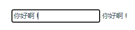
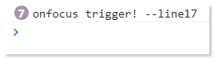
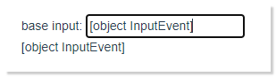

[toc]

## 1.准备：先封装一个最基本的input组件

按照先前讲到的自定义v-model，我们可以轻松完成一个具备双向绑定的input元素：

```javascript
<template>
<div>
  <BaseInput v-model="value"/>
  <br/>
  {{value}}
</div>
</template>
<script>
import BaseInput from "../originEvent/comps/BaseInput.vue"
export default {
  components: {
    BaseInput
  },
  data() {
    return {
      value:'init value'
    }
  }
}
</script>
```

```javascript
<template>
    <input name="inputele" :value="value" type="text" @input="$emit('input',$event.target.value)">
</template>
<script>
export default {
  props:['value']
};
</script>
```

现在它看起来就像这样：



> 如果对自定义v-model 存在问题，可以参考先这篇文章 [《[Vue深入组件]:v-model语法糖与自定义v-model》](https://www.cnblogs.com/jaycethanks/p/15182919.html)


## 2. 利用`.native` 修饰符，给自定义组件绑定一个`focus`事件

假如，我们现在需要当鼠标聚焦到输入框时，触发某些操作。我们当然需要绑定一个`focus` 事件， vue已经为我们提供了`@focus` 。其用法如：`<input @focus/>` 

既然是封装组件，我们现在需要将这个事件绑定在我们的自定义元素`<BaseInput/>`上面 ,就像这样：

```javascript
<template>
  <div>
    <BaseInput v-model="value" @focus="onFocus" />
    <br />
    {{value}}
  </div>
</template>
<script>
import BaseInput from "../originEvent/comps/BaseInput.vue"
export default {
  components: {
    BaseInput
  },
  data() {
    return {
      value: 'init value'
    }
  },
  methods: {
    onFocus() {
      console.log("onfocus trigger!", '--line17');
    }
  }
}
</script>
```

可以预料到的是，它并不会生效。 


这时候，vue为我们解决了这种情况，直接给`@focus` 加上一个`.native`修饰符就好了。就像这样。

```javascript
  <BaseInput v-model="message" @focus.native="onFocus"/>
```

这样，在你每次鼠标聚焦到输入框，就会触发我们预定义的`onFocus` method。




至此，如果你想知道`.native` 究竟是干什么用的，到这里就可以了。


## 3. 提出问题

不难发现，上面我们自定义的这个组件，实在是太过于简单了，自定义组件`<BaseInput/>`的根元素，就是一个简单的`<input/>` 。 但是我们日常工作中，基本上不会去做这种没有多大意义的封装。 如果，这个`<input/>`元素，并不是自定义组件的根元素，那么`.native`修饰符，还能生效吗？为了验证想法，我们对自定义组件套上一个label 试一试：

```javascript
<template>
  <label for="inputele">
    base input:
    <input name="inputele" :value="value" type="text" @input="$emit('input',$event.target.value)">
  </label>
</template>
<script>
export default {
  props: ['value']
};
</script>
```

父组件依旧不变：

```javascript
<template>
  <div>
    <BaseInput v-model="value" @focus.native="onFocus" />
    <br />
    {{value}}
  </div>
</template>
<script>
import BaseInput from "../originEvent/comps/BaseInput.vue"
export default {
  components: {
    BaseInput
  },
  data() {
    return {
      value: 'init value'
    }
  },
  methods: {
    onFocus() {
      console.log("onfocus trigger!", '--line17');
    }
  }
}
</script>
```


此时，会发现，确实失效了。 `onFocus` method 不会再被触发。 


## 4. 解决问题

实际上，Vue 文档中，也为我们提供了解决方案。 那就是`$listeners` 这个实例property。

我们先直观的来看一看，这个实例property是什么, 在自定义组件的`created()` 生命周期函数中，我们尝试打印看看：


可以看到，它收集了所有作用于当前组件的**事件监听器**

```javascript
<BaseInput v-model="message" @focus="onFocus" />
```

你可能不明白这个`input`从哪里来， 这是因为他被`v-model` 语法糖覆盖掉了。如果对此存在疑问还是请参考这篇文章[link](https://www.cnblogs.com/jaycethanks/p/15182919.html)。


我们现在知道了有这些事件，但是，我们怎么让这些对应的`<input/>`元素去监听这些事件呢？

<span style="color:#f40">**【拓展:】**</span>

这里涉及到一个新的知识点，文档中并未发现有单独提及，而是在执行报错时发现的。 

我们在之前的学习中，基础部分知道，vue为我们提供了一写常见的DOM监听事件，其中用的最多的就是`v-on:click` === `@click`, `v-on:change`===`@change`,`v-on:focus` ===`@focus`

但是，实际上，`v-on` 还能够绑定一个监听事件集合（包含一系列监听事件的对象）， 即刚才提到的 `$listeners` 是可以直接被绑定的。 

由此， 我们尝试在自定义组件中，显式的指明`<input/>` 元素，监听`$listeners`中的所有事件。 

```javascript
<template>
  <label for="inputele">
    base input:
    <input name="inputele" :value="value" type="text" @input="$emit('input',$event.target.value)" v-on="$listeners">
  </label>
</template>
<script>
export default {
  props: ['value']
};
</script>
```

但是你会发现，现在的情况变得有些怪异：



不仅仅`focus` 事件没有生效，且原先的双向绑定也失效了。 


## 5. 问题的进一步解决

为什么会出现这个奇怪的问题?

我们再看一下这个自定义组件内部：

```javascript
    <input name="inputele" :value="value" type="text" @input="$emit('input',$event.target.value)" v-on="$listeners">
```

可以看到，绑定了一个监听事件`@input` （即`v-on:input`）,

此外，还绑定了`$listeners`,而我们刚才说了，它实际上是一个监听事件集合，我们刚才也打印了，它现在里面有两个事件：

```javascript
{
  focus: function (event) { /* ... */ }
  input: function (value) { /* ... */ },
}
```

这也就意味着现在这个`<input/>` 元素上绑定了三个事件，其中有两个重复的。 应该是这里导致的问题。 


为了解决这个问题就需要将监听事件对象做“去重”处理。

**有三种方式：**

1. 将`$listeners` 中重复的`input` 监听事件剔除，然后分别绑定只有一个`focus`事件的`$listeners` 集合，以及`@input`事件（也就是保持这部分不变）
2. 将`$listeners` 中的`focus` 事件单独取出，单独绑定。
3. 将单独的`@input` 合并到`$listeners` 然后只绑定`$listeners` 这个监听事件集合。


> 以下方式，父组件都是相同的，且注意需要去除掉之前添加的`.native`修饰符。即
>
> ```javascript
> <template>
>   <div>
>     <BaseInput v-model="value" @focus="onFocus" />
>     <br />
>     {{value}}
>   </div>
> </template>
> <script>
> import BaseInput from "../originEvent/comps/BaseInput.vue"
> export default {
>   components: {
>     BaseInput
>   },
>   data() {
>     return {
>       value: 'init value'
>     }
>   },
>   methods: {
>     onFocus() {
>       console.log("onfocus trigger!", '--line17');
>     }
>   }
> }
> </script>
> ```

### 方式1[不推荐]：“剔除”

这种方式，其实是不推荐的，因为修改了`$listeners` 这个通用的实例property, 不能保证后期代码的维护。这里为了证明可行性，所以同样尝试实现。 

```javascript
<template>
  <label for="inputele">
    base input:
    <input name="inputele" :value="value" type="text" @input="$emit('input',$event.target.value)" v-on="focusListener">
  </label>
</template>
<script>
export default {
  props: ['value'],
  computed:{
    focusListener:function(){
      delete this.$listeners.input;
      return this.$listeners;
    }
  }
};
</script>
```

### 方式2[推荐★]：“单独取出”

这种方式其实和第一种方式是类似的，不同点在于这种方式并不会影响`$listeners` 在后期的使用。 这种方式可以被使用，但是从html元素上的可读性考虑，不作首要推荐。

```javascript
<template>
  <label for="inputele">
    base input:
    <input name="inputele" :value="value" type="text" @input="$emit('input',$event.target.value)" v-on="focusListener">
  </label>
</template>
<script>
export default {
  props: ['value'],
  computed: {
    focusListener: function () {
      return { focus: this.$listeners.focus };//不到参数的v-on 目标，须是一个Object
    }
  }
};
</script>
```

### 方式3[推荐★★★]：“合并”

这种方式也是文档中的实例方式。推荐，因为它并不影响`$listeners` 在后期的使用。

```javascript
<template>
  <label for="inputele">
    base input:
    <input name="inputele" :value="value" type="text" v-on="inputListenersObj">
  </label>
</template>
<script>
export default {
  props: ['value'],
  computed: {
    inputListenersObj: function () {
      let _this = this;
      return Object.assign({},_this.$listeners,{
        input:function(e){
          _this.$emit('input',e.target.value)
        }
      })
    }
  }
};
</script>
```

