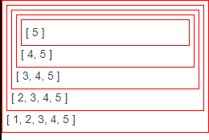
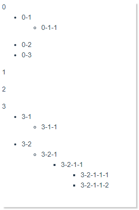

[toc]

## 1. 组件的递归

如果期望你有以下实现：


这是一个嵌套了很多层的组件，你会有什么样的思路？


### 1.1 递归组件

Vue 允许我们递归的调用一个组件，即在一个组件内部不断的嵌套调用自身。

为了实现组件的递归，Vue 要求我们必须指定组件的 `name` 属性。 

此外，必须给渲染加上条件判断，在适当的时刻停止调用。 

我们以实现如上的demo为目的，认识一下Vue中递归组件是如何使用的。 

```javascript
//上层组件（调用根父组件）
<template>
  <div style="width:100%;height:100%">
    <BoxRecursion />
  </div>
</template>
<script>
import BoxRecursion from "./comps/BoxRecursion.vue";
export default {
  components: {
    BoxRecursion,
  },
  created() {
    localStorage.setItem("key", 0);
  },
};
</script>
```

这是我们在一个组件中对即将嵌套的组件的首次调用。

为了有一个合适的判断条件，我们通过localStorage 设定了一个全局可访问的变量值`key`， 并给定初始值为`0` ， 接着，预期每当一次渲染就让这个`key` 值加一，并在达到一定值后停止渲染。 （你可以用任何其他的方式达成相同的目的，如store,vuex,eventBus,$root...）

一下是嵌套组件本身的实现：

```javascript
//嵌套组件本身
<template>
  <div class="box">
    <BoxRecursion v-if="count <= 50" />
  </div>
</template>
<script>
export default {
  name: "BoxRecursion",
  data() {
    return {
      count: 0,
    };
  },
  created() {
    let a, b;
    a = localStorage.getItem("key");//获取key值
    b = a * 1;//转换为Number 类型
    b++;//加一操作
    localStorage.setItem("key", b);//重新set key值
    this.count = b;
  },
};
</script>
<style>
.box {
  width: 100%;
  height: 100%;
  padding: 5px;
  border: 1px solid red;
}
</style>
```

可以看到，我们定义了一个简单的`BoxRecursion` 组件，其内容就是一个空的class=box的div元素，此外什么都没有。为了比较明显的看出嵌套效果，我们写了简单的基本样式。 

**值得注意的是，我们给定了`name` 属性，即当前组件的名称。** 

紧接着，我们**直接**在`BoxRecursion`组件内部，dom中写了`<BoxRecursion/>`

最重要的，我们通过`v-if` 对渲染进行了条件控制，这样，就能在达到条件是停止渲染。 以免发生栈溢出。

这上面的过程中，还有一个最重要的点，就是怎么判断`v-if` 条件，以控制渲染。

以上示例中，我们通过一个全局的变量的自增来达到目的的。 在实际工作中，应当灵活处理。 

### 1.2 递归组件 - 拓展示例1 ： 递归渲染扁平数组

例如，你可能会递归的去渲染一个一维数组？

```javascript
//index
<template>
  <div style="width:100%;height:100%">
    <BoxRecursion :arr="arr" />
  </div>
</template>
<script>
import BoxRecursion from "./comps/BoxRecursion.vue";
export default {
  components: {
    BoxRecursion,
  },
  data() {
    return {
      arr: [1, 2, 3, 4, 5],
    };
  },
};
</script>
```

```javascript
//BoxRecursion
<template>
  <div class="box">
    <BoxRecursion :arr="propArr" v-if="propArr.length != 0" />
    {{ arr }}
  </div>
</template>
<script>
export default {
  name: "BoxRecursion",
  props: ["arr"],
  computed: {
    propArr: function() {
      return this.arr.slice(1, this.arr.length);
    },
  },
};
</script>
<style>
.box {
  width: 100%;
  height: 100%;
  padding: 5px;
  border: 1px solid red;
}
</style>
```

看起来，就像这样：



### 1.3 递归组件 - 拓展示例2 ： 递归渲染Tree型数组

最常见的树形数据结构，就是文件目录了，以linux上的tree命令就是一个很好的例子：

```bash
jayce@LAPTOP-0CA0HBLH:Vue$ tree
.
├── $parent
│   ├── comps
│   │   ├── ChildA.vue
│   │   ├── ChildB.vue
│   │   └── ComSubChild.vue
│   └── index.vue
├── $ref
│   ├── comps
│   │   ├── ChildA.vue
│   │   └── ChildB.vue
│   └── index.vue
.............
```

利用递归组件，我们也能够简单实现一个展示一个tree数据结构的组件：

```javascript
//index.vue
<template>
  <div style="width:100%;height:100%">
    <BoxRecursion :dirlist="dirlist" />
  </div>
</template>
<script>
import BoxRecursion from "./comps/BoxRecursion.vue";
export default {
  components: {
    BoxRecursion,
  },
  data() {
    return {
      dirlist: [
        // 为了文章阅读体验，请在下方点击展开查看数据代码
      ],
    };
  },
};
</script>
```

<details>
<summary>点击查看展开dirlist数据</summary>
<pre>
<code>
dirlist: [
  {
    path: "0",
    child: [
      {
        path: "0-1",
        child: [
          {
            path: "0-1-1",
          },
        ],
      },
      {
        path: "0-2",
        child: [
          {
            path: "0-2-1",
          },
        ],
      },
      {
        path: "0-3",
      },
    ],
  },
  {
    path: "1",
  },
  {
    path: "2",
  },
  {
    path: "3",
    child: [
      {
        path: "3-1",
        child: [
          {
            path: "3-1-1",
          },
        ],
      },
      {
        path: "3-2",
        child: [
          {
            path: "3-2-1",
            child: [
              {
                path: "3-2-1-1",
                child: [
                  {
                    path: "3-2-1-1-1",
                  },
                  {
                    path: "3-2-1-1-2",
                  },
                ],
              },
            ],
          },
        ],
      },
    ],
  },
],
</code>
</pre>
</details>

```javascript
//递归组件 BoxRecursion.vue
<template>
  <div class="box">
    <details open v-for="(item, index) in dirlist" :key="index">
      <summary :style="{ color: item.child ? '#1890ff' : 'grey' }">{{
        item.path
      }}</summary>
      <template v-if="item.child && item.child.length">
        <BoxRecursion :dirlist="item.child" />
      </template>
    </details>
  </div>
</template>
<script>
export default {
  name: "BoxRecursion",
  props: ["dirlist"],
};
</script>
```

最终你将得到如下实现：


## 2. 组件的循环调用

以上示例中，即拓展示例2 ，实际上我们只通过了一个组件就完成了tree结构数据的递归调用组件。思路也很简单，传入一个初始化数组，然后取每一个对象元素中的`path` 属性，先渲染。 然后在加一个条件判断，当前对象是否存在子列表，如果存在，就嵌套调用。 在下一轮循环中，同样的规则，直到没有嵌套的列表才停止嵌套调用。 

实际工作中，可能会存在更加复杂的需求。可能出于维护，或者其他一些原因。 需要你把**根父节点**内容的渲染写在一个组件中，把**子节点**的内容写在另一个组件中，然后循环的互相调用，以完成组件的嵌套调用。 

所以，我们尝试将刚才同样的数据内容，抽离成两个相互调用的组件，加以实现。 

```javascript
//根父节点组件index.vue
<template>
  <div>
    <p v-for="(folder, index) in list" :key="index">
      <span>{{ folder.path }}</span>
      <tree-folder-contents v-if="folder.child" :children="folder.child" />
    </p>
  </div>
</template>
<script>
export default {
  name: "tree-folder",
  props: ["folderList"],
  components: {
    TreeFolderContents: () => import("./comps/TreeFolderContents.vue"),
  },
  created() {
    if (this.folderList) {
      //第一层时:folderList为undefined
      this.list = this.folderList;
    }
  },
  data() {
    return {
		//....拓展示例2相同的数据....
    };
  },
};
</script>

```

```javascript
//子节点组件TreeFolderContents

<template>
  <ul>
    <li v-for="(item, index) in children" :key="index">
      <tree-folder v-if="item.child" :folderList="[item]" />
      <span v-else>{{ item.path }}</span>
    </li>
  </ul>
</template>
<script>
import TreeFolder from "../index.vue";
export default {
  props: ["children"],
  name: "tree-folder-contents",
  components: {
    TreeFolder,
    // TreeFolder: () => import("../index.vue"),
  },
};
</script>
```

它的实现效果如下：



你特别需要值得注意的有这样几点：

1. 这两个组件时互相调用的

2. **这两个组件在引入注册的时候，须至少有一个是懒加载的。** 还有别的解决方案，见Vue 相关文档。 

   > 相关说明如下（但是这里我还没有特别清楚究竟为什么能这样被解决）
   >
   > ”我们先把两个组件称为 A 和 B。模块系统发现它需要 A，但是首先 A 依赖 B，但是 B 又依赖 A，但是 A 又依赖 B，如此往复。这变成了一个循环，不知道如何不经过其中一个组件而完全解析出另一个组件。为了解决这个问题，我们需要给模块系统一个点，在那里“A *反正*是需要 B 的，但是我们不需要先解析 B。”
   >
   > ”在我们的例子中，把 `<tree-folder>` 组件设为了那个点。我们知道那个产生悖论的子组件是 `<tree-folder-contents> `组件，所以我们会等到生命周期钩子 beforeCreate 时去注册它：“
   >
   > ```javascript
   > beforeCreate: function () { this.$options.components.TreeFolderContents = require('./tree-folder-contents.vue').default }
   > ```
   >
   > 或者，在本地注册组件的时候，你可以使用 webpack 的异步 `import`：
   >
   > ```javascript
   > components: {
   >   TreeFolderContents: () => import('./tree-folder-contents.vue')
   > }
   > ```
   >
   > 这样问题就解决了！ 摘自[link](https://cn.vuejs.org/v2/guide/components-edge-cases.html#%E7%BB%84%E4%BB%B6%E4%B9%8B%E9%97%B4%E7%9A%84%E5%BE%AA%E7%8E%AF%E5%BC%95%E7%94%A8)

   > 另： 两个组件循环调用，有些难度，我在调试这个demo的时候，有时候一个细节错了，调半天。 - - 西吧~~~
   >
   > 所以，要想能活用，首先得熟练，要多看看。
