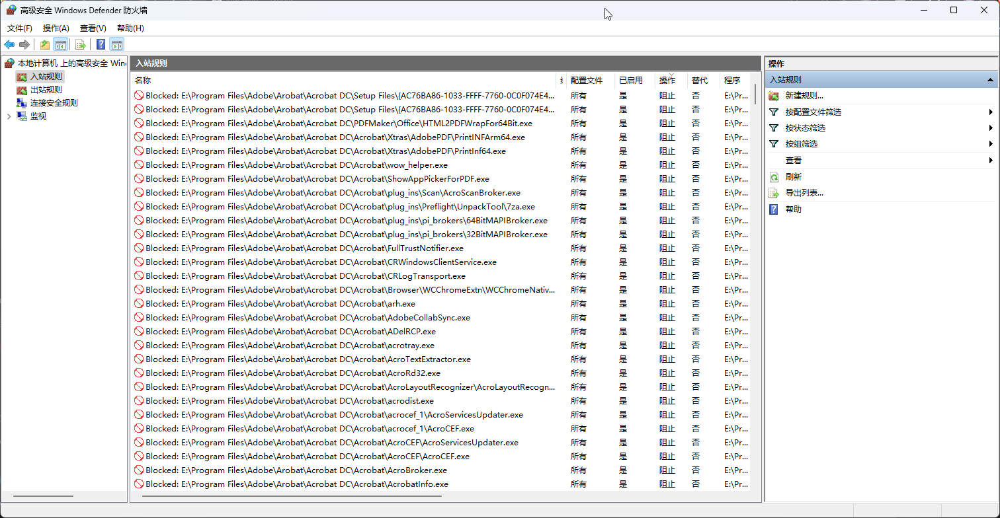

## 新建防火墙出入网批处理文件

分别在 Adobe 软件的安装位置，例如：`E:\Program Files\Adobe` 根目录下， 和 Adobe 程序公共目录下：`C:\Program Files\Common Files\Adobe` 创建两个文件(文件名任意)：

**bounded_script.bat**

```bat
@ setlocal enableextensions
@ cd /d "%~dp0"

for /R %%f in (*.exe) do (
  netsh advfirewall firewall add rule name="Blocked: %%f" dir=out program="%%f" action=block
  netsh advfirewall firewall add rule name="Blocked: %%f" dir=in program="%%f" action=block
)
pause
```

**unbounded_script.bat**

```bat
@ setlocal enableextensions
@ cd /d "%~dp0"

for /R %%f in (*.exe) do (
  netsh advfirewall firewall add rule name="Blocked: %%f" dir=out program="%%f" action=allow
  netsh advfirewall firewall add rule name="Blocked: %%f" dir=in program="%%f" action=allow
)
pause
```

这两个批处理文件分别会递归的将所有子目录下的` .exe` 扩展文件 加入 出站/入站 网络防火墙规则。 `bounded_script.bat` 是禁用， `unbounded_script.bat` 是删除配置的规则。

如果你对某些目录没有权限导致无法通过右键创建文件，可以使用超级管理员身份启动 Powershell 创建文件。

```powershell
# 超级管理员 powershell

New-Item -ItemType File -Path "C:\Program Files\Common Files\Adobe\bounded_script.bat"
New-Item -ItemType File -Path "C:\Program Files\Common Files\Adobe\unbounded_script.bat"

# 注意：这里的 E:\Program Files\Adobe 应该替换为你自己的安装目录
New-Item -ItemType File -Path "E:\Program Files\Adobe\bounded_script.bat"
New-Item -ItemType File -Path "E:\Program Files\Adobe\unbounded_script.bat"
```

写入文件内容保存后，右键 管理员运行 `bounded_scritpt.bat` 文件。

你可以在防火墙 - 高级设置 中验证禁用规则。


