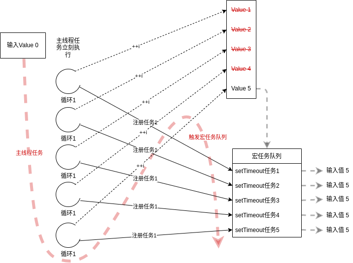

### 对这个经典问题做一个阐述，作为笔记补充

在 let 出现之前,for 循环定义的迭代变量会渗透到循环体外部:

```js
for (var i = 0; i < 5; ++i) {
// 循环逻辑
}
console.log(i) // 5
```

改成使用 let 之后,这个问题就消失了,因为迭代变量的作用域仅限于 for 循环块内部:

```js
for (let i = 0; i < 5; ++i) {
// 循环逻辑
}
console.log(i) // ReferenceError: i 没有定义
```

<span style="color:red">在使用 var 的时候,最常见的问题就是对迭代变量的奇特声明和修改:</span>

```js
for (var i = 0; i < 5; ++i) {
  setTimeout(() => console.log(i), 0)
}
// 你可能以为会输出 0、1、2、3、4
// 实际上会输出 5、5、5、5、5
```

之所以会这样,是因为在退出循环时,迭代变量保存的是导致循环退出的值:5。在之后执行超时
逻辑时,所有的 i 都是同一个变量,因而输出的都是同一个最终值。
而在使用 let 声明迭代变量时,JavaScript 引擎在后台会为每个迭代循环声明一个新的迭代变量。
每个 setTimeout 引用的都是不同的变量实例,所以 console.log 输出的是我们期望的值,也就是循
环执行过程中每个迭代变量的值。
图解如下：


```js
for (let i = 0; i < 5; ++i) {
  setTimeout(() => console.log(i), 0)
}
// 会输出 0、1、2、3、4
```

这种每次迭代声明一个独立变量实例的行为适用于所有风格的 for 循环,包括 for-in 和 for-of
循环。

那么在 let， const 新特性被支持之前，这个问题是如何被解决的呢？

```javascript
for (let i = 0; i < 10; i++) {
  !(function (i) {
    setTimeout(() => {
      console.log('[j]: ', i)
    }, 0)
  }(i))
}
```

我们可以看看 babel 将其转换为 es5 代码是什么样的？

```javascript
// es6
for (let i = 0; i < 10; i++) {
  setTimeout(() => {
    console.log('[i]: ', i)
  }, 0)
}
```

```javascript
// es5
'use strict'
function _loop_1(i) {
  setTimeout(() => {
    console.log('[i]: ', i)
  }, 0)
}
for (let i = 0; i < 10; i++) {
  _loop_1(i)
}
```

可以看到这里利用了闭包的思想，将状态 i 传入，内部保持对引用。
