Windows 11 没有使用密码保护文件夹的功能，因为该帐户已受到您的配置文件凭据的保护（如果您使用 BitLocker，则还会进行加密）。但是，您可以使用虚拟驱动器和 BitLocker 功能创建带有密码的安全驱动器，其工作方式与受密码保护的文件夹类似。

## 创建虚拟驱动器作为文件夹

要创建将充当受密码保护的文件夹的虚拟驱动器，请使用以下步骤：

1. 打开 **设置**。
2. 单击 **“系统”**。
3. 单击 右侧的**“存储”页面。**
4. 单击 “存储管理”部分下的**“高级存储设置” 。**
5. 单击 **磁盘和卷** 设置。

1. 单击 **创建 VHD** 按钮。

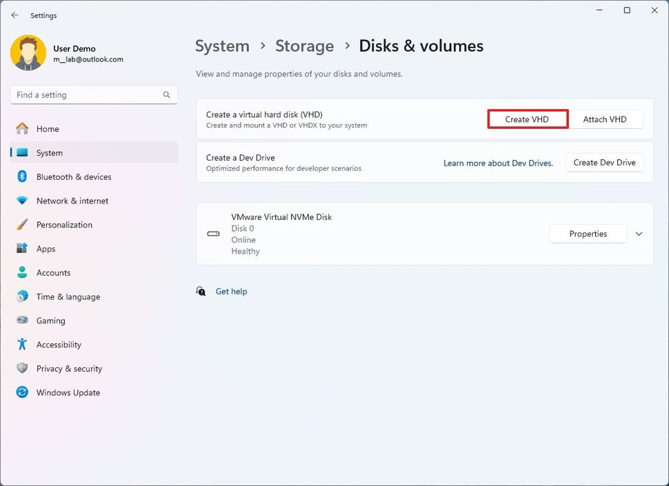

1. 为虚拟驱动器选择一个描述性名称。
2. 单击**浏览**按钮。
3. 指定存储虚拟驱动器的位置。
4. 确认驱动器大小（以 GB 为单位）。例如，10GB。
5. 选择 **VHDX** 选项。
6. 选择 **动态扩展** 选项。

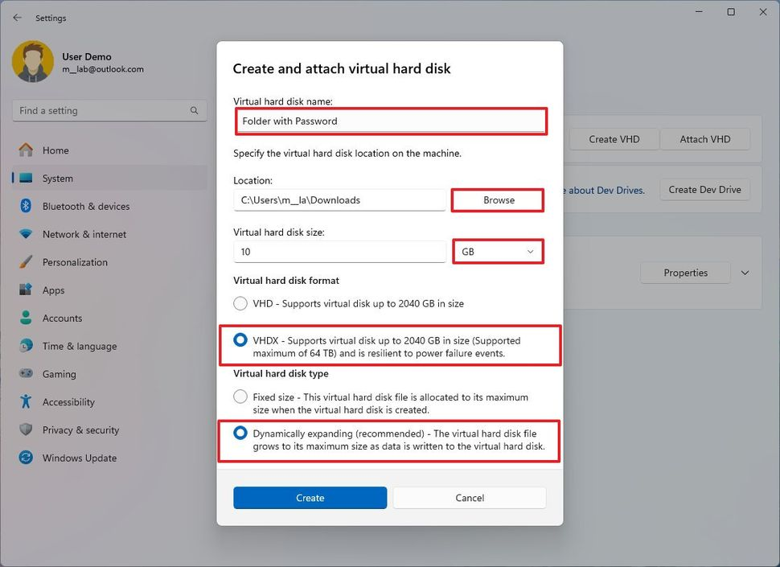

1. 单击**创建**按钮。
2. 选择 **“GPT（GUID 分区表）”** 选项。

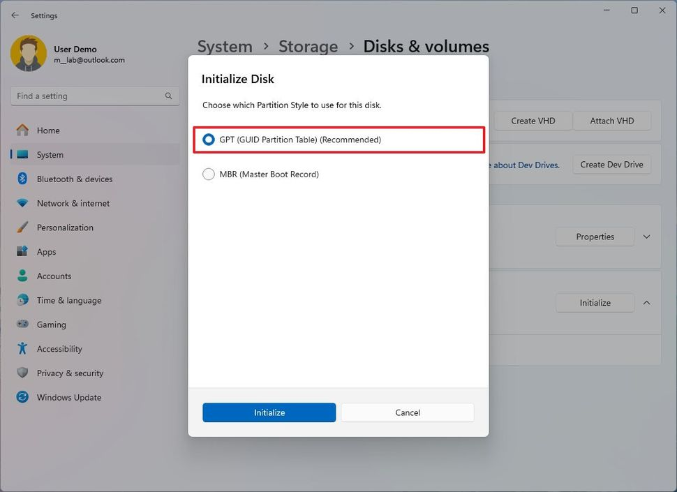

1. 单击 **初始化** 按钮。
2. 确认虚拟驱动器的标签，因为您希望它显示在文件资源管理器上。
3. 选择您想要在系统中显示的驱动器号。
4. 在“文件系统”设置中选择 **“NTFS” 选项。**
5. 单击 **格式** 按钮。

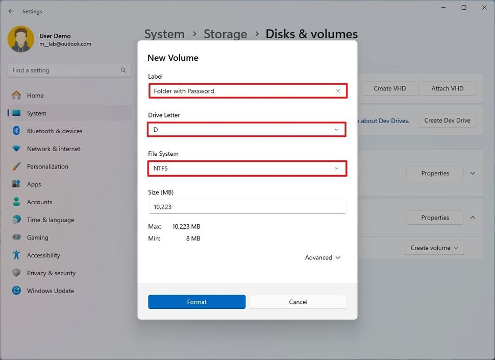

完成这些步骤后，将创建虚拟驱动器，您现在可以将其用作文件夹，通过使用 BitLocker 对其进行加密来安全地存储文件。

## 使用 BitLocker 密码保护文件夹

要在 Windows 11 上设置 BitLocker 以使用密码保护驱动器，请使用以下步骤：

1. 打开 **设置**。
2. 单击 **“系统”**。
3. 单击 右侧的**“存储”页面。**
4. 单击“存储管理”部分下的**“高级存储设置” 。**
5. 单击**“磁盘和卷”**设置。

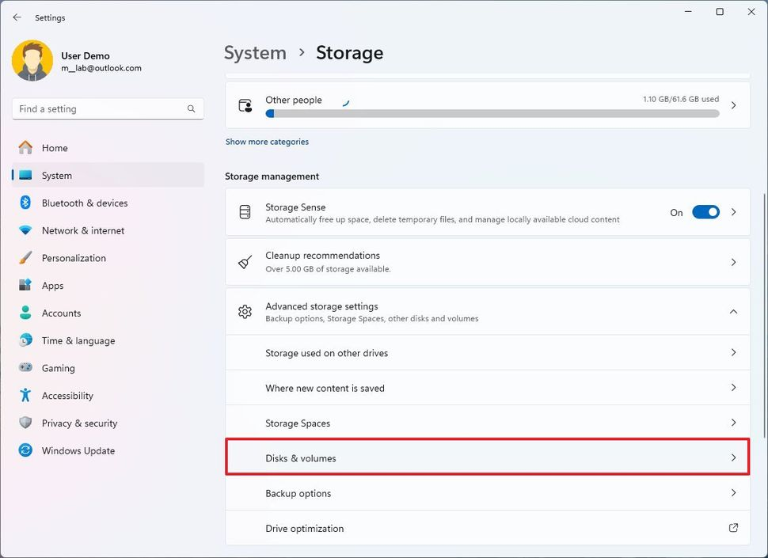

1. 选择虚拟驱动器的卷，然后单击**“属性”**按钮。

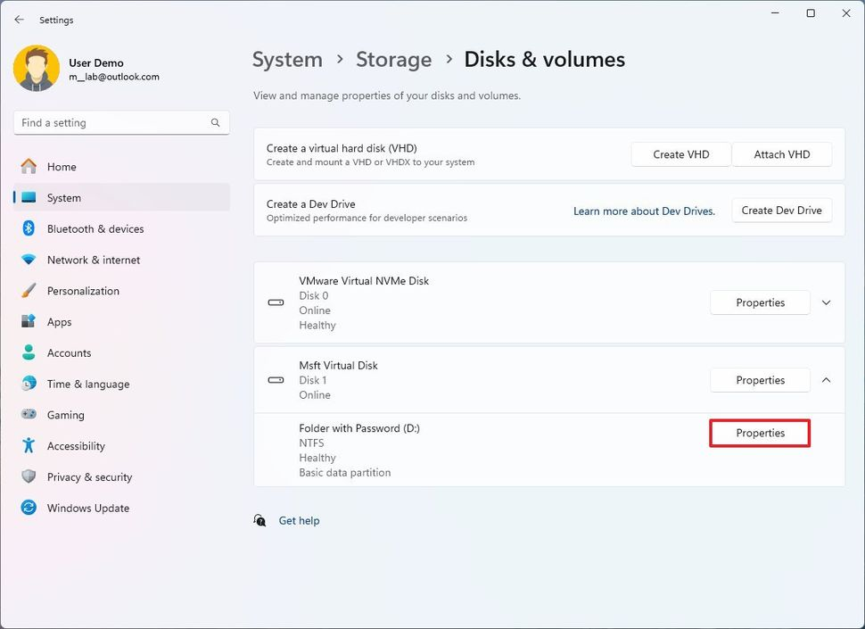

1. 单击页面底部的**“打开 BitLocker”选项。**

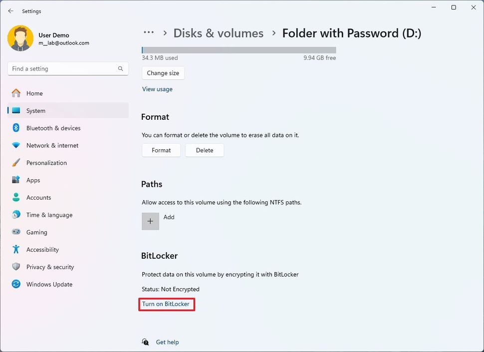

1. 在“固定数据驱动器”部分下选择保管库驱动器
2. 单击 **“打开 BitLocker”** 选项。

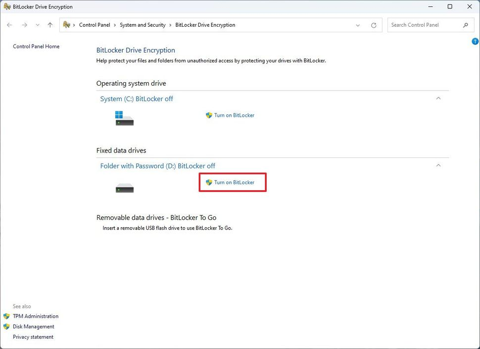

1. 选中 **“使用密码解锁驱动器”** 选项。
2. 创建密码来保护驱动器内的文件夹。

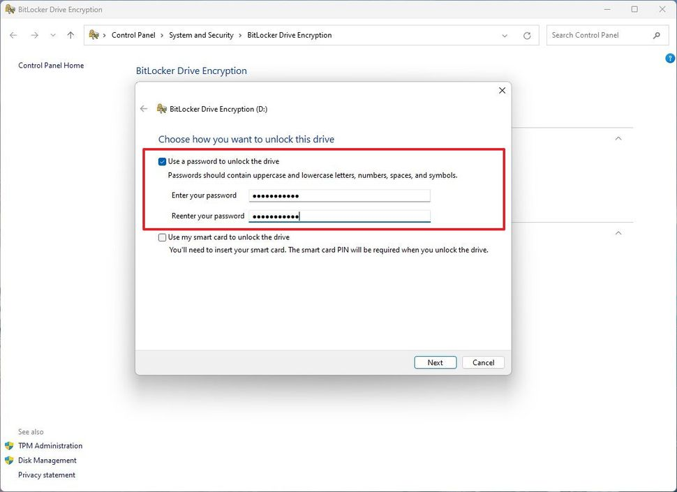

1. 单击 **下一步** 按钮。
2. 选择 **“保存到您的 Microsoft 帐户”** 选项。 

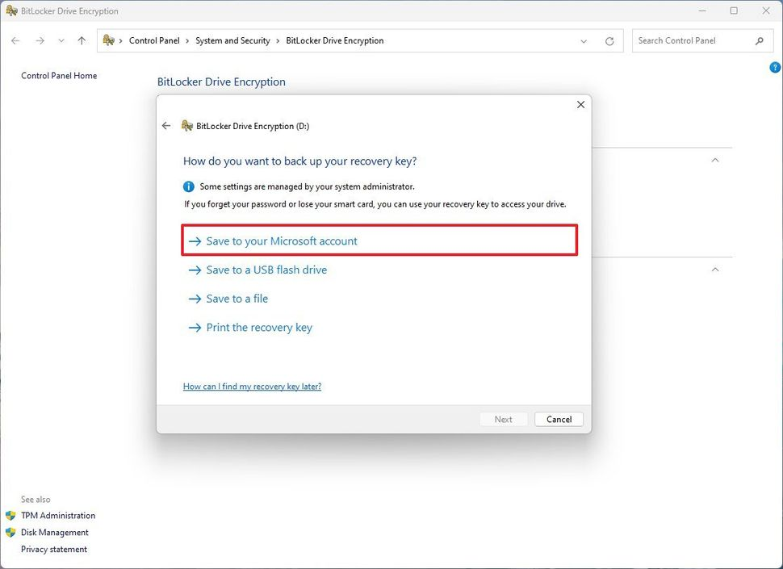

- **小提示：** 使用 Microsoft 帐户是最方便的选择。但是，您可以选择任何其他可用选项。

1. 单击 **下一步** 按钮。
2. 选择 **“仅加密已用磁盘空间”** 选项。

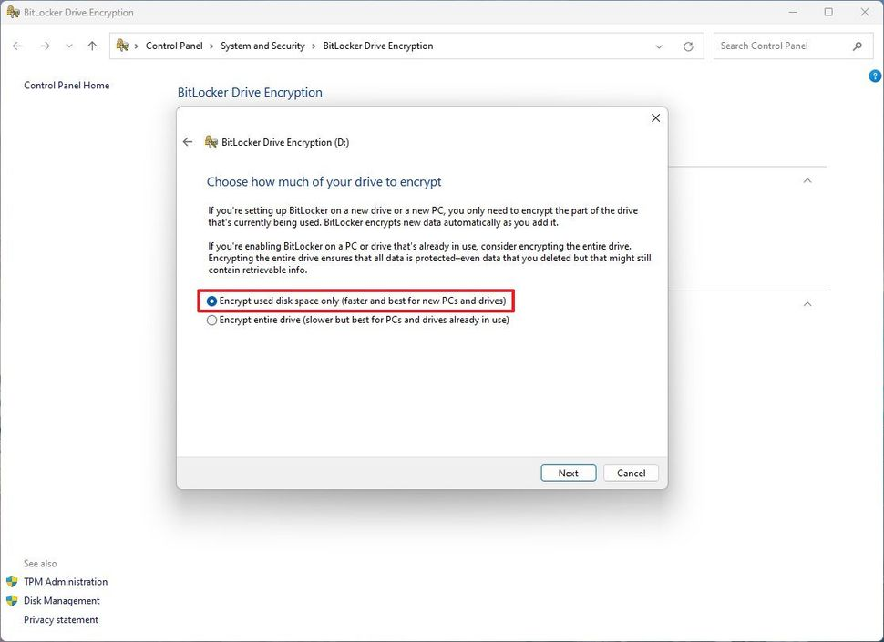

1. 单击 **下一步** 按钮。
2. 选择 **兼容模式** 选项。

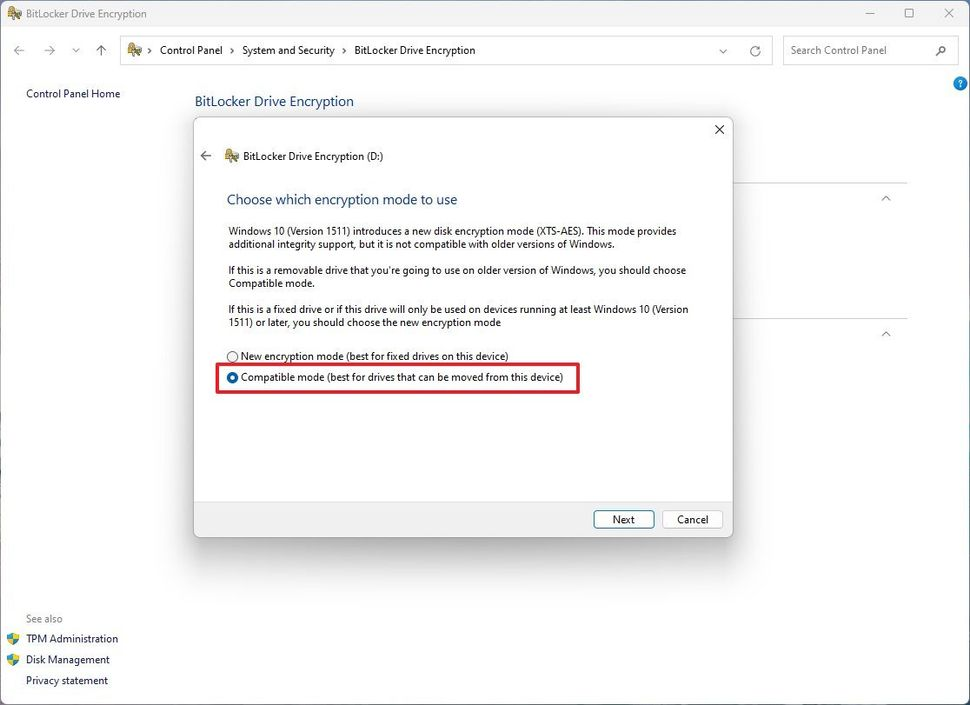

1. 单击 **下一步** 按钮。
2. 单击 **开始加密** 按钮。
3. 单击 **关闭** 按钮。

完成这些步骤后，虚拟驱动器将受到密码保护。

## 解锁受密码保护的文件夹

要在 Windows 11 上使用密码打开文件夹，请使用以下步骤：

1. 打开 **文件资源管理器**。
2. **打开包含Vault.vhdx**文件的文件夹 。
3. 双击 **VHD** (VHDX) 文件将其装载到文件资源管理器。 

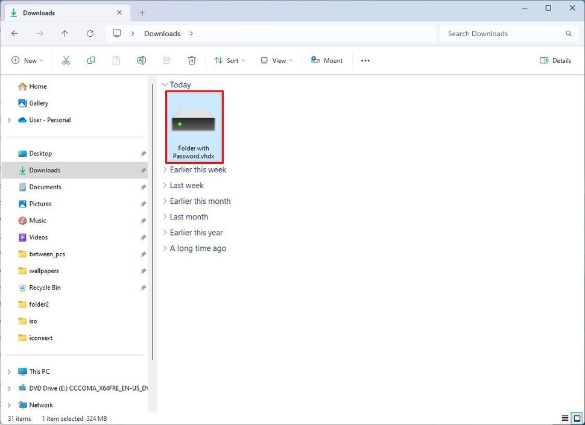

- **快速说明：** 如果您收到“无法访问”和“访问被拒绝”消息，这是正常行为，因为您已安装驱动器但尚未使用密码解锁。

1. 单击 左侧导航窗格中的**“此电脑” 。**
2. 双击驱动器以打开“设备和驱动器”部分下的登录页面。
3. 输入密码以解锁驱动器。 

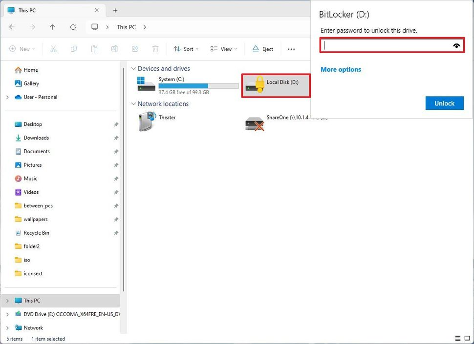

- **快速提示：** 如果您忘记了密码，请单击 **“更多选项”，**选择 “**输入恢复密钥 ”选项，然后输入您的**[Microsoft 帐户](https://click.linksynergy.com/deeplink?id=kXQk6*ivFEQ&mid=24542&u1=wp-hk-1157116650956660616&murl=https%3A%2F%2Faccount.microsoft.com%2Fdevices%2Frecoverykey)上可用的 48 位恢复密钥。

1. 单击 **解锁** 按钮。

完成这些步骤后，驱动器将打开，允许您添加、修改和删除敏感文件。

## 锁定受密码保护的文件夹 

要在 Windows 11 上使用密码关闭并锁定文件夹，请使用以下步骤：

- 打开 **文件资源管理器**。
- 单击 左侧导航窗格中的**“此电脑” 。**
- 在“设备和驱动器”部分下，右键单击 BitLocker 驱动器，然后选择 **“弹出”** 选项。

完成这些步骤后，文件夹（驱动器）将锁定，并且需要密码才能再次解锁内容。

[原文地址](https://www.windowscentral.com/how-fix-screen-flickering-windows-10)
