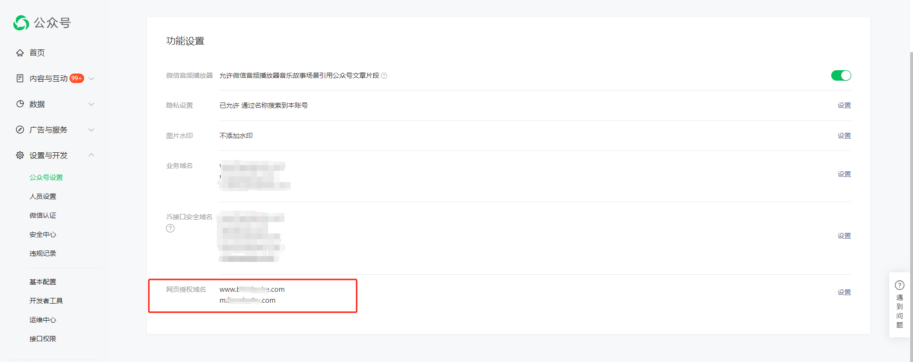
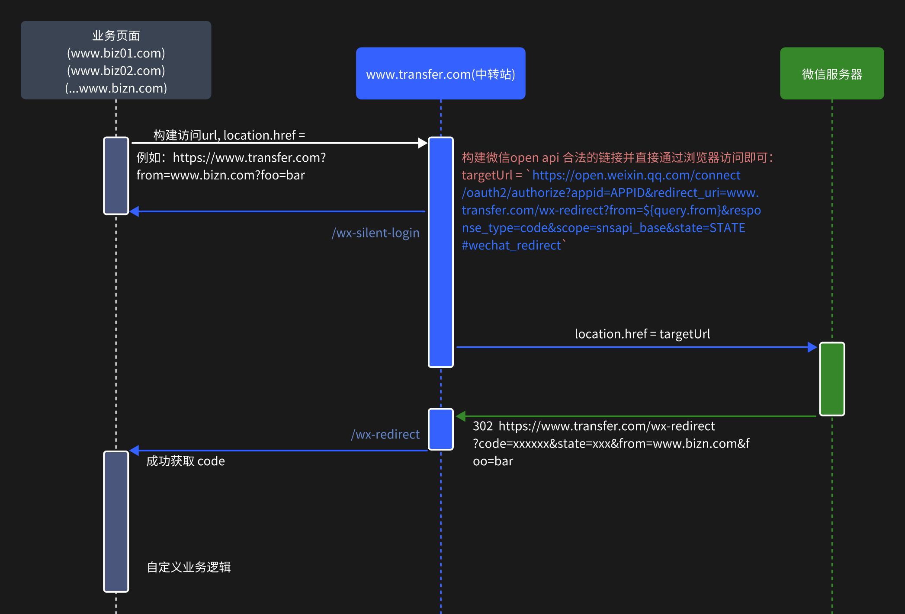

## 前言

最近在做一个接入微信静默登陆的业务， 就是用户在手机微信中打开指定网页， 然后我们去拿到这个 用户的openid, 做后续的操作。 相关文档在这里 [link](https://developers.weixin.qq.com/doc/offiaccount/OA_Web_Apps/Wechat_webpage_authorization.html).

> 我们目的是拿到一个临时code， 然后调用我们后端的接口去关联我们自己内部的登录系统， 处理用户登录。 所以本篇文章将不涉及获取code以后的后续流程和工作。

文档中的操作流程 [第一步](https://developers.weixin.qq.com/doc/offiaccount/OA_Web_Apps/Wechat_webpage_authorization.html#0) 要求我们获取到 code , 需要引导用户访问如下链接的页面：

```bash
https://open.weixin.qq.com/connect/oauth2/authorize?appid=APPID&redirect_uri=REDIRECT_URI&response_type=code&scope=SCOPE&state=STATE#wechat_redirect
```

用户访问这个页面后， 就会写道 `code` 的query 参数，跳转到 `REDIRECT_URI` 这个设定的地址。 形如：

```bash
REDIRECT_URI?code=xxxxxxxxxxxx
```

问题是这个 `REDIRECT_URI` 地址并不是随意填写的，一定要在公众号中配置过后才行。

> 在 设置与开发 - 接口权限 - 网页服务（表格一级分类） - 网页授权（表格二级分类） - 网页授权获取用户基本信息 - 修改 （表格 “操作” 列）

但是我们公众号下面的网页授权域名已经绑满了 （最多两个）



因此就有了关于这个问题的解决方案的讨论。

## 解决方案

我们将会以封装一个公司内公用的解决方案为目标说明。 我们会将已经绑定的某个域名作为 **"中转站"**， 将我们所有需要静默获取用户 微信授权 `code` 的页面称作 **"业务页面"**， 为了便于描述， 下面：

- 中转站： 将被表示为 `www.transfer_example.com`
- 业务页面： 将被表示为 `www.bizn.com`

### 整体流程图

为了方便描述，整个过程如下图所示：



首先， 我们需要在 中转站 新增两个页面， 一个用于构建 微信 open api 链接地址并访问，一个是获取code 以后的回调地址。

### wx-silent-login

实际上， 我们的业务中，因为涉及到数据埋点，开发环境等原因，需要请求我们自己的后台开发服务器，去返回一个 `https://open.weixin.qq.com/xxxxx` 地址， 为了说明关键的问题，所以我在上图中并没有画出来。 不管怎么样， 我们最终都是需要构建一个 合法的地址然后去访问即可。

这个地址中，最重要的就是 `redirect_uri` 这个参数，在 wx-silent-login 页面，我们的地址栏应该形如："www.transfer.com/wx-silent-login?from=https://www.bizn.com?foo=bar"， 其中，from 表示哪个业务页面需要获取 `code`, `foo` 是指任意参数， 因为业务页面可能有自己需要的query参数。

> tips: 开发环境from参数可以是localhost:port

现在我们直接构建这个地址去访问即可， 以下是关键部分的示例代码片段：

```js
// vue
......
  created() {
    const {
      query: { from, ...moreQueryParams },
    } = this.$route;
    if (!from) {
      alert('from为必传参数');
      return;
    };
    const otherQuery = new URLSearchParams(moreQueryParams);
    const fromWithQuery = `${from}?${otherQuery.toString()}`;
	const jumpUrl = `https://open.weixin.qq.com/connect/oauth2/authorize?appid=APPID&redirect_uri=www.transfer.com/wx-redirect?from=${fromWithQuery}&response_type=code&scope=snsapi_base&state=STATE#wechat_redirect`;
    location.href = jumpUrl;
  },
......
```

### wx-redirect

如果上述链接构建并访问成功， 那么将会携带 `from` 和 `code` query 参数跳转到 www.transfer.com/wx-redirect 页面。 到这里其实我们就已经拿到了目标 `code` 了， 我们再手动跳回去就行。

假设现在的页面地址形如： www.transfer.com/wx-redirect?code=xxxxxx&from=www.bizn.com?foo=bar

关键的代码片段如下：

```js
// vue
  created() {
    const url = new URL(location.href);
    const from = url.searchParams.get('from');
    const code = url.searchParams.get('code');
    window.location.href = `${from}?code=${code}`;
  },
```

### 处理业务逻辑

> 业务页面处理业务逻辑，也就是 from 参数中指定的页面

```js
// src/mob/utils/wx-silent-login.js
import { isLogin } from "your_logic_refer_detect_user_login"

export default ()=>{
    if(isLogin()) return;

    const currentUrlObj = new URL(location.href)
    const code = currentUrlObj.searchParams.get("code")
    if(code){
       // 在这里处理你获取code以后的后续业务逻辑
        return；
    }

    /**
     * 用户未登录，去获取 code
     * query 参数：
     * from： 必传
     * foo: 其他参数
     */
    location.href = `https://transfer.com/wx-silent-login?from=${location.origin}&foo=bar&baz=qux`
}
```
