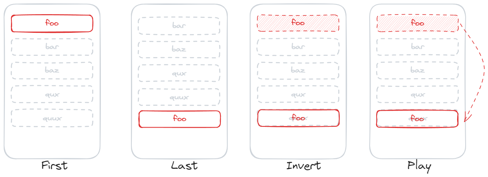
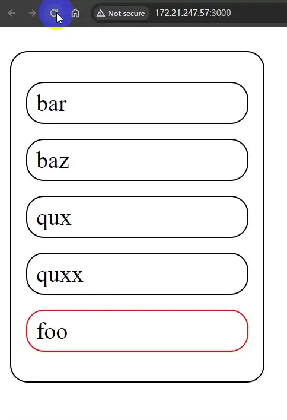
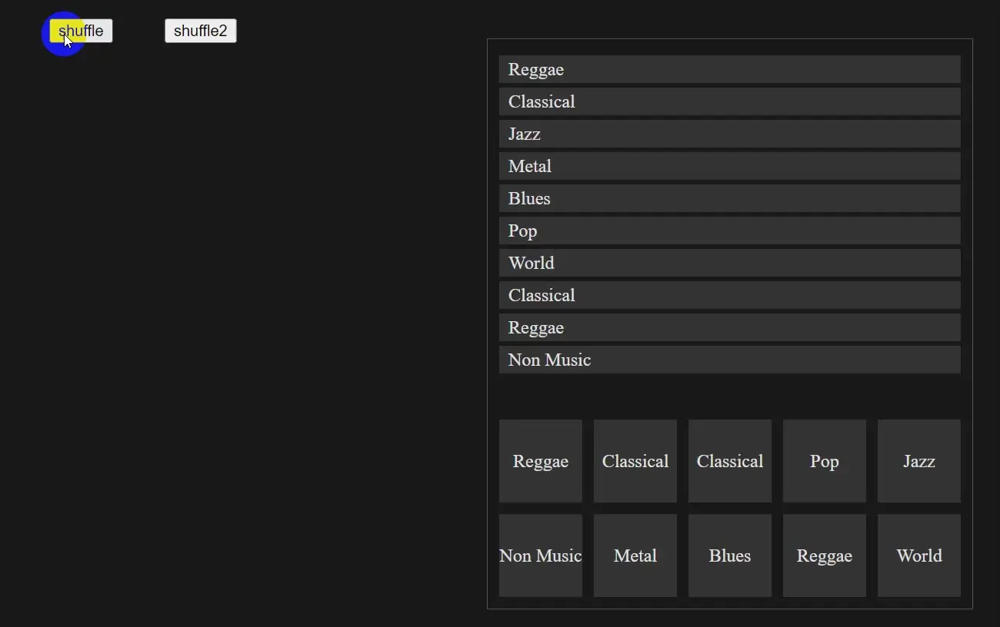

## 什么是 FLIP ?
FLIP 是一种原理，既不是框架也不是库， 是一种思考动画实现的方式。它由 [Paul Lewis](https://aerotwist.com/blog/flip-your-animations/) 首次提出。  FLIP 是几个词汇的缩写， 分别是  **F**irst, **L**ast, **I**nvert, **P**lay。 Vue 中 Transition Group 的实现也是基于这个动画原理。 

- **First:** 元素最初的状态（位置，尺寸等）
- **Last:** 元素最终的状态（位置，尺寸等）
- **Invert:** 反转状态
- **Play:** 播放动画

这几个概念其实还是比较抽象的，以下会用绘图结合实际代码来辅助性地说明。 




假设我们最终希望实现这么一个动画，将一个元素移动到列表的最后一项。

### Fisrt

First 阶段中，我们需要将这个元素的状态记录下来。 

```html
    <ul>
        <li id="no1">foo</li>
        <li>bar</li>
        <li>baz</li>
        <li>qux</li>
        <li>quxx</li>
    </ul>
```

```js
const li = document.querySelector("#no1")
// first state
const firstState = li.getBoundingClientRect().top
```


### Last

Last 阶段，我们需要执行变更函数，这个函数中，会执行对元素的移动操作。 也就是一个瞬时完成的动作。 

```js
// change and record last state
const ul = document.querySelector('ul')
ul.insertBefore(li, null)// 将第一个 Li 元素移动到ul列表最后
const lastState = li.getBoundingClientRect().top // 记录最后的状态
```


### Invert

Invert 阶段，目前，第一个 Li 元素已经被放置到了列表最后 (物理上)，  我们需要在视觉上借助 transform属性将这个元素移动到初始状态。   这也是为什么这个阶段叫做 反转 Invert 的原因。 

```js
// invert
li.style.transform = `translateY(${firstState - lastState}px)`
```

注意，`firstState - lastState` 值将是一个负数， 这是正确的，当前位置已经是 Last 状态了，需要把状态反转到初始位置。 


### Play

Play 阶段，就是应用动画，让元素 “还原”到当前位置 (Last):

```js
// Play
requestAnimationFrame(() => {
    // Set up the transition and reset transform
    li.style.transition = 'transform 1s';
    li.style.transform = 'translateY(0)';
});
```

> `requestAnimationFrame()` 将会在浏览器下一次 repaint 之前触发。




### Element.Animate API

现代浏览器中支持了更新的 `animate` API， 可以更加方面的帮我们完成 Invert 和 Play 这两个阶段的操作：

```js
// Invert And Play
li.animate([
    { transform: `translateY(${firstState - lastState}px)`},
    { transform: `translateY(0)` }
],{
    duration: 1000,
})
```


以上示例的完整代码如下：
```html
<!DOCTYPE html>
<html lang="en">

<head>
    <meta charset="UTF-8">
    <meta name="viewport" content="width=device-width, initial-scale=1.0">
    <title>Document</title>
</head>
<style>
    ul{
        border: 1px solid #000;
        border-radius: 12px;
        padding: 10px;
        width: 150px;
        li{
            list-style: none;
            border: 1px solid #000;
            border-radius: 12px;
            padding: 4px 6px;
            margin: 10px 0;
        }
        li#no1{
            border: 1px solid red;

        }
    }
</style>
<body>
    <ul>
        <li id="no1">foo</li>
        <li>bar</li>
        <li>baz</li>
        <li>qux</li>
        <li>quxx</li>
    </ul>
    <script>
        const li = document.querySelector("#no1")
        const ul = document.querySelector('ul')
        // first state
        const firstState = li.getBoundingClientRect().top

        // change and record last state
        ul.insertBefore(li, null)
        const lastState = li.getBoundingClientRect().top

        // invert
        // li.style.transform = `translateY(${firstState - lastState}px)`
        
        // Play
        // requestAnimationFrame(() => {
        //     // Set up the transition and reset transform
        //     li.style.transition = 'transform 1s';
        //     li.style.transform = 'translateY(0)';
        // });

        // Invert And Play
        li.animate([
            { transform: `translateY(${firstState - lastState}px)`},
            { transform: `translateY(0)` }
        ],{
            duration: 1000,
        })
    </script>
</body>
    
</html>
```


## 通用函数封装示例

实际的应用中，我们可能不仅仅是位置的变化，可能有其他的属性变化。 实现的效果可能也更加复杂。  这时候，我们实际可以把 FLIP 动画的思想进一步提炼以方面我们实际业务的实现。 

通过上面的示例，我们可以发现，实现一个FLIP动画，实际上需要三步：

**记录First 状态** -> **变更DOM并记录 Last 状态** -> **播放动画**

那么我们可以创建几个对应的函数：

```js
function record(containerDom){
    // 将初始位置，记录到各个 子元素节点对象上
}
function change(containerDom){
    // 变更 Dom，使得所有子元素变为最终的状态
}
function move(containerDom){
    // 1. 获取当前所有子节点的 最终状态
    // 2. 利用 animate API 播放动画
}

function triggerFlip(containerDom){
    record(containerDom);
    change(containerDom);
    move(containerDom);
}
```


下面将实现如下动画：


```html
    <div class="container">
      <button id="btn">shuffle</button>
      <ul id="box1">
        <li>Reggae</li>
        <li>Classical</li>
        <li>Classical</li>
        <li>Blues</li>
        <li>World</li>
        <li>Non Music</li>
        <li>Reggae</li>
        <li>Pop</li>
        <li>Metal</li>
        <li>Jazz</li>
      </ul>
      <button id="btn2">shuffle2</button>
      <ul id="box2">
        <li>Reggae</li>
        <li>Classical</li>
        <li>Classical</li>
        <li>Blues</li>
        <li>World</li>
        <li>Non Music</li>
        <li>Reggae</li>
        <li>Pop</li>
        <li>Metal</li>
        <li>Jazz</li>
      </ul>
    </div>
```

```ts
const btn = document.querySelector('#btn') as HTMLButtonElement
const btn2 = document.querySelector('#btn2') as HTMLButtonElement
const ul = document.querySelector('#box1') as HTMLUListElement;
const ul2 = document.querySelector('#box2') as HTMLUListElement;


btn.onclick = () => {
    record(ul)
    change(ul)
    move(ul)
}
btn2.onclick = () => {
    record(ul2)
    change(ul2)
    move(ul2)
}
type ExtendHTMLLIElement = HTMLLIElement & { StartX: number, StartY: number }
// 记录初始位置，保存到各个 元素节点对象上
function record(ul: HTMLUListElement) {
    const childrens = ul.children
    for (let i = 0; i < childrens.length; i++) {
        const li = childrens[i] as ExtendHTMLLIElement;
        const li_bcr = li.getBoundingClientRect()
        li.StartX = li_bcr.x;
        li.StartY = li_bcr.y;
    }
}
// 变更DOM
function change(ul: HTMLUListElement) {
    const childrens = ul.children
    for (let i = 0; i < childrens.length; i++) {
        // 当前li元素
        const li = childrens[i];
        // 当前li元素的后一个元素
        const liSibling = li.nextElementSibling

        // 需要替换的目标元素位置
        const x = Math.floor(Math.random() * childrens.length)
        // 替换的目标元素
        const xLiEl = childrens[x]

        // 将目标元素移动到当前元素之后
        ul.insertBefore(xLiEl, liSibling);
    }
}
// 获取当前DOM 位置信息，并播放动画
function move(ul: HTMLUListElement) {
    const childrens = ul.children
    for (let i = 0; i < childrens.length; i++) {
        // 当前li元素
        const li = childrens[i] as ExtendHTMLLIElement;
        const { x: curX, y: curY } = li.getBoundingClientRect()
        li.animate([
            { transform: `translate(${li.StartX - curX}px, ${li.StartY - curY}px)` },
            { transform: `translate(0px, 0px)` } // 可省略
        ], { duration: 300 })

    }

}
```

你可以在这里看到更多示例：
https://joisun.github.io/demos/DemoPages/flip-animation/dist/
对应的源代码在这里：
https://github.com/joisun/joisun.github.io/tree/master/demos/DemoPages/flip-animation


> @refer: https://aerotwist.com/blog/flip-your-animations/
>
> @refer: https://css-tricks.com/animating-layouts-with-the-flip-technique/
>
> @refer: https://developer.mozilla.org/en-US/docs/Web/API/Window/requestAnimationFrame
>
> @refer: https://www.bilibili.com/video/BV1Yu411E7io/?spm_id_from=333.337.search-card.all.click&vd_source=1a939f65e5f7333a6191746cf99398dd
>
> @refer: https://juejin.cn/post/7016912165789515783
