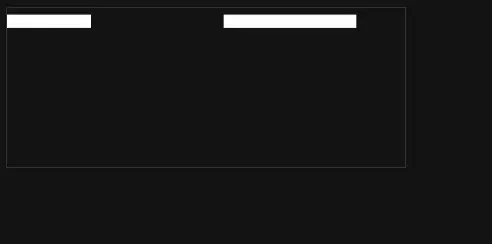

## SVG 路径动画的实现原理

svg 路径动画的实现，主要依赖于两个 svg 属性(同样适用CSS)，它们分别是：

- `stroke-dasharray` :  定义用于绘制形状轮廓的虚线和间隙
- `stroke-dashoffset`： stroke-dasharray 的偏移量



```html
<svg viewBox="0 0 30 12" xmlns="http://www.w3.org/2000/svg">
  <line x1="0" y1="1" x2="30" y2="1"></line>
</svg>
<style>
  svg {
    width: 400px;
    border: 1px solid #333;
  }
  line {
    stroke: white;
    stroke-dasharray: 10;
    animation: move 2s infinite;
  }
  @keyframes move {
    0%,
    100% {
      stroke-dashoffset: 0;
    }
    50% {
      stroke-dashoffset: 10;
    }
  }
</style>
```

如果 `stroke-dashoffset` 和 `stroke-dashoffset` 以及 路径的长度相同， 就可以实现元素从消失到完整出现的过渡效果。 如下：


```css
  @keyframes move {
    0%,
    100% {
      stroke-dashoffset: 0;
    }
    50% {
      stroke-dashoffset: 30;
    }
  }
```


但是有两个问题我们需要解决：

1. 我们需要知道路径的长度
2. 我们需要设定动画为变量

第一个问题，我们可以通过svg 元素对象的API 实现：`getTotalLength()`

### `getTotalLength()`

```js
document.querySelector('line').getTotalLength();// 30
```

第二个问题，我们可以通过 `EL.style.setProperty` 和 CSS 变量引用`var` 来解决：

### `style.setProperty`

示例：

```js
// js
const p = document.querySelector('line')
p.style.setProperty('--l', p.getTotalLength())
```

```css
/* css */
  line {
    stroke: white;
    stroke-dasharray: var(--l);
    animation: move 2s infinite;
  }
  @keyframes move {
    0%,
    100% {
      stroke-dashoffset: 0;
    }
    50% {
      stroke-dashoffset: var(--l);
    }
  }
```


### 多路径示例


```html
  <svg xmlns="http://www.w3.org/2000/svg" width="32" height="32" viewBox="0 0 24 24">
    <g fill="none" stroke="currentColor" stroke-linecap="round" stroke-linejoin="round" stroke-width="1.5"
      color="currentColor">
      <path class="p" d="M22 12c0 5.523-4.477 10-10 10S2 17.523 2 12S6.477 2 12 2s10 4.477 10 10" />
      <path class="p" d="M2 12c2.28 2.429 5.91 4 10 4s7.72-1.571 10-4M12 2v20" />
      <path class="p"
        d="M5.156 5c-.382 1.5-.116 4 1.41 6c1.605 2.103 2.616 5-1.197 8M18.844 5c.382 1.5.116 4-1.41 6c-1.605 2.103-2.616 5 1.197 8" />
    </g>
  </svg>
```

```html
<style>
  svg {
    width: 400px;
    border: 1px solid #333;
    color: white;
  }
  .p {
    stroke: white;
    stroke-dasharray: var(--l);
    animation: move 2s infinite;
  }
  @keyframes move {
    0%,
    100% {
      stroke-dashoffset: 0;
    }
    50% {
      stroke-dashoffset: var(--l);
    }
  }
</style>
```

```html
<script>
  const paths = document.querySelectorAll('.p')
  paths.forEach(p => {
    p.style.setProperty('--l', p.getTotalLength())
  })
</script>
```


### 多元素示例

<iframe height="300" style="width: 100%;" scrolling="no" title="【BLOG_POSTS】svg path animation" src="https://codepen.io/joisun/embed/zYQRoWa?default-tab=js%2Cresult&editable=true" frameborder="no" loading="lazy" allowtransparency="true" allowfullscreen="true">
  See the Pen <a href="https://codepen.io/joisun/pen/zYQRoWa">
  【BLOG_POSTS】svg path animation</a> by joisun (<a href="https://codepen.io/joisun">@joisun</a>)
  on <a href="https://codepen.io">CodePen</a>.
</iframe>
