## 引言

### 什么是 GitHub Actions

Github Actions 是一个持续集成(CI/Continuous Integration) 和 持续交付(CD/Continuous Delivery) 的 **平台**， 它允许你将 打包，测试，部署这些操作实现自动化。

### GitHub Actions 的优势和使用场景

#### Github Actions 的主要优势：

- 开箱即用：依托 Github, 无需额外配置，
- 社区资源丰富：Github Actions 提供了一个丰富的 [MarketPlace](https://github.com/marketplace?type=actions)， 里面有很多社区贡献的，可以直接复用的 Action
- 并行执行：支持并行执行多个任务，节省时间

> 还有一些其他的，比如灵活性高/可扩展性强/自动化能力强/易于调试/安全.... 基本每个 CI/CD 平台都会强调这些，就不赘述了。 

#### Github Actions 的使用场景：

- CI
  - 自动化测试：代码提交时，自动运行单测，集成测试等
  - 代码质量检查：通过静态代码分析工具检查代码风格/质量
- CD
  - 自动构建/部署： 代码合并时自定执行打包，部署到不同环境
  - 多环境部署： 使用矩阵策略在不同的环境下去打包，生产不同的构建产物
- 发布管理
  - 自动发布： 创建新的 Github Release, 自动生成发布说明，上传构建产物
  - 版本管理：自动更新版本好，生成changlog
- 项目管理
  - 任务自动化：自动分配和管理 Github Issues/ PR， 例如 PR 合并后自动关闭关联的 Issues
  - 通知和报告：工作流程完成后，发送通知到邮件等平台
- 定时任务
  - 定时运行脚本，例如，定期数据库备份

> 总的来说，还是依托 Github Action 是 Github 亲儿子，所以很多和 Github 本身相关的操作，Github Action 自然是更加的得心应手。 此外，Github 也支持一些传统 CICD 平台所支持的功能。 


## 基础概念

### Workflow （工作流程）

**一个 Workflow 就是自动化执行 一个或者多个 Jobs 的流程**。 它通过 YAML 文件来定义， 它可以通过仓库事件，例如pull/push 来自动触发；可以手动触发，还可以通过一些方式实现定时触发。

### Events（事件）

事件就是触发 Workflow 运行的**特定活动**。例如 Pr, Push，新建 Issue等，也可以是**定时**任务，或者**手动**触发

### Job （任务）和 Steps（步骤）

一个任务 由一组 step 组合而成。 每一个步骤 step 要么是一个 shell 脚本或者是一个 action。 这组 steps 是按照顺序执行的，并彼此依赖。 这些**steps是在同一个 runner 中执行的，也因此你可以从某个step 中获取另一个 step 中的数据**。 例如，你可以在一个 build 任务后面，去创建一个测试任务以测试这个build 的产出。

**一般来说**，如果有多个 Job ， 那么默认它们是**并行**的。 **但是**如果某个 Job 的执行，**依赖**另一个 Job, 那么可以通过一定配置去描述，某个 Job A 的执行依赖于 Job B 的执行，这种情况下。 Job A 的执行就一定会在 Job B 执行之后才会执行。 

### Action（动作）

action 是Github Actions 平台的**自定义应用程序**，它们用于执行复杂但是经常重复的任务。 通过引入这个 Action 可以极大的简化你的工作流配置。 

### Runner （运行机器）

一个 Runner 可以理解为一个运行 Workflow 的**服务器**。它可以是 Ubuntu Linux/ Windows/ MacOS。

## 快速开始

### 创建一个简单的 GitHub Actions Workflow

我们可以创建一个空的 Demo Git 仓库来演示一个最基础的 Workflow 长什么样子。

点击 [Action] 这个 Tab, 然后点击下方的 “set up a workflow yourself ”

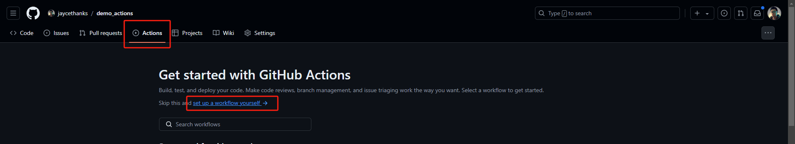

拷贝下面的代码到编辑器中，然后点击 "Commit changes"：

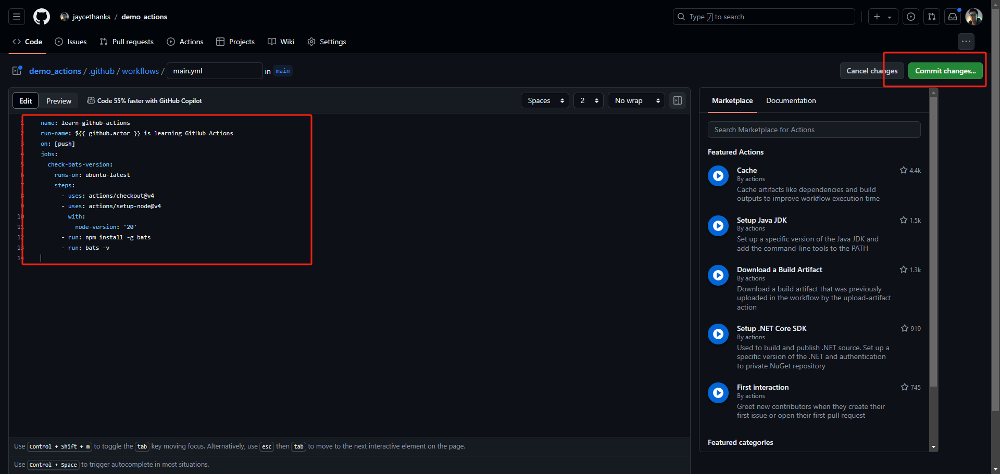

在 Action Tab 中就能看到这个 正在运行的 workflow 了：

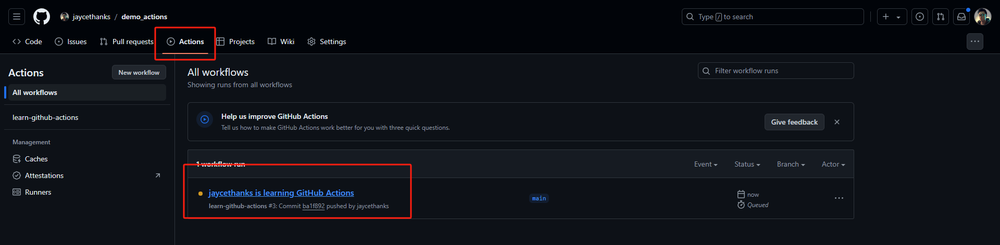

点击可以看到具体的任务详情：

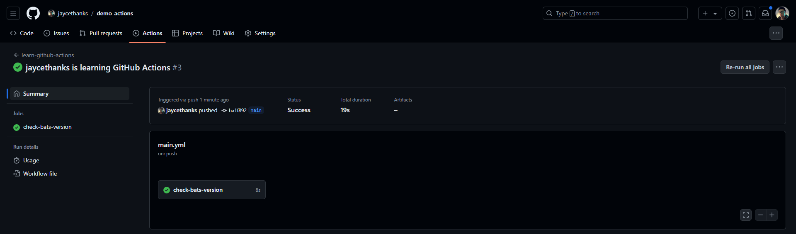

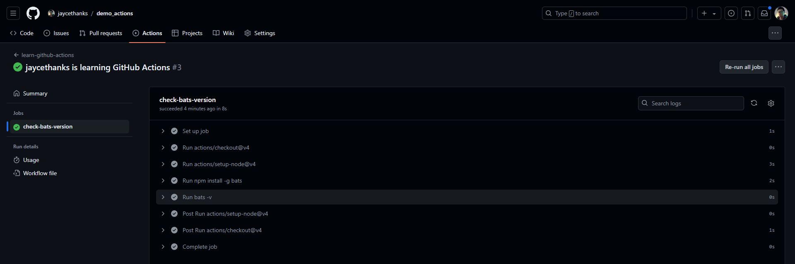

现在我们看看这份yaml 文件中的具体含义：

```yaml
name: learn-github-actions
run-name: ${{ github.actor }} is learning GitHub Actions
on: [push] # 指定本 workflow 触发的事件为 Git push 事件
jobs: # 定义Jobs
  check-bats-version: # Job1 的名称，可以是任意的
    runs-on: ubuntu-latest # 指定runner 的环境
    steps: # 定义 steps
      - uses: actions/checkout@v4 # uses 指定了引用的 action, checkout 这个action 用于迁出，相当于在 runner 中去拉取一下本仓库代码
      - uses: actions/setup-node@v4 # node 配置 action
        with: # with 用于指定 action 的配置参数
          node-version: '20' # 配置参数 node-version, 值为 '20'
      - run: npm install -g bats # run 即在 runner 中cli 执行命令滚
      - run: bats -v
```

其中 "name" 和  "run-name" 的指定如下图：

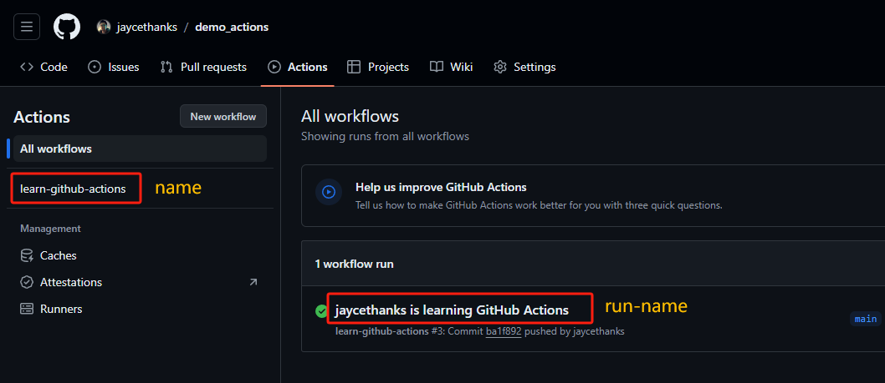

> 这部分内容直接引用的 Github Actions 的官方文档，如果有不清楚的地方可以看官方的解释 [link](https://docs.github.com/en/actions/learn-github-actions/understanding-github-actions#understanding-the-workflow-file).

## 重用 Action

### 使用 Actions 市场中现成的 Actions

你可以直接在github 的编辑器中访问 Marketplace：

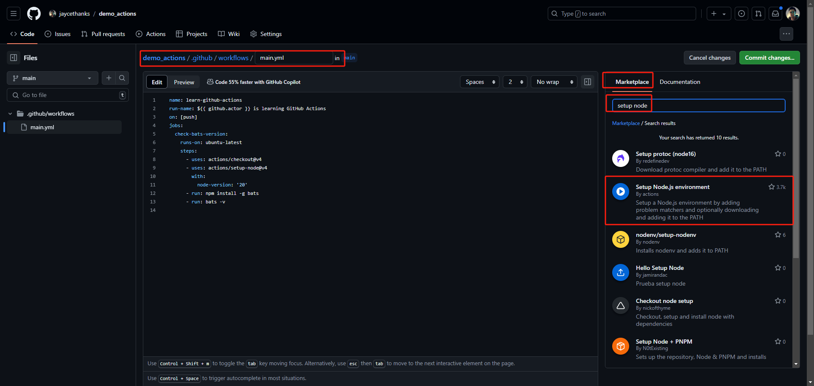

直接将 action 复制到编辑器：

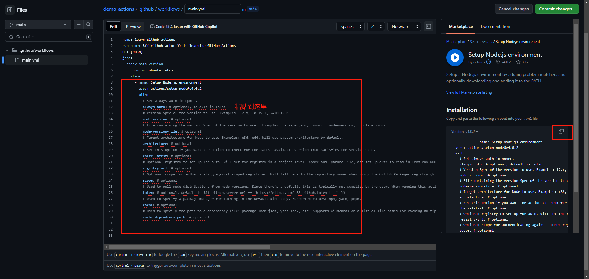

你也可以直接访问 [marketplace](https://github.com/marketplace), 找到目标的 action, 再复制也行:

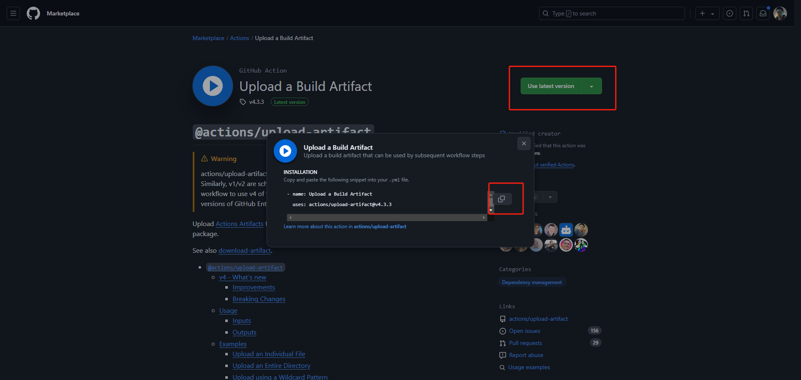

### 使用任何人 public 仓库的 actions

你可以通过 `{owner}/{repo}@{ref}` 语法去引用任何 public 仓库的 action:

```yaml
jobs:
  my_first_job:
    steps:
      - name: My first step
        uses: actions/setup-node@v4
```

### 使用同仓库的actions

你还可以通过相对路径引用自己写的actions:

```bash
|-- hello-world (repository)
|   |__ .github
|       └── workflows
|           └── my-first-workflow.yml
|       └── actions
|           |__ hello-world-action
|               └── action.yml
```

```yaml
jobs:
  my_first_job:
    runs-on: ubuntu-latest
    steps:
      # This step checks out a copy of your repository.
      - name: My first step - check out repository
        uses: actions/checkout@v4
      # This step references the directory that contains the action.
      - name: Use local hello-world-action
        uses: ./.github/actions/hello-world-action
```

> 注意  (`./`) 是相对于默认的工作目录（`github.workspace`, `$GITHUB_WORKSPACE`），如果 checkout 迁出的目录不是根目录，那么这个相对路径也需要调整

> 如果一个action发布在一个docker 镜像中， 还可以引用这个docker 镜像，详细见 [link](https://docs.github.com/en/actions/learn-github-actions/finding-and-customizing-actions#referencing-a-container-on-docker-hub), 这个用的不多，不做过多介绍。 

## 高级用法

### 上下文的访问

你可以在 [这里](https://docs.github.com/en/actions/learn-github-actions/contexts) 看到， 一个workflow 的执行，有很多的上下文，例如 github 的上下文， env 上下文， jobs上下文， steps 上下文， secrets 上下文。这个上下是一个非常重要的概念， 我们知道，在代码编程时，也有一个上下文的概念，不同的作用域，上下文也不同。 之所有会有这么多上下文，也是类似的。 一个 workflow 的执行有很多子任务和环节。 有的时候某个任务执行依赖另一个任务的产出， 或者需要动态地获取到当前上下文的一些运行时信息。 以确保任务的正常执行， 上下文的存在同时也增强了 Github Actions 的灵活/功能性。 

- `github` 上下文

  - **用途**：提供关于仓库、事件、提交等信息

  - **常见用法**：

    ```YAML
    - name: Print repository
      run: echo "Repository: ${{ github.repository }}"
      
    - name: Print event name
      run: echo "Event: ${{ github.event_name }}"
      
    - name: Print SHA
      run: echo "SHA: ${{ github.sha }}"
    ```

- `env` 上下文

  - **用途**: 包含在工作流程中定义的环境变量。

  - **常见用法**：

    ```yaml
    env:
      MY_VAR: "some value"
    steps:
      - name: Print environment variable
        run: echo "Env variable is ${{ env.MY_VAR }}"
    ```

- `secrets` 上下文

  - **用途**: 包含在仓库或组织中定义的秘密变量，用于存储敏感信息。

  - **常见用法**：

    ```yaml
    steps:
      - name: Use secret
        run: echo "Secret is ${{ secrets.MY_SECRET }}"
    ```

- `vars` 上下文

  - **用途**： 全局的环境变量
  - **常见用法**：

  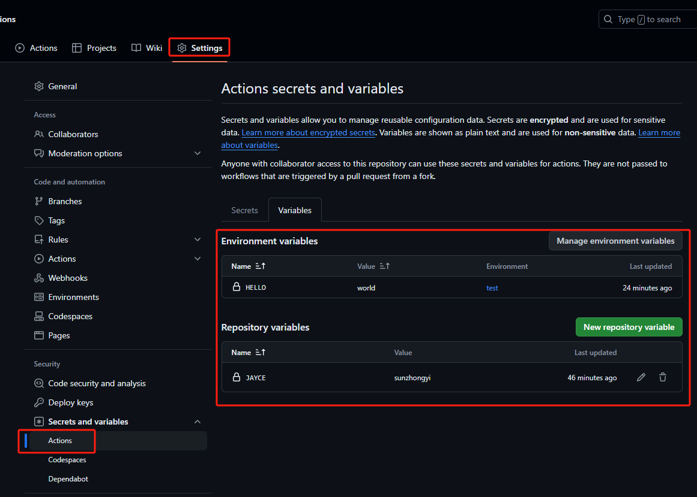

  ```yaml
  name: learn-github-actions
  run-name: ${{ github.actor }} is learning GitHub Actions
  on: [push]
  jobs:
    check-bats-version:
      runs-on: ubuntu-latest
      environment: test
      steps:
        - run: echo ${{vars.HELLO}}
        - run: echo ${{vars.JAYCE}}
  ```

### 多 Job 和并行执行

```yaml
name: learn-github-actions
run-name: ${{ github.actor }} is learning GitHub Actions
on: [push]
jobs:
  job1-check-test-vars:
    runs-on: ubuntu-latest
    name: Check Test Env Vars
    environment: test
    steps:
      - run: echo ${{vars.HELLO}}
  job2-check-vars:
    runs-on: ubuntu-latest
    name: Check Global Vars
    steps:
      - run: echo ${{vars.JAYCE}}
      
  # job3 的执行依赖 job1 的先执行
  job3-check-runtime-env:
    runs-on: ubuntu-latest
    name: Check Runtime Env
    needs: [job1-check-test-vars]
    env:
      SAY_HI: "Hi ~~~"
    steps:
       - run: echo ${{env.SAY_HI}}
       
  job4-echo-string:
    runs-on: ubuntu-latest
    name: Echo String
    needs: [job1-check-test-vars]
    steps:
      - run: echo "just echo a string~"
 
```

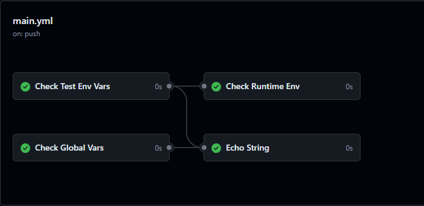

### 条件执行和矩阵构建

### 缓存和依赖管理

### 定时任务和事件触发


## 实战案例

### 自动化测试流程

### 持续集成和持续交付CICD 

### 自动发布和部署


## 常见问题与解决

### 调试和日志查看

### 常见错误以及解决方案


## 最佳实践

### 安全性注意实现

### 性能优化

### 社区资源和学习路径


## 总结
