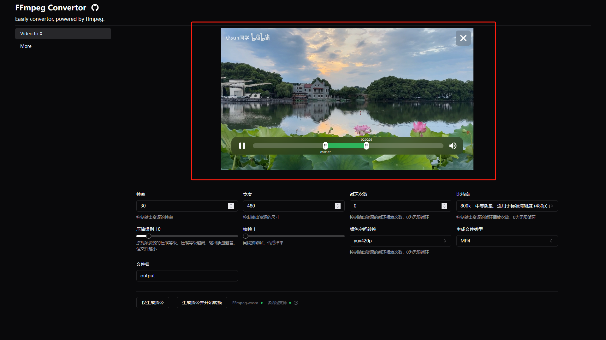
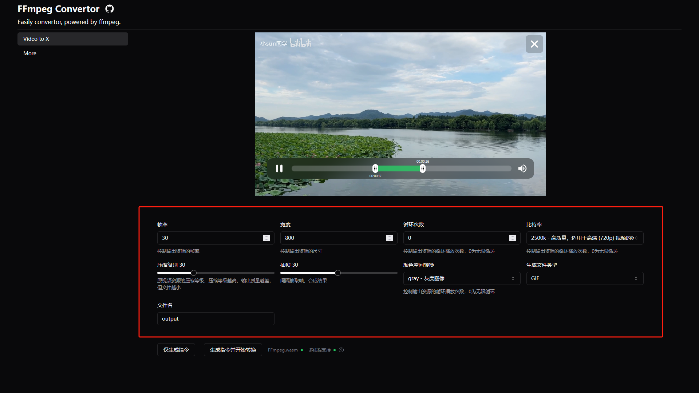
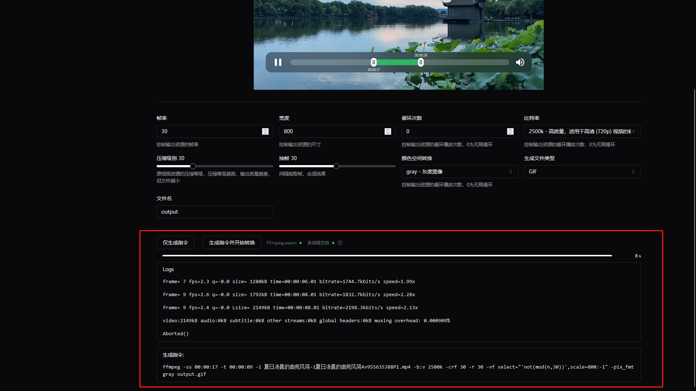
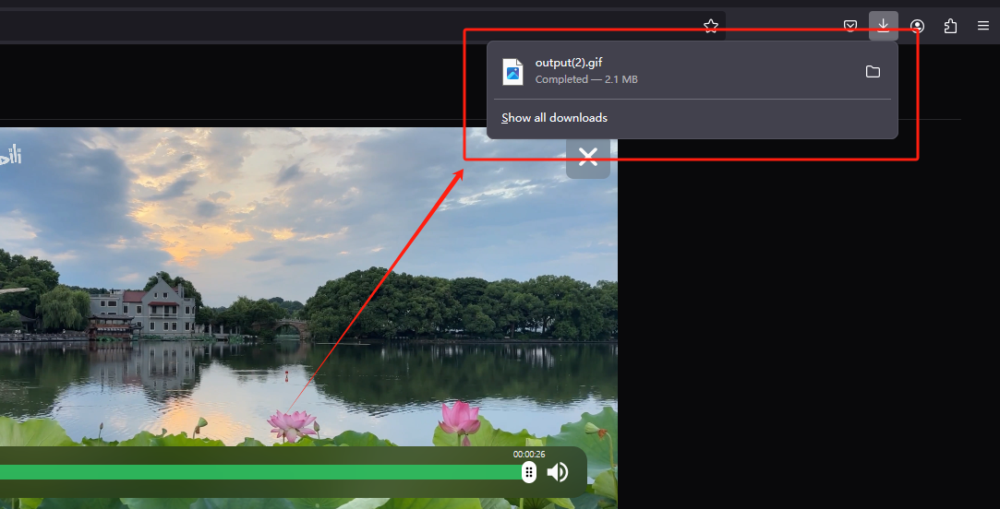
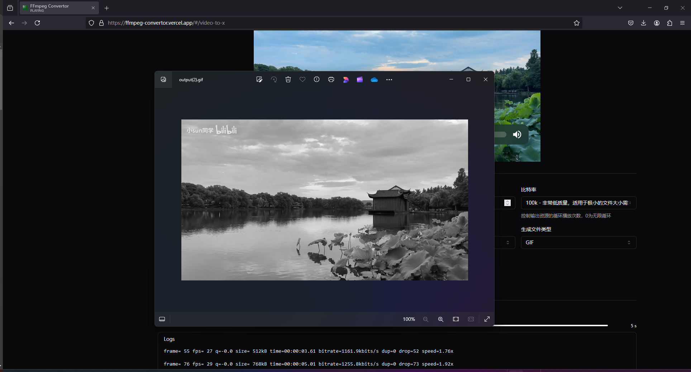

## 引言

写文章的时候， 有的地方为了描述，或者演示清楚，所以经常需要准备一些GIF/WEBP 的短视频演示素材插入文中。经常会用到 FFmpeg 这个命令行工具， 不过尽管用了很久，我始终是记不住这些参数命令， 太多了主要是。 我甚至写过一篇文章去结构性的总结使用 FFmpeg ---- [《FFmpeg的安装和基本使用》](https://sunzy.fun/blog_11ty/posts/Others/2021-04-28-FFmpeg%E7%9A%84%E5%AE%89%E8%A3%85%E5%92%8C%E5%9F%BA%E6%9C%AC%E4%BD%BF%E7%94%A8/)。

之所以我不用现有的视频剪辑工具，主要原因还是觉得臃肿。

我一开始本来只是想做个界面，动态的帮我拼接生成指令， 然后粘贴到命令行去使用。

不过做完了，想着现在不是有 wasm 吗？ 直接放浏览器里面跑不是更省事？

### 技术栈的选择

1. React：为了练习使用 React， 所以这次就选用 React 来撸吧
2. shadcn-ui: 一个 UI 库
3. FFmpeg.wasm：FFmpeg的WebAssembly版本，使得在浏览器中运行FFmpeg成为可能。
4. TypeScript：没什么好提的
5. react-hook-form：用于处理表单状态和验证的React库
6. zod：TypeScript优先的模式声明和验证库

> 一些技术，像 react-hook-form 和 zod， 我之前完全没用过， 不过现在我 和 AI 结对编程，基本上也是磕磕绊绊用起来了， 之前的工作中也没用到过，就当拓展一下认识了。

这个项目本身来说，就是一个小工具， 在做之前先整理下思路，就两个点：

1. 首先， 我得拼出 命令行可用的 指令 串。
2. 让它在浏览器中去执行

> 本文也只是从大致实现上去描述一下，所以不会逐行实现， 感兴趣的朋友可以自行翻 [源码 joisun/ffmpeg-convertor](https://github.com/joisun/ffmpeg-convertor)，有更多想法的话，也欢迎 PR。

演示地址:https://ffmpeg-convertor.vercel.app/

### 构建 UI

#### 表单设计与验证

我们使用`react-hook-form`和`zod`来处理表单。首先，定义了一个`formSchema`，它描述了表单的结构和验证规则：

```ts
const formSchema = z.object({
  fps: z.coerce.number().lte(120).gte(10),
  width: z.coerce.number().lte(5000).gte(1),
  loop: z.coerce.number().gte(0),
  bitrate: z.string().min(0),
  compression: z.coerce.number().lte(100).gte(0),
  output: z.string().min(1).max(50).regex(/^[\w-]+$/),
  // ... 其他字段
})
```

这个schema不仅定义了每个字段的类型，还包含了详细的验证规则，如最大/最小值、正则表达式匹配等。

#### 表单组件

使用`useForm`钩子初始化表单，并设置默认值：

```ts
const form = useForm < z.infer < typeof formSchema >> ({
  resolver: zodResolver(formSchema),
  defaultValues: {
    fps: 30,
    width: 480,
    loop: 0,
    bitrate: '800k',
    // ... 其他默认值
  },
})
```

然后用 Shadcn-ui 的 Form 组件去构建 UI：

```tsx
// ......
<Form {...form}>
        <form
          onSubmit={form.handleSubmit(() => onSubmit(form.getValues(), false))}
          className="sm:grid lg:grid-cols-2 xl:grid-cols-3 2xl:grid-cols-4 gap-x-4 gap-y-4"
        >
          <FormField
            control={form.control}
            name="fps"
            render={({ field }) => (
              <FormItem>
                <FormLabel>帧率</FormLabel>
                <FormControl>
                  <Input type="number" placeholder="" {...field} />
                </FormControl>
                <FormDescription>控制输出资源的帧率</FormDescription>
                <FormMessage />
              </FormItem>
            )}
          />
          <FormField
// ......
```

#### 文件上传与预览

使用自定义的`Dropzone`组件处理文件上传，`VideoClipper`组件用于视频预览和裁剪：

> 组件代码的实现可自行翻阅源码

```tsx
<Dropzone
  onChange={handleDropzoneChange}
  className="w-full h-24 my-12 flex items-center justify-center"
  fileExtension="video/*"
/>

<VideoClipper src={videoSrc} onClipChange={handleVideoClipperChange}>
  {/* ... */}
</VideoClipper>
```

到这里，基本的用户界面就算构建完成了。 接下来就是接入 FFmpeg 了。

### 接入 FFmpeg

在浏览器中使用 FFmpeg， 就需要借助 wasm 的实现， 我们使用 [ffmpeg.wasm](https://ffmpegwasm.netlify.app/docs/getting-started/usage/)。

为了我们使用方便，我们采用 React Hook 的方式对它进行一些封装：

这个 hook 将导出一个 对象，其中包括了一些状态，还有一个 transcode 方法。 该方法用于执行对文件的转换。

```ts
interface FFmpegInstance {
    load: () => Promise<void>;
    transcode: (file: File, commandParts: CommandPartsType) => Promise<void>;
    isLoaded: boolean; // 是否加载完成
    isDoing: boolean;// 是否正在执行转换任务
    isLoading: boolean;// 是否正在加载
    progress: number;// 转换任务处理进度
    transcodedTime: number; // 转化的产物时长
    logs: string[];//执行期间的日志
    error: Error | null;//错误
    openMT:boolean;// 是否开启了多线程
}
```

FFmpeg.wasm 的接入有一些注意点，FFmpeg.wasm 官方提供了两种包：

1. 多线程支持
2. 单线程

对于多线程支持，需要用到 SharedArrayBuffer ，是 JavaScript 中的一个对象，它代表一个固定长度的原始二进制数据缓冲区，可以在多个工作线程（Web Workers）之间共享。

不过由于它支持多个线程操作同一个内存空间， 处于安全考虑， 通常需要网站实施特定的安全头才能启用也就是：

```http
'Cross-Origin-Embedder-Policy': 'require-corp',
'Cross-Origin-Opener-Policy': 'same-origin',
```

单线程则没有这些要求。 不过单线程相对多线程肯定是要慢很多。

另一个问题就是 多线程并不是所有浏览器都支持， 似乎目前 Chromium based 的浏览器都不支持。 这也就意味着， Chrome, Safari, 还有一众过程套壳的浏览器都不支持。 好消息是 FireFox 支持。

为此，我们需要做一个自动启用， 去自动切换这两种模式。 下面是核心的部分代码：

```ts
// 检测当前浏览器环境是不是 FireFox， 如果是就把  OpenMT 这个开启标志设为 true
const browser = Bowser.getParser(window.navigator.userAgent)
let OpenMT = false
if (browser.getBrowser().name === 'Firefox') {
  OpenMT = true
}
serOpenMT(OpenMT)

//  根据 OpenMT 的值自行加载 对应 的 FFmpeg.wasm 模块。
const CORE_URL = 'https://cdn.jsdelivr.net/npm/@ffmpeg/core@0.12.6/dist/esm'
const CORE_MT_URL = 'https://cdn.jsdelivr.net/npm/@ffmpeg/core-mt@0.12.6/dist/esm'
const baseURL = OpenMT ? CORE_MT_URL : CORE_URL
await ffmpegRef.current.load({
  coreURL: await toBlobURL(`${baseURL}/ffmpeg-core.js`, 'text/javascript'),
  wasmURL: await toBlobURL(`${baseURL}/ffmpeg-core.wasm`, 'application/wasm'),
  ...(OpenMT
    ? {
        workerURL: await toBlobURL(
          `${baseURL}/ffmpeg-core.worker.js`,
          'text/javascript'
        ),
      }
    : {})
})
```

这部分代码，官方也是这么干的。 可以看看官方的 [Playgroud](https://ffmpegwasm.netlify.app/playground/)。 对应的源码在 [here](https://github.com/ffmpegwasm/ffmpeg.wasm/blob/ae1cdac7db79c5315f9a1b716fcbd9bcfe27c902/apps/website/src/components/Playground/index.tsx#L24).

另外， 在开发阶段，vite.config.ts 中需要配置响应头：

```ts
optimizeDeps: { exclude: ["@ffmpeg/ffmpeg", "@ffmpeg/util"], },
server: {
headers: {
  'Cross-Origin-Embedder-Policy': 'require-corp',
  'Cross-Origin-Opener-Policy': 'same-origin',
},
}
```

在部署阶段， 因为我使用的是 vercel 部署的， vercel 暴露了 vercel.json 配置文件， 可以很方便的支持我们自行配置， 如下：

```json
// vercel.json
{
  "headers": [
    {
      "source": "/",
      "headers": [
        {
          "key": "Cross-Origin-Embedder-Policy",
          "value": "require-corp"
        },
        {
          "key": "Cross-Origin-Opener-Policy",
          "value": "same-origin"
        }
      ]
    },
    {
      "source": "/assets/(.*)",
      "headers": [
        {
          "key": "Cross-Origin-Embedder-Policy",
          "value": "require-corp"
        },
        {
          "key": "Cross-Origin-Opener-Policy",
          "value": "same-origin"
        }
      ]
    }
  ]
}
```

完整的 useFFmpeg Hook 实践，详见 [源码](https://github.com/joisun/ffmpeg-convertor/blob/main/src/lib/FFmpeg.wasm.ts).

### FFmpeg命令生成与执行

定义了`onSubmit`函数来处理表单提交。它首先生成FFmpeg命令，然后根据需要执行转码：

```ts
async function onSubmit(values: z.infer<typeof formSchema>, onlyGenerateCommand?: boolean) {
  const { command, commandParts } = generateFFmpegCommand({
    ...values,
    timeRange,
    input: sanitizeFilename(files[0].name)
  });
  setCommand(command);
  if (onlyGenerateCommand) return;

  await handleTranscode(files[0], commandParts);
}
```

到这里基本就完成了。

然后处理一些用户反馈的 UI 和逻辑， 这里就不展开说明了。 来看看具体怎么使用这个工具。

### 使用

访问 https://ffmpeg-convertor.vercel.app

开始之前，你可以在这里看到应用的基本状态：


上传视频： 打开应用后，您会看到一个拖放区域。只需将视频文件拖入其中，或点击选择文件即可上传。

视频预览和裁剪： 上传完成后，视频会自动显示在预览区域。您可以使用内置的视频裁剪工具选择所需的片段。



设置转换参数：

- 帧率（FPS）：控制输出视频的流畅度，通常在10-120之间。
- 宽度：设置输出视频的宽度，高度会按比例自动调整。
- 循环次数：设置GIF等格式的循环播放次数，0表示无限循环。
- 比特率：控制视频质量和文件大小的平衡，可从预设选项中选择。
- 压缩级别：滑动条可调节0-100，数值越高压缩越大，文件越小但质量越低。
- 抽帧：控制每隔多少帧选取一帧，用于创建缩时效果。
- 颜色空间：根据需要选择适当的颜色编码方式。
- 输出格式：选择期望的输出文件格式。
- 输出文件名：为生成的文件指定一个名称。



生成命令和开始转换： 设置完参数后，您可以选择"仅生成指令"来查看对应的FFmpeg命令，或直接点击"生成指令并开始转换"启动处理过程。

查看进度和结果： 转换开始后，您可以通过进度条实时掌握处理进度。完成后，处理后的视频将自动下载到您的设备上。







源码 [joisun/ffmpeg-convertor](https://github.com/joisun/ffmpeg-convertor)

原文首发自 [sunzy.fun](https://sunzy.fun/blog_11ty/posts/Others/2024-07-30-%E6%92%B8%E4%B8%80%E4%B8%AA%E7%BA%AF%E5%89%8D%E7%AB%AF%E5%AE%9E%E7%8E%B0%E7%9A%84FFmpeg%E8%A7%86%E9%A2%91%E8%BD%AC%E5%8E%8B%E7%BC%A9%E5%B7%A5%E5%85%B7/)。

好用的话，赏个 Star
