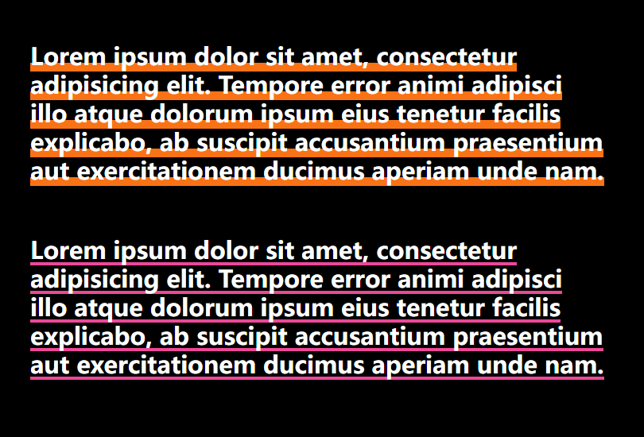

## Tailwind 通过bg-gradient 实现 underline 下划线效果

```html
<div class="flex h-screen items-center bg-black p-12 text-3xl font-semibold text-white">
  <!-- 1.should be inline element -->
  <!-- 2.parent should not be flex/grid -->
  <div>
    <p class="inline bg-gradient-to-b from-transparent from-70% via-orange-500 via-[percentage:70%_70%] to-orange-500">
      Lorem ipsum dolor sit amet, consectetur adipisicing elit. Tempore error animi adipisci illo atque dolorum ipsum
      eius tenetur facilis explicabo, ab suscipit accusantium praesentium aut exercitationem ducimus aperiam unde nam.
    </p>
    <div class="my-16"></div>
    <p class="inline bg-gradient-to-b from-transparent from-90% via-pink-500 via-[percentage:90%_90%] to-pink-500">
      Lorem ipsum dolor sit amet, consectetur adipisicing elit. Tempore error animi adipisci illo atque dolorum ipsum
      eius tenetur facilis explicabo, ab suscipit accusantium praesentium aut exercitationem ducimus aperiam unde nam.
    </p>
  </div>
</div>
```


