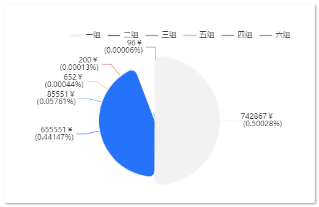
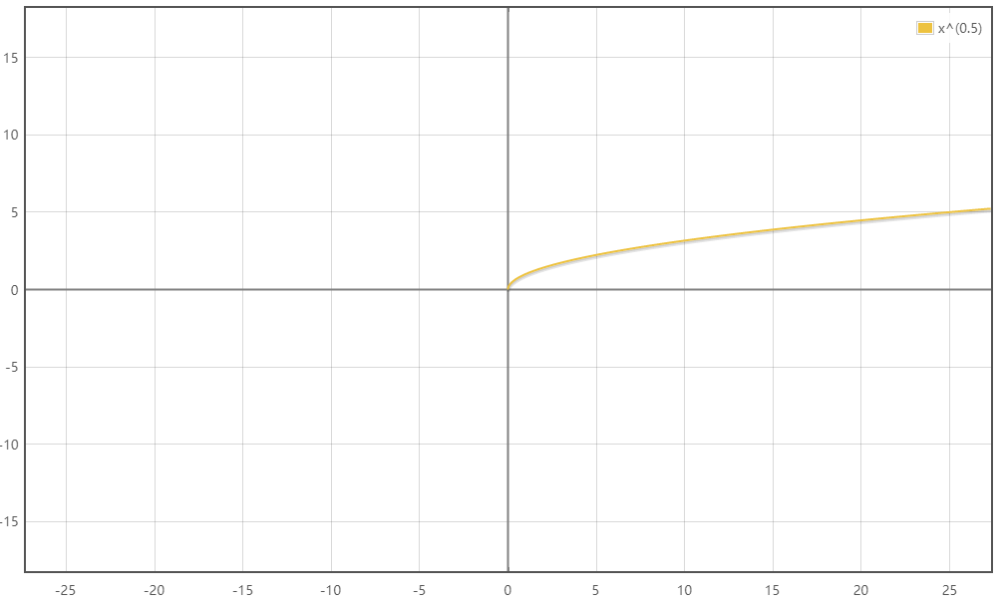
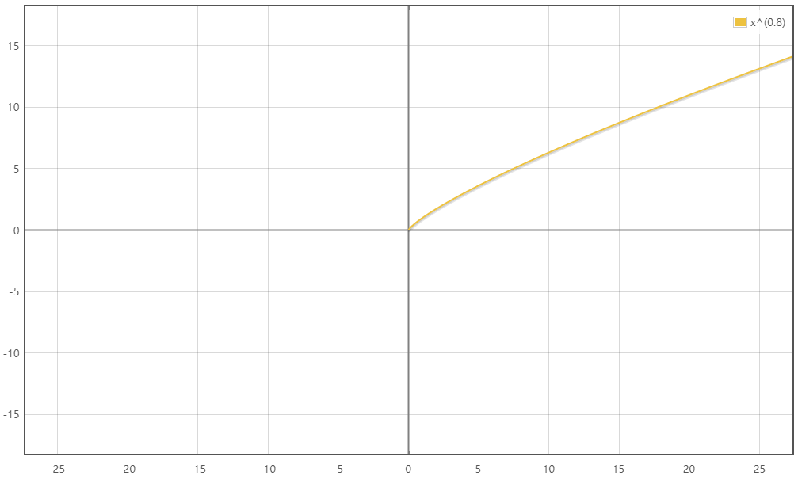
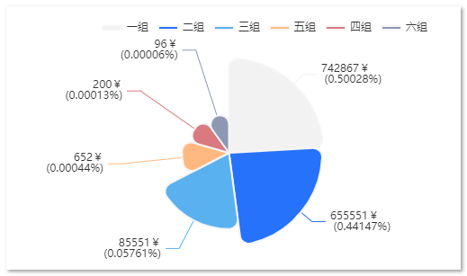

## Echarts Pie RoseType #南丁格尔玫瑰图 #玫瑰图极小值问题

有这样一组数据：

```json
pie: {
    dataSource: [
        { name: '一组', value: 742867 },
        { name: '二组', value: 655551 },
        { name: '三组', value: 85551 },
        { name: '四组', value: 200 },
        { name: '五组', value: 652 },
        { name: '六组', value: 96 },
    ].sort((a, b) => b.value - a.value),
},
```

如果直接将这组数据用于展示：



> roseType: true

可以看到，极小值数据，几乎看不到。

为了解决这种情况， 我们可以利用数学中的 _幂函数_ 来解决：

**`y=x^0.5`**



**`y=x^0.8`**



该函数曲线的特点，即较小值对应的Y值，和大值对应的Y值，差距不大。 x值越大，y值变化越平缓。

所以，我们可以将数据做一下处理：

```javascript
const a = [
  { name: '一组', value: 742867 },
  { name: '二组', value: 655551 },
  { name: '三组', value: 85551 },
  { name: '四组', value: 200 },
  { name: '五组', value: 652 },
  { name: '六组', value: 96 },
].sort((a, b) => b.value - a.value)

const b = a.map((it) => {
  return {
    name: it.name,
    value: it.value ** 0.099, // 值越大，数据差越小 最大值为0.5
  }
})
```

我们可以得到这样的数据：

```javascript
[{ name: '一组', value: 3.8125908000644397 }, { name: '二组', value: 3.765685464082815 }, { name: '三组', value: 3.0781535758618612 }, { name: '五组', value: 1.8993741014853285 }, { name: '四组', value: 1.6896702968622095 }, { name: '六组', value: 1.5712484130901458 }]
```

这样，我们就能放大极小值的占比，缩小极大值的占比。 需要注意的是tooltip 和 label 的formatter 需要重新设定。 因为渲染值和实际值不同。



以下是完整的组件代码：

```javascript
<template>
  <div />
</template>

<script>
// import resize from "@/views/dashboard/mixins/resize";

export default {
  // mixins: [resize],
  props: {
    dataSource: {
      // 不直接传入轴数据 和 系列数据的原因是因为tooltip 需要展示额外的数据字段，ringRatio
      type: Array,
      default: () => [],
    },
  },
  data() {
    return {
      chart: null,
    }
  },
  computed: {
    pieData: function () {
      return this.dataSource
    },
  },
  watch: {
    // 监听数据变化，触发图表绘制刷新
    pieData: {
      handler(val) {
        this.drawChart()
      },
    },
  },
  mounted() {
    this.chart = this.$echarts.init(this.$el, 'macarons')
    this.drawChart()
  },
  beforeDestroy() {
    if (!this.chart) {
      return
    }
    this.chart.dispose()
    this.chart = null
  },
  methods: {
    drawChart() {
      let _this = this
      this.chart.setOption({
        color: ['#f2f2f2', '#2772FB'],
        tooltip: {
          trigger: 'item',
          backgroundColor: 'rgba(255, 255, 255, 0.7)',
          formatter: (p) => {
            let target = this.dataSource.find((it) => it.name === p.name)
            let temp = 0
            this.dataSource.forEach((it) => {
              temp += it.value
            })
            let sum = temp
            let realVal = target.value
            let realPercent = (realVal / sum).toFixed(5)
            return target.name + ' ' + realVal + '￥\n (' + realPercent + '%)'
          },
        },
        title: {
          show: false,
          text: 'Income\nDistribution',
          // textAlign: 'center',
          // textVerticalAlign: 'middle',
          top: '43%',
          left: 'center',
          textStyle: {
            color: '#3C3B39',
            fontWeight: 'normal',
            fontFamily: '苹方-简',
            fontSize: 22,
          },
        },
        legend: {
          data: _this.pieData.map((it) => it.name),
          type: 'plain', // 普通图例
          orient: 'horizontal', // 水平
          right: 0, // 左距离
          top: 0, // 下距离
          // itemGap: 20, // 间隔
          itemWidth: 22, // 图形宽度。
          itemHeight: 4, // 图形高度。
          itemStyle: {
            // color:''
          },
        },
        series: [
          {
            // name: 'Access From',
            type: 'pie',
            avoidLabelOverlap: true,
            radius: ['0%', '70%'],
            center: ['50%', '50%'],
            roseType: true,
            // minAngle: 5,
            label: {
              show: true,
              // bleedMargin: 0, // 放置文字被折叠
              // alignTo: 'labelLine',
              formatter: (p) => {
                let target = this.dataSource.find((it) => it.name === p.name)
                let temp = 0
                this.dataSource.forEach((it) => {
                  temp += it.value
                })
                let sum = temp
                let realVal = target.value
                let realPercent = (realVal / sum).toFixed(5)
                return realVal + '￥\n (' + realPercent + '%)'
              },
              // formatter: ['{bs|{b}} {ds|{d}%}', '{cs|{c}(￥)}'].join('\n'),
              // rich: {
              //   bs: {
              //     color: '#000',
              //     fontSize: 14,
              //   },
              //   ds: {
              //     color: '#000',
              //     fontSize: 14,
              //   },
              //   cs: {
              //     color: '#000',
              //     fontSize: 12,
              //     align: 'center',
              //   },
              // },
            },
            itemStyle: {
              borderRadius: 10,
              borderColor: '#f5f5f5',
              borderWidth: 2,
              label: {
                // position: 'inside',
                fontSize: '16',
                align: 'center',
                // fontWeight: 'bolder',
                fontFamily: '苹方-简',
                overflow: 'breakAll',
              },
              labelLine: {
                show: true,
              },
            },

            data: _this.pieData.map((it) => {
              // 这里为了放大数据的差距，在roseType:true时，让小值能够较好的展示出来，如果roseType为false。 直接赋值_this.pieData，需要注意的时候，label和 tooltip的展示值需要调整
              return {
                name: it.name,
                value: Math.pow(it.value, 0.099), // 值越大，数据差越小 最大值为0.5
              }
            }),
          },
        ],
      })
      _this.resize() //首次绘制 resize
    },
    resize() {
      this.chart.resize({
        width: 'auto', //自动获取dom宽度
        height: (() => {
          return 'auto'
        })(),
      })
    },
  },
}
</script>
```

> 数据值为：
>
> ```javascript
> [{ name: '一组', value: 3.8125908000644397 }, { name: '二组', value: 3.765685464082815 }, { name: '三组', value: 3.0781535758618612 }, { name: '五组', value: 1.8993741014853285 }, { name: '四组', value: 1.6896702968622095 }, { name: '六组', value: 1.5712484130901458 }]
> ```
