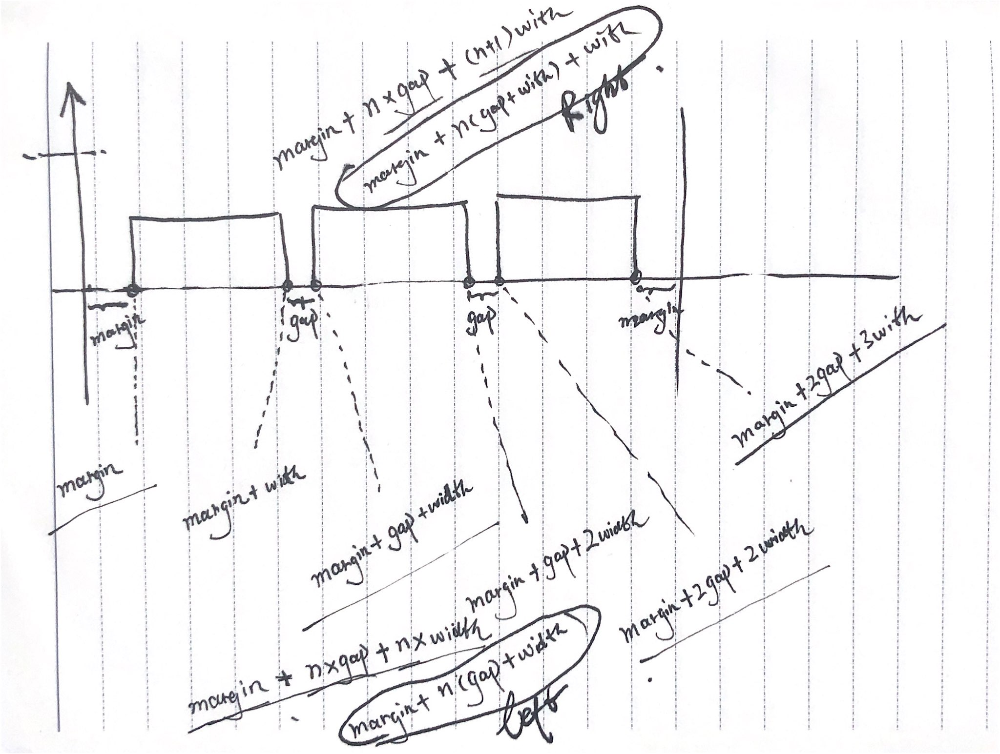
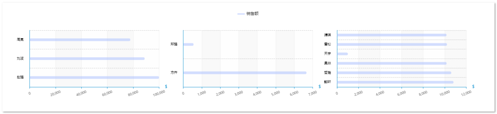
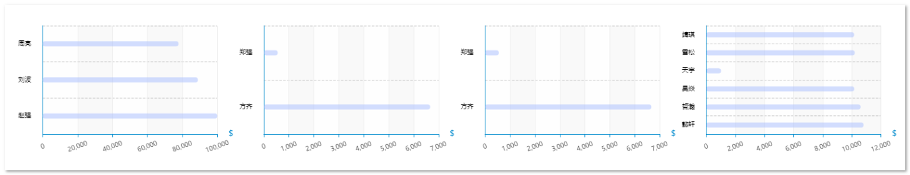
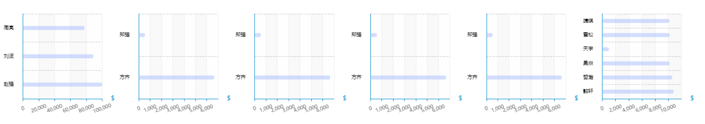

其实很简单，简单画一画就清楚了,大致的关系如下图示：



```json
// 实例数据
dataSource: [
    {
        name: '一组',
        currencySymbol: '￥',
        value: [
            {
                name: '赵强',
                value: 99999,
            },
            {
                name: '刘波',
                value: 88888,
            },
            {
                name: '周亮',
                value: 77777,
            },
        ],
    },
    {
        name: '二组',
        currencySymbol: '￥',
        value: [
            {
                name: '方齐',
                value: 6666,
            },
            {
                name: '郑强',
                value: 555,
            },
        ],
    },
    {
        name: '三组',
        currencySymbol: '￥',
        value: [
            {
                name: '懿轩',
                value: 10810.74,
            },
            {
                name: '哲瀚',
                value: 10603.07,
            },
            {
                name: '昊焱',
                value: 10169.32,
            },
            {
                name: '天宇',
                value: 1022.98,
            },
            {
                name: '雪松',
                value: 10207.0,
            },
            {
                name: '靖琪',
                value: 10163.52,
            },
        ],
    },
],
```








> 完整组件代码
>
> ```javascript
> <template>
>   <div />
> </template>
> 
> <script>
> // import resize from "@/views/dashboard/mixins/resize";
> import Color from '@/views/dashboard/css/theme.js'
> 
> export default {
>   // mixins: [resize],
>   props: {
>     dataSource: {
>       // 不直接传入轴数据 和 系列数据的原因是因为tooltip 需要展示额外的数据字段，ringRatio
>       type: Array,
>       default: () => [],
>     },
>   },
>   data() {
>     return {
>       chart: null,
>     }
>   },
>   computed: {
>     // xAxisData: function () {
>     //   // 从props 中取出轴数据
>     //   return this.dataSource.map((it) => it.time)
>     // },
>     // seriesData1: function () {
>     //   // 从props 中取出系列
>     //   return this.dataSource.map((it) => it.count * 0.2)
>     // },
>     // seriesData2: function () {
>     //   // 从props 中取出系列
>     //   return this.dataSource.map((it) => it.amount)
>     // },
>   },
>   watch: {
>     // 监听数据变化，触发图表绘制刷新
>     dataSource: {
>       handler(val) {
>         this.drawChart()
>       },
>     },
>   },
>   mounted() {
>     this.chart = this.$echarts.init(this.$el, 'macarons')
>     this.drawChart()
>   },
>   beforeDestroy() {
>     if (!this.chart) {
>       return
>     }
>     this.chart.dispose()
>     this.chart = null
>   },
>   methods: {
>     drawChart() {
>       let _this = this
>       let grid = []
>       let yAxis = []
>       let xAxis = []
>       let series = []
>       let color = Color.ColorSeries
> 
>       _this.dataSource.forEach((it, index) => {
>         function stucGrid() {
>           // 构建grid数据
>           let gap = 20 //间距
>           let margin = 3
>           let length = _this.dataSource.length // 数组长度
>           let width = (100 - gap * (length - 1) - 2 * margin) / length // 每个grid的宽度,减去的gap 是最后一个grid的right值
>           grid.push({
>             id: it.name,
>             top: 0,
>             bottom: '10%',
>             left: margin + index * (gap + width) + '%',
>             right: 100 - (margin + index * (gap + width) + width) + '%',
>           })
>           console.log(grid, '--line80')
>         }
>         function strucyAxis() {
>           let temp = Object.assign(
>             {
>               gridIndex: index,
>             },
>             new Object({
>               show: true,
>               type: 'category',
>               nameTextStyle: {
>                 fontSize: 14,
>                 fontFamily: 'Microsoft YaHei',
>                 align: 'right',
>                 color: '#000',
>               },
>               offset: 10,
>               axisTick: {
>                 show: false,
>               },
>               axisLine: {
>                 show: true,
>                 lineStyle: {
>                   color: '#d8d8d8',
>                 },
>               },
>               axisLabel: {
>                 fontSize: 10,
>                 color: '#000',
>               },
>               splitLine: {
>                 show: false,
>                 lineStyle: {
>                   color: '#d8d8d8',
>                   width: 1,
>                   type: 'dashed',
>                 },
>               },
>               data: it.value.map((_it) => _it.name),
>             })
>           )
>           yAxis.push(temp)
>         }
>         function strucxAxis() {
>           let temp = Object.assign(
>             {
>               gridIndex: index,
>             },
>             new Object({
>               name: '＄',
>               type: 'value',
>               inverse: false,
>               // boundaryGap: true,
>               axisLine: {
>                 show: true,
>                 lineStyle: {
>                   color: '#d8d8d8',
>                 },
>               },
>               axisTick: {
>                 show: true,
>                 alignWithLabel: true,
>               },
>               axisLabel: {
>                 color: 'rgba(0, 0, 0, 0.85)',
>                 fontSize: 10,
>                 interval: 0, // 标签细粒度
>                 rotate: 20,
>                 align: 'center',
>                 margin: 20, //标签与轴线的距离
>                 // verticalAlign: 'bottom',
>               },
>               splitLine: {
>                 show: true,
>                 lineStyle: {
>                   color: '#d8d8d8',
>                   width: 1,
>                   type: 'dashed',
>                 },
>               },
>               splitArea: {
>                 show: false,
>               },
>             })
>           )
>           xAxis.push(temp)
>         }
>         function strucSeries() {
>           let temp = {
>             name: '销售额', // lengend need this
>             type: 'bar',
>             smooth: true,
>             showSymbol: true,
>             symbol: 'diamond',
>             symbolSize: 8,
>             // barGap: '-100%',
>             xAxisIndex: index,
>             yAxisIndex: index,
>             data: it.value.map((_it) => _it.value),
>             label: {
>               show: true,
>               position: 'right', //top / left / right / bottom / inside / insideLeft / insideRight / insideTop / insideBottom / insideTopLeft / insideBottomLeft / insideTopRight / insideBottomRight。
>               // color: '#fff',
>               formatter: '{c}' + '(' + it.currencySymbol + ')',
>             },
>             barWidth: 20,
>             itemStyle: {
>               borderRadius: 8,
>               color: new _this.$echarts.graphic.LinearGradient(
>                 0,
>                 0,
>                 1,
>                 1,
>                 [
>                   {
>                     offset: 0,
>                     color: color[index],
>                   },
>                   {
>                     offset: 1,
>                     opacity: 0.5,
>                     color: color[index] + '33',
>                   },
>                 ],
>                 false
>               ),
>             },
>           }
>           series.push(temp)
>         }
>         stucGrid()
>         strucyAxis()
>         strucxAxis()
>         strucSeries()
>       })
>       this.chart.setOption({
>         title: {
>           show: false,
>         },
>         tooltip: {
>           trigger: 'axis',
>           backgroundColor: Color.Tooltip_bg,
>           axisPointer: {
>             type: 'shadow',
>           },
>           // formatter:''
>         },
>         legend: {
>           show: false,
>         },
>         grid,
>         yAxis,
>         xAxis,
>         series,
>       })
>       // _this.resize() //首次绘制 resize
>       // 窗口缩放resize
>       // window.addEventListener("resize", _this.resize()); //这个不加也可以，但是加了在resize的时候更加流畅
>     },
> 
>     // resize() {
>     //   this.chart.resize({
>     //     width: 'auto', //自动获取dom宽度
>     //     height: (() => {
>     //       return 'auto'
>     //     })(),
>     //   })
>     // },
>   },
> }
> </script>
> <style scoped>
> .tooltip-wrapper {
>   background-color: aqua;
> }
> </style>
> ```
>