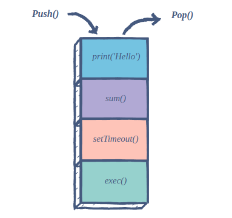
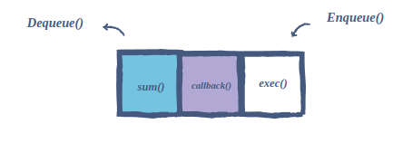
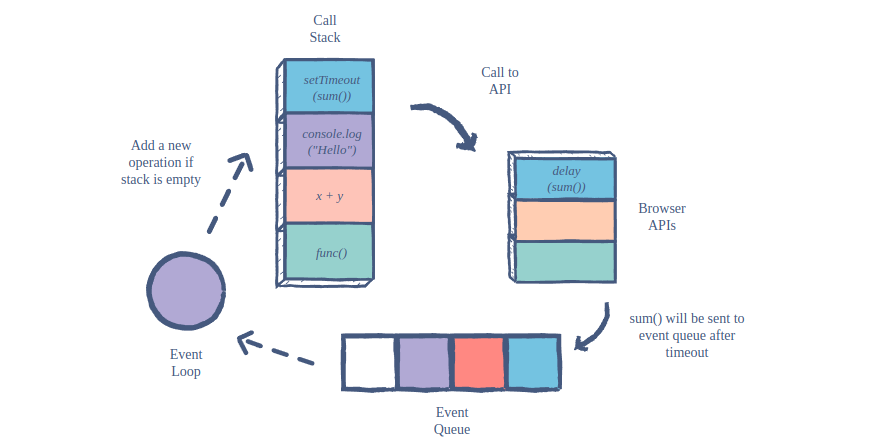

## 简述 JavaScript 中的事件循环(even loop) 是什么？

> 本文翻译自 [link](https://www.educative.io/answers/what-is-an-event-loop-in-javascript)

**event loop** 是 Javascript 异步编程背后的奥秘，JS 执行所有的操作都是 **单线程**， 但是利用一些小聪明的数据结构， 能够给我们一些多线程操作的错觉。 让我们看看在这背后发生了什么？

**调用栈 (call stack)**

**call stack ** 负责跟踪待执行的所有操作。每当一个函数执行完毕，它就会从栈中弹出。

**事件队列（event queue）**

**event queue** 负责将新的函数发送到 **调用栈** 进行处理， 它遵循队列数据结构， 以维护将所有操作发送到执行的正确顺序。

无论何时， 当一个**异步函数**被调用的时候， 它将会被发送到**浏览器的API**, 这些 API 是浏览器内置的， 基于来自 **call stack** 的指令，<u>这些 API 开始他们自己的单线程操作</u>。

`setTimeout` 方法是一个很好的例子， 当在 call stack 中执行一个 `setTimeout` 操作时， 它将会被发送到对应的 API, 该 API 等待指定的时间后将此操作发送回进行处理。

那它将会把该操作发送到哪里呢？ —— event queue, 由此来看，在 Javascript 我们有一个循环系统，去执行异步操作。 该语言本身是 单线程的， 但是 浏览器的 APIS 都是多个独立的线程。

那 event loop 呢？ event loop 促使了这整个过程， 它会不断的检查，当前调用栈是否为空， 如果为空， 新的 functions， 就会从 事件队列中 添加进来， 否则，当前 function 的调用就处理完毕了。

**总结**

> 总结的来说， 当谈及 event loop 的时候，我们不能单独去思考， 因为它是 JavaScript 异步编程中的一环。 在描述一个概念时， 要从 WWH (what-why-how) 思考框架去阐述。

- **What :** Event loop 是 JavaScript 异步编程中的一个概念， JavaScript 是一个单线程的语言， 通过异步编程的思想，能够让 JavaScript 模拟出 多线程操作的效率。

- **Why :** Event loop 是一个非常必要的机制， 它保证了事件能够被按照正确的顺序处理， 是整个异步函数调用的枢纽。负责管理调用栈和事件队列之间的交互。

- **How : ** 当一个异步函数被**调用栈**所调用时， 会被发送到 浏览器对应的API 去执行， 当异步操作执行完毕的时候，浏览器会将回调添加到 **事件队列**， **事件循环** 会不断检查当前调用栈是否为空， 如果为空就从 事件队列的顶部取出一个 事件放入到 调用栈中去执行。 在这个过程中， Event loop 事件循环起到一个连接闭环的作用。

  > 补充说明， 以 setTimeout 为例， 当调用栈遇到该方法的时候，会发送到 浏览器对应的 api, 然后等待指定时间后， 将回调又追加到 事件队列尾部。 event loop 会在调用栈为空时，从事件队列中取出事件压入到调用栈， 然后不断循环这个过程。
  >
  > > 这也是为什么说 setTimeout 无法做到完全准确的原因， 实际上 setTimeout 的第二个参数指定的是执行回调的最小时间(最理想状态下, 事件队列前面为空， 调用栈为空)
