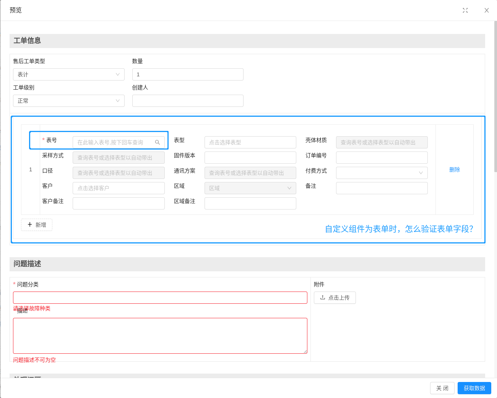
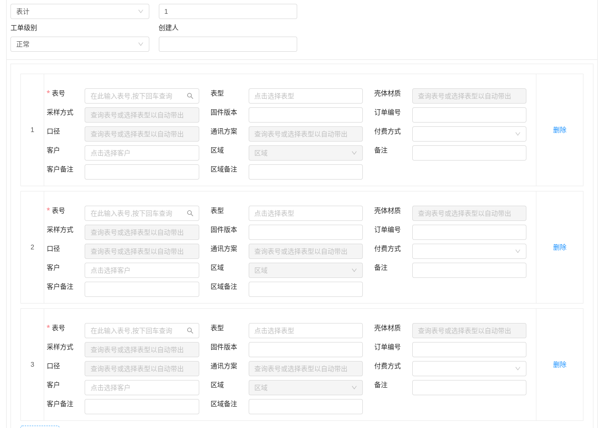
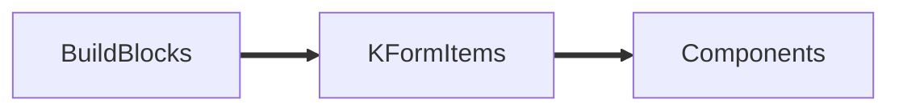
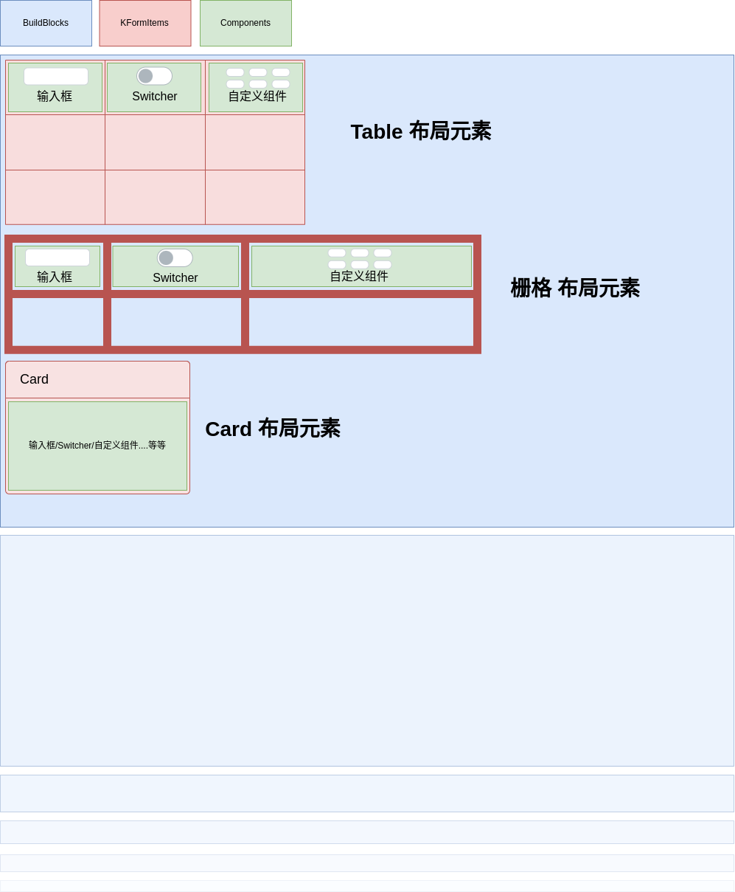

[toc]

### 1. 问题描述

项目中遇到一个问题，自定义的组件，没办法触发表单的验证：



默认在获取数据的时候，整体表单触发了验证， 但是如果是一个自定义的表单组件，该怎么触发验证呢？

我自定义表单组件的根组件为 ： src/components/laison/AftersaleCutsomComponents/DcuCiuDynamicForm.vue

它引入了一个子组件为： src/components/laison/AftersaleCutsomComponents/comps/DcuCiuFormItem.vue

它实际上将会渲染出一个表单列表，就像这样：


实际上, 我需要这些表单都要执行验证该怎么办呢？

### 2. KFormDesign 的组件渲染结构

KFormDesign 的组件渲染大致是这样的一个结构：



一个表单，大致由 多个 BuildBlocks 组成，即 “ 块 ” 。

而每个 BuildBlock 又由 KFormItems 组成，KFormItem 可能是布局元素， 也可能是实际的组件 Components

而 Components 就可以细分为各种预定义组件，以及自定义组件。

从页面的解构上来看，大至是这样的：



### 3. KFormDesign 代码层面的逻辑

#### 3.1 从触发验证开始：

**src/components/kform/KFormBuild/index.vue**

```js
getData() {
    // 提交函数，提供父级组件调用
    return new Promise((resolve, reject) => {
        try {
            this.form.validateFields(async (err, values) => {
                if (err) {
                    reject(err)
                    /**
               * @author: lizhichao<meteoroc@outlook.com>
               * @Description: 多容器校验时，提供error返回给多容器进行判断。
               */
                    this.validatorError = err
                    return
                }
                this.validatorError = {}
                this.$refs.buildBlocks.forEach(async (item) => {
                 if (!item.validationSubform()) {
                   reject(err)
                 }
......
......
```

当点击获取数据时，将会触发该值`getData()` 方法， 它会直接通过 `this.form.validateFields`去验证表单， 该方法提供了一个回调， 可以看到， 这里对 动态表格 KBatch 进行了特别处理， 它会去验证每个字段项。

但是我们需要验证自己的嵌套表单，在 **src/components/kform/KFormBuild/buildBlocks.vue** 中，可以看到：

它可能是布局组件， 可能就是实际的组件，

1. 所以我们的目标就是找到这些需要验证的自定义表单组件，
2. 表单的验证通常是一个异步的过程，以antdv 为例， `form.validate()` 将返回一个 Promise， 这就意味着 从组定义表单的验证到这里的 `getData()` 方法中， 都需要依赖 Promise 处理。

#### 3.2 怎么处理自定义表单验证 ？

那么这里首先， 怎么找到需要验证的自定义表单？ 我们给自定义表单组件，提供一个 验证方法，然后去查找所有组件，如果有这个验证方法，我们就收集起来。

以我这里的应用场景为例， **DcuCiuFormItem** 组件中，是单个的表单，我们暴露一个验证方法，然后返回一个 Promise ：

```js
// src/components/laison/AftersaleCutsomComponents/comps/DcuCiuFormItem.vue
validateForm() {
    // Promise
    return this.$refs.ruleForm.validate()
},
```

在自定义根组件中， 因为我们实际验证一个表单列表：

```js
// src/components/laison/AftersaleCutsomComponents/DcuCiuDynamicForm.vue
validateCurrentForm() {
    return new Promise((resolve, reject) => {
        if (this.$refs.dcuCiuFormItem) {
            const validates = this.$refs.dcuCiuFormItem.map((it) => it.validateForm())
            Promise.all(validates)
                .then(() => {
                resolve()
            })
                .catch((err) => {
                reject(err)
            })
        } else {
            resolve()
        }
    })
},
```

我们收集了所有的子表单项， 然后收集起来，利用 `Promise.all` 处理， 紧接着，返回一个新的 Promise, 把 验证的结果返回出去。

现在， 关于自定义表单组件的工作就完成了。

#### 3.3 怎么找到收集这些表单验证 ？

按照上面的分析，结合代码，我们可以找到，从外到里， 代码的主要引用线路是：

src/components/kform/KFormBuild/buildBlocks.vue --> src/components/kform/KFormItem/index.vue --> src/components/kform/KFormItem/customComponent.vue --> 动态组件component --> src/components/laison/AftersaleCutsomComponents/DcuCiuDynamicForm.vue

到 src/components/kform/KFormItem/index.vue 这里， 也就是 KFormItem , 可能渲染为布局组件，也可能渲染成实际的组件， 所以我们可以在这里去遍历判断： 最终的代码如下

```vue
...
<KFormItem
    v-else-if="!record.options.hidden && !laisonHiddenFlag"
    ref="nestedComponents"
    @handleReset="$emit('handleReset')"
    @change="handleChange"
    :disabled="disabled"
    :dynamicData="dynamicData"
    :sunOfProps="sunOfProps"
    :rootCompent="rootCompent"
    :stockRecord="stockRecord"
    :key="record.key"
    :record="record"
    :formConfig="formConfig"
    :config="config"
  />
...
```

```js
// src/components/kform/KFormBuild/buildBlocks.vue
methods:{
...
validateKFormItem() {
  let cusCompList = []
  /**
    * @description: 递归查找 含有validateCurrentForm 方法的子组件
    * @param {*} target
    * @return {*}
    */
  function digCusComp(target) {
    if (typeof target === 'object' && target instanceof Array && target.length > 0) {
      // 如果为数组， 则说明是布局组件， 那么去查询每一项, 如果能找到定义有 `validateCurrentForm` 方法 的自定义组件，那么将该组件收集起来， 否则就递归重新执行 digCusComp 方法
      for (let i = 0; i < target.length; i++) {
        if (target[i].$refs && target[i].$refs.cusComp) {
          if (target[i].$refs.cusComp.$refs.actualCusComp.validateCurrentForm) {
            cusCompList.push(target[i].$refs.cusComp.$refs.actualCusComp)
          }
        } else {
          digCusComp(target[i].$children)
        }
      }
    } else if (
      // 如果不是数组， 则说明说明，当前项就是一个组件，去判断它是否为我们符合条件的自定义组件， 是的话同样，收集到 cusCompList
      typeof target === 'object' &&
      !(target instanceof Array) && //不是数组， 这里可能是空数组
      target.$refs &&
      target.$refs.cusComp &&
      target.$refs.cusComp.$refs.actualCusComp &&
      target.$refs.cusComp.$refs.actualCusComp.validateCurrentForm
    ) {
      cusCompList.push(target.$refs.cusComp.$refs.actualCusComp)
    }
  }
  const nestedComponents = this.$refs.nestedComponents || []
  digCusComp(nestedComponents)
  // 去handle 我们收集的组件集合， 然后触发 定义的 `validateCurrentForm` 方法，他们将返回西岸Promise, 我们交由 Promise.all 处理，并返回到上层。
  const promiseall = cusCompList.map((it) => it.validateCurrentForm())
  return Promise.all(promiseall)
},
...
}
```

我们在这里定义了一个 `validateKFormItem` 方法， 去主要的作用就是递归的去找到 含有validateCurrentForm 方法的子组件，`validateCurrentForm` 方法是我们之前在需要验证的自定义表单组件中定义的。

> 上述的 cusComp 和 actualCusComp 分别是：
>
> **src/components/kform/KFormItem/index.vue**
>
> ```vue
> ...
>   <!-- 自定义组件 -->
>   <customComponent
>     ref="cusComp"
>     v-else-if="customList.includes(record.type)"
>     :record="record"
>     :disabled="disabled || record.options.disabled"
>     :dynamicData="dynamicData"
>     :sunOfProps="sunOfProps"
>     :stockRecord="stockRecord"
>     :rootCompent="rootCompent"
>     @change="handleChange"
>     @input="handleInput"
>     :formConfig="formConfig"
>     v-decorator="[
>       record.model,
>       {
>         initialValue: record.options.defaultValue,
>         rules: record.rules,
>       },
>     ]"
>   />
> ...
> ```
>
> **src/components/kform/KFormItem/customComponent.vue**
>
> ```vue
>     <component
>       ref="actualCusComp"
>       :record="record"
>       :style="`width:${record.options.width}`"
>       @change="handleChange"
>       @input="handleInput"
>       :disabled="disabled"
>       :dynamicData="dynamicData"
>       :sunOfProps="sunOfProps"
>       :stockRecord="stockRecord"
>       :rootCompent="rootCompent"
>       :conditions="cd"
>       :options="record.options"
>       :height="typeof record.options.height !== 'undefined' ? record.options.height : ''"
>       v-decorator="[
>         record.model,
>         {
>           initialValue: record.options.defaultValue,
>           rules: record.rules,
>         },
>       ]"
>       :is="customComponent"
>     ></component>
> ```

#### 3.4 处理返回的 Promise

要知道，一个KFormDesign 表单，是由一系列的 BuildBlocks 组合而成， 我们将改写一部分 `getData()` 逻辑，以handle 上面的 Promise

```js
// src/components/kform/KFormBuild/index.vue
    getData() {
      // 提交函数，提供父级组件调用
      return new Promise((resolve, reject) => {
        try {
          this.form.validateFields(async (err, values) => {
            if (err) {
              reject(err)
              /**
               * @author: lizhichao<meteoroc@outlook.com>
               * @Description: 多容器校验时，提供error返回给多容器进行判断。
               */
              this.validatorError = err
              return
            }
            this.validatorError = {}
            // this.$refs.buildBlocks.forEach(async (item) => {
            // 这个地方仅设计了 KBatch 组件类型的验证
            // if (!item.validationSubform()) {
            //   reject(err)
            // }

            //@jayce 22/08/18-14:10:13 : 增强验证， 子组件为表单的情况下，支持验证
            const validates = this.$refs.buildBlocks.map((item) => {
              if (!item.validationSubform()) {
                reject(err)
              }
              return item.validateKFormItem()
            })
            await Promise.all(validates)
....
```

### 4. 【附件】README开发文档

### 自定义表单验证支持

当自定义组件为一个自定义表单类型时，又期望能够在提交数据时进行验证。

你 **必须** 在自定义表单中暴露出一个名为 `validateCurrentForm()`
的 方法， 该方法必须返回一个 Promise 对象，因为表单验证都是异步工作的。

在实际应用中， 可能会遇到两中常见的用法：

#### 单层表单组件，

这种情况 很简单，只需要在自定义组件的根组件中， 暴露一个名为 `validateCurrentForm` 的方法。

然后直接在该方法中，直接返回 表单 的 validate()方法执行结果 （一个 promise）即可：

如：

```vue
<a-form ref="ruleForm">
......
......
</a-form>
...
methods:{
  validateCurrentForm() {
    return this.$refs.ruleForm.validate()
  }
}
...
```

#### 自定义组件中含多个表单的验证

以 src/components/laison/AftersaleCutsomComponents/DcuCiuDynamicForm.vue 组件为例：

该组件实际上是一个 表单数组， 那么意味着你需要在提交整个表单的之前，先验证所有的表单。

该表单是自定义组件的根组件， 它提供了

```js
validateCurrentForm() {
  return new Promise((resolve, reject) => {
    if (this.$refs.dcuCiuFormItem) {
      const validates = this.$refs.dcuCiuFormItem.map((it) => it.validateForm())
      Promise.all(validates)
        .then(() => {
          resolve()
        })
        .catch((err) => {
          reject(err)
        })
    } else {
      resolve()
    }
  })
},
```

方法，
在该方法中，它用 Promise.all 去 handle 所有的子级的表单。 然后返回了一个 新的 Promise

在其子级表单中， src/components/laison/AftersaleCutsomComponents/comps/DcuCiuFormItem.vue

提供了 validateForm 方法， 它直接返回了 表单的验证方法 （validateForm 可以任意命名，只要在父级组件中，validateCurrentForm 方法中，正确调用该方法即可。）

```js
validateForm() {
  // Promise
  return this.$refs.ruleForm.validate()
},
```

> antdv 中 this.$refs.ruleForm.validate() 返回一个 promise

### 代码层面的大致思路记录

src/components/kform/KFormBuild/buildBlocks.vue 组件中 提供了一个 `validateKFormItem` 方法
该方法递归的去查找找所有提供了 `validateCurrentForm` 方法的自定义组件。

```js
validateKFormItem() {
  let cusCompList = []
  /**
   * @description: 递归查找 含有validateCurrentForm 方法的子组件
   * @param {*} target
   * @return {*}
   */
  function digCusComp(target) {
    if (typeof target === 'object' && target instanceof Array && target.length > 0) {
      for (let i = 0; i < target.length; i++) {
        if (target[i].$refs && target[i].$refs.cusComp) {
          if (target[i].$refs.cusComp.$refs.actualCusComp.validateCurrentForm) {
            cusCompList.push(target[i].$refs.cusComp.$refs.actualCusComp)
          }
        } else {
          digCusComp(target[i].$children)
        }
      }
    } else if (
      typeof target === 'object' &&
      !(target instanceof Array) && //不是数组， 这里可能是空数组
      target.$refs &&
      target.$refs.cusComp &&
      target.$refs.cusComp.$refs.actualCusComp &&
      target.$refs.cusComp.$refs.actualCusComp.validateCurrentForm
    ) {
      cusCompList.push(target.$refs.cusComp.$refs.actualCusComp)
    }
  }
  const nestedComponents = this.$refs.nestedComponents || []
  digCusComp(nestedComponents)
  const promiseall = cusCompList.map((it) => it.validateCurrentForm())
  return Promise.all(promiseall)
},
```

它将收集所有 validateCurrentForm 返回的 Promise ， 同样由 Promise.all handle。

该方法将会在 src/components/kform/KFormBuild/index.vue 中
getData 方法中

```js
const validates = this.$refs.buildBlocks.map((item) => {
  if (!item.validationSubform()) {
    reject(err)
  }
  return item.validateKFormItem()
})
await Promise.all(validates)
```

验证失败将会 reject ， 阻塞掉整个表单的提交。
