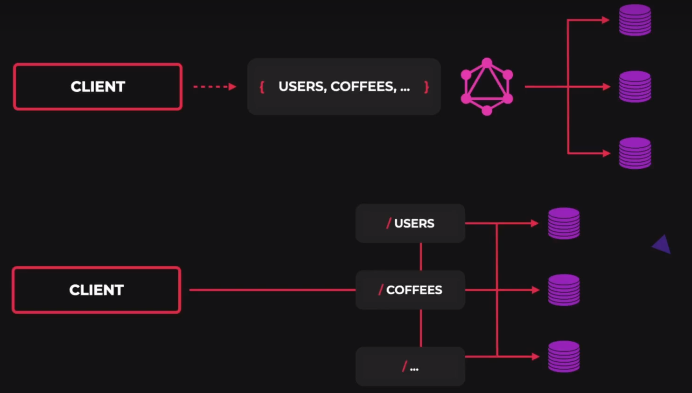
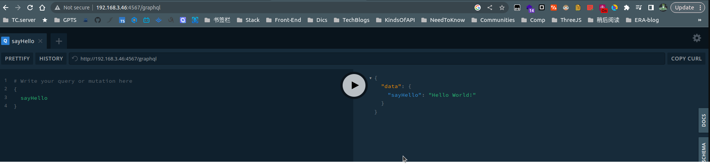
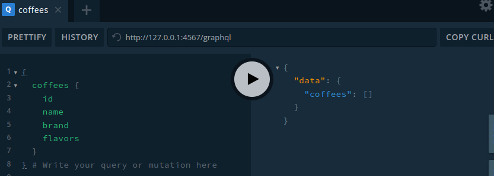
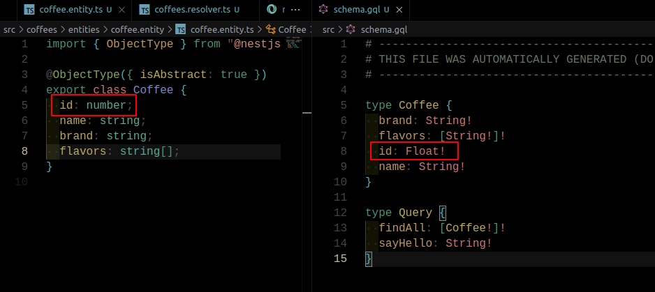
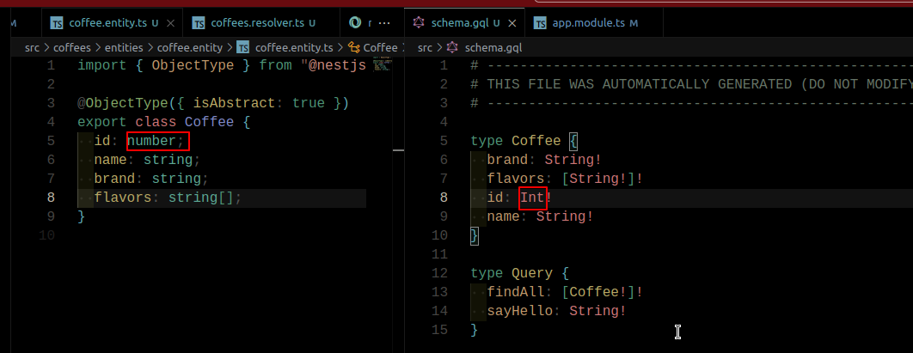
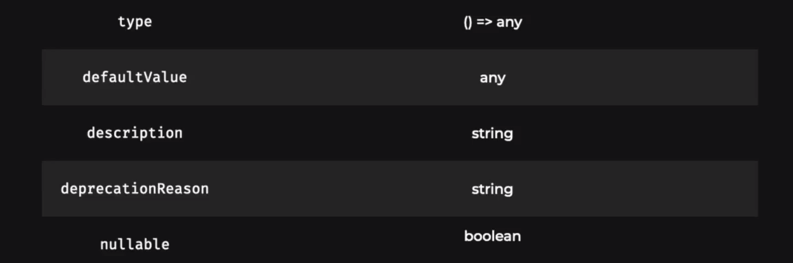
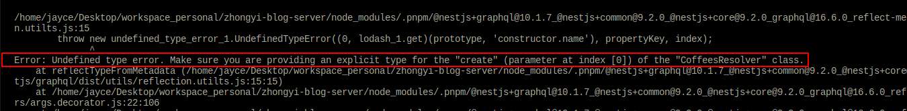
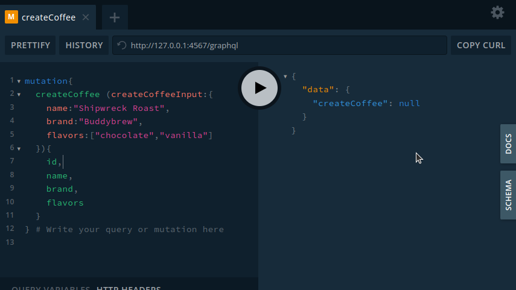

### 普通的RESTFUL 和 GraphQL 的大致区别

简单的说，一个网络请求就是向服务器去获取对应的资源，或者进行 CRUD 操作。 在传统的 RESTFUL API 中， 每一个资源都对应着一个 route, 也就是每一个资源都有一的单独的对应请求。 这些请求返回的资源都由对应的服务器 Controller 去处理并返回组织好的数据结构。 相比较而言， GraphQL 是简化了这个标准， 用一个请求接口， 然后根据不同的传参， 去获取不同的请求数据。 主动权向客户端偏移了。 本质上来讲， 请求都是 基于 HTTP 协议的， GraphQL 本身也不例外， 所以可以理解为， GraphQL 是一个结构上复杂化的 POST 请求， 但是，架构设计上是简化了。

### NestJS 与 GraphQL

NestJS 提供了两种构建 GraphQL程序的方式， 分别是 Code First, 和 Schema First, 这两种方式各有优劣。 后者更趋向原生的 GraphQL 模式， 前者则是一种上层封装， 完全支持通过 TS 的方式去组织 GraphQL, 相比较而言，前者的好处是，去除了从 TS 到 schema 文件的上下文切换， 更加易于维护。

简单的概览：

```ts
import { Resolver, Query } from '@nestjs/graphql';
@Resolver()
export class FooResolver {

  @Query(() => String)
  sayHello(): string {
    return 'Hello World!';
  }
}
```

Code First 方式，利用了装饰器，和 TypeScript 类来自动生成 GraphQL Schema.

NestJS 内置的 `@nestjs/graphql` 模块支持 [Apollo](https://www.apollographql.com/) 和 [Mercurius](https://github.com/mercurius-js/mercurius) ， 下面 使用 Apollo 。

### 安装

```bash
$ npm i @nestjs/graphql @nestjs/apollo @apollo/server graphql
```

### 配置 app.module.ts

```ts
import { GraphQLModule } from '@nestjs/graphql';
import { ApolloDriver, ApolloDriverConfig } from '@nestjs/apollo';

@Module({
  imports: [
    GraphQLModule.forRoot<ApolloDriverConfig>({
      driver: ApolloDriver,
      autoSchemaFile: join(process.cwd(), 'src/schema.gql'),
    }),
  ],
})
```

引入了 nestjs 内置 graphQL 模块 `GraphQLModule`， `ApolloDriver` 和其对应的配置类型声明文件 `ApolloDriverConfig`。 `GraphQLModule` 模块介绍一个 配置对象作为参数。`driver`: 配置驱动为 `ApolloDriver`。 `autoSchemaFile` 是自动生成的 schema 文件的路径， 如果配置为 `true` ，则表示在内存中暂存，而不产生实体文件，上面是在 src/ 目录下生成 schema.gql 文件。

### GraphQL CLI Plugin

借助 nestjs 的插件系统， nestajs 可以在我们编译的过程中运行某些插件，这些插件中， 有一个插件对我们编写 GraphQL 程序有很大的帮助。 就是 GraphQL CLI ， 如果没有这个插件，我们就需要手动去写很多重复的代码去告诉 graphql 包，我们在 graphql 中的类型是如何声明的。

启动该插件

```diff
// nest-cli.json
{
  "$schema": "https://json.schemastore.org/nest-cli",
  "collection": "@nestjs/schematics",
  "sourceRoot": "src",
  "generateOptions": {
    "spec": false
  },
+ "compilerOptions":{
+ "plugins": ["@nestjs/graphql"]
+ }
}
```

### 尝试一下

现在，graphql 程序还不能启动，会报错， 这是因为graphql 检查器要求至少有一个 Query,

为了快速预览，我们快速的让它跑起来。

```bash
mkdir src/graqlQLResolver
touch src/graqlQLResolver/graqlQLResolver.module.ts
```

```ts
// src/graqlQLResolver/graqlQLResolver.module.ts
import { Resolver, Query } from '@nestjs/graphql';
@Resolver()
export class FooResolver {

  @Query(() => String)
  sayHello(): string {
    return 'Hello World!';
  }
}
```

> 在 graphql 中， resolver 用于描述 graphql 操作，

```diff
// app.module.ts
import { GraphQLModule } from '@nestjs/graphql';
import { ApolloDriver, ApolloDriverConfig } from '@nestjs/apollo';
+ import {FooResolver} from "./graqlQLResolver/graqlQLResolver.module"//https://stackoverflow.com/a/64106012/12261182

@Module({
  imports: [
    GraphQLModule.forRoot<ApolloDriverConfig>({
      driver: ApolloDriver,
      autoSchemaFile: join(process.cwd(), 'src/schema.gql'),
+     playground: true,

    }),
+      FooResolver

  ],
})
```

> playground 是 grapql 的自带调试器，开启后可以在 nestjs 的监听端口/graphql 路由下访问到。
> (可以在 main.ts 中查看 listening 端口)



初次尝试并调通后，我们继续下面的学习

### 完整创建示例

假如现在我们需要一个获取咖啡列表的接口，

#### 1. 创建 coffee entity

我们需要定义一个咖啡的实体类型， 以便我们的 schema 支持该类型。

```bash
# terminal
nest g class coffees/entities/coffee.entity --no-spec #--no-spec 指的是不要生成测试文件
```

```ts
// src/coffees/entities/coffee.entity/coffee.entity.ts
import { Field } from '@nestjs/graphql';

// export class CoffeeEntity {} // 将CoffeeEntity修改为了Coffee 以更简洁
@ObjectType({ isAbstract: true }) // fix(没有这个 isAbstract 跑不起来，原教程没有这个)
export class Coffee {
  id: number;
  name: string;
  brand: string;
  // @Field(() => [String]) // 如果没有 GraphQL CLi 这个插件，那么所有的字段都需要像这样，用@Field 字段去装饰每一个属性
  flavors: string[];
}

```

#### 2. 创建 coffee Resolver

```bash
nest g module coffees # 创建 module 以保持模块化和整齐的代码组织
nest g resolver coffess
```

当前目录结构如下：

```bash
jayce@jayce:coffees$ tree
.
├── coffees.module.ts
├── coffees.resolver.ts
└── entities
    └── coffee.entity
        └── coffee.entity.ts
```

并且， resolver 自动被 coffees.module 引入了。

```ts
// src/coffees/coffees.resolver.ts
import { Resolver } from '@nestjs/graphql';

@Resolver() // @Resolver 装饰器将一个类标识为 resolver, 意味这这个类，现在应该被 nestjs 的 GraphQL 模块所收集分析
export class CoffeesResolver {}

```

#### 3. 创建第一个 Query

```ts
// src/coffees/coffees.resolver.ts
import { Query, Resolver } from '@nestjs/graphql';
import { Coffee } from './entities/coffee.entity/coffee.entity';

@Resolver() // @Resolver 装饰器将一个类标识为 resolver, 意味这这个类，现在应该被 nestjs 的 GraphQL 模块所收集分析
export class CoffeesResolver {
  @Query(() => [Coffee])
  async coffees() {
    return [];
  }
}

```

query的名称就是查询的字段， 通常我们会将这些名称解藕，让他更为通用(别名 findAll <---> coffees )

```diff
import { Query, Resolver } from '@nestjs/graphql';
import { Coffee } from './entities/coffee.entity/coffee.entity';

@Resolver() // @Resolver 装饰器将一个类标识为 resolver, 意味这这个类，现在应该被 nestjs 的 GraphQL 模块所收集分析
export class CoffeesResolver {
-  @Query(() => [Coffee])
-  async coffees() {
+  @Query(() => [Coffee],{name:'coffees'})
+  async findAll() {
    return [];
  }
}

```

这样，我们向外暴露的查询接口就是 `findAll`， 而在内部， grapqh 将会去映射处理 `coffees`



#### 4. 对比 entity 和 生成的 schema 文件



可以看到生成的schema 文件中，将 `number` 类型转为 schema 的时候，变成了 `Float`, 这是因为在 Js 中， number 类型就是一个 `Double`.
如果我们希望它转为一个 `Int` 类型， 我们可以在 `app.module.ts` 中增加以下配置：

```diff
//src/app.module.ts
@Module({
  imports: [
    GraphQLModule.forRoot<ApolloDriverConfig>({
      // https://docs.nestjs.com/graphql/quick-start
      driver: ApolloDriver,
      autoSchemaFile: join(process.cwd(), 'src/schema.gql'),
      playground: true,
      sortSchema: true,
+     buildSchemaOptions:{
+       numberScalarMode: 'integer',
+     }
      ...
```

就能改变该编译策略：



> 还有一些类似的编译配置，都可以在 nest 的文档中找到

### 通过 `@Field` 装饰器去定义编译策略

除了向上面那样，定义全局的 number => int 的编译策略，怎么定义更加灵活的策略呢？ 如果有的 number 字段我希望对应 graphql 的 Float 类型，而有的我希望是 Int 怎么办？ ，我们可以通过 `@Field` 这个装饰器完成更加灵活的字段编译配置。

前面提到过， GraphQL CLI 这个插件，帮我们处理很多类型的声明， 如果没有该插件的帮助 我们就需要手动通过 `@Field` 装饰器，去定义我们的实体字段类型, 是不是required 等等。

```ts
// src/coffees/entities/coffee.entity/coffee.entity.ts
import { Field, ObjectType } from "@nestjs/graphql";

@ObjectType({ isAbstract: true })
export class Coffee {
  @Field(() => Number)
  id: number;
  @Field(() => String)
  name: string;
  @Field(() => String)
  brand: string;
  @Field(() => [String]) // 如果没有 GraphQL CLi 这个插件，那么所有的字段都需要像这样，用@Field 字段去装饰每一个属性
  flavors: string[];
}
```

> 实际上 `@Field` 装饰器，可以接收可选的第二个参数，
>
> ```ts
> @Field(()=> Number, { description?, nullable?, deprecationReason?, .... })
> ```
>
> - `nullable` : 是否可以为空， 注意默认所有的字段都是 not nullable, 也就是 required
> - `description`:
> - `deprecationReason`: 用于标记被废弃的字段，提供废弃缘由

但是这并不意味这我们不能或者不需要在某些情况下使用`@Field`装饰器。比如，当TypeScript 类型系统和 GraphQl 的类型系统之间存在潜在的歧义的时候，我们就需要手动添加装饰器以覆盖 GraphQL CLI 的编译策略。

而通常情况下，我们不需要手动去覆盖简单的类型，例如字符串或者布尔类型，但是对于数字类型来说，它可能是有必要的。

例如， ts 中的 number 必须被映射为 graphql 中的 Float 或者 Int.

另一个手动覆盖字段元数据的好例子是，当我们需要使用GraphQL ID **标量（scaler）** 时,也就是一个唯一的标识符， Id 标量通常被用于重新获取一个对象，或者作为一个缓存 key。

在我们当前的实践中， Coffee 的实体 ID 字段被映射到一个 GraphQL Float, 但是作为最佳实践，在这种情况下， 我们应该始终使用 ID 类型。 就像下面这样

```ts
// src/coffees/entities/coffee.entity/coffee.entity.ts
import { Field, ObjectType } from "@nestjs/graphql";

@ObjectType({ isAbstract: true })
export class Coffee {
  @Field(() => ID)
  id: number;
  name: string;
  brand: string;
  flavors: string[];
}
```

> ```ts
> // src/coffees/entities/coffee.entity/coffee.entity.ts
> import { Field, ID, ObjectType } from '@nestjs/graphql';
>
> @ObjectType({ isAbstract: true, description: 'Coffee module' })
> export class Coffee {
>   @Field(() => ID, { description: 'A unique identifier' })
>   id: number;
>   name: string;
>   brand: string;
>   flavors: string[];
> }
> ```
>
> ```ts
> // src/coffees/coffees.resolver.ts
> import { Query, Resolver } from '@nestjs/graphql';
> import { Coffee } from './entities/coffee.entity/coffee.entity';
>
> @Resolver() // @Resolver 装饰器将一个类标识为 resolver, 意味这这个类，现在应该被 nestjs 的 GraphQL 模块所收集分析
> export class CoffeesResolver {
>   @Query(() => [Coffee], { name: 'coffees' })
>   async findAll() {
>     return [];
>   }
> }
> ```
>
> 将会生成以下 schema
>
> ```ts
> # ------------------------------------------------------
> # THIS FILE WAS AUTOMATICALLY GENERATED (DO NOT MODIFY)
> # ------------------------------------------------------
>
> """Coffee module"""
> type Coffee {
>   brand: String!
>   flavors: [String!]!
>
>   """A unique identifier"""
>   id: ID!
>   name: String!
> }
>
> type Query {
>   findAll: [Coffee!]!
>   sayHello: String!
> }
> ```

### 向 graphql handler 传入查询参数

我们也可以在查询处理的方法中向图形查询传递任意数量的参数

```ts
  @Query(() => Coffee, { name: 'coffee' })
  // 默认传入的参数 id 将会被解析为 string, 但是我们需要这个值是数字类型， 我们可以使用  ParseIntPipe 来解决这个问题
  async findOne(@Args('id', { type: () => ID }, ParseIntPipe) id: number) {
    return null;
  }
}
```

```ts
// 当前生成的 schema src/schema.gql
# ------------------------------------------------------
# THIS FILE WAS AUTOMATICALLY GENERATED (DO NOT MODIFY)
# ------------------------------------------------------

"""Coffee module"""
type Coffee {
  brand: String!
  flavors: [String!]!

  """A unique identifier"""
  id: ID!
  name: String!
}

type Query {
  coffee(id: ID!): Coffee!
  coffees: [Coffee!]!
  sayHello: String!
}
```

`@Args` 装饰器允许我们传入一些参数，如下：



### 创建第一个修改接口

在 GraphQL 中，我们使用 `mutation` 去修改数据

像这样：

```ts
type Mutation {
	createCoffee( createCoffeeInput: CreateCoffeeInput!): Coffee!
}
```

示例：

```diff
//src/coffees/coffees.resolver.ts
import { Args, ID, Mutation, Query, Resolver } from '@nestjs/graphql';
import { Coffee } from './entities/coffee.entity/coffee.entity';
import { ParseIntPipe } from '@nestjs/common';

@Resolver() // @Resolver 装饰器将一个类标识为 resolver, 意味这这个类，现在应该被 nestjs 的 GraphQL 模块所收集分析
export class CoffeesResolver {
  @Query(() => [Coffee], { name: 'coffees' })
  async findAll() {
    return [];
  }
  @Query(() => Coffee, { name: 'coffee' })
  // 默认传入的参数 id 将会被解析为 string, 但是我们需要这个值是数字类型， 我们可以使用  ParseIntPipe 来解决这个问题
  async findOne(@Args('id', { type: () => ID }, ParseIntPipe) id: number) {
    return null;
  }

+  // 这里设定 nullable: true 只是临时的，目的是让 graphql 能够 return null, 因为这里暂时没有实现逻辑
+  @Mutation(() => Coffee, { name: 'createCoffee', nullable: true })
+  async create(@Args('createCoffeeInput') createCoffeeInput) {
+    return null;
+  }
+}

```

注意，现在会报错：



因为还没有定义输入类型， 也就是 `createCoffeeInput` 的类型， 创建类型：

```bash
 nest g class coffees/dto/create-coffee.input --no-spec
```

```ts
// src/coffees/dto/create-coffee.input/create-coffee.input.ts
export class CreateCoffeeInput {}
```

定义输入类型：

```diff
// src/coffees/dto/create-coffee.input/create-coffee.input.ts
- export class CreateCoffeeInput {}
+ import { Field, InputType } from '@nestjs/graphql';
+
+ @InputType({ description: 'Create coffee input object type.' }) // description 可选， 只是一个描述
+ // 如果没有 graphql CLI 插件， 这里的每个字段都必须使用 @Field 装饰器装饰
+ export class CreateAdminContentDto {
+   @Field(() => String, { description: 'A new coffee name' })
+   name: string;
+   brand: string;
+   flavors: string[];
+ }
```

在 resolver 中指定类型

```diff
import { Args, ID, Mutation, Query, Resolver } from '@nestjs/graphql';
import { Coffee } from './entities/coffee.entity/coffee.entity';
import { ParseIntPipe } from '@nestjs/common';
+ import { CreateCoffeeInput } from './dto/create-coffee.input/create-coffee.input';

@Resolver() // @Resolver 装饰器将一个类标识为 resolver, 意味这这个类，现在应该被 nestjs 的 GraphQL 模块所收集分析
export class CoffeesResolver {
  @Query(() => [Coffee], { name: 'coffees' })
  async findAll() {
    return [];
  }
  @Query(() => Coffee, { name: 'coffee' })
  // 默认传入的参数 id 将会被解析为 string, 但是我们需要这个值是数字类型， 我们可以使用  ParseIntPipe 来解决这个问题
  async findOne(@Args('id', { type: () => ID }, ParseIntPipe) id: number) {
    return null;
  }

  // 这里设定 nullable: true 只是临时的，目的是让 graphql 能够 return null, 因为这里暂时没有实现逻辑
  @Mutation(() => Coffee, { name: 'createCoffee', nullable: true })
-  async create(@Args('createCoffeeInput') createCoffeeInput) {
+  async create(
+    @Args('createCoffeeInput') createCoffeeInput: CreateCoffeeInput,
  ) {
    return null;
  }
}

```

生成的 schema

```diff
# ------------------------------------------------------
# THIS FILE WAS AUTOMATICALLY GENERATED (DO NOT MODIFY)
# ------------------------------------------------------

"""Coffee module"""
type Coffee {
  brand: String!
  flavors: [String!]!

  """A unique identifier"""
  id: ID!
  name: String!
}

+ """Create coffee input object type."""
+ input CreateCoffeeInput {
+   brand: String!
+   flavors: [String!]!
+
+   """A new coffee name"""
+   name: String!
+ }

+ type Mutation {
+   createCoffee(createCoffeeInput: CreateCoffeeInput!): Coffee
+ }

type Query {
  coffee(id: ID!): Coffee!
  coffees: [Coffee!]!
  sayHello: String!
}
```


