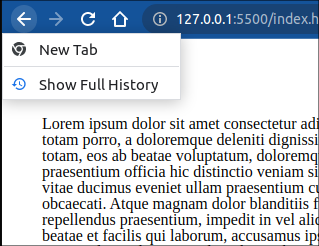
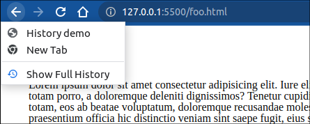
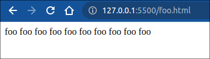
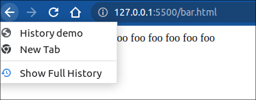

## 1. SPA路由实现的基本原理

前端单页应用实现路由的策略有两种，分别是 **基于hash** 和  **基于 History API**

**基于hash**

>  通过将一个 URL path 用 `#` Hash 符号拆分。— 浏览器视作其为虚拟的片段。

最早前端路由的实现就是 基于 location.hash 来实现的， 有这样几个特性：

- URL 中hash值的改变不会被触发页面的重载
- 页面发送请求时， hash 部分不会被发送
- hash 值的改变，会记录在浏览器的历史记录，可使用浏览器的“后退” “前进”触发页面跳转
- 可以利用 hashchange 事件来监听 hash 的变化

触发hash 变化的方式有两种：

- 通过a 标签的 href 属性，用户点击后，URL 就会发生改变，进而触发 hashchange 事件
- 直接对 location.hash 赋值，从而改变 URL, 触发hashchange 事件。 

**基于 History API**

> 普通的 URL path (无哈希的 URL path)  — 服务器需要拦截路径请求返回 入口 index.html 文件

基于 hash 的实现，存在一些问题，例如

- URL 上很多 `#` 影响美观。 

因此 H5 中，提供了 History API 来实现 URL 的变化。 采用这种策略实现的前端路由， 主要是利用了 popstate 事件来监听历史记录的变化。 

> 补在文章后面：
>
> 除此之外， 基于 Hash 的路由不需要对服务器做改动，但是基于 History API 的路由则需要对服务器做一些 hanle 处理。 


## 2. 相关API 与方法

在开始手动实现之前，有必要先了解一下将会涉及的 API 与 方法。

### 基于 Location.hash 相关

#### location 

##### 实例属性 hash

返回 URL 中 `#` 部分的内容， 例如 `http://www.example.com/index.html#hello` 中的 `#hello` 部分。 

#### 相关方法

##### **`window.hashchange` 方法**

该方法监听url 中， hash 部分改变时的回调。

> 注意:warning:： 用户点击 浏览器的前进后退 按钮，如果url 的hash 发生改变，同样也会触发该方法。 

### History API

#### 实例属性

##### `History.length` [只读属性]

返回 session 历史记录的长度，新打开的tab 页面该属性值为 1 。

##### `History.scrollRestoration`

控制页面刷新时是否记住用户页面的滚动位置。 该值是一个可设定值，有 `auto` 和 `manual` 两种：

- `auto` : 保存页面滚动位置(默认)
- `manual`: 不保存页面滚动位置

> 新打开tab 页面时，滚动位置始终回到页面顶部。 这两个属性仅对 页面刷新有效。 

##### `History.state` [只读属性]

浏览器页面历史记录是一个栈结构，该属性将返回栈顶页面的 状态， 在使用`pushState() ` 或者 `replaceState()` 方法之前， 这个值为 `null`.  state 是一个 js 对象，该对象将会被存储到用户的本地磁盘， 浏览器关闭重启之后，还能够访问历史值。 但是该对象有大小限制(具体大小根据浏览器的实现而定)，一旦所设定内容超出该限制，浏览器将会抛出错误。 

#### 实例方法

##### `History.go()`

该方法控制页面回到历史中的某个相对位置，仅一个可选参数表示前进的步进值，它可以为正值，也可以为负值。

- 如果不传入参数，或者传入 `0`, 则等同于页面刷新。
- 该方法无返回值。

##### `History.back()`

该方法，不接受任何参数。 它等同于 `history.go(-1)`, 也就是页面的 回退 按钮。

##### `History.forward()`

该方法同样不接受参数，等同于 `history.go(1)`, 也就是页面的 前进 按钮

##### `History.pushState()` 和 `History.replaceState()`

语法： 

```js
pushState(state, unused)
pushState(state, unused, url)
```

 state 是一个 js 对象，可以是任意被序列化的值。 第二个参数被废弃了，但是由于历史缘故，依然保留，在使用时，应该传入一个空字符串。 

这两个方法用于手动操作History对象。 

```bash
.
├── foo.html
└── index.html
```

```html
<head>  
	<title>History demo</title>
</head>
<body>
    <button onclick="handleClick()">test</button>
    <p>
        some text here...
    </p>
</body>
```

```js
function handleClick() {
  window.history.pushState({ hello: 'world' }, '', 'foo.html');
}
```

chrome 浏览器中，可以将鼠标按住后退按钮，查看到 History 数组：



此时点击 test 按钮后:



浏览器新打开tab 就会入栈一个 “New Tab”, 点击test 触发 `pushState()` 之后， 会将当且页面“History demo”入栈, 然后当前页面变为 `foo.html`, 页面的状态变作：`{hello: 'world'}`, 可以通过`history.state` 访问到。 

值得注意的是， 页面虽然改变了，但是还没有更新渲染。 此时如果刷新页面，就会更新渲染了。 



但是注意`pushState` 的目标url,必须是一个子域地址，且如果`pushState` 的目标页面不存在，页面刷新之后会报404错误。 


在 `foo.html` 中新增一个按钮，测试 `replaceState` 方法：

```html
<!--foo.html-->
  <body>
    <button onclick="handleReplace()">replace</button>
    foo foo foo foo foo foo foo foo foo foo
    <script src="script.js"></script>
  </body>
```

```js
// script.js
function handleReplace() {
  window.history.replaceState({ foo: 'bar' }, '', 'bar.html');
}
```

当前页面`foo.html` 将会被替换为 `bar.html`, 状态改变为 `{foo: 'bar'}`, 页面同样在刷新后会更新。 

注意， 该方法并不会新增一个记录到历史记录。 



**关于`History.pushState()` 和 `History.replaceState()` 这两个API 的补充：**

1. 这两个API的，第三个参数可以可选的，如果缺省，那么操作默认以当前页面为目标。 第二个参数可以认为始终传入 `""` 一个空串。 
2. 页面不仅仅


#### 相关方法

##### `window.popstate` 方法

该方法当用户通过点击 前进后退 按钮，或者通过js, 调用 `history.go()`, `history.back()`, `history.forward()` 时，将会被触发


了解了所必须的 API，下面详细的试试如何手动实现路由。

## 3. 手写一个简单的路由

### 1.0 预准备

因为接下来的两种实现，我们都将用到同样的文件目录结构，所以在这里我们先创建好他们。

#### 1.0.1 文件目录

```bash
.
├── index.html
├── js
│   └── router.js
└── templates
    ├── 404.html
    ├── about.html
    ├── contact.html
    └── index.html
```

#### 1.0.2 创建服务器 serve 的主 html 文件

```html
<!DOCTYPE html>
<html lang="en">
  <head>
    <meta charset="UTF-8" />
    <meta http-equiv="X-UA-Compatible" content="IE=edge" />
    <meta name="viewport" content="width=device-width, initial-scale=1.0" />
    <meta name="description" />
    <title></title>
  </head>
  <body>
    <nav>
      <a href="/">Home</a>
      <a href="#about">About</a>
      <a href="#contact">Contact</a>
    </nav>
    <div id="content"></div>
    <script src="js/router.js"></script>
  </body>
</html>
```

#### 1.0.3 创建脚本文件

注意一个步骤中的代码，在body闭合标签的上方，我们引入了js脚本。 

### 1.1 基于 History API

#### 1.1.1 添加路由导航

将以下代码添加到  `<nav></nav>` 标签内，作为我们的路由导航。 

```html
<a href="/">Home</a>
<a href="/about">About</a>
<a href="/contact">Contact</a>
```

#### 1.1.2 创建路由数组

```js
// route.js
const routes = {
    404: {
        template: "/templates/404.html",
        title: "404",
        description: "Page not found",
    },
    "/": {
        template: "/templates/index.html",
        title: "Home",
        description: "This is the home page",
    },
    "/about": {
        template: "/templates/about.html",
        title: "About Us",
        description: "This is the about page",
    },
    "/contact": {
        template: "/templates/contact.html",
        title: "Contact Us",
        description: "This is the contact page",
    },
};
```

#### 1.1.3 给导航添加点击事件监听器

```js
//script.js
const route = (event) => {
    event = event || window.event; // get window.event if event argument not provided
    event.preventDefault();
    // window.history.pushState(state, unused, target link);
    window.history.pushState({}, "", event.target.href);
    locationHandler();
};

// create document click that watches the nav links only
document.addEventListener("click", (e) => {
    const { target } = e;
    if (!target.matches("nav a")) {
        return;
    }
    e.preventDefault();
    route();
});
```

#### 1.1.4 创建处理 location URL 的函数

```js
//script.js
const locationHandler = async () => {
    const location = window.location.pathname; // get the url path
    // if the path length is 0, set it to primary page route
    if (location.length == 0) {
        location = "/";
    }
    // get the route object from the urlRoutes object
    const route = routes[location] || routes["404"];
    // get the html from the template
    // 注意这里是怎么获取到html模板的，很具有技巧性
    const html = await fetch(route.template).then((response) => response.text());
    // set the content of the content div to the html
    document.getElementById("content").innerHTML = html;
    // set the title of the document to the title of the route
    document.title = route.title;
    // 如何选中 meta 标签
    // set the description of the document to the description of the route
    document
        .querySelector('meta[name="description"]')
        .setAttribute("content", route.description);
};
```

#### 1.1.5 完成脚本

最后，我们需要在页面首次加载的时候调用一下 `locationHandler` 方法，否则，首页无法呈现。

此外，我们还需要添加 URL 变化的 `watcher`

```js
//script.js
// add an event listener to the window that watches for url changes
window.onpopstate = locationHandler;
// call the urlLocationHandler function to handle the initial url
window.route = route;
// call the urlLocationHandler function to handle the initial url
locationHandler();
```

注意，点击导航，以及用户控制页面前进后退，都会触发页面的渲染。 所以需要调用 `locationHandler` 方法。 

### 1.2 基于hash 的实现

#### 1.2.1 添加路由导航

将以下内容添加在 `<nav></nav>` 标签内：

```html
<a href="/">Home</a>
<a href="#about">About</a>
<a href="#contact">Contact</a>
```

#### 1.2.2 创建路由数组

```js
//script.js
const routes = {
    404: {
        template: "/templates/404.html",
        title: "404",
        description: "Page not found",
    },
    "/": {
        template: "/templates/index.html",
        title: "Home",
        description: "This is the home page",
    },
    about: {
        template: "/templates/about.html",
        title: "About Us",
        description: "This is the about page",
    },
    contact: {
        template: "/templates/contact.html",
        title: "Contact Us",
        description: "This is the contact page",
    },
};
```

#### 1.2.3 创建处理 location URL 的函数

```js
//script.js
const locationHandler = async () => {
    // get the url path, replace hash with empty string
    var location = window.location.hash.replace("#", "");
    // if the path length is 0, set it to primary page route
    if (location.length == 0) {
        location = "/";
    }
    // get the route object from the routes object
    const route = routes[location] || routes["404"];
    // get the html from the template
    const html = await fetch(route.template).then((response) => response.text());
    // set the content of the content div to the html
    document.getElementById("content").innerHTML = html;
    // set the title of the document to the title of the route
    document.title = route.title;
    // set the description of the document to the description of the route
    document
        .querySelector('meta[name="description"]')
        .setAttribute("content", route.description);
};
```

#### 1.2.4 完成脚本

同样的，页面首次加载，以及 hashchange 的时候都需要调用 locationHandler 函数

```js
//script.js
// create a function that watches the hash and calls the urlLocationHandler
window.addEventListener("hashchange", locationHandler);
// call the urlLocationHandler to load the page
locationHandler();
```


## 4. 总结

### 4.1 原理总结

总结的来说， 基于 **History API** 的实现，主要是利用了 h5 提供的 `pushState`, `replaceState`方法。去改变当前页面的 URL, 同时，利用点击事件 结合 `window.popState` 监听事件触发页面的更新渲染逻辑。 

而 基于 **location.hash** 的实现，则更为简单，直接 利用 a 便签的 href 属性，触发 `hashchange` 事件，进而触发页面的更新逻辑。 

对比起来， 基于 location.hash 的实现要更为简单。 但是基于 History API 实现的路由，URL 中不含有 `#` 而显得用户体验更加良好。

### 4.2 基于History API 的实现需要注意的事项

此外值得注意的一点是， 现在的框架中，大都提供了这两中实现方案。 在实际应用中。 如果应用了 基于 **History API** 的实现方式，**服务器通常需要做一些配置**。 

因为由于单页应用路由的实现是前端实现的， 可以理解为是 “伪路由”， 路由的跳转逻辑都是前端代码完成的，这样就存在一个问题， 例如上面的实现中， `http://127.0.0.1:5500/about` 这个页面用户点击了页面刷新，就会找不到页面。 因为浏览器会向服务器 “http://127.0.0.1:5500/about” 这个地址发送 GET 请求， 希望请求到一个单独的 `index.html` 文件， 而实际上这个文件我们服务器上是不存在的。 我们需要将其处理为：

`http://127.0.0.1:5500/` server 返回首页

`http://127.0.0.1:5500/about` server 返回首页, 然后前端路由跳转到 about 页

`http://127.0.0.1:5500/contact` server 返回首页， 然后前端路由跳转到 contact 页

为了做到这点，所以我们需要对服务器做一些转发处理， 

```nginx
// root 是我本地的页面地址
// try_files 将匹配子级路由全部尝试返回 index.html 文件
server {
    listen 7000;
    location / {
        root /home/jayce/Desktop/temp/demo/front-end-router-implement/HistoryApi;
        index index.html;
        try_files $uri $uri/ /index.html;
    }
}
```

### 4.3 两种实现模式的优势和挑战对比

#### 4.3.1 基于 History API 的实现

##### 优势

1. URL 看起来和普通的url 一样， 更加美观简洁
2. 在 SEO 方面， 普通 url 会有更多的优势
3. 现代框架通常默认支持该模式

##### 挑战

1. 客户端刷新时，会把 SPA 的路由误当作 资源请求链接，所以需要配置 web 服务器以处理这些 “路由形式的URL” 以统一放回入口 index.html 文件。
2. 通常为了让服务器区分这些 “路由形式的URL”, 所以通常需要用一些前缀以区分和普通 请求的区别，如` /api/*`
3. 通过这种方式实现时，定义路由的时候需要特别注意， 因为不当的链接跳转可能会导致全页面重载。


#### 4.3.2 基于 Location.hash 的实现

##### 优势

1. 浏览器不会将 URL.path 中 `#` hash 后面的部分视作一个分页，因此默认的就不会触发页面的重载
2. 在前端定义带有 hash 的链接总是安全的，因为它不会触发页面的重载
3. 服务端不需要额外配置。
4. 实现起来更加简单

##### 挑战

1. SEO 并不友好
2. 用户体验不好


## 参考

1. https://developer.mozilla.org/en-US/docs/Web/API/History/pushState
2. https://developer.mozilla.org/en-US/docs/Web/API/Window/hashchange_event
3. https://developer.mozilla.org/en-US/docs/Web/API/Location/hash
4. https://dev.to/thedevdrawer/single-page-application-routing-using-hash-or-url-9jh
5. https://blog.bitsrc.io/using-hashed-vs-nonhashed-url-paths-in-single-page-apps-a66234cefc96
6. https://www.jianshu.com/p/d2aa8fb951e4
7. https://zhuanlan.zhihu.com/p/116023681#:~:text=%E5%89%8D%E7%AB%AF%E8%B7%AF%E7%94%B1%E5%AE%9E%E7%8E%B0%E5%8E%9F%E7%90%86%E5%B0%B1%E6%98%AF,%E5%AE%9E%E7%8E%B0%E6%96%B9%E5%BC%8FHistory%20%E5%92%8Chash%E3%80%82


## 推荐阅读

[搞不懂路由跳转？带你了解 history.js 实现原理](https://juejin.cn/post/7192479334962528317)