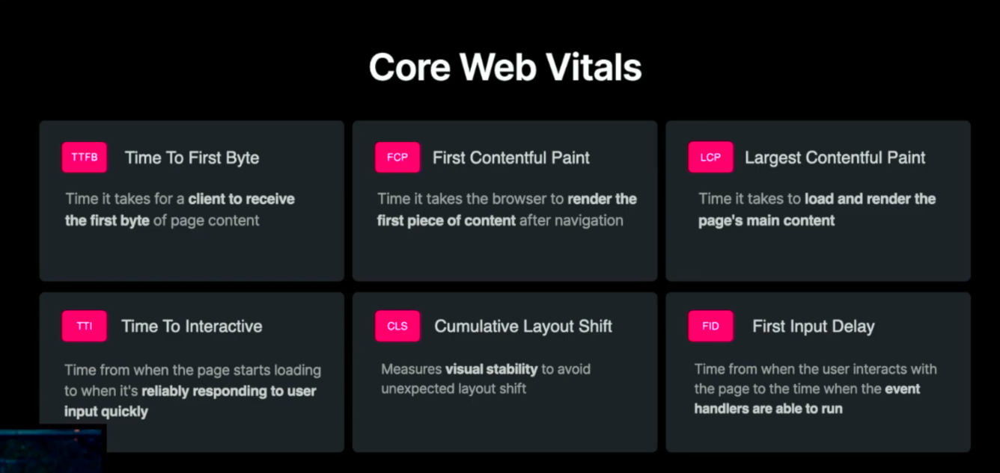

#### TTFB: Time To First Byte

Time it takes for a client to receive the first byte of page content

#### FCP:First Contentful Paint

Time it takes the browser to render the first piece of content after navigation

#### LCP:Largest Contentful Paint

Time it takes to load and render the page's main content

#### TTI:Time To Interactive

Time from when the page starts loading to when it's reliably responding to user input quickly

#### CLS:Cumulative Layout Shift

Measures visual stability to avoid unexpected layout shift

#### FID:First Input Delay

Time from when the user interacts with the page to the time when the event handlers are able to run.
