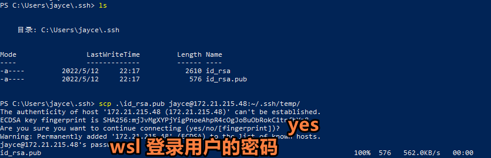
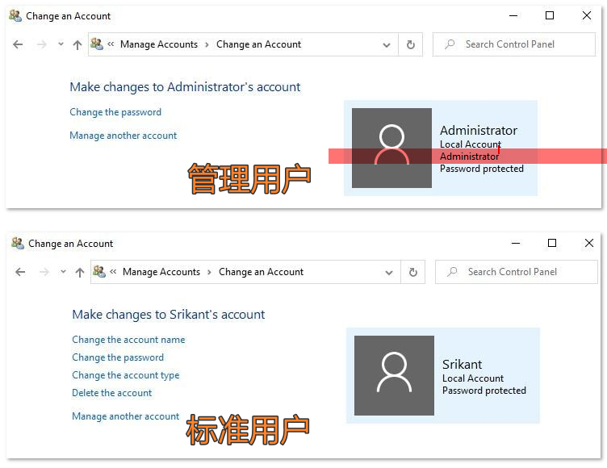
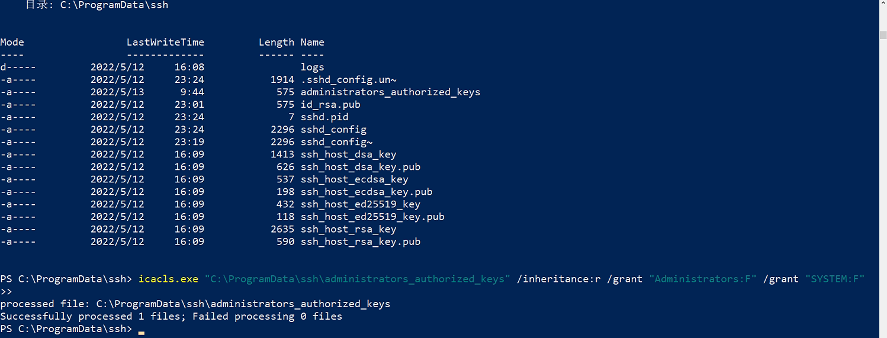

## 1. Windows ,Wsl 相互 SSH 密码登录

### 1.1 双端开启Open-SSh服务

1. Windows 开启Open-SSH

   [相关文档](https://docs.microsoft.com/en-us/windows-server/administration/openssh/openssh_install_firstuse), 执行到 "#Start and configure OpenSSH Server" 就可以了

2. Wsl 开启Open-SSH

   Wsl 自带Open-SSH, 启动方式如下：

   ```bash
   $ sudo service ssh start
   ```

   > 如果遇到以下报错：
   >
   > ```bash
   > sshd: no hostkeys available -- exiting.
   > ```
   >
   > 执行:
   >
   > ```bash
   > $ ssh-keygen -A
   > $ sudo service ssh start
   > # $ sudo service ssh restart 重启
   > ```

### 1.2 测试连接

密码连接非常简单，只要双端开启了 Open-SSH 服务， 就可以连接了：

**测试 Windows to Wsl**

```bash
# windows powshell
$ ssh jayce@172.21.215.48
# jayce 是我wsl用户
# 172.21.215.48 是我wsl 局域网地址

# 然后输入密码就可以了(wsl 用户密码，这里就是jayce 的用户密码)
```

**测试 Wsl to Windows**

```bash
# wsl bash
ssh jayce@192.168.0.101
# jayce 也是我windows用户
# 192.168.0.101 是我 windows 局域网地址
```

> :notebook: Tips
>
> 查看ip地址：
>
> - windows
>
>   ```bash
>   ipconfig
>   ```
>
> - wsl
>
>   ```bash
>   hostname -I
>   ```

## 2. Windows ,Wsl 相互免密登录

**准备工作 —— 配置文件**

在开始前有一些必要的配置需要设定：

以 Wsl 为例：

```bash
# wsl bash

$ sudo vim /etc/ssh/sshd_config
```

有以下字段需要修改：

```bash
PermitRootLogin prohibit-password
#[按需修改] 是否允许以root角色通过ssh登录？， 如果需要设为：
PermitRootLogin yes

#------------------------------------------------------------
PasswordAuthentiation yes #是否开启密码认证？ 在设置免密登录之后，建议关闭(设为 no)

#------------------------------------------------------------
PubkeyAuthentication yes #是否开启公钥认证？ wsl 是默认开启的就不用管

#------------------------------------------------------------
Port 22 #默认端口也是22，建议不要修改，除非22 端口另有别用，且以下教程端口都是默认22端口
```

> :warning: 每次修改完配置文件要重启服务
>
> ```bash
> # windows
> Restart-Service sshd -Force
> # or
> Restart-Service -Name sshd -Force
>
> # wsl
> $ sudo service ssh restart
> ```

### 2.1 双端生成密钥对

```bash
# wsl bash
$ sudo ssh-keygen

# windows powershell 管理员
ssh-keygen

# 然后一路回车就好
```

生成的密钥对位于："~/.ssh/ "目录下，命令行可以通过下面命令访问：

```bash
$ cd ~/.ssh/
```

> :notebook:
>
> Tips:
>
> 配置文件路径：
>
> - windows："C:\ProgramData\ssh\sshd_config"
>
>   > 文件管理器地址栏 "%programdata/ssh%" 回车即可访问，注意该目录须在首次启动sshd服务后才会产生，且属于隐藏目录。 powershell 可能看不到，但是直接可以 `cd ProgramData` 进去。
>
> - Wsl : "/etc/ssh/sshd_config"

### 2.2 向对端添加 本端 的公钥

#### 2.2.1 Windows 到 Wsl (免密登录到 Wsl/Linux)

1. 创建 wsl 临时目录：

   ```bash
   # wsl
   $ mkdir ~/.ssh/temp
   ```

2. 通过 scp 将 windows 公钥发送到 第一步在 wsl 创建的目录，即 wsl 下 "~/.ssh/temp"

   ```shell
   # powershell
   $ cd ~/.ssh/
   $ scp ./id_rsa.pub jayce@172.21.215.48:~/.ssh/temp/
   # jayce 为我自己wsl 用户名，172.21.215.48 是我自己的wsl 局域网ip
   ```

   

3. 将 ~/.ssh/temp/id_rsa.pub 追加到 ~/.ssh/authorized_keys 文件

   ```bash
   # wsl
   $ cd ~/.ssh/
   $ touch authorized_keys #如果目录下有这个文件就不用创建
   $ cat ~/.ssh/temp/id_rsa.pub >> ~/.ssh/authorized_keys
   ```

   > 第1，2，3 步骤， 如果你只需要一台 windows ssh 免密登录到wsl 得话，上述命令可以直接简化为 ：
   >
   > ```bash
   > # windows shell
   > scp C:\Users\jayce\.ssh\id_rsa.pub jayce@172.21.215.48:~/.ssh/authorized_keys
   > ```
   >
   > 这行命令直接将 windows 客户端公钥发送至作为服务端的 wsl "~/.ssh/" 路径下，并重命名为 authorized_keys

4. 重启 wsl sshd 服务

   ```bash
   # wsl
   $ sudo service ssh restart
   ```

5. windows 测试连接 wsl

   ```shell
   # windows powershell
   ssh jayce@172.21.215.48 #回车即可连接上
   ```

#### 2.2.2 Wsl 到 Windows (免密登录到 Windows)

从Wsl (Linux 发行版，以及Windows) 到 Windows 实现免密登录稍有不同。 Windows 上用户分为三类，分别是 管理用户，标准用户，和来宾用户。 一般个人电脑。都是管理账户。更详细可以参看这里 [Windows 10标准用户帐户和管理员帐户之间的区别](https://zh.theihccforum.com/difference-between-standard-user)。

> 如何确定你是否为管理用户？
>
> 

以下步骤基于你是 **管理用户**， 如果你是标准用户，或者有其他问题可以参看这篇文档 [OpenSSH 密钥管理](https://docs.microsoft.com/zh-cn/windows-server/administration/openssh/openssh_keymanagement)

1. 通过 scp 将 wsl 公钥发送到 windows C:/ProgramData/ssh/

   ```bash
   # wsl bash
   $ scp ./id_rsa.pub jayce@192.168.0.101:C:/ProgramData/ssh/administrators_authorized_keys
   # 注意路径
   # jayce 为我自己的windows 用户名
   # 192.168.0.101 为我自己的windows 局域网ip 地址
   ```

   > 以上命令将会把 id_rsa.pub 公钥发送到 windows下，C:/ProgramData/ssh/ 路径下，并重命名为 administrators_authorized_keys

2. 在 Windows 上执行以下命令

   ```shell
   # windows shell

   icacls.exe "C:\ProgramData\ssh\administrators_authorized_keys" /inheritance:r /grant "Administrators:F" /grant "SYSTEM:F"
   ```

   

3. 测试连接

   ```bash
   # wsl bash
   ssh jayce@192.168.0.101
   ```

## 3. 简化登录(可选)

每次去输入IP 以登录有些麻烦， 我们可以为每台机器配置一个 HOST ，让DNS 去解析，从而简化我们的登录。

在Linux， 或者Windows 上都是一样的：

如下对 Wsl 进行配置

```bash
# wsl bash
vim ~/.ssh/config
```

```bash
# 编辑内容如下
 Host  win_home
 HostName 192.168.0.101
 User  jayce
 Port  22
```

```bash
# 测试登录
ssh jayce@win_home
# 连接成功！
```

## 4. 关闭密码验证提高安全性（可选）

修改配置文件

```bash
# wsl path :  /etc/ssh/sshd_config
# windows path:  C:/ProgramData/ssh/sshd_config
PasswordAuthentiation no #关闭密码认证

PubkeyAuthentication yes #开启公钥认证
```

## 5. 可能需要用的命令参考

```shell
# windows
Start-Service sshd #启动服务
Stop-Service sshd #停止服务
Restart-Service sshd #重启服务
```

```bash
# wsl
$ sudo service ssh status #查看运行状态
$ sudo service ssh restart #重启
$ sudo service ssh start #启动
$ sudo service ssh stop #停止
$ sudo service ssh force-reload# 强制重载
```

文章参考：

1. [OpenSSH 密钥管理](https://docs.microsoft.com/zh-cn/windows-server/administration/openssh/openssh_keymanagement)
2. [Windows 10标准用户帐户和管理员帐户之间的区别](https://zh.theihccforum.com/difference-between-standard-user)
