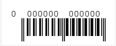
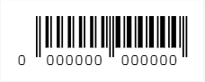
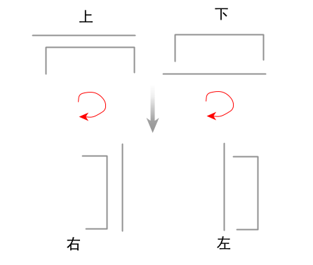
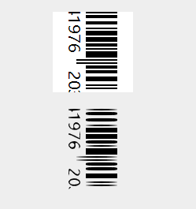
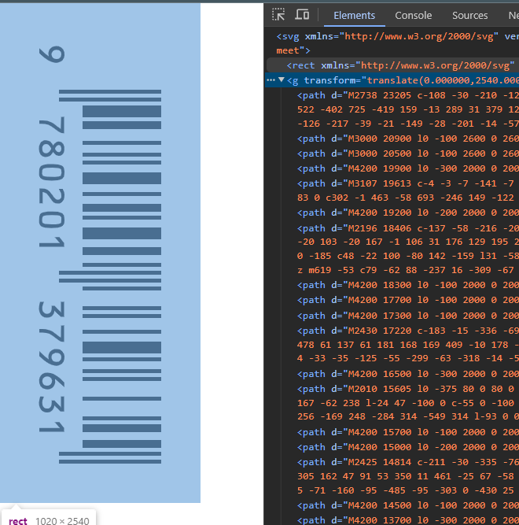

工作业务中，使用到了 [JsBarcode](https://github.com/lindell/JsBarcode) 用于生成条码图， 但是**直接生成的条码图如果为 svg 格式的话，存在一些问题**：

1. 字体丢失

2. 无法旋转条码，我们需求它支持旋转

3. 生成的svg 条码图中的文字部分直接是 `<text>` 元素，未转曲。

   

为了解决这个问题，我的解决思路是:

1. 条码生成的时候插入base64格式的字体文件到 style 标签，追加到生成的svgNode
2. 绘制一个 背景塞入
3. 将生成的svg绘制到 canvas， 在canvas 上旋转
4. 将canvas 通过位图转矢量图转换未转曲后的携带path 的 svg。

> 下面的演示仅包含关键逻辑代码， 并非完整代码

## 追加 字体 文件到svg，修复生成的svg条码字体丢失问题：

```ts
......
// 创建svg节点，用于绘制 svg 条码
const svgNode = document.createElementNS(svgNS, "svg")

// 下面两行代码是因为我这边支持 png 和 svg 导出两种格式， 这边仅演示 options.export !== 'png' 的情况
const canvasNode = document.createElement("canvas")
const node = options.export === 'png' ? canvasNode : svgNode

// 使用 JSBarcode 绘制
JsBarcode(node, code, {
    textPosition: textPosition,
    format: options.symbology,
    lineColor: "#000",
    height: 40,
    margin: 20,
    font: "ocrb",
    //!需要本地指定 fontfaze https://github.com/lindell/JsBarcode/wiki/Options#font
    // 这里的 font 指定，在生成png格式(直接绘制到canvas)的时候，是正常的
    displayValue: true,
    background: '#FFFFFF'
});
```

修复字体：

```ts
// @/assets/fonts/ocrb.base64
// base64 字体文件
export default "data:@file/x-font-ttf;base64,AAEAAAAOAIAAAwBgT1MvMoikfiEAAFAIAAAAVlBDTFR........
```

```ts
import ocrbfont from "@/assets/fonts/ocrb.base64"

fixFont(svgNode)
const fixFont = (svgNode: SVGSVGElement)=>{
    const style = document.createElementNS("http://www.w3.org/2000/svg", "style");
    style.textContent = `
    @font-face {
        font-family: "ocrb";
        src: url('${ocrbfont}');
      }    
    `
    svgNode.append(style)
}
```

修复后的 svgNode 输出转未 xmlString， 方便我们后续处理：
```ts
const xml = new XMLSerializer().serializeToString(svgNode)
```


## 支持旋转并转曲

JsBarcode 支持条码和文字的上下倒置，但是不支持旋转，





所谓旋转，其实就是把条码竖过来，所有符合规则的条码如下图所示：



所以我们只要判断什么收竖直排列条码就可以了， 至于文字如何排列可以在 jsBarcode 绘制阶段就能处理好，也就是 上面的 `textPosition` 字段。

如何完成旋转呢？ 我们可以在canvas 上做到。 

另一个问题是怎么将文字转为 path ？ 这里经过一番调研，请教有经验的同事， 我知道了一个工具， 叫做 [Potrace](https://potrace.sourceforge.net/), 这是一个位图转矢量图的工具， 也就是你喂给它 png/jpeg之类的非矢量图， 它会自动帮你转为 svg path， 我们在web上使用， 这里有一个 wasm 对应的库 [potrace-wasm](https://github.com/IguteChung/potrace-wasm) (直呼大佬nb!!! 大佬救我狗命！)

一番bug之后，我写了一个工具函数，如下：

```bash
├── convertNormalSvg2Path
│   ├── convertCanvas2Svg.ts
│   └── index.ts
```

```ts
// convertCanvas2Svg.ts
import { loadFromCanvas } from "potrace-wasm";
export default (canvas: HTMLCanvasElement, config?: { [x: string]: any }) => {
    return new Promise((resolve, reject) => {
        loadFromCanvas(canvas, config)
            .then((svg:string) => resolve(svg))
            .catch((err:Error) => reject(err));
    })
}
```

```ts
// index.ts
import convertCanvas2Svg from "./convertCanvas2Svg"
/**
 * svgxml: svgXml 字符串
 * scale: 放大倍数,值越大，转换结果越大，在容器固定时就会越清晰
 * isVertical: 横向/竖向
 */

export default (svgxml: string, scale: number = 2, isVertical: boolean):Promise<string> => {
    return new Promise((resolve, reject) => {
        const svgDoc = svgStr2Dom(svgxml)
        // 移除 svg 节点的 transform 属性
        svgDoc.removeAttribute('transform')
        const _svgxml = svgDom2Str(svgDoc)

        const url = 'data:image/svg+xml;charset=utf-8,' + encodeURIComponent(_svgxml);
        const img = new Image();
        img.src = url
        img.onload = async () => {
            if (svgDoc) {
                // 创建一个虚拟的 canvas 画布
                const canvas = document.createElement('canvas');
                // 按照指定规则绘制画布
                drawImg(canvas, svgDoc, img, isVertical, scale)
                try{
                    const newSvgXml = await convertCanvas2Svg(canvas) as string
                    resolve(newSvgXml)
                }catch(err){
                    reject(err)
                }
            }
        }
    })

}


// 设定画布信息
function setCanvas(canvas: HTMLCanvasElement, svgDoc: SVGElement, isVertical: boolean, scale: number) {
    const _width = svgDoc.getAttribute('width');
    const _height = svgDoc.getAttribute('height');
    if (_width && _height) {
        const width = parseInt(_width)
        const height = parseInt(_height)
        canvas.width = isVertical ? height * scale : width * scale
        canvas.height = isVertical ? width * scale : height * scale
    }
}

function drawImg(canvas: HTMLCanvasElement, svgDoc: SVGElement, img: HTMLImageElement, isVertical: boolean, scale: number) {
    setCanvas(canvas, svgDoc, isVertical, scale)
    const ctx = canvas.getContext('2d')
    if (!ctx) return
    ctx.scale(scale, scale);

    if (isVertical) {
        ctx.translate(img.height, 0);
        ctx.rotate((90 * Math.PI) / 180);
    }

    ctx.drawImage(img, 0, 0)
}

function svgDom2Str(svgElement: SVGElement) {
    const serializer = new XMLSerializer();
    // 使用 serializeToString 方法将 DOM 元素序列化为 XML 字符串
    return serializer.serializeToString(svgElement);
}
function svgStr2Dom(svgStr: string) {
    const parser = new DOMParser();
    return parser.parseFromString(svgStr, 'image/svg+xml').firstChild as SVGElement;
}
```

如下调用：
```ts
const isVertical = ['left', 'right'].includes(options.position)
const _xml = await convertNormalSvg2Path(xml, 10, isVertical)
```

> 特别注意第二个参数， 他是基于输入xml 的 `<svg height="xx" width="xx">` 的宽高的放大倍数， 这个值越大，那么在canvas 上的绘制图也就越大， 喂给 potrace-wasm 之后，输出的精度就越高， 当然输出的 svg 尺寸也会更大。 这个值太小就会失真，就像这样
>
> 


## 额外的问题: 转曲后的svg 背景丢失了

这个问题好解决，我们自己画一个背景就行了：

```diff
+ import setBgc4PathSvg from "@/utils/setBgc4PathSvg"
.....
const isVertical = ['left', 'right'].includes(options.position)
const _xml = await convertNormalSvg2Path(xml, 10, isVertical)
+ const _xml_with_bgc = setBgc4PathSvg(_xml, '#FFFFFF')
```

```ts
// @/utils/setBgc4PathSvg.ts
export default function setBackgroundColor(xml: string, color: string) {
    const parser = new DOMParser();
    const xmlDoc = parser.parseFromString(xml, 'image/svg+xml').lastChild as SVGElement;
    // 获取元素宽高
    const svgHeight = xmlDoc.getAttribute("height")!;
    const svgWidth = xmlDoc.getAttribute("width")!;
    console.log('svgHeight', svgHeight)
    // 绘制一个矩形背景
    const rect = document.createElementNS("http://www.w3.org/2000/svg", "rect");
    rect.setAttribute("x", '0');
    rect.setAttribute("y", '0');
    rect.setAttribute("xmlns", "http://www.w3.org/2000/svg");
    rect.setAttribute("width", Number(svgWidth).toFixed());
    rect.setAttribute("height", Number(svgHeight).toFixed());
    rect.setAttribute("fill", color);

    // 将矩形元素添加到 SVG 中
    // 获取svg节点下面的第一个元素
    const firstChild = xmlDoc.firstChild;
    // 将举行边框插入到第一个元素之前
    xmlDoc.insertBefore(rect, firstChild);

    // 返回 xmlstring
    const serializer = new XMLSerializer();
    return serializer.serializeToString(xmlDoc);
}
```




完美！