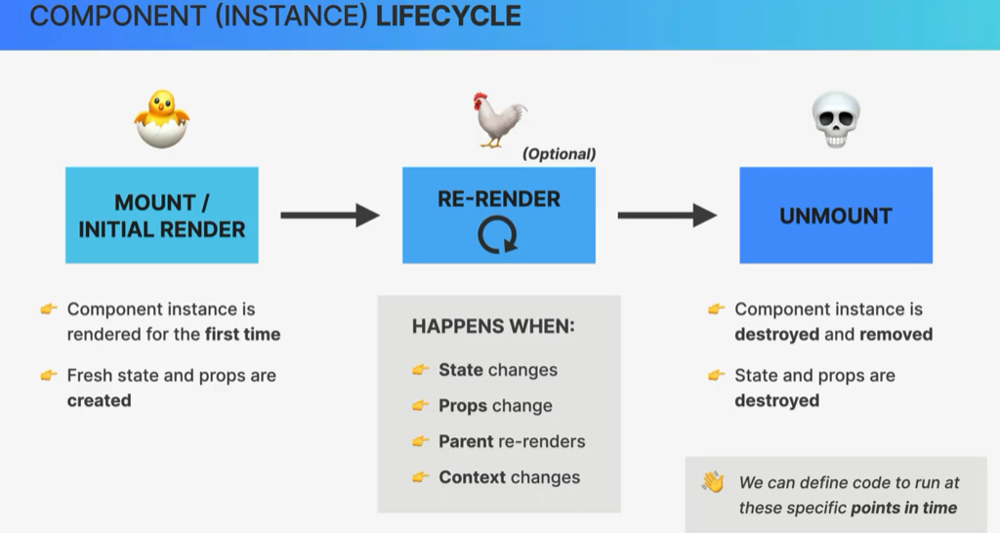
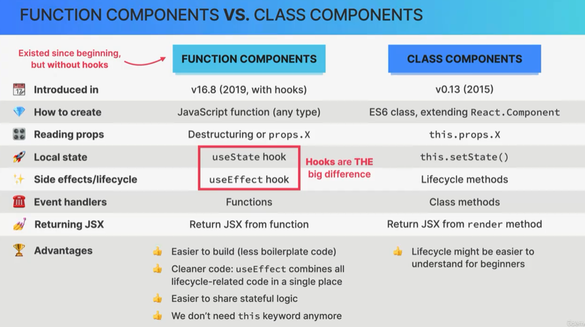

谈论 React 的生命周期通常是基于类组件的，在 React 中引入函数组件后，类组件的生命周期方法并不适用于函数组件。函数组件依赖于 React Hooks 来管理状态和副作用。

### 类组件生命周期

React 类组件中，React 的生命周期可以分为三个主要阶段：

-   挂载阶段 Mounting
    -   `constructor(props)`: 在组件挂载之前调用。通常用于初始化状态和绑定事件处理程序
    -   `static getDerivedStateFromProps(props, state)`: 从 Props 派生状态，[该钩子基本不会使用](https://zh-hans.react.dev/reference/react/Component#static-getderivedstatefromprops)。
    -   `render()`：必须实现的方法，返回 React 元素(jsx 描述)
    -   `componentDidMount()`：在组件挂载后立即调用。通常用于进行网络请求或订阅
-   更新阶段 Updating
    -   `static getDerivedStateFromProps(props, state)`：同上
    -   `shouldComponentUpdate()`：返回一个布尔值，决定组件是否应更新。用于优化性能
    -   `render()`：同上
    -   `getSnapshotBeforeUpdate(prevProps, prevState)`：在 DOM 更新前调用，常用于捕获一些 DOM 更新之前的一些状态(例如滚动位置)，该函数可以返回任意值，返回的值将作为 componentDidUpdate 的第三个参数
    -   `componentDidUpdate(prevProps, prevState, snapshot)`：在组件更新后立即调用。用于处理 DOM 操作或网络请求。
-   卸载阶段 Unmounting
    -   `componentWillUnmount()`：当组件从 DOM 中移除时调用

> 详细的可以参考这里： [link](https://juejin.cn/post/7359103640105910310?searchId=20240709225918A9E1E297891A54124F56).

### 函数式组件中的生命周期

类组件每个阶段都有不同的生命周期钩子函数，一共有很多钩子，这里不详细展开研究。且着重使用的就三个，分别是 `componentDidMount`、`componentDidUpdate`、`componentWillUnmount` 。函数组件依赖于 React Hooks 来管理状态和副作用，下面列出了关键 Hook —— `useEffect()` 和这三个钩子的映射关系。

具体生命周期方法在类组件和函数组件中的对应关系如下：

#### componentDidMount(无参数): 在组件挂载后执行。

对应的 Hook: `useEffect(() => { /_ 逻辑 _/ }, []);`

#### componentDidUpdate(prevProps, prevState): 在组件更新后执行。

对应的 Hook: `useEffect(() => { /_ 逻辑 _/ });`

#### componentWillUnmount(无参数): 在组件卸载前执行。

对应的 Hook: `useEffect(() => { return () => { /_ 清理逻辑 _/ }; }, []);`

通过使用 Hooks，函数组件能够实现类组件生命周期方法中的大部分功能，同时代码更加简洁和易于理解。

> 类组件中通常在 componentDidMount 钩子中去发送请求，在函数式组件中式在 useEffect 中去发送请求，useEffect 模拟了 componentDidmMount 这个钩子。

### 类组件和函数式组件区别

