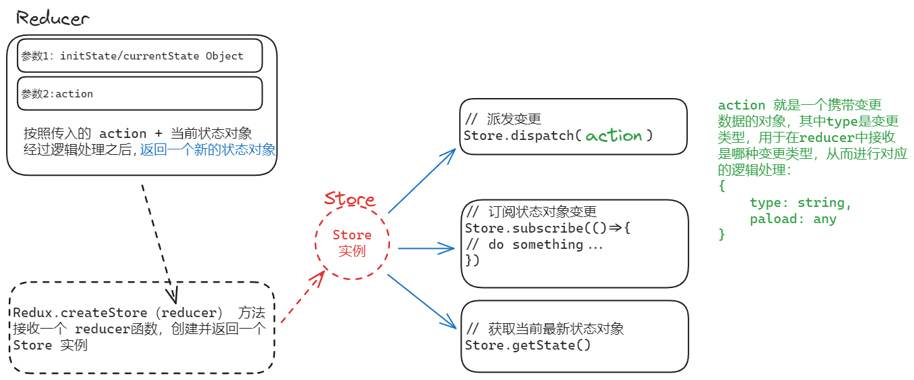

## 通过 CDN 示例快速认识 Redux

### Redux 最简化使用步骤

1. 定义一个 `reducer` 函数
2. 使用 createStore 方法传入 reducer 函数， 生成一个 `store` 实例对象
3. 通过 store 实例的 `dispatch` 方法提交一个 `action` 对象触发数据变化
4. 通过 store 实例的 `subscribe` 方法订阅数据变化
5. 通过 store 实例的 `getState` 方法获取最新的状态数据更新到视图中

### 具体实例

```html
<button class="w-12 mi border active:bg-black">-</button>
<span class="count mx-4">0</span>
<button class="w-12 add border active:bg-black">+</button>
```

```ts
// main.ts

const miBtn = document.querySelector(".mi")
const addBtn = document.querySelector(".add")
const countEL = document.querySelector(".count") as HTMLSpanElement
import { createStore } from "https://unpkg.com/redux@5.0.1/dist/redux.browser.mjs"

// typings
enum ActionTypes {
    MINUS = "Increment",
    ADD = "Decrement"
}

/**
 * 1.定义 reducer 函数
 * @param state 管理的数据初始状态
 * @param action 对象type 标记当前的修改类型
 */
const countReducer = (state = { count: 0 }, action: { type: ActionTypes }) => {
    switch (action.type) {
        case ActionTypes.ADD:
            return { count: ++state.count }
        case ActionTypes.MINUS:
            return { count: --state.count }
        default:
            return state
    }
}

// 2.使用reducer函数生成 store 实例
const store = createStore(countReducer)

// 3.派发更新
const handleMinus = () => {
    store.dispatch({ type: ActionTypes.MINUS })
}
const handleAdd = () => {
    store.dispatch({ type: ActionTypes.ADD })
}

// 4.通过 store.subscribe 方法订阅 数据对象的变动
store.subscribe(() => {
    // 5.通过 getState 方法获取最新的状态数据
    const { count } = store.getState()
    countEL.innerText = count
})

miBtn?.addEventListener('click', handleMinus)
addBtn?.addEventListener('click', handleAdd)
```

### Redux 的应用逻辑



### Redux 数据流图


> https://redux.js.org/tutorials/fundamentals/part-2-concepts-data-flow#redux-application-data-flow

## 在 React 应用中使用 Redux

Redux 本省是框架无关的， 在上面的 CDN 示例中，可以看到，原生 JS 也是可以直接使用的。 但是其他的 UI 库如 React， 有自己的渲染更新逻辑， 所以需要在适当的实际触发 React 的 re-render 从而使得页面上更新 新的数据。

在 React 中使用 Redux， 官方提供了两个包： redux-toolkit 和 react-redux。

1. redux-toolkit(RTK): 这是官方推荐的编写 Redux 逻辑的方式， 它是一套工具集， 用以简化 书写
   1. 简化 store 的配置方式
   2. 内置 immer 支持可变式状态修改
   3. 内置 thunk 更好的异步创建
2. react-redux：用来 链接 Redux 和 React 组件的 中间件
   ```mermaid
   graph LR
    A[React]-.-> C([react-redux])
    C -.-> A
    A -->|获取状态| B[React 组件]
    B -.-> C
    C -.-> B
    B -->|更新状态| A
   ```

```

### 在 React 应用中使用 Redux 示例
```
