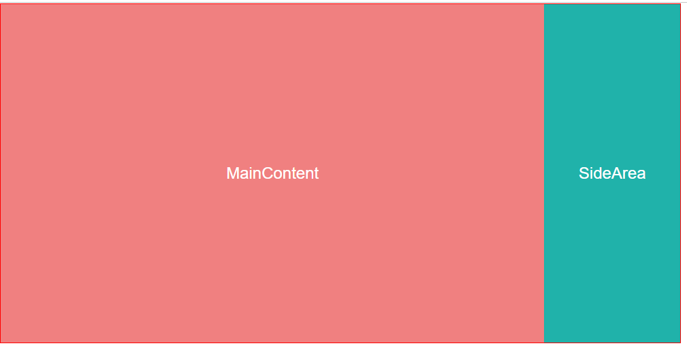
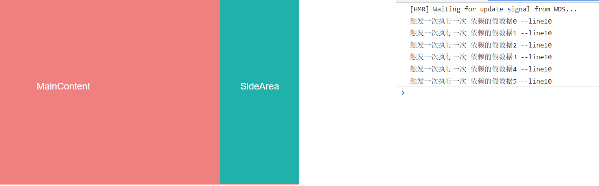
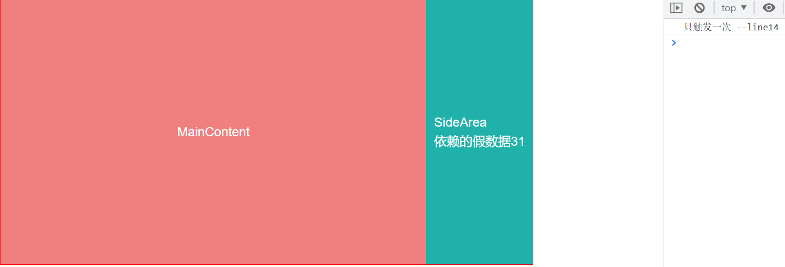
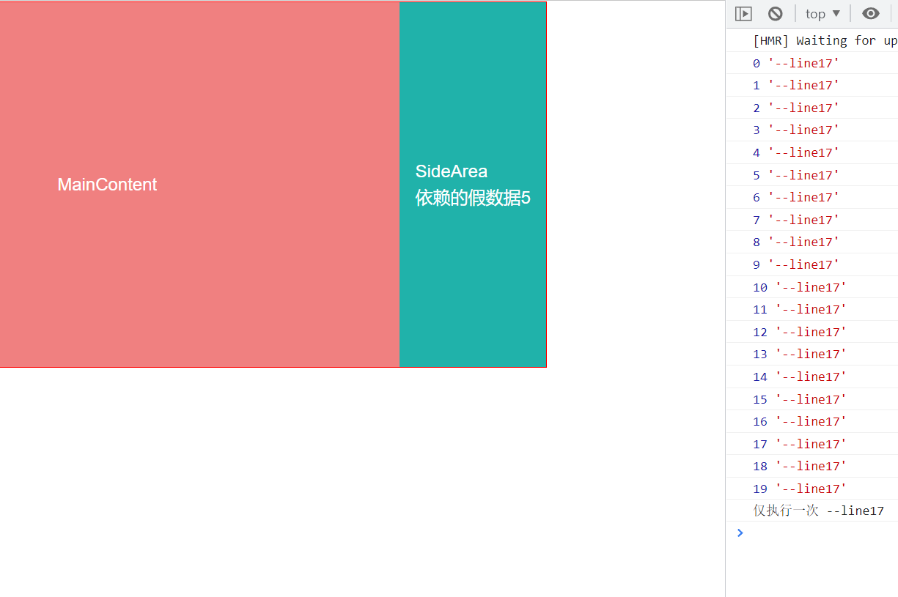

[toc]

## 引言

本篇文章总结了日常开发中，时长会处理的两类问题， 一个是，条件渲染， 这里的所说的条件渲染不仅仅包含了`v-if` ， 而是泛指，一个组件的渲染，需要具备一定的触发时机， 那么处理这种场景时， 通常有 `v-if` 、 手动挂载 、 以及 动态组件

此外，第二种场景，是 某个组件中的某些方法的执行， 需要依赖另一个组件中函数处理返回的数据。也就是需要值监听，然后执行某些方法

这里常用的是：通过`ref`访问实例直接调用、 `vm.$watcher` 和 递归判断 因需求的变化，其应用场景也有不同。

### 1. 条件渲染

开发工作时， 要求 A 组件挂载完成之后，再去挂载 B 组件， 是极为常见的开发需求。通常是由于B 组件的渲染，依赖 A 组件处理返回的数据。
这里讨论几种最常用的处理方案， 在不同的情况下度量应用

为了演示方便， 这里通过一个简单的示例来进行说明：



有这样一个页面， 期望，MainContent 要先于 SideArea 挂载

组件定义内容如下：

```javascript
// MainContent
<template>
  <div class="flex justify-center items-center">
    MainContent
  </div>
</template>
<script>
export default {
  created() {
    setTimeout(() => this.$emit("isMounted", { msg: "依赖的假数据" }), 2000);
  },
};
</script>
<style scoped>
div {
  height: 100%;
  width: 800px;
  background-color: lightcoral;
  color: white;
  font-size: 24px;
}
</style>
```

> 为了模拟MainContent组件需要较长时间的渲染， 这里通过延时定时器触发 自定义事件 来标识组件挂载完毕

````javascript
// SideArea
<template>
  <div class="flex justify-center items-center">
    SideArea
    <br />
    {{ mockMsg }}
  </div>
</template>
<script>
export default {
  props: ["mockMsg"],
};
</script>
<style scoped>
div {
  height: 100%;
  width: 200px;
  background-color: lightseagreen;
  color: white;
  font-size: 24px;
}
</style>
``

#### 方案一 ： 通过 `v-if` 指令，条件渲染

`index.vue` 组件

```javascript
<template>
  <div class="wrapper">
    <main-content @isMounted="isMountedHandler"></main-content>
    <side-area v-if="ifRender" :mock="mock"></side-area>
  </div>
</template>
<script>
import MainContent from "./comps/MainContent.vue";
import SideArea from "./comps/SideArea.vue";
export default {
  components: {
    MainContent,
    SideArea,
  },
  data() {
    return {
      ifRender: false,
      mock: "",
    };
  },
  methods: {
    isMountedHandler({ mock }) {
      this.ifRender = true;
      this.mock = mock;
    },
  },
};
</script>
<style scoped>
.wrapper {
  height: 500px;
  width: 1000px;
  border: 1px solid red;
  display: flex;
  justify-content: flex-start;
}
</style>

````

当 MainContent 组件渲染完成， 通过`$emit` 触发自定义事件 `isMounted` ，并传入返回的mock 数据，上层组件监听函数`isMountedHandler` 执行， 将 SideArea `v-if` 值设定为 `true` 并props传入 mock 数据。

这种方式是最方便，也是最常见的方式

#### 方案二 ：`vm.$mount()` 手动挂

不再通过`v-if` 去控制是否渲染SideArea, 利用Vue 的手动挂载机制：

`index.vue` 组件

```javascript
<template>
  <div class="wrapper">
    <main-content @isMounted="isMountedHandler"></main-content>
    <div id="side-area-box"></div>
  </div>
</template>
<script>
import MainContent from "./comps/MainContent.vue";
import SideArea from "./comps/SideArea.vue";
import Vue from "vue";
export default {
  components: {
    MainContent,
  },
  methods: {
    isMountedHandler({ msg }) {
      let sideAreaInstance = Vue.extend(SideArea);
      new sideAreaInstance({
        propsData: {
          mockMsg: msg,
        },
      }).$mount("#side-area-box");
    },
  },
};
</script>
<style scoped>
.wrapper {
  height: 500px;
  width: 1000px;
  border: 1px solid red;
  display: flex;
  justify-content: flex-start;
}
</style>
```

> 这种方式要注意的是， 你需要有一个占位的容器， 需要考虑样式布局，被挂载的组件样式应该独立。 因为手动挂载后， 并不是将组件插入到占位容器中去， 而是直接替换，这意味着，如果你的样式作用在占位容器上，将全部失效， 所以应该将样式写在组件内部
>
> 此外如果必须要传入 `props` 可以直接这样写：
>
> ```javascript
> isMountedHandler() {
>     new Vue(SideArea).$mount("#side-area-box");
> },
> ``
> ```

#### 方案三 ：动态组件

`index.vue` 组件

```javascript
<template>
  <div class="wrapper">
    <main-content @isMounted="isMountedHandler"></main-content>
    <component :is="componentName" :mockMsg="mock" />
  </div>
</template>
<script>
import MainContent from "./comps/MainContent.vue";
import SideArea from "./comps/SideArea.vue";
export default {
  components: {
    MainContent,
    SideArea,
  },
  data() {
    return {
      mock: null,
      componentName: undefined,
    };
  },
  methods: {
    isMountedHandler({ msg }) {
      this.componentName = "SideArea";
      this.mock = msg;
    },
  },
};
</script>
<style scoped>
.wrapper {
  height: 500px;
  width: 1000px;
  border: 1px solid red;
  display: flex;
  justify-content: flex-start;
}
</style>
```

实现效果和`v-if` 是比较类似的

## :star: 2. 组件方法的值驱动执行

还有一种常见的场景，<u>B 组件中的某个方法的执行， 依赖于 A 组件某个方法执行的返回值</u>。 听起来，常用eventbus 解决这个问题， 但是这里，不是利用事件机制， 而是通过观察值的变化去执行B组件内的方法。即我们监测A 组件的方法执行返回值， 有值之后再去执行B 组件方法。

#### 方案一：通过 ref 直接调用

这种方法是最常见的方式， 但是其重心就不在 `SideArea` 组件中了，而是在其上层组件, 示例中，即 `index.vue` 文件。

```javascript
//mainContent.vue
<template>
  <div class="flex justify-center items-center">
    MainContent
  </div>
</template>
<script>
export default {
  created() {
    let count = 0;
    setInterval(
      () => this.$emit("isMounted", { msg: "依赖的假数据" + count++ }),
      2000,
    );
  },
};
</script>
<style scoped>
div {
  height: 100%;
  width: 800px;
  background-color: lightcoral;
  color: white;
  font-size: 24px;
}
</style>
```

> 让props 值每两秒变化一次

```javascript
// SideArea.vue
<template>
  <div class="flex justify-center items-center">
    SideArea
  </div>
</template>
<script>
export default {
  methods: {
    doSomething(msg) {
      console.log("触发一次执行一次", msg, "--line10");
    },
  },
};
</script>
<style scoped>
div {
  height: 100%;
  width: 200px;
  background-color: lightseagreen;
  color: white;
  font-size: 24px;
}
</style>
```

`index.vue` 文件：

```javascript
<template>
  <div class="wrapper">
    <main-content @isMounted="isMountedHandler" />
    <SideArea ref="sideArea" />
  </div>
</template>
<script>
import MainContent from "./comps/MainContent.vue";
import SideArea from "./comps/SideArea.vue";
export default {
  components: {
    MainContent,
    SideArea,
  },
  data() {
    return {
      mock: null,
    };
  },
  methods: {
    isMountedHandler({ msg }) {
      this.$refs.sideArea.doSomething(msg);
    },
  },
};
</script>
<style scoped>
.wrapper {
  height: 500px;
  width: 1000px;
  border: 1px solid red;
  display: flex;
  justify-content: flex-start;
}
</style>
```



mainContent 中值发生变化，然后通过`$emit` 触发其上层组件`index.vue` 中的 `handler` —— isMountedHandler , 然后直接在handler 中通过 `ref` 引用访问到 SideArea 组件实例，直接调用预定义的目标方法，并通过函数参数传参达到传值的目的

这种方式的特点就是 简单， 还有就是**触发一次， 执行一次**， 这意味着，值一旦变化， 这个方法就会重新被触发；大部分时候是符合我们的用意的，但是有些场景下是不适用的， \*_例如要求仅触发一次。_

---

<u>下面的两种方案，则是常用于解决要求仅触发一次的场景。</u

接下来的两种方案， 重心都在 SideArea.vue 组件 另外两个文件也稍有变化， 先写在前面：

`index.vue` 文件：

```javascript
// index.vue
<template>
  <div class="wrapper">
    <main-content @isMounted="isMountedHandler" />
    <SideArea :mockMsg="mock" />
  </div>
</template>
<script>
import MainContent from "./comps/MainContent.vue";
import SideArea from "./comps/SideArea.vue";
export default {
  components: {
    MainContent,
    SideArea,
  },
  data() {
    return {
      mock: null,
    };
  },
  methods: {
    isMountedHandler({ msg }) {
      this.mock = msg;
    },
  },
};
</script>
<style scoped>
.wrapper {
  height: 500px;
  width: 1000px;
  border: 1px solid red;
  display: flex;
  justify-content: flex-start;
}
</style>
```

> 直接简单的把 mainContent.vue 中变化的值通过 props 传给 SideArea

`mainContent.vue` 文件:

```javascript
<template>
  <div class="flex justify-center items-center">
    MainContent
  </div>
</template>
<script>
export default {
  created() {
    let count = 0;
    setInterval(
      () => this.$emit("isMounted", { msg: "依赖的假数据" + count++ }),
      2000,
    );
  },
};
</script>
<style scoped>
div {
  height: 100%;
  width: 800px;
  background-color: lightcoral;
  color: white;
  font-size: 24px;
}
</style>
```

> 让props 值每两秒变化一次

接下来的说明，主要是在`SideArea.vue` 中演示的， 和上面这两个文件的关联不大

#### 方案二： `vw.$watch`

利用vue实例方法 `$watch()` , 之所以不用普通的监听器，写在 watch 对象中， 是因为 vue **实例方法** `$watch` ，在定义一个监听器后**返回**的是其\*_<u>取消侦听函数</u>_

> https://cn.vuejs.org/v2/api/index.html#vm-watch

`SideArea.vue` 文件 ：

```javascript
<template>
  <div class="flex justify-center items-center">
    SideArea
    <br />
    {{ mockMsg }}
  </div>
</template>
<script>
export default {
  props: ["mockMsg"],
  created() {
    var unwatch = this.$watch("mockMsg", function() {
      //do something here
      console.log("只触发一次", "--line14");
      if (unwatch) {
        unwatch();
      }
    });
  },
};
</script>
<style scoped>
div {
  height: 100%;
  width: 200px;
  background-color: lightseagreen;
  color: white;
  font-size: 24px;
}
</style>
```

> 简单的描述，就是通过vue 的实例方法`$watch` 去监听mainContent 组件传入的props 值， 且为了 SideArea 组件中的目标事件仅触发一次， 我们通过调用 `vm.$watch()` 返回的取消侦听函数，在目标事件执行完后去调用以取消侦听



可以看到，实现的效果，就是即便props在不断变化， 但是目标函数仅会执行一次。

#### 方案三：递归判断

这种方法，也是类似监听，不过方法更加的原始。

`SideArea.vue`

```javascript
<template>
  <div class="flex justify-center items-center">
    SideArea
    <br />
    {{ mockMsg }}
  </div>
</template>
<script>
export default {
  props: ["mockMsg"],
  created() {
    this.doSomething();
  },

  methods: {
    doSomething() {
      if (!this.mockMsg) {// init prop is null
        this.timer = setTimeout(() => this.doSomething(), 10);
        return;
      }
      if (this.timer) clearTimeout(this.timer);
      // do something here
      console.log("仅执行一次", "--line17");
    },
  },
};
</script>
<style scoped>
div {
  height: 100%;
  width: 200px;
  background-color: lightseagreen;
  color: white;
  font-size: 24px;
}
</style>

```

> 定义了一个定时器，用以不断的去问有没有props值过来， 一旦有值，就立即销毁定时器， 然后执行之后的代码逻辑

为了观察更加方便可以加一个定时器：

```javascript
<template>
  <div class="flex justify-center items-center">
    SideArea
    <br />
    {{ mockMsg }}
  </div>
</template>
<script>
export default {
  props: ["mockMsg"],
  data() {
    return {
      count: 0,
    };
  },
  created() {
    this.doSomething();
  },

  methods: {
    doSomething() {
      console.log(this.count, "--line17");
      if (!this.mockMsg) {
        this.count++;
        // init prop is null
        this.timer = setTimeout(() => this.doSomething(), 100);
        return;
      }
      if (this.timer) clearTimeout(this.timer);
      // do something here
      console.log("仅执行一次", "--line17");
    },
  },
};
</script>
<style scoped>
div {
  height: 100%;
  width: 200px;
  background-color: lightseagreen;
  color: white;
  font-size: 24px;
}
</style>
```



可以看到也可以达到监听 props 值的效果。

# 总结

本文总结了日常开发中，经常遇到的两种场景处理， 分别是 组件的条件渲染问题， 以及组件方法执行由值驱动时的问题。

根据不同开发需求，又列举了多种不同场景时解决方案。 它们有的可能并不是专用于解决该类问题， 而是能够解决

此外，组件方法由值驱动执行这种场景下， 本文按照可能需要重复执行和单次执行 进行了总结， 如 以常用的 ref 实例引用的方式直接调用子组件内的方法，用于调用一次执行一次。 所以当其在被一个变化值所驱动时，子组件内对应的方法也就会重复被执行

而有的时候，我们需要的其实是一次性执行，例如我们需要在子组件目标方法中去初始化一个事件监听器，等类似的场景

这时候我们可以利用 `vm.$watch()` vue 的实例方法， 返回的是其取消监听的函数这一特点，实现一次性监听

也可以用循环延时判断，props 值， 然后在该值满足所需要求的时候，销毁定时器， 执行下面的流程

实际上，这只是一部分方法， 例如, 第二种场景的 如果要求能重复执行，除了 ref ,我们还可以通过 props 传值，然后通过 定义watch 对象，去达成目的。 再比如，无论第二种场景下的哪种情况，都是可以通过自定义事件(eventBus)去达成目的的， 要求重复执行？， `$on`， 要救仅执行一次？ ， `$once`
