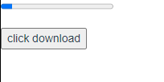
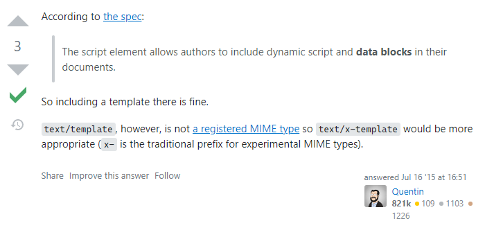

## 1. 内联模板

即将要说的是一个很有意思的Vue边界应用。

Vue开发者，通常都有着很敏感的组件规则。 我们写的组件全部都是以一个个组件组装到一起的。

当涉及组件之间通信，调用时，会出现各种招数应对各种场景。 如果你要写一个嵌套组件。

你必然会先创建两个单独的组件，然后在其中一个引入注册另一个（当然，我们刚说过了组件的互相循环调用）。 注册好之后，为了我们的组件易于维护。 我们严格的分清，什么应该写在调用组件中， 哪些内容又应该写在子组件中，我们会考虑数据怎么传递，嵌套组件的是怎么协同工作的。

但是，假如，你可以在父组件中，写子组件的dom呢？

这么说，可能很疑惑，我一开始因为完全不明白，因为这种模式，以往我们从未遇见过。

以下是一个示例，看完就知道了：

```javascript
//index
<template>
  <div>
    <Child></Child>
  </div>
</template>
<script>
import Child from "./comps/index.vue";
export default {
  components: {
    Child,
  },
};
</script>
```

```javascript
<template>
  <div>
    <p>
      <progress :value="count" max="100"> </progress>
    </p>
    <button @click="count++">click download</button>
  </div>
</template>
<script>
export default {
  data() {
    return {
      count: 0,
    };
  },
};
</script>
```

这是一个再简单不过的父子组件了：


我们在子组件中定义了一个进度条元素，这是H5的原生元素，然后我们通过点击，让进度条变化。

现在，我们子组将中dom 上`<template><template/>` 包裹的所有内容，都叫做这个子组件的模板，我们跟习惯叫他dom, 即便它实际上编译成html文件中真正的dom还需要很复杂底层Vue实现的过程。

Vue 允许我们有一种边界的应用方式，可以将模板内容不写在子组件，而写到父组件中去。

要做到这样只需要：

1. 在父组件中需要调用的地方，给子组件注册标签元素，指定`inine-template` 属性，将其标记为一个行内模板。
2. 将子组件中模板内容尽数剪切到`template`元素中间。

即：

```javascript
//index
<template>
  <div>
    <Child inline-template>
      <div>
        <p>
          <progress :value="count" max="100"> </progress>
        </p>
        <button @click="count++">click download</button>
      </div>
    </Child>
  </div>
</template>
<script>
import Child from "./comps/index.vue";
export default {
  components: {
    Child,
  },
};
</script>
```

```javascript
//Child
<template> </template>
<script>
export default {
  data() {
    return {
      count: 0,
    };
  },
};
</script>
<style></style>

```

它完全能够如期运行。



是不是非常神奇且有意思？

注意，你仅能在`<Child></Child>` 标签内方式 该子组件的实例内容。但是不能访问父组件中的实例内容。 也不能在父组件中访问这个子组件实例的内容。

这意味着，直接想当然的像下面这样操作是不行的哦：

```javascript
<template>
  <div>
    <Child inline-template>
      <div>
        <p>
          <progress :value="count" max="100"> </progress>
        </p>
        <!-- vue.runtime.esm.js?2b0e:619 [Vue warn]: Error in render: "TypeError: Cannot read properties of undefined (reading 'toString')" -->
        {{ name.toString }}
        <button @click="count++">click download</button>
      </div>
    </Child>
    <!-- [Vue warn]: Property or method "count" is not defined -->
    <button @click="count++">click download outside</button>
  </div>
</template>
<script>
import Child from "./comps/index.vue";
export default {
  components: {
    Child,
  },
  data() {
    return {
      num: 123,
    };
  },
};
</script>
```

想想看，是不是表现的就像是，除了把子组件的模板内容换到了父组件中去写，似乎没有任何差异？

就是如此，**父子组件依然是不能直接互相访问彼此实例的**

是不是想问， 那这样写有个球用 ？ 我干嘛还单独写个子组件？ 直接写一个组件里不就好了？

实际上，确实一般情况下是用不着的。 Vue 文档也提醒我们，这样使用会让我们阅读起来不友好，不易维护，作用域甚至可能会用的很混乱。 但是好处是，如果你的子组件数据处理逻辑很庞大，这么写，就可以满足在父组件中写子组件模板的同时，又能分隔开来父子组件的数据处理。

用不用是一回事，知不知道是另一回事嘛。

## 2. X-Template

```html
<script type="text/x-template" />
```

实际上，这并不是一个官方的MIME type , stackoverflow 有大佬给出了如下解释：



> https://stackoverflow.com/a/31460171

Vue 文档中，使用了这种特例。

实际上，被标记为`type="text/x-template"` 的script 标签并不会被标准解析执行。

Vue 会在dom渲染后再对其进行额外处理，注意，是Vue 处理。

Vue 提供这样一个接口的目的是怎么被使用的？

其实，这是在你不使用webpack 、gulp 等工具的时候才会用得到，为了方便在那种模式下在js 中写模板繁琐而出现的。 假如组件的template的内容很冗长，如果都在JavaScript里面拼接脚本，效率是非常低的，因为不能像写HTML那样舒服。因此，Vue 提供了另外一种定义模板的方法：

```html
<!doctype html>
<html lang="en">
 <head>
  <meta charset="UTF-8">
  <meta name="Generator" content="EditPlus®">
  <meta name="Author" content="">
  <meta name="Keywords" content="">
  <meta name="Description" content="">
  <title>Vue之X-Templates的使用</title>
 </head>
 <body>
  <div id="app">
  <my-component></mycomponent>
  <script type="text/x-template" id="my-component">
   <div>这是组件的内容</div>
  </script>
 </div>
<!-- 开发环境版本，包含了有帮助的命令行警告 -->
<script src="https://cdn.jsdelivr.net/npm/vue/dist/vue.js"></script>
<script>
 Vue.component('my-component',{
  template:'#my-component'
 });
 var app = new Vue({
  el:'#app'
 })
</script>
 </body>
```

> 参考自 [link](https://blog.csdn.net/BADAO_LIUMANG_QIZHI/article/details/82831045)
