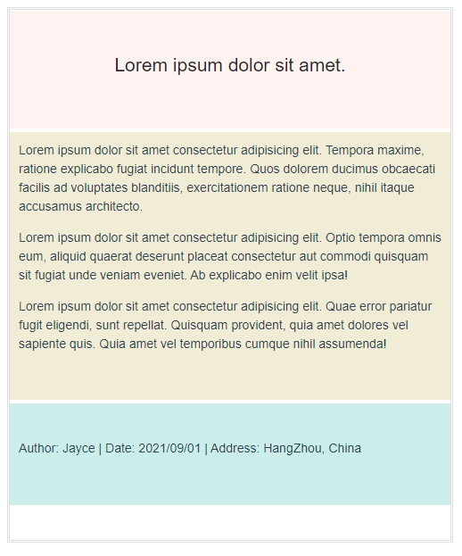
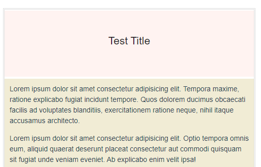
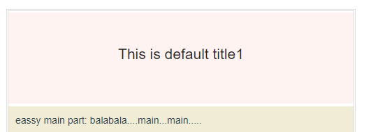
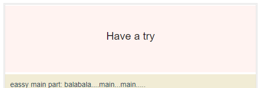

[toc]

## 1. 插槽内容

假设我们有这样一个组件：

```javascript
<template>
  <section class="eassy-container">
    <header class="eassy-header">
	lorem
    </header>
    <main class="eassy-main">
    lorem
    </main>
    <footer class="eassy-footer">
	lorem
    </footer>
  </section>
</template>
```

它看起来的效果就像是这样：



我们创建了一个文章模板组件，现在，假如你要将这个模板作为公用组件，那么通常，我们可能需要先在这个组件内部，用假数据，写好所有的样式。 然后在父组件中引用时，传入变量，去渲染文章的标题，文章主题，文章末尾等。 

但是这样做，存在诸多问题，例如样式的兼容性，要让这个组件能够被通用是有难度的，主要是文章是需要排版的，内容是多变的。 如果你通过v-html 传入模板字符串，去拓展排版，插入多媒体去实现需求自然也是可行，不过这样一来，其实就失去了组件封装的初衷 ---- 简化，提高可维护性。 

所以这时候，Vue 就提供了一种解决方式，我只保留这个组件封装的基本意义，例如基本的布局，结构，基本的样式，就好了。 其他的**需要创造性，存在变动的地方，我全部都暴露给父级对应的"接口"。在本组件内，我只留下一个空位，以待内容插入。 实现高度自定义。** 

> 通俗的讲，我们只建造一面墙，这面墙上只留了插座， 至于你想要接什么电器，随你便。

首先，我们基本认识下，具体的是什么意思？

例如，文章的标题，当然应该是个变量，以往，我们肯定会通过Props等方式向下传参。 刚才我们简单分析了弊端，所以我们这里不期望使用传统传参的方式去实现。 

我们仅需要在**组件内需要被占位的地方**，放置一个`<slot></slot>` 标签即可。即:

```javascript
<!--Eassy.vue-->
<template>
  <section class="eassy-container">
    <header class="eassy-header">
      <h1>
        <slot></slot>
      </h1>
    </header>
    <main class="eassy-main">
      <p>Lorem ipsum dolor sit
      .......
```

然后在父组件，该组件标签的中间，写入内容，他就会被**自动地插入**到这个`<slot></slot>` **所占位的地方**。

```javascript
<template>
  <Eassy>Test Title</Eassy>
</template>
<script>
import Eassy from "./comps/Eassy.vue";
export default {
  components: {
    Eassy,
  },
  data() {
    return {
      user: {
        name: "jayce",
      },
    };
  },
};
</script>
```




## 2. 具名插槽

刚才，我们演示了文章标题的插槽用法。 现在如果我们类似的实现文章主体和结尾。 我们当然就需要指定多个`<slot>`用以占位了，可以预见的是，在上层组件（父组件）中，我们同时要塞一些内容到自封装组件内部，肯定**需要让组件知道，哪些内容，插到哪里去。** 所以，我们要在`<slot>`定义的地方指定一个`name` 属性， 在上层组件，插入的时候，也需要**以某种方式显式的明确插入位置**，具体的，如下：

自封装组件中：给`<slot>` 增加一个`name` 属性（attribute）

```javascript
<template>
  <section class="eassy-container">
    <header class="eassy-header">
      <h1>
        <slot name="header"></slot>
      </h1>
    </header>
    <main class="eassy-main">
      <slot name="main"></slot>
    </main>
    <footer class="eassy-footer">
      <slot name="footer"></slot>
    </footer>
  </section>
</template>
```

上层组件中（父组件）：通过`v-slot:name`  指定给一个`<template>` 以指明将要插入的位置

```javascript
<template>
  <Eassy>
    <template v-slot:header>
      This should be a title
    </template>
    <template v-slot:main>
      eassy main part: balabala....main...main.....
    </template>
    <template v-slot:footer>
      eassy footer part: bala...foooooooter....
    </template>
  </Eassy>
</template>
```


> 你需要注意的是，上面我们在仅插入一个文章标题的时候，并没有指定`name` 属性，也没有通过`v-slot` 指定这个唯一的`<slot>`插槽，其实并不是没有，而是如果不加指定，其`name` 属性被隐式的指定为"default"，这时候可以省略。 


### 2.1 [具名插槽的缩写](https://cn.vuejs.org/v2/guide/components-slots.html#具名插槽的缩写)

跟 `v-on` 和 `v-bind` 一样，`v-slot` 也有缩写，即把参数之前的所有内容 (`v-slot:`) 替换为字符 `#`。例如 `v-slot:header` 可以被重写为 `#header`

```javascript
<template>
  <Eassy title="this is a title">
    <template #header="{ anyName }">
      {{ anyName.default1 }}
    </template>
    <template #main>
      eassy main part: balabala....main...main.....
    </template>
    <template #footer>
      eassy footer part: bala...foooooooter....
    </template>
  </Eassy>
</template>
```


## 3. 后备内容（默认slot内容）

如果你希望插槽处有一个默认内容，你仅需要在`<slot></slot>` 中间写默认值即可。而当上层组件有后来的插值时，默认值将会立刻被自动的覆盖掉。

就像这样:

```javascript
<!--自建组件内-->
<template>
  <section class="eassy-container">
    <header class="eassy-header">
      <h1>
        <slot name="header">This is default title</slot>
      </h1>
    </header>
........
```

```html
<!--上层组件不指定该插值或者插入空值即可-->
<template>
  <Eassy>
    <!-- <template v-slot:header>
      This should be a title
    </template> -->
    <template v-slot:main>
      eassy main part: balabala....main...main.....
    </template>
    <template v-slot:footer>
      eassy footer part: bala...foooooooter....
    </template>
  </Eassy>
</template>    
```


## 4. 传入变量

在文档中，这部门内容，称为编译作用域。 

它的意思是， <u>自建组件</u>的编译存在于<u>一个作用域</u>，该组件中的data中的属性，或者自上层组件传入的prop 都属于这个作用域。  而<u>上层组件</u>的编译则属于<u>另一个作用域</u>。  你可以正常的通过props 自上层组件向自建组件传递值， 但是，你不能直接在上层组件中直接取到自建组件作用域中的值。

> 换句话说，有时候你需要在上层组件（父组件）的插槽内容中引用来子自建组件（子组件），而这种行为默认是不被允许的。

文档是这样概括的：

> 父级模板里的所有内容都是在父级作用域中编译的；子模板里的所有内容都是在子作用域中编译的。

具体的演示，就像这样：

假设有这样一个自建组建：

```javascript
<!--自建组件-->
<template>
  <section class="eassy-container">
    <header class="eassy-header">
      <h1>
        <slot name="header">{{obj.default1}}</slot>
      </h1>
..........
<script>
export default {
  data() {
    return {
      obj: {
        default1: "This is default title1",
        default2: "This is default title2"
      }
..........
```

我们在data中定义一个对象`obj`，有两个key，我们将 `obj.default1` 以插值语法的形式将其作为了文章标题的默认值，而上层组件中，我们什么都没做：

```javascript
<!--上层组件-->
<template>
  <Eassy title="this is a title">
    <!-- <template v-slot:header>
    </template> -->
    <template v-slot:main>
      eassy main part: balabala....main...main.....
    </template>
	............
```



此时，并不会影响后来插槽值的覆盖：

```javascript
<!--上层组件-->
<template>
  <Eassy title="this is a title">
    <template v-slot:header>
      Have a try
    </template>
    <template v-slot:main>  
.......
```



那么现在，有一个问题，假如，现在有个需求，我想让上层组件具备控制这个默认值的能力，例如换做`obj.default2` 。 那该怎么办呢？

由于`obj` 属于**自建组件**的构建的**作用域**， 所以上层组建中，**没有办法直接访问**到`obj` ，也就没办法修改。

这时候你就需要用到**作用域插槽**，将`obj` **对上层组件暴露**：

## 5. 作用域插槽

作用域插槽允许你将要向上层组建暴露的对象通过值绑定语法，绑定在`<slot>` 标签上，就像这样：

```javascript
<!--自建组件-->
<template>
  <section class="eassy-container">
    <header class="eassy-header">
      <h1>
        <slot name="header" :anyName="obj">{{obj.default1}}</slot>
      </h1>
    </header>
.......
```

这样就将`obj` 绑定给了一个我们自定义的属性`anyName` , 他将会传递给上层组建一个对象:

```javascript
{
    "anyName":{
        default1:"xxx",
        default2:"xxx"
    }
}
```

然后在上层组建中通过`v-slot:name="自定义对象名"`的方式，就可以接收到这个对象：

```javascript
<template>
  <Eassy title="this is a title">
    <template v-slot:header="slotProps">
      {{slotProps.anyName.default2}}<!--将插槽值修改喂默认值default2-->
    </template>
    <template v-slot:main>
.......        
```

【拓展：解构语法】

以上的接收值过程还可以简化，使用解构语法去接受该对象：

```javascript
<template>
  <Eassy title="this is a title">
    <template v-slot:header="{ anyName }">
      {{ anyName.default2 }}
    </template>
    <template v-slot:main>
......        
```

还能重命名接收的值`key`

```javascript
<template>
  <Eassy title="this is a title">
    <template v-slot:header="{ anyName:cusName }">
      {{ cusName.default2 }}
    </template>
    <template v-slot:main>
......        
```


## 6. 一些拓展

### 6.1 动态插槽名

你可以像其他的动态指令一样，动态的去指定插槽名。

```javascript
<base-layout>
  <template v-slot:[dynamicSlotName]>
    ...
  </template>
</base-layout>
```

### 6.2 Vue 2.6.0 之前的旧语法

现在有一些主流的前端UI库，使用的还是旧的语法。

#### 6.2.1 带有`slot` 属性的具名插槽

和现在的`v-slot` 一样，

2.6.0 以前，允许通过一个`slot` 属性，指定插槽名，并且它不仅可以作用于`template` 标签，还可以作用于常规元素：

> ```javascript
> <base-layout>
>   <template slot="header">
>     <h1>Here might be a page title</h1>
>   </template>
> 
>   <p>A paragraph for the main content.</p>
>   <p>And another one.</p>
> 
>   <p slot="footer">Here's some contact info</p>
> </base-layout>
> ```
>
> 注意，这个示例中的中间`p` 元素所包裹的内容：
>
> ```javascript
>   <p>A paragraph for the main content.</p>
>   <p>And another one.</p>
> ```
>
> 没有命名插槽名，将会同样被视作为默认插槽。 在下层组件中，`<base-layout>` 中，将会捕获所有未被匹配的内容。

#### 6.2.2 带有`slot-scope` 属性的作用域插槽

```javascript
<slot-example>
  <template slot="footer" slot-scope="slotProps">
    {{ slotProps.msg }}
  </template>
</slot-example>
```

注意，不同于新的语法的是，`slot-scope` 属性还可以作用于普通元素：

```javascript
<slot-example>
  <span slot-scope="slotProps">
    {{ slotProps.msg }}
  </span>
</slot-example> 	
```

