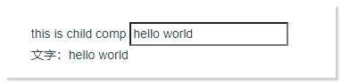
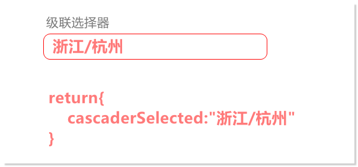
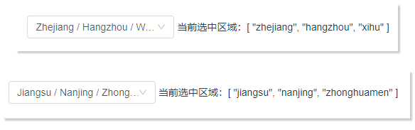

[toc]

## 1. `v-model` 语法糖

当你希望一个自定义组件的值能够实现双向绑定。 那么就需要：

1. 将值传入组件；
2. 将变化的值逆传回父组件。 

实际上，就可以利用 `props` 实现的父传子 +　通过自定义事件`this.$emit`实现的子传父。实现双向的数据流传递。 

下面是一个示例：

有这样一个父组件：

```html
<template>
  <div>
    <Child :value="message" @input="message = $event" />
    文字：{{message}}
  </div>

</template>
<script>
import Child from "./comps/child.vue"
export default {
  components: {
    Child
  },
  data() {
    return {
      message: 'init default'
    }
  }
}
</script>
```

和这样的一个子组件：

```html
<template>
  <div>
    this is child comp
    <input type="text" :value="value" @input="onInputChange">
  </div>
</template>
<script>
export default {
  props:["value"],
  methods: {
    onInputChange(e) {
      this.$emit('input', e.target.value)
    }
  }
}
</script>
```



我们自定义了一个组件，名为`<Child />` ， 我们通过 `v-bind:value` 向`<Child />` 传递了一个`prop` , 即 `<Child :value="message" />` 。

然后在`<Child />`组件内部，通过`props`接收到了这个值，并通过`v-bind:value` 将值绑定给了`<input /> 元素。

紧接着，我们给`<input />` 元素设定了一个`input` 监听事件， 当输入时，触发该事件，然后将当前值通过`this.$emit('input',e.target.value)` 以参数的形式，传递给了父组件。 在父组件中通过`@input`这个自定义事件，接收到变化后的值，然后通过`$event` 将值赋给了绑定的 `message` 。 

从而实现了自定义的双向绑定。


实际上，上边这个过程，可以简化为一个vue为我们预定义实现的`v-model`， 即：

```html
<template>
  <div>
    <Child v-model="message" />
    文字：{{message}}
  </div>

</template>
<script>
import Child from "./comps/child.vue"
export default {
  components: {
    Child
  },
  data() {
    return {
      message: 'init default'
    }
  }
}
</script>
```

> `<Child/>` 组件无需任何改动。 


自此，我们便能够理解，为什么说`v-model` 实际上就是`props` + `$emit` 自定义事件的语法糖 。


以上这个纯粹为了实验而构建的组件关系。 并没有实际应用意义。 所以，接下来，需要了解，什么是自定义v-model ， 以及其应用场景。

## 2. 自定义`v-model`

首先，我们仿照着[vue文档的举例](https://cn.vuejs.org/v2/guide/components-custom-events.html#自定义组件的-v-model)，尝试去理解需要自定义`v-model`的使用场景。 

文档中有这样一段描述很重要

> 一个组件上的 `v-model` 默认会利用名为 `value` 的 prop 和名为 `input` 的事件，但是像单选框、复选框等类型的输入控件可能会将 `value` attribute 用于[不同的目的](https://developer.mozilla.org/en-US/docs/Web/HTML/Element/input/checkbox#Value)。

他说，当你使用`v-model` 的时候，默认是，是传递的`value` ，且触发自定义emit事件的事件是`input` 。 回看我们刚才写的例子。 确实是这样，我们传递的是名为`value` 的prop, 且监听的自定义事件名为`input`。

```html
<Child :value="message" @input="message = $event" />
```


这是因为我们使用的是输入框（`type="text"`） ，所以是适用的。 但是如果是一个checkbox 会怎么样呢？

```html
<template>
  <div>
    <Child :checked="message" @change="message = $event"/>
    文字：{{message}}
  </div>

</template>
<script>
import Child from "../cusVModelcheckBox/comps/child.vue"
export default {
  components: {
    Child
  },
  data() {
    return {
      message: true
    }
  }
}
</script>
```

```html
<!-- Child Component-->
<template>
  <div>
    this is child comp
    <input type="checkbox" :checked="checked" @change="onChange">
  </div>
</template>
<script>
export default {
  props:["checked"],
  methods: {
    onChange(e) {
      this.$emit('change', e.target.checked)
    }
  }
}
</script>
```


我们发现，按照刚才我们手动实现input 的自定义组件双向绑定的规则。 这样做是没有问题的。 所不同的是，`v-bind`的是`checked`, 触发的`emit` 事件是`change`。 

> 当然自定义事件的名称是任意的，可以用任何名称。 这里指的是input 元素在 type 为checkbox 的时候，监听事件不再是input, 而是change ,即触发emit事件的事件是change ,而不再是input。 

我们发现，由于这样的一条规则：

> 一个组件上的 `v-model` 默认会利用名为 `value` 的 prop 和名为 `input` 的事件，但是像单选框、复选框等类型的输入控件可能会将 `value` attribute 用于[不同的目的](https://developer.mozilla.org/en-US/docs/Web/HTML/Element/input/checkbox#Value)。

好像会使得我们无法对当前场景直接用`v-model` 替换。 实际情况也是如此：

```html
<template>
  <div>
    <Child v-model="message"/>
    文字：{{message}}
  </div>

</template>
<script>
import Child from "../cusVModelcheckBox/comps/child.vue"
export default {
  components: {
    Child
  },
  data() {
    return {
      message: true
    }
  }
}
</script>
```

如果尝试这样像之前的示例那样直接替换为`v-model`， 是不会生效的。 


那么该怎么解决这样一种场景呢？

—— 指定`model `属性：

我们只需要在刚才的基础上，在`<Child/>`组件中指定如下`model`配置即可：

```javascript
<template>
  <div>
    this is child comp
    <input type="checkbox" :checked="checked" @change="onChange">
  </div>
</template>
<script>
export default {
  props:["checked"],
  //-----------------------start------------------    
  model:{
    prop:'checked',
    event:'change'
  },
  //----------------------- end ------------------      
  methods: {
    onChange(e) {
      this.$emit('change', e.target.checked)
    }
  }
}
```


## 3. 总结

所以，总结一下。

什么情况下需要自定义`v-model`？

1. 当有自定义组件的双向数据流的需求的时候，都可以自定义`v-model` 来达成目的。

   1. 其中，什么时候需要配置 `model` 属性？

      当默认通过`v-bind` prop传递到自定义组件的变量名不是默认的`value` ，**<u>或者</u>** 触发自定义事件的"源事件"名不为`input` 的时候。

   2. 什么时候不需要配置`model` 属性？

      当满足默认的`v-model`规则时，即 prop传递到自定义组件的变量名为`value` **<u>且</u>** 触发自定义事件的"源事件"名为`input` 的时候，不需要指定`model`属性配置。可直接使用`v-model` 这种情况比较少见，<u>**基本**</u>仅当自定义组件是为了扩展`type="text"` 的 `<input/>` 元素时才符合条件。

      


## 4. 附加拓展，实践一个常见的`v-model`业务需求

**【需求：】**

假设现在有这样一个需求（基于antdv）



有这样一个区域级联选择器，我希望，我能从父组件中给它一个初始值`cascaderSelected:"浙江/杭州"`。 在级联选择器值变换以后，这个`cascaderSelected`值响应式的变化。 要求利用`v-model` 实现，从而让代码简洁高效。


【**实现：**】

父组件：

```html
<template>
  <div>
    <cus-area-cascader v-model="cascaderSelected"/>
    当前选中区域：{{cascaderSelected}}
  </div>

</template>
<script>
import CusAreaCascader from "../cusVModelPractice/comps/CusAreaCascader.vue"
export default {
  components: {
    CusAreaCascader
  },
  data() {
    return {
      cascaderSelected: ['zhejiang', 'hangzhou','xihu']
    }
  }
}
</script>
```

子组件：

```html
<template>
  <a-cascader :options="options" :value="selected" placeholder="Please select" @change="onChange" />
</template>
<script>
export default {
  props:['selected'],
  model:{
    prop:'selected',
    event:'change'
  },
  data() {
    return {
      options: [
        {
          value: 'zhejiang',
          label: 'Zhejiang',
          children: [
            {
              value: 'hangzhou',
              label: 'Hangzhou',
              children: [
                {
                  value: 'xihu',
                  label: 'West Lake',
                },
              ],
            },
          ],
        },
        {
          value: 'jiangsu',
          label: 'Jiangsu',
          children: [
            {
              value: 'nanjing',
              label: 'Nanjing',
              children: [
                {
                  value: 'zhonghuamen',
                  label: 'Zhong Hua Men',
                },
              ],
            },
          ],
        },
      ],
    };
  },
  methods: {
    onChange(value) {
      this.$emit('change',value)
    },
  },
};
</script>
```

在这个实现中，传递的prop名是"selected"，但是实际上` <a-cascader/>` 绑定的还是`value`， 这符合`v-model` 的默认prop 为value , 但是触发emit事件的"源事件"则是`change` 并不是`input` 。 



目标达成。