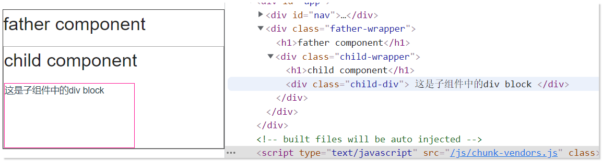
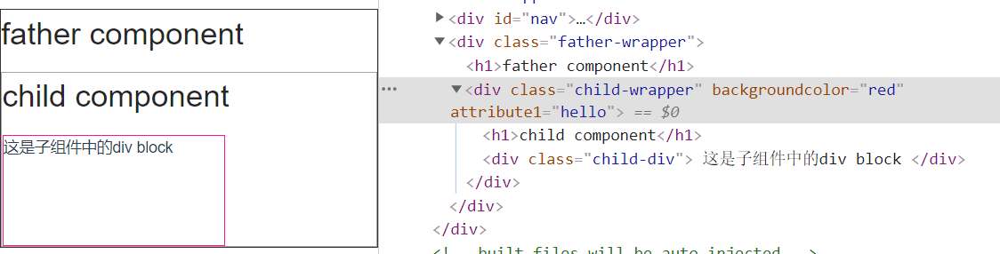
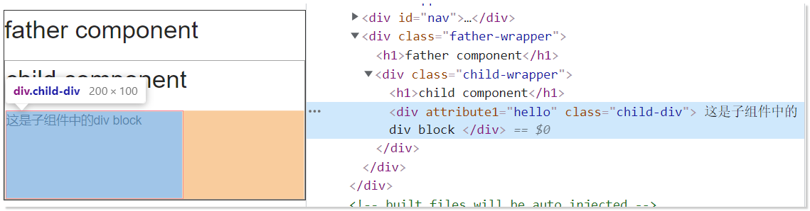

## attribute 和 property 的区别

> property 和 attribute非常容易混淆，两个单词的中文翻译也都非常相近（property：属性，attribute：特性），但实际上，二者是不同的东西，属于不同的范畴。
>
> - property是DOM中的属性，是JavaScript里的对象；
> - attribute是HTML标签上的特性，它的值只能够是字符串；
>
> 简单理解，Attribute就是dom节点自带的属性，例如html中常用的id、class、title、align等。
>
> 而Property是这个DOM元素作为对象，其附加的内容，例如childNodes、firstChild等。
>
> [@cnblog:lmjZone](https://www.cnblogs.com/lmjZone/p/8760232.html)

有这样一个嵌套组件，父组件为：

```html
<template>
  <div class="father-wrapper">
    <h1>father component</h1>
    <ChildComp />
  </div>
</template>

```

子组件为：

```html
<template>
  <div class="child-wrapper">
    <h1>child component</h1>
    <div class="child-div">这是子组件中的div block</div>
  </div>
</template>

```

为了看起来直观，加了少许样式，现在看起来就像这样：



如果，我们在`<ChildComp />` 上加上一个Attribute ,如 ：

```html
<ChildComp attribute1="hello" />
```

会发现：



我们将attribute添加在了 `div.child-wrapper` 上, 这实际上符合我们的预期的。

但是究其原因，官方是这样解释的：

> - 一个非 prop 的 attribute 是指传向一个组件，但是该组件并没有相应 prop 定义的 attribute。
> - 这也是为什么组件可以接受任意的 attribute，而这些 attribute 会被添加到这个组件的根元素上。
>
> [@vue/doc:非-Prop-的-Attribute](https://cn.vuejs.org/v2/guide/components-props.html#%E9%9D%9E-Prop-%E7%9A%84-Attribute)

意思就是说，在父组件中，如果你给一个子组件传递一个attribute（注意，这叫做非prop的Attribute）,那么attribute会被解析为html 属性作用到根元素，即`div.child-wrapper` , 它的表现就像是继承一样。

但是，有一个问题，如果某些场景下，你期望不让它默认的作用在根元素上 `div.child-wrapper` , 那该怎么办？
例如，我们需要加在 `div.child-div`上？

这是时候，我们需要做的就是：

1. 禁用掉这样一种默认的作用规则；
2. 在子组件中取得attribute变量，然后绑定在 `div.child-div`

实际上操作起来很简单:

1. 禁止继承(禁止默认的作用规则):

   ```javascript
   export default {
     inheritAttrs: false,
       ...
   ```

2. 取得attribute 变量，绑定到指定元素上（自定义我们需要的作用规则）：
   在vue中，可以通过`this.$attrs` 获取到所有的 非prop的Attributes

   ```html
   <template>
     <div class="child-wrapper">
       <h1>child component</h1>
       <div class="child-div" v-bind="$attrs">
         <!-- <--这里 -->
         这是子组件中的div block
       </div>
     </div>
   </template>

   ```

```

```

```

```

```

```

```

```

```

```

```

```

```

```

```

```

```

```

```

```

```

```

```

```

```

```



这就是 [禁用 Attribute 继承](https://cn.vuejs.org/v2/guide/components-props.html#禁用-Attribute-继承)

```

```

```

```

```

```

```

```

```

```

```

```

```

```

```

```

```

```

```

```

```

```

```

```

```

```
