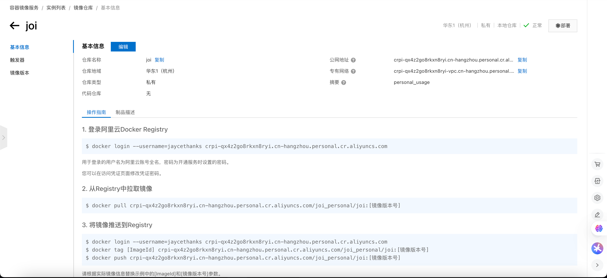
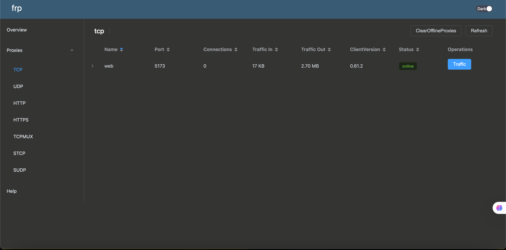

## 拉取docker 镜像

但是由于国内从今年 6 月份开始都访问不了docker 官方镜像仓库了。 我后来也换过一些三方镜像源，都失效了。 这次使用阿里云提供的 acr 个人仓库。

基本的操作就是：

1. 确保你本地网络可以正常拉取`snowdreamtech/frps`将镜像拉取下来
2. 将本地`snowdreamtech/frps` 镜像推送到 阿里云 ACR 个人镜像仓库
3. 在服务器将镜像从 ACR 拉取下来。

### 配置ACR 个人镜像仓库

[官方参考文档](https://help.aliyun.com/zh/acr/user-guide/use-a-container-registry-personal-edition-instance-to-push-and-pull-images)

1. 在[容器镜像服务](https://cr.console.aliyun.com/repository) 中创建个人仓库，包括命名空间、仓库名称。（代码源用于做构建的，直接选本地仓库即可）这个过程会要求你创建一个镜像仓库密码， 后续拉取操作也是需要用到的。

   创建完成后就可以看到下面的页面

   

2. 在本地机器上登录，也就是执行上图中的 `docker login xxxxxxxxx`

   ```bash
   ➜  ~ docker login --username=jaycethanks crpi-qx4z2go8rkxn8ryi.cn-hangzhou.personal.cr.aliyuncs.com
   Password:
   Login Succeeded
   ```

3. 拉取 frps 镜像到本地(上面拉取过就不需要了)

   ```bash
   ➜  ~ docker pull snowdreamtech/frps
   Using default tag: latest
   latest: Pulling from snowdreamtech/frps
   cb8611c9fe51: Pull complete
   21961a7217b4: Pull complete
   4f4fb700ef54: Pull complete
   6a0a203414ba: Pull complete
   0f2926ad560e: Pull complete
   7f1c3a950dd8: Pull complete
   Digest: sha256:1ef9ed77ebc5d03c6c1dd20eec8d03bdf61b98e1ba0eda1e7e4aeffa08bdb610
   Status: Downloaded newer image for snowdreamtech/frps:latest
   docker.io/snowdreamtech/frps:latest
   ➜  ~ docker images
   REPOSITORY           TAG       IMAGE ID       CREATED       SIZE
   snowdreamtech/frps   latest    c17ac1a8dd5b   2 weeks ago   37.8MB
   # 复制这里的 c17ac1a8dd5b 镜像id
   ```

   > 特别注意⚠️：由于你是在本地拉取的， docker默认会自动拉取使用你电脑的芯片架构对应的镜像。 Aliyun 服务通常是 amd, 架构。 如果你在mac 上拉取。 默认会拉取arm j架构。 因此，**如果你是mac 用户， 需要指定 `--platform` 参数 **为 amd，即：
   > `docker pull --platform linux/amd64 snowdreamtech/frps`

4. 给拉取的镜像打一个 tag

   ```bash
   ➜  ~ docker tag c17ac1a8dd5b crpi-qx4z2go8rkxn8ryi.cn-hangzhou.personal.cr.aliyuncs.com/joi_personal/joi:frps
   ```

5. 把镜像推送到 ACR

   ```bash
   docker push  crpi-qx4z2go8rkxn8ryi.cn-hangzhou.personal.cr.aliyuncs.com/joi_personal/joi:frps
   ```

6. 登录你的服务器，拉取镜像

   ```bash
   # 登录 acr
   docker login --username=jaycethanks crpi-qx4z2go8rkxn8ryi.cn-hangzhou.personal.cr.aliyuncs.com
   # 拉取镜像
   docker pull crpi-qx4z2go8rkxn8ryi.cn-hangzhou.personal.cr.aliyuncs.com/joi_personal/joi:frps
   frps: Pulling from joi_personal/joi
   cb8611c9fe51: Pull complete
   21961a7217b4: Pull complete
   4f4fb700ef54: Pull complete
   6a0a203414ba: Pull complete
   0f2926ad560e: Pull complete
   7f1c3a950dd8: Pull complete
   Digest: sha256:a9517b3ed2287556cf489ee1df7fd098eefeb645d7ef5eca0fe6743fe91a729a
   Status: Downloaded newer image for crpi-qx4z2go8rkxn8ryi.cn-hangzhou.personal.cr.aliyuncs.com/joi_personal/joi:frps
   crpi-qx4z2go8rkxn8ryi.cn-hangzhou.personal.cr.aliyuncs.com/joi_personal/joi:frps
   # 查看镜像
   docker images
   REPOSITORY                                                                    TAG       IMAGE ID       CREATED        SIZE
   crpi-qx4z2go8rkxn8ryi.cn-hangzhou.personal.cr.aliyuncs.com/joi_personal/joi   frps      c17ac1a8dd5b   2 weeks ago    37.8MB
   ```

### 配置 frps 配置文件

登录你的服务器：

```bash
mkdir /opt/frp
vim /opt/frp/frps.toml

# 编辑你需要的内容
```

```bash
#示例

bindPort = 7000  # 服务端监听端口
# 可选：Web 管理界面
webServer.addr = "0.0.0.0"
webServer.port = 7500
webServer.user = "admin"
webServer.password = "admin"
# 可选：认证令牌
# auth.token = "your_secure_token"
```

### 运行 frps 容器

```bash
# 查看镜像
docker images
REPOSITORY                                                                    TAG        IMAGE ID       CREATED        SIZE
crpi-qx4z2go8rkxn8ryi.cn-hangzhou.personal.cr.aliyuncs.com/joi_personal/joi   frps_amd   c17ac1a8dd5b   2 weeks ago    37.8MB

# 启动 frps
docker run -d   --name frps   --restart always   -v /opt/frp/frps.toml:/etc/frp/frps.toml   --network host   5f8d50fd4536
```

> 特别注意⚠️： 为什么这里使用的是宿主机网络模式， 而不是桥接模式？
> 当使用桥接模式时，如下：
>
> ```bash
> docker run -d   --name frps   --restart always   -v /opt/frp/frps.toml:/etc/frp/frps.toml   -p 7000:7000   -p 7500:7500  c17ac1a8dd5b
> ```
>
> 在 Docker 的默认桥接网络模式下，容器拥有自己独立的网络命名空间。外部网络要访问容器内的服务，必须通过 Docker Host 进行端口映射 (-p host_port:container_port)。这意味着：
>
> 1. **bindPort (7000)**：frpc 需要连接到容器内的 frps，所以必须映射。
> 2. **webServer.port (7500)**：如果你想从外部访问 Dashboard，也必须映射。
> 3. **remotePort (例如 5173)**：当外部用户访问 http://公网IP:5173 时，流量首先到达 Docker Host 的 5173 端口。为了让这个流量进入容器并被 frps 接收，你也**必须**在 docker run 时映射这个端口 (-p 5173:5173)。
>
> 所以， 使用宿主机网络模式，可以很好的解决这个问题。

```bash
# 查看容器运行情况
docker ps
CONTAINER ID   IMAGE                         COMMAND                  CREATED         STATUS             PORTS                                                                                  NAMES
a4e323f6fb93   5f8d50fd4536                  "/usr/bin/frps -c /e…"   6 seconds ago   Up 5 seconds       0.0.0.0:7000->7000/tcp, :::7000->7000/tcp, 0.0.0.0:7500->7500/tcp, :::7500->7500/tcp   frps
```

### 运行客户端

在此之前可以测试一下你的服务器 7000 端口服务能否测通。 可以利用 telnet 或者 netcat(mac 自带)来测试：

```bash
nc -v 47.121.146.12 7000
Connection to 47.121.146.12 port 7000 [tcp/afs3-fileserver] succeeded!

# telnel
telnet x.x.x.x 7000
```

> 注意⚠️： 如果不通，则很可能是你阿里云的网络安全策略没有放开 7000 TCP/UDP 端口

### 下载 frp 到本地：

你可以到 [frp/releases](https://github.com/fatedier/frp/releases) 手动下载解压， 也可以到终端通过命令行下载。 我这里打算直接装到系统目录。 所以我使用命令行：

```bash
# mac
wget https://github.com/fatedier/frp/releases/download/v0.61.2/frp_0.61.2_darwin_arm64.tar.gz

# 如果你是linux 则是
https://github.com/fatedier/frp/releases/download/v0.61.2/frp_0.61.2_linux_amd64.tar.gz

```

解压

```bash
sudo tar -xzf frp_*_darwin_arm64.tar.gz  # Mac[arm] 客户端
sudo tar -xzf frp_*_linux_amd64.tar.gz #linux
```

配置 frpc.toml 客户端配置文件

```bash
sudo vim frpc.toml
```

假设你需要穿透本地 5173 端口web 服务， 你可以如下配置：

```bash
erverAddr = "47.121.146.12" # 换成你自己的公网ip
serverPort = 7000

[[proxies]]
name = "web"
type = "tcp"
localIP = "127.0.0.1"
localPort = 5173
remotePort = 5173
```

启动本地服务穿透：

```bash
./frpc -c frpc.toml
2025-04-06 14:50:10.791 [I] [sub/root.go:142] start frpc service for config file [frpc.toml]
2025-04-06 14:50:10.791 [I] [client/service.go:295] try to connect to server...
2025-04-06 14:50:10.913 [I] [client/service.go:287] [f482d7ebdb23de02] login to server success, get run id [f482d7ebdb23de02]
2025-04-06 14:50:10.913 [I] [proxy/proxy_manager.go:173] [f482d7ebdb23de02] proxy added: [web]
2025-04-06 14:50:10.950 [I] [client/control.go:168] [f482d7ebdb23de02] [web] start proxy success
```

### 测试访问：

**访问 frp dashboard** : http://47.121.146.12:7500/ （换成你的ip）

> (需要配置阿里云安全组开放 7500 tcp 端口)



**访问你的web 服务** ： http://47.121.146.12:5173/

### 额外的

#### 穿透后端接口服务（以java 为例）

```bash
#frpc.toml

# frpc.toml

# [common] 部分保持不变
serverAddr = "47.121.146.12"
serverPort = 7000

# 如果之前有 web 服务的代理，可以保留或注释掉
# [[proxies]]
# name = "web"
# type = "tcp"
# localIP = "127.0.0.1"
# localPort = 5173
# remotePort = 5173

# --- 为 Java 服务添加新的代理 ---
[[proxies]]
name = "java-backend-api"   # 给这个代理起一个唯一的名字，方便识别
type = "tcp"                # 对于大多数 HTTP API 或后端服务，TCP 类型是合适的
localIP = "127.0.0.1"       # frpc 连接 Java 服务时使用的 IP (根据第 1 步确定)
localPort = 8080            # frpc 连接 Java 服务时使用的端口 (Java 服务监听的端口)
remotePort = 8081           # **关键**: 公网访问时使用的端口。
```
