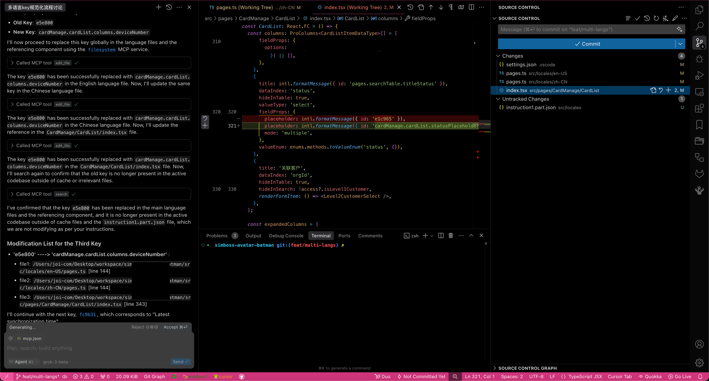
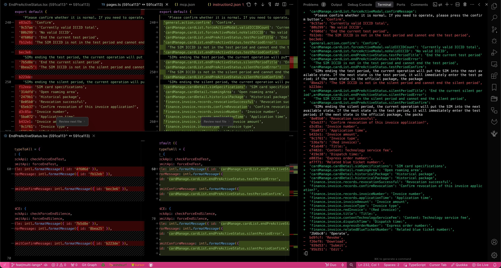
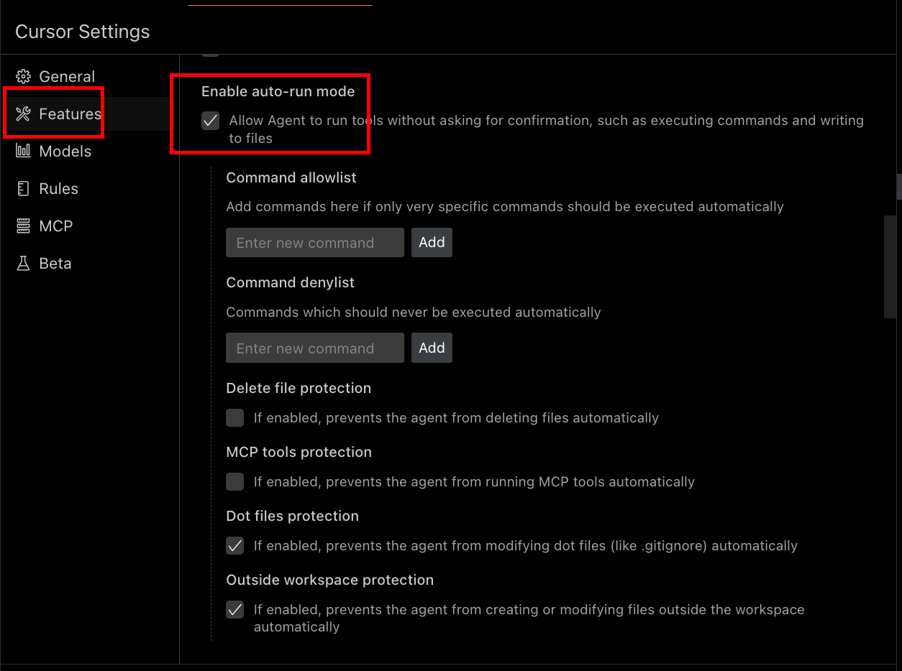

## 一、引言

在软件开发中，多语言支持（国际化，i18n）是一个常见但又容易被忽视的技术债务。随着项目的扩展，不规范的语言键（keys）会导致维护成本激增，尤其是当团队需要理解和更新这些杂乱无章的标识符时。本文将分享如何利用 Model Context Protocol (MCP) 技术，结合 AI 的语义理解能力，高效处理项目中的多语言支持规范化工作。

我现在维护的项目中，可能有几百个这种不规范的key:

```json
# en
{
  "4ef3c7": "Current IMSI",
  "26989a": "Usable region",
  "0ced5b": "Total package",
  // 更多类似的 key...
}

# zh
{
  "e1c965": "请选择状态",
  "e5e800": "设备号码",
  "fc9b31": "最近同步时间",
  // 更多类似的 key...
}
```

这种无意义的哈希值作为键名，维护修改起来异常的痛苦不堪 - 完全不知道它们代表什么，需要在哪里使用，以及如何有效地组织它们。

这可能是 “先这样吧，以后再处理” 所遗留的债务问题吧，也无从考究。
好在现在这个项目只有中英双语，我现在如果要对他们进行修改流程上倒是不会太复杂。

而现在如果要对这些 key 进行规范化，传统上需要完成以下步骤：

1. 找到所有引用特定 key 的页面和组件
2. 根据使用场景命名（如公共键："common.xxx.standardKeyName"，特定键："page.section.dialog.standardKeyName"）
3. 修改对应的语言包文件和所有引用

这样就完成了一次 key 的规范化优化，本身是一件很简单的过程，不过问题在于我们需要对几百个key 都要这样重复的操作。这个工作量就很大了，过程非常耗时，而且很容易出错。

## 二、AI 直接解决的局限性

我们当然不可能人工去完成这件苦差事，我首先尝试了直接使用 AI 来帮助完成这项工作，但是经过我一番换不同的姿势和角度去和ai battle， 我发现了一些绕不过的问题：

1. AI 需要先索引整个代码库，然后在内存中搜索 key，这个过程会因上下文限制而丢失精度, 或者难以控制 AI 的具体行为，可能胡乱的“优化”其他的代码，无论你怎么重申都无济于事。
2. 批量处理容易导致大量修改错误或命名不当
3. 单个处理效率低下且 token 消耗巨大

## 三、MCP：突破性的解决方案

Model Context Protocol (MCP) 为我们提供了一条新路径。MCP 允许 AI 模型调用外部工具和服务，而不必依赖于自身的上下文记忆来处理大量代码。

关键思路是：我们只需要 AI 的语义理解能力来生成规范的 key 名称，而代码中的查找和替换操作可以交给更专业的工具来完成。

### MCP 真的能够解决我们上述问题吗， 为什么？

根据我的实践， 是非常可以的。

**MCP（Model Context Protocol，模型上下文协议）**是由Anthropic公司提出的一种标准化协议，旨在解决大模型与外部工具、数据源之间的碎片化接入问题。它通过统一的技术规范，让AI模型能够像“即插即用”一样调用各类工具和服务，大幅降低了开发者的集成成本。

其实，我们很容易找到上述场景所面临的问题。 我们为什么不能使用脚本的形式去做批量替换处理呢？ 为什么？因为我们需要理由ai 的上下文语言理解能力，帮我们生成规范的key, 这是核心。

而 AI 在处理这种大量上下文的任务的时候，需要频繁的定位相关key的引用，然后对他们去逐个修改。这个过程很简单，但是对于AI 来说，目前大部分只能够一个一个去修改。 这也是导致为什么实际任务处理中，精度低，效率低，token 消耗大的问题根源。

但是 key 的替换其实是一个很简单的操作。 直接 vscode 全局查找，然后批量替换，基本可以解决掉 99% 的需要了。

> 还有 1% 就是字符串拼接没法处理（还就真被我遇上了 - -）。

我们没法让 vscode 去这样操作。 像 rpa 机器人一样帮我们自动点击-输入-替换， 尽管可能现在的 agent ai 如同雨后春笋一般涌现， 不过大部分还没有成熟应用成本高，或者只是支持了 浏览器操作。不过，我们可以通过 MCP 服务，将 AI 生成的规范化 key 作为输入，然后让 MCP 服务去执行程序性的文本替换 old-key-->new-key， 这样就能够解决上面提到的问题了。

## 四、实施方案

具体的，我们需要全局的文本搜索能力，还有全局文本替换能力。

[modelcontextprotocol/filesystem](https://github.com/modelcontextprotocol/servers/tree/main/src/filesystem) 就支持文件系统， 不过它支持文本替换，却没有支持文本搜索能力。看了下 [#335](https://github.com/modelcontextprotocol/servers/issues/335) 似乎没有打算继续更新了。为此，我们需要找一个三方的mcp， 我找到了[Kurogoma4D/file-search-mcp](https://github.com/Kurogoma4D/file-search-mcp?tab=readme-ov-file) , 不过搜索效率很低。我让ai 帮忙重写了下， 使用和vscode一样的底层技术 ripgrep 重写了核心逻辑 —— [joisun/file-find-mcp](https://github.com/joisun/file-find-mcp)。

### 工具准备

1. AI 编辑器：我尝试不同的方案，windsurf、cline、copilot、cursor， 目前看来，cursor 对mcp 的支持是最稳定的，cline也可以。这里，我推荐使用 cursor(grok3-beta 就够用了) 进行后续的操作。

2. 我们需要两个核心 MCP 服务：
   1. 文件系统操作：[modelcontextprotocol/filesystem](https://github.com/modelcontextprotocol/servers/tree/main/src/filesystem)

   2. 文件搜索功能： [joisun/file-find-mcp](https://github.com/joisun/file-find-mcp)

      > 这里说一下接入方法：
      >
      > 1. 使用rust 写的 。 需要预装一下 rust 环境: https://www.rust-lang.org/tools/install
      > 2. 拉取代码仓库到本地，后执行下方命令：
      >
      > ```bash
      > # Update dependencies
      > cargo update
      > # Release build with optimizations
      > cargo build --release
      >
      > ## Check for errors, warnings, and lints
      > # cargo check
      > # cargo clippy
      >
      > ## Run your tests
      > # cargo test
      > ```
      >
      > 3. 准备添加 file-find-mcp :
      >
      >    编译构建完后，我们就可以添加 file-search-mcp 这个serve 了, 构建命令会构建出运行文件，目录应该是 `/path/to/file-find-mcp/target/release/file-find-mcp`, 例如我本地就是：`/Users/joi-com/Desktop/mcp_servers/file-search-mcp/target/release/file-search-mcp`

   配置文件 cursor `mcp_config.json` 示例：

   ```json
   {
     "mcpServers": {
       "filesystem": {
         "command": "npx",
         "args": [
           "-y",
           "@modelcontextprotocol/server-filesystem",
           "/Users/joi-com/Desktop/workspace/projectPath" #注意这里需要指向你项目的根目录
         ],
         "autoApprove": [
           "list_allowed_directories",
           "edit_file"
         ]
       },
       "file-find-mcp": {
         "command": "/Users/joi-com/Desktop/mcp_servers/file-find-mcp/target/release/file-find-mcp", #注意这里需要替换为你自己的 file-find-mcp 构建产物路径
         "autoApprove": [
           "search",
           "search_file"
         ]
       }
     }
   }
   
   ```

### 数据预处理

其实现在，你就可以让 AI 按照我们上面讨论到的思路进行工作了。 不过，我的实践中，我发现如果一次性处理的key 太多，还是可能会造成后面的操作跑偏的问题。 所以我建议分批操作，分的越小，ai 执行的准确度越高。 同时我们也应该需要不断的review，手动抽查 AI 的变更是否正确。

首先，我们需要提取项目中所有不规范的语言 key：

1. 创建一个包含所有语言 key 的源数据文件（如 `instruction.map.js`），其实就是语言包，可以是 locale/en.json, 我这里是 ts 文件导出的 js 对象。

2. 数据清洗和提取，使用 Node.js 脚本筛选出不规范的 key：

   ```js
   // src/locales/extract.js
   const fs = require('node:fs')
   const path = require('node:path')

   // 正则表达式匹配 6位16进制的key，同时也匹配可能带后缀的key
   const HEX_KEY_REGEX = /'?([0-9a-f]{6}(?:id|ud)?)'?\s*:\s*['"](.+?)['"]/g

   // 主函数
   function extractHexKeys() {
     const results = {}
     const filePath = path.join(__dirname, 'instruction.map.js')

     try {
       const content = fs.readFileSync(filePath, 'utf-8')
       let match

       while ((match = HEX_KEY_REGEX.exec(content)) !== null) {
         const [, key, value] = match
         results[key] = value
       }

       // 将结果写入JSON文件
       const outputPath = path.join(__dirname, 'hex-keys-output.json')
       fs.writeFileSync(
         outputPath,
         JSON.stringify(results, null, 2),
         'utf-8'
       )

       console.log('提取完成！结果已写入:', outputPath)
       console.log('总共找到', Object.keys(results).length, '个匹配项')

       // 打印结果预览
       console.log('\n结果预览:')
       const previewKeys = Object.keys(results).slice(0, 3)
       for (const key of previewKeys) {
         console.log(`\nKey: ${key}`)
         console.log(`Value: ${results[key]}`)
       }

       // 打印带后缀的key
       console.log('\n带后缀的key:')
       const suffixKeys = Object.keys(results).filter(key => key.length > 6)
       for (const key of suffixKeys) {
         console.log(`${key}: ${results[key]}`)
       }
     }
     catch (error) {
       console.error('处理文件时出错:', error.message)
     }
   }

   // 执行提取
   extractHexKeys()
   ```

3. 将提取的 key 分批处理，以适应 AI 的处理能力: 这里你可以选择使用 脚本去分割文件，我这里直接手动分批的，50 个key 一个文件。

   ```json
   // instruction1.json
   {
     "1a8d5b": "Alarm setting",
     "eaa324": "Alarm value setting (each setting triggers a notification once)",
     "10a52f": "Package amount:",
     "73d6a6": "Payable amount:",
     "93ea1f": "Account balance:"
     // more ......
   }
   ```

### AI 提示词工程

为了让 AI 高效地执行规范化任务，我们需要精心设计提示词, 下面是我的提示词：

```
作为代码重构助手，请规范化项目多语言key。按以下流程操作：

1.  分析任务：
    - 每次分析10个不规范key
    - 使用 **file-find-mcp file_search mcp工具服务搜索** 每个key的使用位置
      参数：排除 json 文件

2.  命名规则：
    - 根据key在页面或者组件中被引用的位置，分析使用场景和上下文
    - 层级结构：[模块].[子模块].[功能].[描述]
    - 通用字段用'common'前缀
    - 特定模块用模块名作前缀
    - 表格列名包含'columns'层级
      示例：'common.columns.totalPackage'、'cardManage.otaCardList.columns.currentImsi'

3.  执行更新：
    - 使用filesystem mcp服务全局替换旧key为新key

4.  重要注意：
    - 一次只处理一个key
    - 保留原key的注释
    - 更新所有引用位置
    - 每组10个key处理完后暂停，等待"continue"指令再继续
    - 仅使用指定的mcp服务，不自行使用其他工具
    - 若mcp执行失败，立即停止并报告原因
    - 不修改与key规范化无关的代码

5.  验证步骤：
    - 每个key替换后，再次搜索确认旧key已完全替换
    - 每组任务结束后，以markdown block 的形式列出changelog以便我直接复制，格式如下：
      示例：
    1.  **Key: `f76ca2` changed to `cardManage.poolList.selection.minOneIccid`**
    - Updated in `/src/locales/en-US/pages.ts`
      - Old: `f76ca2: 'Please select at least one ICCID'`
      - New: `'cardManage.poolList.selection.minOneIccid': 'Please select at least one ICCID'`
    - Updated in `/src/locales/zh-CN/pages.ts`
      - Old: `f76ca2: '请至少选择一个ICCID'`
      - New: `'cardManage.poolList.selection.minOneIccid': '请至少选择一个ICCID'`
    - Updated references in:
      - `/src/pages/CardManage/CardList/components/ForceActiveModal.tsx`
      - `/src/pages/CardManage/CardList/components/EndPreActiveStatus.tsx`
      
6.  内容输入和范围边界
    - 我已经将 src/locales/en-US/pages.ts 中不规范的 key单独提取到了 @locales/instruction1.json，以便于你处理。
    - 你需要以这份文件为索引列表进行任务处理，但是不要修改这个 json 文件
    - 如果发现只有语言包中有这个 key，但是页面或者组件中没有引用过这个 key, 那么可以在语言包中删除这个 key

7.  重要说明
    - **请使用我指定的 mcp 服务进行文件的搜索和替换工作，严禁使用你自己的工具**
    - 如果 mcp 执行失败，请立即停止并报告原因
    - 请严格遵循上述指令和要求
```


## 五、实施效果展示

效果不错






## 六、优化策略

- 在 Cursor 编辑器中开启 "Yolo mode"，避免每次 MCP 调用都需要确认



- 按模块分批处理

- 可能用到的指令：
- 分片切换:

 ```
 from now on, use the @instruction2.json as the keys index map。 and pause after 10 keys processed
 ```

- 一次性处理所有的key 不要停止。

 ```
 from now on ,the input key index map gonna be @instruction3.json ,and this time you need finish all of the keys in the file, no pausing untill finish the job, the approch is the same as before,you should handle the keys one by one .
 ```

- 从暂停处继续

 ```
 please go ahead, and deal with all the remain keys.
 ```

## 七、延伸应用与思考

通过结合 AI 的语义理解能力和 MCP 的工具调用能力，我们成功地解决了项目中的技术债务问题。这种方法的优势在于：

1. **高效**：MCP 服务直接在文件系统层面操作，避免了 AI 上下文限制
2. **准确**：专业工具的搜索和替换功能确保了高精度
3. **可扩展**：方法可应用于各种代码重构和规范化任务
4. **省时省力**：大幅减少了手动操作和人为错误

通过这个场景对 MCP 的探索和实践，我们也可以发现，本地 MCP server 很适合用于执行一些程序化的操作。
