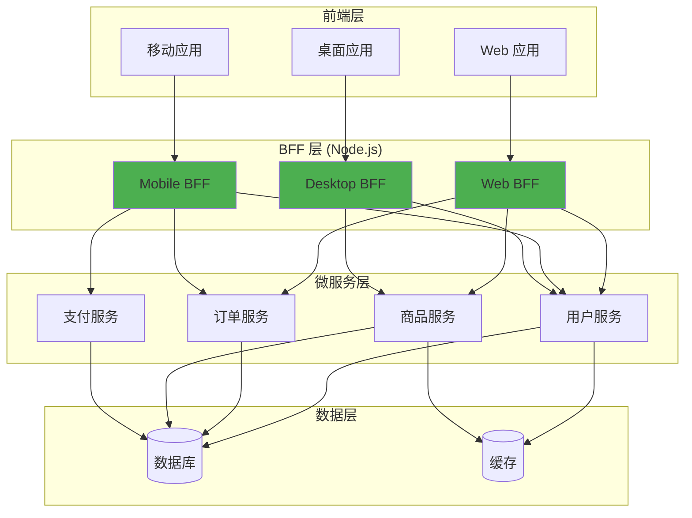
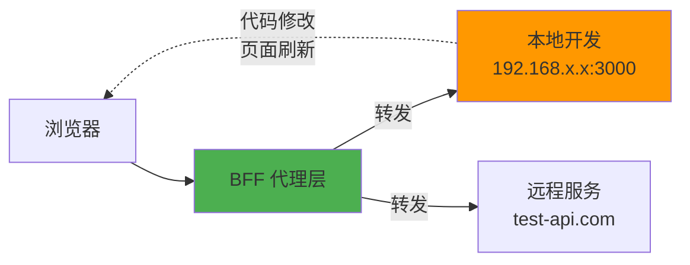
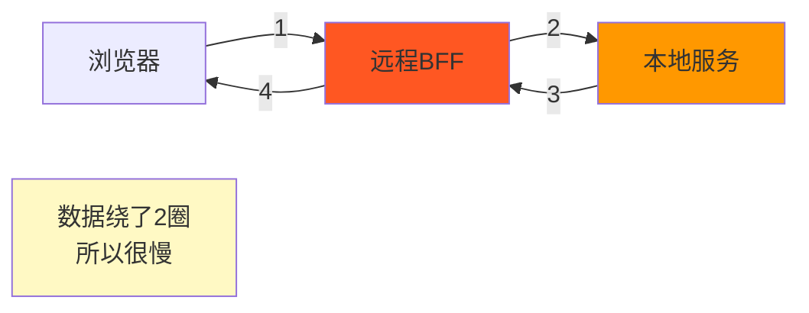
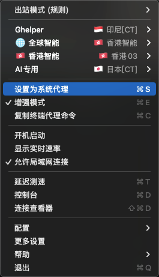
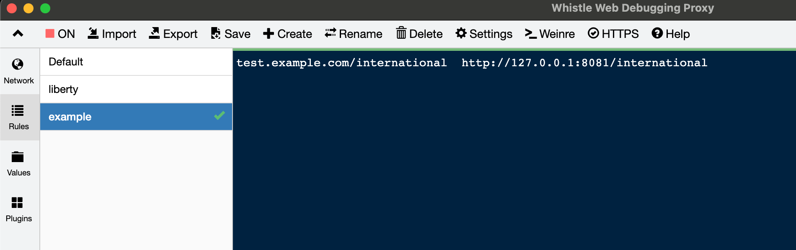
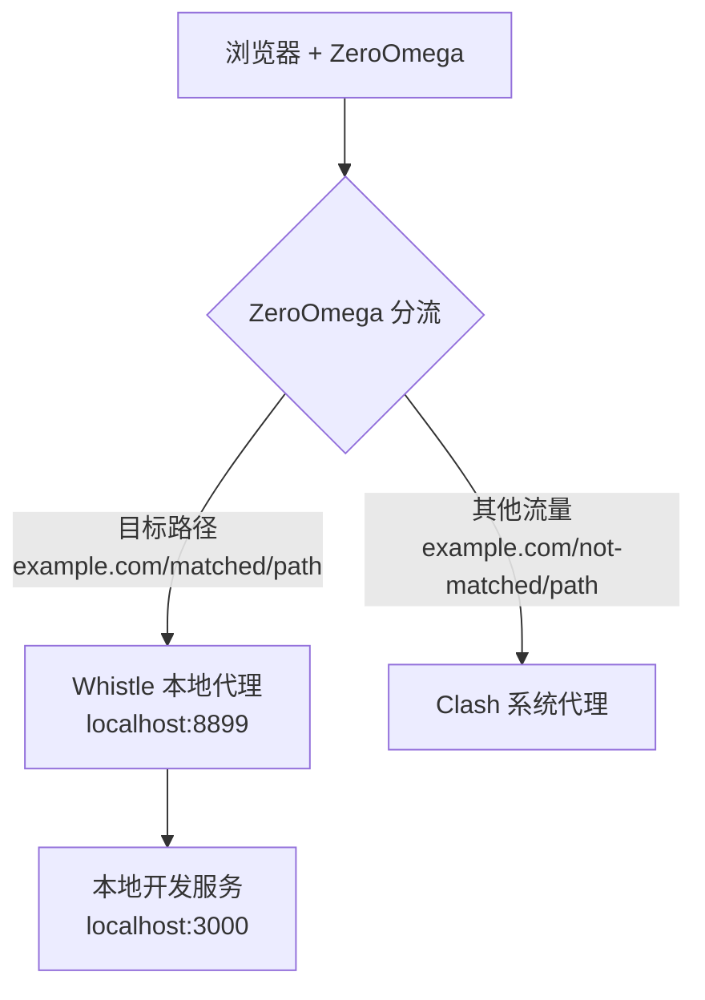

## 背景

我们公司的技术架构是微服务模式，采用 node 作为BFF 中间层，类似这样的架构



不仅如此，为了满足高度自定义开发环境下，多分支协作开发测试的场景，前端通过 cookie 可以动态指定某个前端服务具体要请求到对应服务的哪一个分支, 具体来说，就像这样
```
example-service-a=http://example-service-a-feature-abc.test.example.com:80; 
example-service-b=http://example-service-b-feature-abc.test.example.com:80; 
example-service-c=http://192.168.31.124:8082/international/
```

我们在node BFF 层中去处理转发逻辑， 这样就实现了，前端模块 `example-service-a` 的请求，就会指定转发到 `example-service-a-feature-abc` 这个服务, 前端模块 `example-service-b` 的请求，就会指定转发到 `example-service-b-feature-abc` 这个服务。 

node BFF 中间层的实现本文不予赘述。 

你可能注意到了 `example-service-c=http://192.168.31.124:8082/international/`,  `192.168.31.124:8082` 不是一个本地ip吗？ 是的， 我们局域网网络也是可以代理转发的。 这样就可以实现本地开发，无需发布代码，只要页面刷新，就可以看到本地代码了。 像这样




但是有一个问题很明显，就是太慢了。 也是本文主要的内容。 为什么会这么慢呢？ 原因如下 



实际上，如果文件没有那么大，同时网络条件较好的情况下，其实这也能接受。 但是一旦公司网络有上下行限制，或者网络拥堵，加上文件较大，刷新一次页面，等个大几十秒是便饭。 

## Whistle 拦截转发

[Whistle](https://github.com/avwo/whistle), 是一个基于 Node.js 的网络抓包调试工具。 支持非常灵活的配置规则。可以配置拦截指定的流量并按照指定规则进行转发。 而我们要做的很简单， 就是把特定请求拦截并转发到我本地开发服务器就行。 

> 使用Whistle 如果需要支持https 请求处理， 需要先安装安全证书 ([略](https://wproxy.org/docs/gui/https.html))，我们开发服务都是http，可配可不配。 

whistle 的使用非常简单，安装[GUI版本](https://github.com/avwo/whistle)， 打开后，

### 系统代理

先开启系统代理


如果你同时使用了 clash， 记得去处 clash 的系统代理勾选



### 配置转发规则



> `test.example.com/international   http://127.0.0.1:8081/international`

whistle 非常强大，我们还可以修改响应头，为了让我们可以辨别，我们可以加一个自定义响应头，如下


> `test.example.com/international resHeaders://x-proxy=Whistle  http://127.0.0.1:8081/international`

### 验证一下

在响应头看到我们的自定义响应头


## Whistle +  ZeroOmega 实现更加灵活的转发策略

有时候，我们需要更加灵活的方式，例如我希望 clash 接管系统代理，把指定流量交给 whistle 去处理。 

[ZeroOmega](https://github.com/zero-peak/ZeroOmega/tree/master) 是frok自 [SwitchyOmega](https://github.com/FelisCatus/SwitchyOmega/issues/2513) 原项目作者不再维护。 ZeroOmega 可以按照特定规则进行流量转发。

> 看起来都是流量转发？ 那为什么不直接使用 ZeroOmega 这个插件就好了？ 原因是因为 ZeroOmega 是基于浏览器的 **Proxy API** 工作，而浏览器层面的代理协议（HTTP / HTTPS / SOCKS5）定义是这样的：
> ```bash
> 协议://用户名:密码@主机:端口
> ```
>
> 并不支持带有路径，而 whistle 是一个本地代理服务器，它暴露了代理服务的端口。 

通过这两个工具， 我们要实现的是什么呢

ZeroOmage 可以配置不同的情景模式，我们可以借由该特性将指定请求转发到 whistle 我们希望

1. 转发 `http://example-service-a.com/intl/` 入口流量，转发到whistle 处理
2. 其他的走默认情景模式 (我是配置了一个 clash请求模式)，也就是其他流量走 clash

Whistle 中需要配置监听规则，监听 `http://example-service-a.com/intl/`, 然后转发到本地服务



## 具体配置

### ZeroOmega

首先配置 ZeroOmega， 在我的实际场景中，我需要转发这些地址到我本地开发服务器


为了通用性，接下来我们将 `test.example.com`作为讨论的域名，也就是说，上面的请求可以看作:
```bash
http://test.example.com/international/js/chunk-vendors.js
http://test.example.com/international/
http://test.example.com/international/js/app.js
```

我建立了两个ZeroOmega请求规则， 如下：


**Auto switch 配置动态应用规则**


正则参考: `^http(|s):\/{2}test\.example\.com\/international*`


### whistle 配置

先确认我们端口和 ZeroOmega中对应， 我用的是8888（默认是8899）


其他的rule配置和之前一样


不过，现在可以取消 whistle 的系统代理了，让clash 去做系统代理
