## Chrome DevTools Perfomance Tab

Chrome DevTools Performance 标签页有大量的特性帮助你深度的分析你的站点性能。本文将阐述如何使用。

[toc]

### 1.录制一个性能简报

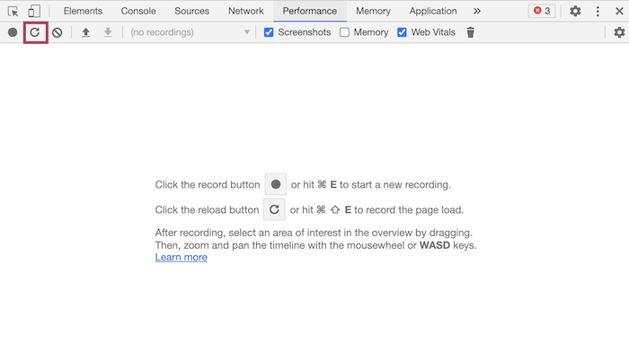

点击 reload 按钮，即可自动生成一次CPU 和 网络活跃表现报告。

> 请在无痕模式下调试，这样能确保浏览器以最干净的环境去分析网页

### 2.Performance tab 功能概览

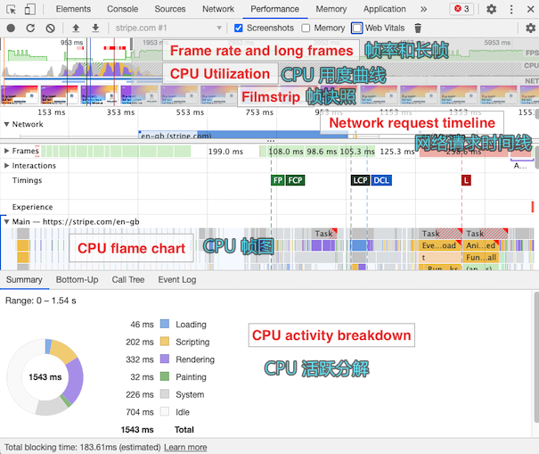

#### 3.CPU 用度时间线（timeline）

该图表示了CPU的不同的任务忙碌分布情况，通常JavaScript 为黄色， 布局工作为紫色

CPU活跃曲线通常在最初为高峰，而后会骤降

下面这个示例中，你可以看到CPU 在初始化页面之后，依旧会持续利用，特别在性能比较差的设备，这会导致用户的有效交互被延后。

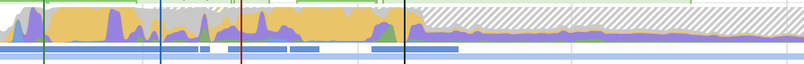

#### 4.帧快照

帧快照（或者叫幻灯片）以直观的方式录制了你的网页的渲染过程。

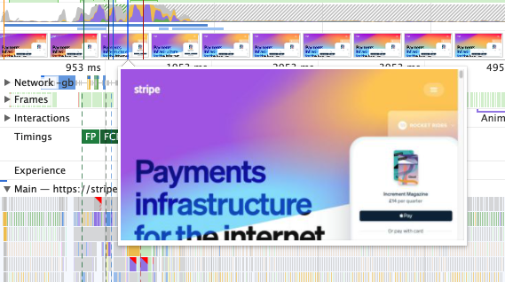

#### 5.网络请求时间线

网络请求部分，展示了一个网络请求的瀑布流，以HTML文档请求开始，然后是其他的请求跟在下方。

点击每一个请求，可以看到额外的信息，如完整的url, 请求耗时，资源优先级，以及下载大小。

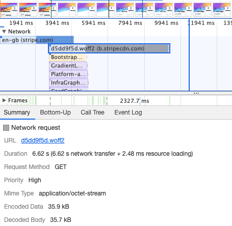

网络时间线对于将请求与 UI 更新或 CPU 活动关联起来特别有用。例如，此屏幕截图显示了字体加载完成之前的 Stripe 主页。

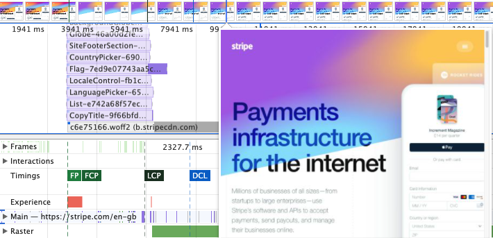

如果你看到了UI的变动，你可以查看网络请求部分以验证是什么网络请求阻塞了UI 的更新。

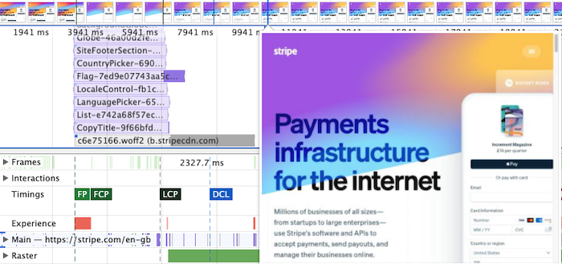

#### 6.CPU 火焰图 (CPU flame chart)

主线程 CPU 部分包括了一个嵌入的火焰图，表现了CPU 任务是如何被分配到各个不同的组件。

例如，你可以看到一个 `waitForCssVars` 的函数在火焰图中被调用，往上一层看，可以发现是被一个匿名函数调用，而之所以调用它，是因为它被用作 requestAnimationFrame 回调。你还可以看到`init` 函数在`waitForCssVars` 中被调用。

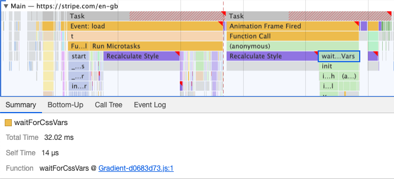

在火焰图中选中一个JavaScript函数，将会展示出额外的关于该调用的信息，包括了资源的位置，点击资源链接，将会跳转到源代码的位置

> 并不是所有的函数调用都可以看到源码位置。

**Forced reflows （强制回流）**

通常，浏览器首先完成运行 JavaScript 代码，然后为用户更新 UI。强制回流是指当JS访问了元素的布局属性，然而此时有整处于pending状态中的UI 变动会被JS访问布局属性的元素影响。浏览器在 JavaScript 代码运行时同步计算布局更新。

强制回流不总是对性能有着很大的影响，强制 `style recalculation` 强制样式重新计算将工作向前推进，因此如果布局稍后没有更改，则不需要额外的工作。

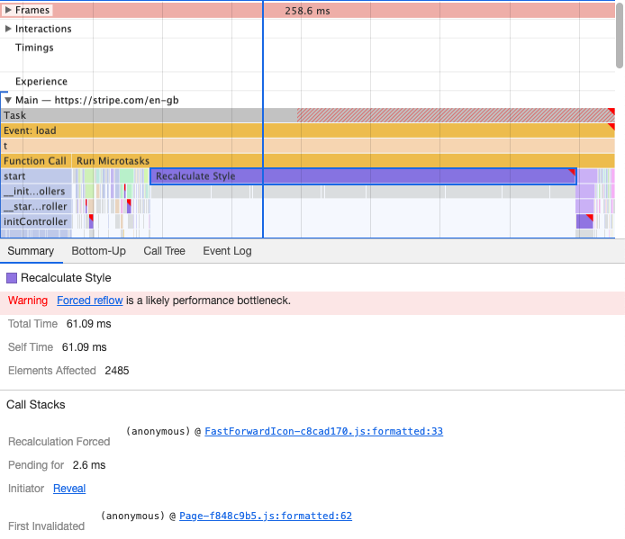

1. **Recalculation Forced**: The code that triggered the relayout by accessing DOM element properties that depend on the layout

   > 通过代码访问影响布局的元素属性将会触发重排。

2. **First Invalidated**: The code that changed the DOM, meaning layout recalculations would be necessary the next time the UI is updated

   > 通过代码改变DOM意味着在下次UI更新之前重新计算布局是必然的

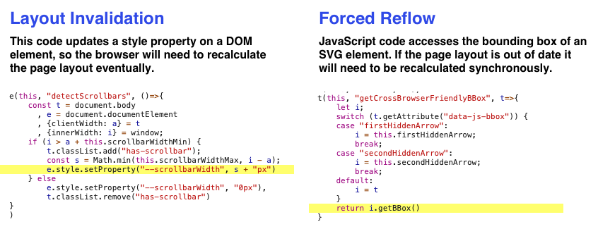

**【Summary】**

如果没有特别选中某个CPU任务，而是点中了主线程 “Main” 详情栏将会把CPU 消耗分解为四类并以饼图统计：

- **Loading**: 网络请求 + 解析HTML
- **Scripting**: 解析 + 编译 + 执行 JavaScript 代码 + 垃圾回收
- **Rendering**: 样式 + 布局计算
- **Painting**: 绘制 + 图层合并 + 缩放、解码图片

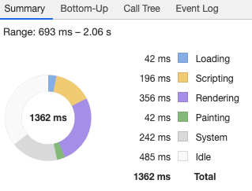

**【Bottom-up】**

查看更细粒度的 CPU 活动细分。它从调用树的底部显示最低级别的活动类型，所以你会经常看到像 getBBox 或 setAttribute 这样的原生浏览器函数。

展开这些低级函数以找出调用它们的代码。这可以帮助您找到您可以控制的代码。

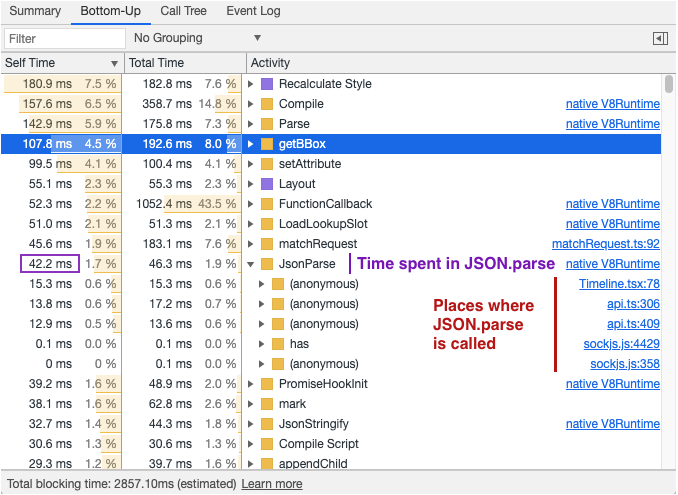

**【Call Tree】**

调用树选项卡类似于火焰图：它显示了不同子任务和函数调用对任务总体持续时间的贡献程度。

与火焰图相比的优势在于调用树聚合了重复的代码调用，而不是一次只查看一个调用。这样可以更轻松地查看平均花费的时间。

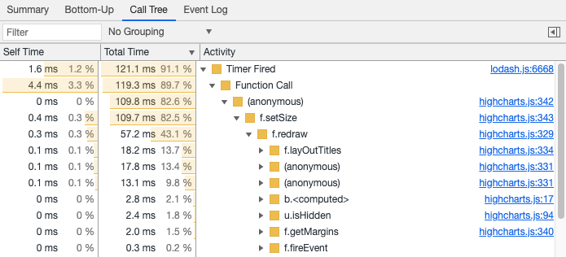

#### 7.帧与帧率

【Frames】部分展示了页面上的每次UI 更新。每个UI更新都被一个frame调用，且如果UI被“冻结”了很长时间，它将被称为 long frame.

下方的截屏展示了几个long frame， 这是由于被太过庞大的JS 活动推延UI更新导致的。

Long frame 和 帧率同样会展示在上方的CPU活跃图中

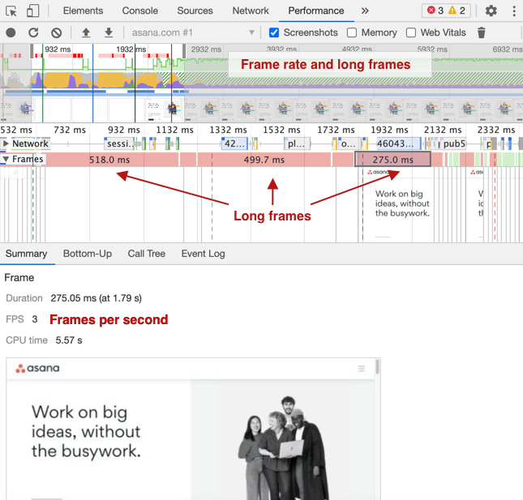

如果你点击帧截图在详情面板，你可以逐帧查看所有捕获的帧。

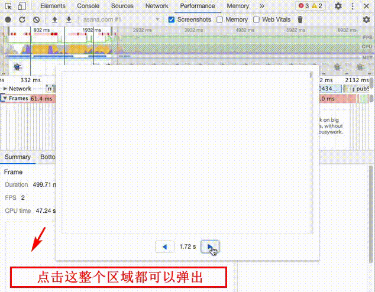

#### 8.网页重点时间点

DevTools Performance 选项卡还可以显示 Web Vitals 和 User Timing 指标。

`FP` : First Paint

`DCL` : DomContentLoaded

`L` : Load

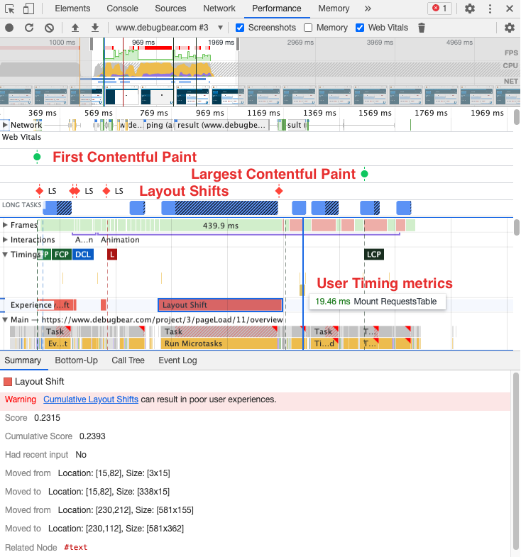

将鼠标悬停在**layout** 通道（shift）中的布局变化上将突出显示页面上更改位置的 DOM 节点，假设 DOM 节点仍然存在。单击布局移位条目会显示其他信息，例如元素移动的位置。

**Long Tasks** 通道(shift)显示运行时间超过 50 毫秒的 CPU 任务，使页面对用户输入的响应速度较慢。超过 50ms 的时间算作阻塞时间，用**黑色条纹标记**。这可以帮助您调试 Total Blocking Time 指标。

#### 9.CPU 节流

在优化网站速度时，您经常会遇到网站在您的设备上速度很快但对某些用户来说速度很慢的情况。例如，页面在 CPU 速度较慢的手机上的加载速度通常比在桌面设备上慢。

DevTools 可以限制 CPU 和网络连接，以模拟速度较慢的设备上的用户如何体验您的网站。

要限制 CPU，请单击“性能”选项卡中的齿轮图标 - 而不是 DevTools 右上角的那个！然后，您可以启用 4-6 倍的 CPU 减速。

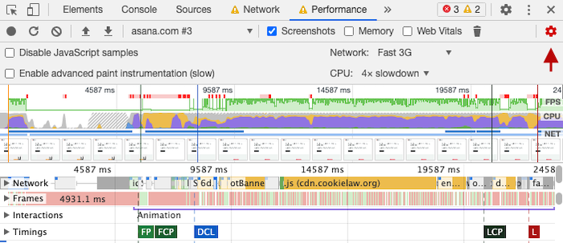

上面的屏幕截图显示，在较慢的设备上，即使在初始加载之后 CPU 仍然很忙。这可以降低页面对用户交互的响应，以及使用额外的电池电量。

作为参考，将上面的 CPU 图表与下面的 CPU 图表进行比较，其中 CPU 没有受到限制。

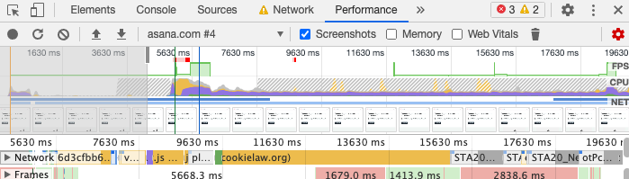

**使用节流使页面活动更易于理解**

除了模拟用户的页面体验之外，限制还可以更轻松地调查性能问题。

除非您的页面真的很慢，否则在加载页面时通常会同时发生数百个事件，这使得很难理解不同类型页面活动的关系和依赖关系。应用慢速 3G 和 6 倍 CPU 减速限制将使页面加载非常缓慢，让您一次查看网络请求和 CPU 任务。

#### 10.高级绘制面板

Enable Advanced Paint Instrumentation 选项收集有关页面呈现性能的其他调试数据。收集此数据会减慢页面速度，因此如果启用此设置，其他性能指标将不太准确。

如果您在时间线中发现一个缓慢的 Paint 事件，您可以选择它并详细了解浏览器正在绘制的内容以及所花费的时间。
