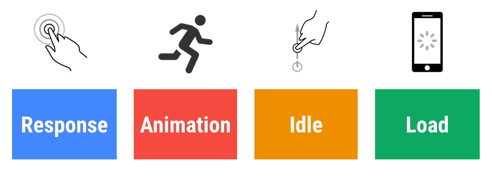
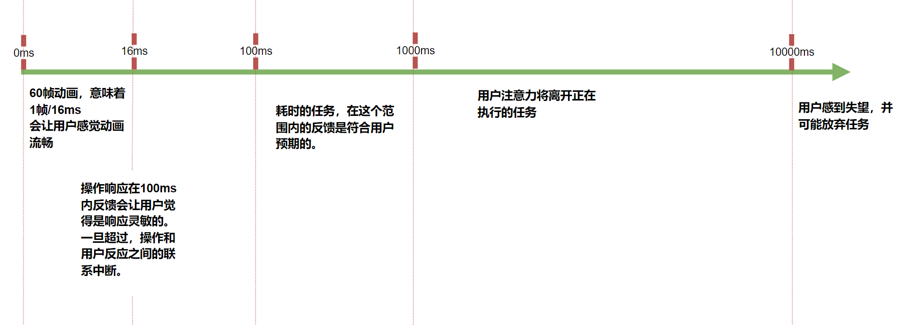
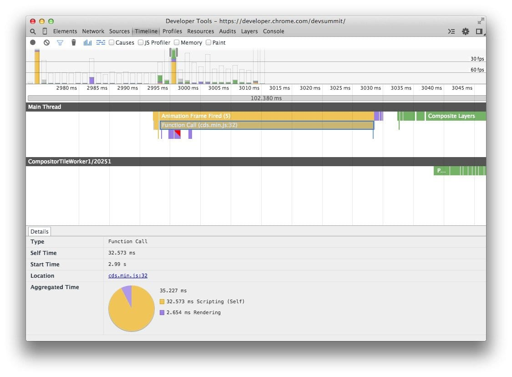

[toc]

1.如何衡量web性能？

### 1.1 RAIL 模型

#### 1.1.1 是什么？

**RAIL** 是一种以用户为中心的性能模型，代表了Web应用生命周期的四个不同方面： 



#### 1.1.2 用户感知指标




### 1.2 Loading  Performance 加载性能

#### 1.2.1 Get Started

> 加载时间，是页面性能低下的最主要原因。加载速度慢也意味着对SEO不利，2018年谷歌将网页加载速度也作为搜索结果的排名指标。 

##### 1.2.1.2 HTTP 请求 

1. 合并 JavaScript 和 Css 文件 ： 将多个文件合并为一个文件以减少HTTP请求，能有效提高网络加载用时。

2. 合并图形资源：也就是精灵图，现在已经不考虑使用了，在不考虑很严格的优化时不用考虑。

   > 注意:warning: HTTP/2 协议下，合并多个文件为一个文件，不一定会有效减少请求时间，这是因为HTTP/2 服务器速度非常快。

3. 将脚本放在body标签末尾，不要放在html文档头部。

##### 1.2.1.3 HTTP 缓存

当访问一个页面时，所有资源都需要浏览器先检索再执行或者显示，你可以让浏览器选择它从哪里检索资源。

浏览器第一次加载网页时， 会将页面资源存储再 HTTP Cache 中。下次，可以再缓存中先获取资源并从本地磁盘中检索它们，这比网络下载要快。

【启用缓存】： 两种主要类型的缓存标头 cache-control 和 expires 定义了资源的缓存特性。通常，前者被认为是一种更现代和灵活的方法，但是二者可以同事使用。

缓存标头应用于服务器级别的资源，例如， Apache 服务器上的文件中，可以通过配置文件`.htaccess` 以控制缓存。

```xml
<fileMatch ".(ico|jpg|jpeg|png|gif)$">
	Header set Cache-Control "max-age=2592000, public"
</fileMatch>
```

> 此示例将各种图片资源的缓存设置为一个月和公共访问

```xml
<fileMatch ".(css|js)$">
	Header set Cache-Control "max-age=86400, public"
</fileMatch>
```

> 此示例将样式和脚本的缓存设置为一天和公共访问

缓存控制有许多选项（指令），用以确定具体如何处理缓存请求。 以下是一些常见指令：

- `no-cache` : 指定可以缓存内容，必须再每次请求时重复验证。会强制客户端检查新鲜度，但如果资源没有更改，则允许它避免再次下载资源。和`no-store` 互斥
- `no-store` : 表示内容实际上不能被任何主缓存或者中间缓存（代理|CDN）以任何方式缓存。与 `no-cache` 互斥。
- `public` : 内容可被浏览器或者中间缓存，与`private` 互斥。 
- `private` ： 指定可以由用户浏览器存储的内容，但是不能被中间缓存。 通常用于特定于用户但不是特别敏感的数据，与`public` 互斥
- `max-age` : 定义在必须重新验证或者从原始服务器再次下载之前可以缓存内容的最长时间（资源有期限）。此选项通常替换`expires` 标头。最大期限为一年（31536000s）

【过期缓存】：你还可以通过为某些类型的文件指定过期或者过期时间来启用缓存，这会告诉浏览器在从服务器请求新副本之前使用缓存资源的时间。`expires` 只是设置将来内容应该过期的时间。在那之后，对内容的请求必须返回到原始服务器。 使用更新和更灵活的缓存控制标头，过期标头通常用作后备。

Apacha .htaccess 配置示例：

```xml
## EXPIRES CACHING ##
ExpiresActive On
ExpiresByType image/jpg "access plus 1 year"
ExpiresByType image/jpeg "access plus 1 year"
ExpiresByType image/gif "access plus 1 year"
ExpiresByType image/png "access plus 1 year"
ExpiresByType text/css "access plus 1 month"
ExpiresByType application/pdf "access plus 1 month"
ExpiresByType text/x-javascript "access plus 1 month"
ExpiresByType application/x-shockwave-flash "access plus 1 month"
ExpiresByType image/x-icon "access plus 1 year"
ExpiresDefault "access plus 2 days"
## EXPIRES CACHING ##
```


#### 1.2.2 （Optimizing Content Efficiency：优化文本内容效率）

##### 1.2.2.1 代码压缩,通过GZIP压缩文本

- GZIP 对基于文本的静态资源的压缩效果最好： CSS\JavaScript\HTML
- 所有现代浏览器都支持GZIP压缩，并且会自动请求改压缩
- 你的服务器必须配置为启用GZIP 压缩
- 某些CDN需要特别注意以确保GZIP 已启用

> 以vue框架为例：
>
> ```javascript
> //vue.config.js @based on vue-cli 4
>     // 生产环境，开启js\css压缩
>     if (process.env.NODE_ENV === 'production') {
>       config.plugin('compressionPlugin').use(
>         new CompressionPlugin({
>           test: /\.(js|css|less|scss)$/, // 匹配文件名
>           threshold: 10240, // 对超过10k的数据压缩
>           deleteOriginalAssets: false, // 不删除源文件
>         })
>       )
>       config
>         .plugin('webpack-bundle-analyzer')
>         .use(BundleAnalyzerPlugin)
>         .init((Plugin) => new Plugin())
>     }
> ```
>
> ```json
> // nginx nginx.conf
> http {
>     gzip  on;
>     gzip_min_length 1k;
>     gzip_buffers 4 16k;
>     gzip_comp_level 6;
>     gzip_types text/plain application/x-javascript text/css application/xml text/javascript application/javascript ;
>     gzip_vary off;
>     gzip_disable "MSIE [1-6]\.";
> }
> ```
>
> 现代压缩的类别：
>
> - 动态压缩： 前端打包代码无需压缩，由服务器程序配置动态压缩，特点是每次HTTP请求，就要压缩一次，对服务器性能消耗大，整个网络延迟可能不降反升。上例就是动态压缩。 
>
> - 静态压缩：前端代码打包， 后台服务配置静态压缩。每次请求，会优先查找对应的压缩文件，如果找不到，再将未压缩的文件返回响应。 所以要优先使用静态压缩。
>
>   > 静态压缩要求配置前端压缩，就和上例一样，webpack 压缩会在打包后生成.gz 文件，保留到服务器磁盘。 然后每次前端请求过来，就会优先使用这个压缩文件。
>   >
>   > nginx 静态压缩仅需开启:
>   >
>   > ```yaml
>   > gzip_static  on;
>   > ```
>   >
>   > 即可。

##### 1.2.2.2 优化图片

能用CSS 实现的效果尽量不要使用图片。

1. 选择合适的图片格式

   **图可以基本分为两个大类：**

   - 矢量图（Vector Graphics）：通过xml描述点线面的图形，如 SVG
   - 光栅图（Raster Graphics）: 基于像素点的构成的图像，如JPEG、PNG、webp 等

   **9种图片格式：**

   | 格式     | 优点                                                         | 缺点                                                         | 适用场景                                                     |
   | -------- | ------------------------------------------------------------ | ------------------------------------------------------------ | ------------------------------------------------------------ |
   | GIF      | 1.支持动画和透明背景<br />2.兼容性好                         | 1.最多支持 8 位 256 色<br />2.支持透明，但不支持半透明，边缘有杂边 | 色彩简单的logo、icon、线框图适合采用gif格 动画               |
   | Base64   | 1.无额外请求<br />2.没有跨域问题，无需考虑缓存、文件头或者cookies问题<br />3.可像单独图片一样使用，比如背景图片重复使用等 | 1.解码编码有额外消耗<br />2.体积相较其他格式至少大1/3        | 对于极小或者极简单图片，使用起来比较方便，无需导入静态文件   |
   | JPG/JPEG | 1.压缩率高<br />2.兼容性好 <br />3.色彩丰富                  | 1.不支持动画，透明 <br />2.不适用框线图，logo等              | JPEG 结合使用有损和无损优化来减少图像资源的文件大小，适用于照片等有大量细节的场景，使用时可以尝试不同的压缩等级以寻求最优点 |
   | JPEG2000 | 1.支持有损和无损压缩，<br />2.压缩比更高                     | 1.支持率太低                                                 | 适用于照片等有大量细节的场景                                 |
   | PNG      | 1.无损压缩图像 <br />2.像素丰富 <br />3.支持透明             | 1.文件大                                                     | 1.需要透明<br />2.需要无损适用高分辨率的场景                 |
   | SVG      | 1.支持动画，可用js，css 控制图形 <br />2.通常比其他格式文件小的多，因为它是由xml描述的抽象图形的集合 <br />3.支持透明 | 1.不适用复杂度太高的场景                                     | 1.适用框线图，或者图标，logo<br />2.适用于需要编程控制的场景<br />3.适用于加载动画，文字特效等特殊场景 |
   | APNG     | 1.支持动画<br />2.支持透明<br />3.文件较gif小<br />4.色彩较gif丰富 | 1.兼容性                                                     | (Animated Portable Network Graphics )<br />1.所有需要使用gif的场景<br />2.不考虑兼容性的场景<br />3.体积会比GIF大 |
   | WebP     | 1.同等质量更小 <br />2.压缩率相较JPEG和PNG更高 <br />3.支持无损图像 <br />4.支持动画 | 1.兼容性                                                     | 1.现代浏览器（bilibili静态资源都是这种格式）<br />2.在不考虑兼容的情况下应该尽量使用该格式 |
   | ico      |                                                              |                                                              | windows 桌面图标设计的，一个ico文件可以包含多个图标，并以列出每个图标详细信息的目录开始。 主要是用于做网站图标。 |

   > 1. 优先使用矢量图： 矢量图是高清的且其缩放是点线独立的，不会出现拉升变形失真。 非常适合多设备以及高清场景。
   >
   > 2. 压缩SVG资源：多数svg画图工具导出的 XML 标记语言常含有不必要的元信息，它们都可以被移除，此外，svg也是数据text-content-based 资源，所以，如果svg资源很多的情况下，一定要开启服务端的GZIP压缩。
   >
   > 3. 优先使用WebP: 相比于老旧的光栅(JPEG等)渲染图，请优先使用WebP, 因为同等质量下，WebP 的压缩率更高，文件更加的小。
   >
   > 4. 在使用光栅图时，要尝试尽可能的调高压缩等级（各大绘图软件中的“quality”设定项）
   >
   > 5. 在使用光栅类图时，记得删去不必要的元信息（Exif ），通常占据了几十Kb
   >
   > 6. 像客户端提供不同尺寸的图像： 也就是预览图用更小的尺寸，放大图才用原图。 因为大部分图片的状态通常处于预览状态。
   >
   >    > 最流行的两个图像调整工具是 [sharp npm package](https://www.npmjs.com/package/sharp) 和 [ImageMagick CLI 工具](https://www.imagemagick.org/script/index.php)。
   >    >
   >    > > 基础用例见：https://web.dev/serve-responsive-images/
   >
   > 7. 用视频代替GIF,可能资源开销小的多
   >
   >    > ```shell
   >    > #利用ffmpeg 将gif转为mp4
   >    > ffmpeg -i my-animation.gif -b:v 0 -crf 25 -f mp4 -vcodec libx264 -pix_fmt yuv420p my-animation.mp4
   >    > #利用ffmpeg 将gif转为webm
   >    > ffmpeg -i my-animation.gif -c vp9 -b:v 0 -crf 41 my-animation.webm
   >    > ```
   >    >
   >    > 
   >    >
   >    > 会发现视频可能要小得多。
   >    
   > 8. APNG的扩展名还是 png
   >
   >    ```bash
   >    #ffmpeg MP4 转 png
   >    $ ffmpeg -i frames_edit.mp4 -f apng frame.png
   >    ```
   >
   >    注意，同样的质量效果下，Gif 会比 PNG 小的多。 在使用该格式的时候注意权衡利弊。

##### 1.2.2.3 延迟加载图片和视频

使用延迟加载提高加载速度

1. 什么时延迟加载？

   延迟加载就是一种在页面加载时推出加载非关键资源的技术。就图像而言，“非关键”指的是“屏幕外”

   从表现上看，就是当阅读内容滚动时，在某个时候，你将占位符图像滚动到视图中，占位符图像突然被最终图像替换。

2. 为什么要延迟加载而不是直接加载？解决了什么问题？

   因为用户可能永远不会看到你正在加载的内容，这样会浪费数据，同事会浪费处理时间，电池和其他系统资源。延迟加载图像和视频能过够有效减少初始页面的加载时间，提高性能。 特别是在图片资源较多的站点。 

3. 实现延迟加载

   现代浏览器实现了 [浏览器级别的延迟加载](https://web.dev/browser-level-image-lazy-loading/)，可以通过对img和 iframe 使用 `loading` 属性实现， 此外，还可以通过js库实现。 

   1. 延迟加载图像

      1. 浏览器级别的延迟加载实现

      2. 使用 Intersection Observer API

         为填充``元素的延迟加载，我们使用JavaScript来检查它们是否位于视图区域，若位于视图区域，再去填充img的`src` 属性的url.

         虽然可以通过`scroll` 和 `resize` 之类的事件处理程序来完成任务， 这些方法在各大浏览器之间的兼容性最好。但现代浏览器提供了一种性能更高，效率更高的方法，通过 [Intersection Observer API](https://developers.google.com/web/updates/2016/04/intersectionobserver) 来完成检查元素可见性的工作。

         ```html
         
         ```

         关注三个部分：

         - `class` 属性， 这是你将在JavaScript 中选择元素的属性
         - `src` 属性， 它会引用页面首次加载时将出现的占位符图像
         - `data-src` 和 `data-srcset` 属性，它们是占位符属性，包含元素出现在视图区域中后将加载图像的URL

         ```JAVASCRIPT
         document.addEventListener("DOMContentLoaded", function() {
           var lazyImages = [].slice.call(document.querySelectorAll("img.lazy"));
         
           if ("IntersectionObserver" in window) {
             let lazyImageObserver = new IntersectionObserver(function(entries, observer) {
               entries.forEach(function(entry) {
                 if (entry.isIntersecting) {
                   let lazyImage = entry.target;
                   lazyImage.src = lazyImage.dataset.src;
                   lazyImage.srcset = lazyImage.dataset.srcset;
                   lazyImage.classList.remove("lazy");
                   lazyImageObserver.unobserve(lazyImage);
                 }
               });
             });
         
             lazyImages.forEach(function(lazyImage) {
               lazyImageObserver.observe(lazyImage);
             });
           } else {
             // Possibly fall back to event handlers here
           }
         });
         ```

      3. CSS 中的图像懒加载

         css 中的懒加载不同于在html 中img元素的懒加载， 通常的做法，是控制 `visible` 属性，结合 Intersection Observer API, 简单的说，即准备两个dom元素，设定一个背景为占位图，一个为实际图的url, 默认 可见占位图元素， 然后当元素进入到可视区域时，将占位visible属性设为不可见，实际图设为可见。 

      4. 一些支持图像延迟加载库：

         > - [lazysizes](https://github.com/aFarkas/lazysizes) 是一个功能齐全的延迟加载库，可以延迟加载图像和 iframe。它使用的模式与本文中的代码示例非常相似，因为它会自动绑定到 `` 元素上 `lazyload` 类，并要求您在 `data-src` 和/或 `data-srcset` 属性中指定图像的 URL，并将其内容分别交换至 `src` 和/或 `srcset`属性。它使用 Intersection Observer（可以对其进行 polyfill），并可以使用[许多插件](https://github.com/aFarkas/lazysizes#available-plugins-in-this-repo)进行扩展来执行诸如延迟加载视频之类的操作。[了解有关使用 lazysizes 的更多信息](https://web.dev/use-lazysizes-to-lazyload-images/)。
         > - [vanilla-lazyload](https://github.com/verlok/vanilla-lazyload) 是用于延迟加载图像、背景图像、视频、iframe 和脚本的轻量级选项。它利用 Intersection Observer，支持响应式图像，并能开启浏览器级的延迟加载。
         > - [lozad.js](https://github.com/ApoorvSaxena/lozad.js) 是另一个仅使用 Intersection Observer 的轻量级选项。因此它的性能很好，但需要先进行 polyfill 然后才能在较旧的浏览器上使用。
         > - [yall.js](https://github.com/malchata/yall.js) 是一个使用 Intersection Observer 并回退到事件处理程序的库。它与 IE11 和主要浏览器都兼容。
         > - 如果您需要使用 React 特定的延迟加载库，请考虑 [react-lazyload](https://github.com/jasonslyvia/react-lazyload) 。虽然它不使用 Intersection Observer，但*确实*为那些习惯于使用 React 开发应用程序的人提供了一种熟悉的延迟加载图像方法。

   2. 延迟加载视频

      1. 对于不自动播放的视频

         ```html
         <video controls preload="none" poster="one-does-not-simply-placeholder.jpg">
           <source src="one-does-not-simply.webm" type="video/webm">
           <source src="one-does-not-simply.mp4" type="video/mp4">
         </video>
         ```

         `preload="none"` 用以放置浏览器预加载任何视频数据， `poster` 属性为`<video>` 元素提供一个占位符，用于占用时评加载时的空间。这样做的目的是，各浏览器视频默认加载行为不一致。

      2. 对于代替动画GIF 的视频 (自动播放的视频)

         利用视频替代GIF 有三个特征需要保持一致：

         - 加载时自动播放
         - 循环播放
         - 没有音轨

         ```html
         <!-- ios 设备中自动播放需设定 playsinline 属性-->
         <video autoplay muted loop playsinline>
           <source src="one-does-not-simply.webm" type="video/webm">
           <source src="one-does-not-simply.mp4" type="video/mp4">
         </video>
         ```

         如何延迟加载？

         ```html
         <video class="lazy" autoplay muted loop playsinline width="610" height="254" poster="one-does-not-simply.jpg">
           <source data-src="one-does-not-simply.webm" type="video/webm">
           <source data-src="one-does-not-simply.mp4" type="video/mp4">
         </video>
         ```

         `poster` 属性用以指定视频的占位符，直到视频延迟加载。 

         借助于 Intersection Observer API :

         ```javascript
         document.addEventListener("DOMContentLoaded", function() {
           var lazyVideos = [].slice.call(document.querySelectorAll("video.lazy"));
         
           if ("IntersectionObserver" in window) {
             var lazyVideoObserver = new IntersectionObserver(function(entries, observer) {
               entries.forEach(function(video) {
                 if (video.isIntersecting) {
                   for (var source in video.target.children) {
                     var videoSource = video.target.children[source];
                     if (typeof videoSource.tagName === "string" && videoSource.tagName === "SOURCE") {
                       videoSource.src = videoSource.dataset.src;
                     }
                   }
         
                   video.target.load();
                   video.target.classList.remove("lazy");
                   lazyVideoObserver.unobserve(video.target);
                 }
               });
             });
         
             lazyVideos.forEach(function(lazyVideo) {
               lazyVideoObserver.observe(lazyVideo);
             });
           }
         });
         ```

         延迟加载`<video>` 元素时，需要迭代所有子 `<source>` 元素，并将其`data-src` 属性改为`src` 属性。 完成后，需要通过调用元素的`load` 方法来触发视频的加载， 此后，媒体将根据`autoplay` 属性开始自动播放。

      3. 一些视频延迟加载库：

         > - [vanilla-lazyload](https://github.com/verlok/vanilla-lazyload) 和 [lozad.js](https://github.com/ApoorvSaxena/lozad.js) 是仅使用 Intersection Observer 的超轻量级选项。因此它们的性能很好，但需要先进行 polyfill 然后才能在较旧的浏览器上使用。
         > - [yall.js](https://github.com/malchata/yall.js) 是一个使用 Intersection Observer 并回退到事件处理程序的库。它与 IE11 和主要浏览器都兼容。
         > - 如果您需要 React 特定的延迟加载库，或许应该考虑 [react-lazyload](https://github.com/jasonslyvia/react-lazyload) 。虽然它不使用 Intersection Observer，但*确实*为那些习惯于使用 React 开发应用程序的人们提供了一种熟悉的延迟加载图像方法。


##### 1.2.2.4 优化css

:star:见［LightHouse优化/延迟加载非关键CSS类］

还有一些其他的代码压缩，利用Webpack配置就好，这里 贴出原文相关内容连接 https://web.dev/minify-css/


这节部分仅总结了一些比较基础的优化，还有更多的优化内容，还是需要webpack完成。

谈及优化，chrome 自带的lighthouse 和 peformance tab 分析工具是很好的分析工具。 

可以在这两个工具的基础之上，再利用webpack等手段去完成一些优化。 最值得一提的是lighthouse 针对所有可优化的点，都给出了建议。本博客将会专门介绍lighthouse 以及 performance 这两个分析工具。 


### 1.3 渲染性能优化

#### 1. 概览

60 fps 与设备刷新率

目前大多数设备的屏幕刷新率为60 次/秒。因此，如果在页面中有一个动画或者渐变效果，或者用户正在滚动页面，那么浏览器渲染动画或者页面的每一帧的速率也需要跟设备屏幕的刷新率保持一致。 

其中每个帧的预算时间为 1000ms/60帧 = 16.6ms/帧。 但实际上，浏览器并不只是在渲染画面，还有别的工作需要做。 因此你的所有工作需要在**10ms** 内完成。否则，帧率将下降，内容可能会卡顿或者抖动。

##### 像素管道（像素点到屏幕显示的过程的统称，或者说渲染过程）


这五个部分是你工作时需要注意的五个部分，也是你有最大控制权限的部分。 

- JavaScript: 一般来说，我们实现动画可以通过js来实现一些视觉变化效果，比如JQuery 的 `animate` 函数。 或者利用 CSS Animations、Transitions 和 Web Animation API
- 样式计算 ： 这个过程即 从匹配选择器到计算出元素的渲染规则，然后将这些规则关联到元素的过程。
- 布局：在知道对一个元素应用哪些规则之后，浏览器即可开始计算它要占据的空间大小以及位置。 
- 绘制：绘制时填充像素的过程，基本包括元素的每个可视部分，如文本，颜色，图像，边框，阴影等。 绘制一般是在多个层上完成的。
- 合成： 由于页的各个部分可能会被绘制到多个层，由此它们需要按正确的顺序绘制到屏幕。

管道的每一个过程都有机会产生卡顿，因此你务必需要准确了解你的代码触发管道的哪些部分。

有时候，你可能听到与绘制一起使用的术语 "栅格化"， 这是因为绘制实际上分为两个任务：

1. 创建绘图调用的元素
2. 填充像素

后者也称为 "栅格化"，不一定每帧都总会经过管道的每个部分处理，实际上，不管使用js， css，还是网络动画，在实现视觉变化的时候，管道针对指定帧的运行通常有三种方式：


1. JS / CSS > 样式 > 布局 > 绘制 > 合成

   

   :star: 如果你修改了元素的 "layout"属性， 也就是改变了元素的几何属性(例如宽度、高度、左侧或者顶部位置等)， 那么浏览器将必须检查所有其他元素，然后“**自动重排**”页面。 任何受影响的部分都不要重新绘制，而且最终绘制的元素需进行合成。

2. JS / CSS > 样式 > 绘制 > 合成

   

   如果你修改了 "paint only" 属性，（例如背景图片，文字颜色，或者阴影），即不会影响页面布局的属性，则浏览器会跳过布局，但任将执行绘制。

3. JS / CSS > 样式 > 合成

   

   如果你更改了一个即不要布局，也不要绘制的属性，则浏览器将跳到只执行合成。

   这个开销最小，最适合于应用生命周期中的高压点，例如动画或者滚动。

> **Note:** 如果想知道更改任何指定 CSS 属性将触发上述三个版本中的哪一个，请查看 [CSS 触发器](https://csstriggers.com/)。如果要快速了解高性能动画，请阅读[更改仅合成器的属性](https://developers.google.com/web/fundamentals/performance/rendering/stick-to-compositor-only-properties-and-manage-layer-count)部分。


#### 2. JavaScript 执行优化

- 对于动画效果的实现，避免使用 setTimeout 或 setInterval，请使用 requestAnimationFrame。
- 将长时间运行的 JavaScript 从主线程移到 Web Worker。
- 使用微任务来执行对多个帧的 DOM 更改。
- 使用 Chrome DevTools 的 Timeline 和 JavaScript 分析器来评估 JavaScript 的影响。

##### 使用 `requestAnimationFrame` 来实现视觉变化

`requestAnimationFrame` 是能够保证JavaScript在帧开始的时候运行的唯一方式

```javascript
function updateScreen(time) {
  // Make visual updates here.
  // requestAnimationFrame(updateScreen); 如果需要动画，要在这里递归调用
}
requestAnimationFrame(updateScreen);
```

> 使用定时器实现动画的性能开销太大


##### 降低复杂性或者使用Web Worker

JavaScript 在浏览器的主线程上执行，恰好与样式计算、布局以及许多情况下的绘制一起运行。如果JavaScript 运行时间过长，就会阻塞这些其他工作，可能导致丢帧。

在许多情况下，可以将纯计算工作移到 Web Worker, 例如，如果它不需要DOM访问权限，数据操作或者遍历 （例如排序或者搜索）往往很适合这种模型。

```javascript
var dataSortWorker = new Worker("sort-worker.js");
dataSortWorker.postMesssage(dataToSort);

// The main thread is now free to continue working on other things...

dataSortWorker.addEventListener('message', function(evt) {
   var sortedData = evt.data;
   // Update data on screen...
});
```

并非所有工作都适合此模型： Web Worker 没有DOM 访问权限。 如果您的工作必须在主线程上执行，请考虑一种批量方法，将大型任务分为微任务，每个微任务所占用时间不超过几毫秒，并且在每帧的 `requestAnimationFrame` 处理程序内运行。

```javascript
var taskList = breakBigTaskIntoMicroTasks(monsterTaskList);
requestAnimationFrame(processTaskList);

function processTaskList(taskStartTime) {
  var taskFinishTime;

  do {
    // Assume the next task is pushed onto a stack.
    var nextTask = taskList.pop();

    // Process nextTask.
    processTask(nextTask);

    // Go again if there’s enough time to do the next task.
    taskFinishTime = window.performance.now();
  } while (taskFinishTime - taskStartTime < 3);

  if (taskList.length > 0)
    requestAnimationFrame(processTaskList);

}
```

##### 了解 JavaScript 的“帧税”

在评估一个框架、库或您自己的代码时，务必逐帧评估运行 JavaScript 代码的开销。当执行性能关键的动画工作（例如变换或滚动）时，这点尤其重要。

测量 JavaScript 开销和性能情况的最佳方法是使用 Chrome DevTools。通常，您将获得如下的简单记录:



如果发现有长时间运行的 JavaScript，则可以在 DevTools 用户界面的顶部启用 JavaScript 分析器.

有了这些信息之后，您可以评估 JavaScript 对应用性能的影响，并开始找出和修正函数运行时间过长的热点。如前所述，应当设法移除长时间运行的 JavaScript，或者若不能移除，则将其移到 Web Worker 中，腾出主线程继续执行其他任务。


#### 3.缩小样式计算的范围并降低其复杂性

##### 降低选择器的复杂性

通过添加和删除元素，更改属性、类或者通过动画来更改DOM，全部会导致浏览器重新计算元素样式，在很多情况下还会对页面的一部分进行布局 (即自动重排)。 这就是所谓的计算样式的计算。 

用于计算某元素的计算样式的时间中，大约有50%用来匹配选择器，而另一半时间用于从匹配规则中构建 RenderStyle (计算样式)。

所以，为了尽可能减少选择匹配的开销，我们可以：

- 降低选择器的复杂性； 使用以类为中心的方法，例如BEM。
- 减少必须计算其样式的元素数量。 


> BEM (块、元素、修饰符) 编码方法，建议所有元素都有单个类，并且在需要层次结构的时候也纳入了类的名称：
>
> ```css
> .list{}
> .list__list-item{}
> ```
>
> 如果需要一些修饰符，像在上面我们想为最后一个子元素做一些特别的东西，就可以按照如下方式添加：
>
> ```css
> .list__list-item--last-child{}
> ```


#### 4.避免大型、复杂的布局和布局抖动

布局是浏览器计算各元素几何信息的过程: 元素的大小以及在页面中的位置。 根据所用的 CSS、元素的内容或父级元素，每个元素都将有显式或隐含的大小信息。此过程在 Chrome、Opera、Safari 和 Internet Explorer 中称为布局 (Layout)。 在 Firefox 中称为自动重排 (Reflow)，但实际上其过程是一样的。

与样式计算相似，布局开销的直接考虑因素如下:

1. 需要布局的元素数量。
2. 这些布局的复杂性。

##### 尽可能避免布局操作

当你更改样式时，浏览器会检查任何更改是否需要计算布局，以及是否需要更新渲染树。对“几何属性” （如宽度、高度、左侧或者顶部）的更改都需要布局计算。

布局几乎总是作用到整个文档，如果有大量元素，将需要很长时间来算出所有元素的位置和尺寸。

##### 使用flexbox而不是较早的布局类型

对于相同数量的元素和相同的视觉外观，flex布局的时间要少得多。

##### 避免强制同步布局

将一帧送到屏幕会采用如下顺序:


首先 JavaScript 运行，然后计算样式，然后布局。但是，可以使用 JavaScript 强制浏览器提前执行布局。这被称为**强制同步布局**。

```javascript
function logBoxHeight() {

  box.classList.add('super-big');

  // Gets the height of the box in pixels
  // and logs it out.
  console.log(box.offsetHeight);
}
```

现在，为了回答高度问题，浏览器必须先应用样式更改（由于增加了 super-big 类），然后运行布局。这时它才能返回正确的高度。这是不必要的，并且可能是开销很大的工作。

正确完成时，以上函数应为:

```javascript
function logBoxHeight() {
  // Gets the height of the box in pixels
  // and logs it out.
  console.log(box.offsetHeight);

  box.classList.add('super-big');
}
```


##### 避免布局抖动

有一种方式会使强制同步布局甚至更糟: 接二连三地执行大量这种布局。看看这个代码:

```javascript
function resizeAllParagraphsToMatchBlockWidth() {

  // Puts the browser into a read-write-read-write cycle.
  for (var i = 0; i < paragraphs.length; i++) {
    paragraphs[i].style.width = box.offsetWidth + 'px';
  }
}
```

此代码循环处理一组段落，并设置每个段落的宽度以匹配一个称为“box”的元素的宽度。这看起来没有害处，但问题是循环的每次迭代读取一个样式值 (`box.offsetWidth`)，然后立即使用此值来更新段落的宽度 (`paragraphs[i].style.width`)。在循环的下次迭代时，浏览器必须考虑样式已更改这一事实，因为 `offsetWidth` 是上次请求的（在上一次迭代中），因此它必须应用样式更改，然后运行布局。每次迭代都将出现此问题！

> 简单的说就是
>
> ```javascript
>  paragraphs[i].style.width = box.offsetWidth + 'px';
> ```
>
> 两边都是变量，且会影响布局，布局的改变又导致两边的变量变动，如此循环。

此示例的修正方法还是先读取值，然后写入值:

```javascript
// Read.
var width = box.offsetWidth;

function resizeAllParagraphsToMatchBlockWidth() {
  for (var i = 0; i < paragraphs.length; i++) {
    // Now write.
    paragraphs[i].style.width = width + 'px';
  }
}
```

如果要保证安全，应当查看 [FastDOM](https://github.com/wilsonpage/fastdom)，它会自动为您批处理读取和写入，应当能防止您意外触发强制同步布局或布局抖动。


#### 5.简化绘制的复杂度、减小绘制区域

- 除 **transform** 或 **opacity** 属性之外，更改任何属性始终都会触发绘制。
- 绘制通常是像素管道中开销最大的部分；应尽可能避免绘制。
- 通过层的提升和动画的编排来减少绘制区域。
- 使用 Chrome DevTools 绘制分析器来评估绘制的复杂性和开销；应尽可能降低复杂性并减少开销。

> https://developers.google.com/web/fundamentals/performance/rendering/simplify-paint-complexity-and-reduce-paint-areas

#### 6.坚持仅合成器的属性和管理层计数

- 使用 transform 和 opacity 属性更改来实现动画

  > 性能最佳的像素管道版本会避免布局和绘。为了实现此目标，需要坚持更改可以由合成器单独处理的属性。目前只有两个属性符合条件: **`transforms`** 和 **`opacity`**: